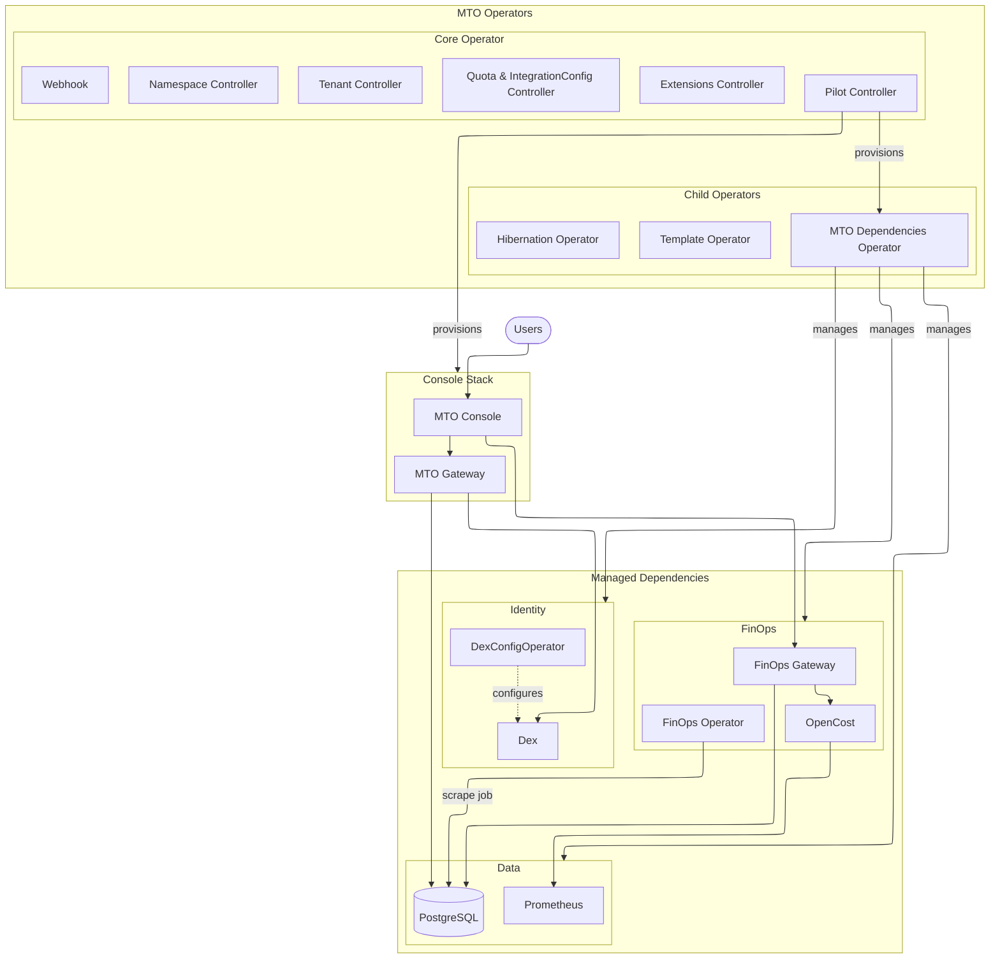

# Architecture

The Multi-Tenant Operator (MTO) is a comprehensive system designed to manage multi-tenancy in Kubernetes environments.

## Overview

The diagram below shows how MTO's controllers, the MTO Dependencies Operator, and the components they provision fit together.

```mermaid
---
config:
  layout: elk
  theme: default
---
flowchart TB
    Users(["Users"])

    subgraph Operators["MTO Operators"]
        direction LR
        subgraph CoreOp["Core Operator"]
            direction TB
            TC["Tenant Controller"]
            NC["Namespace Controller"]
            EC["Extensions Controller"]
            QIC["Quota & IntegrationConfig Controller"]
            PC["Pilot Controller"]
            WH["Webhook"]
        end
        subgraph ChildOps["Child Operators"]
            direction TB
            TmplOp["Template Operator"]
            HibOp["Hibernation Operator"]
            DepsOp["MTO Dependencies Operator"]
        end
    end

    subgraph ConsoleStack["Console Stack"]
        direction LR
        MC["MTO Console"]
        MG["MTO Gateway"]
    end

    subgraph Managed["Managed Dependencies"]
        direction TB
        subgraph Identity["Identity"]
            direction LR
            DX["Dex"]
            DCO["DexConfigOperator"]
        end
        subgraph FinOps["FinOps"]
            direction LR
            FO["FinOps Operator"]
            FG["FinOps Gateway"]
            OC["OpenCost"]
        end
        subgraph Data["Data"]
            direction LR
            PG[("PostgreSQL")]
            PR["Prometheus"]
        end
    end

    Users --> MC
    PC -- provisions --> ConsoleStack
    PC -- provisions --> DepsOp
    DepsOp -- manages --> Identity
    DepsOp -- manages --> FinOps
    DepsOp -- manages --> Data
    MC --> MG
    MC --> FG
    MG --> PG
    MG --> DX
    FG --> OC
    FG --> PG
    OC --> PR
    FO -- scrape job --> PG
    DCO -. configures .-> DX
```

## Core Operators

MTO consists of multiple controllers and components that work together to provide the functionality of the system. The following is a list of the components that make up the MTO system:

| Name | Type | Description |
|------|------|-------------|
| Tenant Controller | Deployment | The Tenant Controller is responsible for managing the creation, deletion, and updating of tenants in the cluster via [Tenant CRD](../kubernetes-resources/tenant/tenant-overview.md). |
| Namespace Controller | Deployment | The Namespace Controller is responsible for managing the creation, deletion, and updating of namespaces in the cluster. |
| Extensions Controller | Deployment | The Extensions Controller enhances MTO's functionality by allowing integration with external services. Currently, supports integration with ArgoCD, enabling you to synchronize your repositories and configure AppProjects directly through MTO. It manages extensions via [Extension CRD](../kubernetes-resources/extensions.md). |
| Quota Integration Config Controller | Deployment | The Quota Integration Config Controller manages 2 different CRDs in one controller, [Quota CRD](../kubernetes-resources/quota.md), and [IntegrationConfig CRD](../kubernetes-resources/integration-config.md). |
| Webhook | Deployment | The Webhook is responsible for managing webhook requests from MTO's resources. |
| Pilot Controller | Deployment | The Pilot Controller is responsible for provisioning and managing the lifecycle of the MTO Console, MTO Gateway, and the MTO Dependencies Operator. |
| MTO Console | Deployment | The MTO Console is the user interface for the MTO system that provides a web-based interface for managing tenants, namespaces, sleep, and more. Details about the MTO Console can be found [here](../console/overview.md). |
| MTO Gateway | Deployment | The MTO Gateway is the backend service that provides the REST API for the MTO Console. |
| PostgreSQL | StatefulSet | PostgreSQL is an open-source relational database that acts as a caching layer and stores the data for the MTO Console. Provisioned and managed by the MTO Dependencies Operator. |
| Prometheus | Deployment | Prometheus is an open-source monitoring and alerting solution that provides metrics and monitoring for the resources deployed on the cluster. Provisioned and managed by the MTO Dependencies Operator. |
| OpenCost | Deployment | OpenCost is an open-source cost management solution that provides cost tracking and reporting for the resources deployed on the cluster. Provisioned and managed by the MTO Dependencies Operator. |
| Kube-State-Metrics | Deployment | Kube-State-Metrics listens to the Kubernetes API server and generates metrics about the state of the objects in the cluster. Provisioned and managed alongside Prometheus by the MTO Dependencies Operator. |
| Dex | Deployment | Dex is the identity provider (IdP) used by MTO for authentication, replacing Keycloak. Provisioned and managed by the MTO Dependencies Operator. |
| DexConfigOperator | Deployment | DexConfigOperator manages the configuration of the Dex IdP on Kubernetes. Provisioned and managed by the MTO Dependencies Operator. |
| FinOps Operator | Deployment | The FinOps Operator powers the showback features in MTO, replacing the previous Showback CronJob. Provisioned and managed by the MTO Dependencies Operator. |
| FinOps Gateway | Deployment | The FinOps Gateway exposes cost and showback data from OpenCost and Prometheus to the MTO Console. |

## Child Operators

MTO deploys child operators to extend its tenancy with features made to reduce complexity while using a Kubernetes cluster.

### Template Operator

Template Operator manages resource distribution and copying of secrets/configMaps across multiple namespaces. More details about its architecture can be found at [Template Operator Architecture](https://docs.stakater.com/template-operator/main/architecture/architecture.html).

### Hibernation Operator

The Hibernation Operator is a lightweight yet powerful system designed to automate cost-saving hibernation of workloads in Kubernetes environments. It enables both platform teams and application owners to define schedules for scaling down and restoring applications during off-hours.

### MTO Dependencies Operator

The MTO Dependencies Operator is a Kubernetes operator that manages common infrastructure dependencies required by Multi-Tenant Operator as Custom Resources using Helm charts.

It simplifies the deployment and management of essential infrastructure components needed by the MTO ecosystem — PostgreSQL, Prometheus, OpenCost, Dex, DexConfigOperator and FinOps Operator. Instead of manually managing multiple Helm releases, this operator provides a declarative way to deploy and configure dependencies through Kubernetes Custom Resources.

Each Custom Resource's `.spec` maps directly to the underlying Helm chart values, so any value supported by the chart can be set in the CR. The operator handles the full lifecycle — install, upgrade, and deletion — automatically.

See the [MTO Dependencies Operator documentation](https://github.com/stakater/mto-dependencies-operator) for reference.
