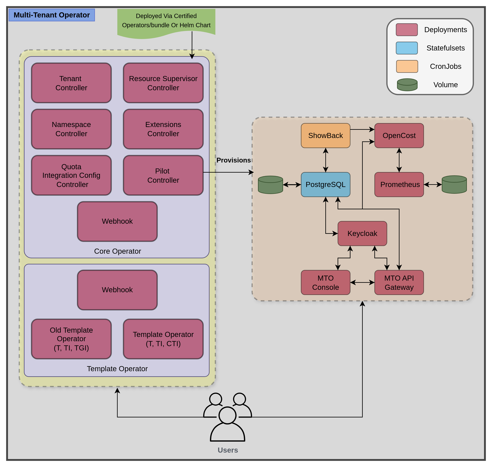

# Architecture

The Multi-Tenant Operator (MTO) is a comprehensive system designed to manage multi-tenancy in Kubernetes environments. Following is the architecture of the MTO:

## Core Operators

MTO consists of multiple controllers and components that work together to provide the functionality of the system. The following is a list of the components that make up the MTO system:

| Name | Type | Description |
|------|------|-------------|
| Tenant Controller | Deployment | The Tenant Controller is responsible for managing the creation, deletion, and updating of tenants in the cluster via [Tenant CRD](../kubernetes-resources/tenant/tenant-overview.md). |
| Namespace Controller | Deployment | The Namespace Controller is responsible for managing the creation, deletion, and updating of namespaces in the cluster. |
| Resource Supervisor Deployment | Deployment | The Resource Supervisor Controller is responsible for managing sleep and hibernation of namespaces in the cluster via [ResourceSupervisor CRD](../kubernetes-resources/resource-supervisor.md). |
| Extensions Controller | Deployment | The Extensions Controller enhances MTO's functionality by allowing integration with external services. Currently, supports integration with ArgoCD, enabling you to synchronize your repositories and configure AppProjects directly through MTO. It manages extensions via [Extension CRD](../kubernetes-resources/extensions.md). |
| Quota Integration Config Controller | Deployment | The Quota Integration Config Controller manages 3 different CRDs in one controller, [Quota CRD](../kubernetes-resources/quota.md), and [IntegrationConfig CRD](../kubernetes-resources/integration-config.md). |
| Webhook | Deployment | The Webhook is responsible for managing webhook requests from MTO's resources. |
| Pilot Controller | Deployment | The Pilot Controller is responsible for provisioning and managing the lifecycle of MTO-Console and its dependencies. |
| Keycloak | Deployment | Keycloak is an open-source identity and access management solution that provides authentication and authorization services for the MTO Console. It can be provisioned via Pilot Controller or deployed and managed externally following this guide [External Keycloak](../integrations/keycloak.md). |
| PostgreSQL | StatefulSet | PostgreSQL is an open-source relational database that acts as a caching layer and stores the data for the MTO Console. It is also provisioned via Pilot Controller and is managed internally. |
| Opencost | Deployment | Opencost is an open-source cost management solution that provides cost tracking and reporting for the resources deployed on the cluster. It is also provisioned via Pilot Controller and is managed internally. |
| Prometheus | Deployment | Prometheus is an open-source monitoring and alerting solution that provides metrics and monitoring for the resources deployed on the cluster. It is also provisioned via Pilot Controller and is managed internally. |
| Kube-State-Metrics | Deployment | Kube-State-Metrics is a service that listens to the Kubernetes API server and generates metrics about the state of the objects in the cluster. It is also provisioned via Pilot Controller and is managed internally. |
| Showback | CronJob | The Showback CronJob is responsible for generating showback reports based on the resources present on the cluster by querying the Opencost-Gateway and storing the reports in the PostgreSQL database that can be viewed in the MTO Console on the [Showback page](../console/showback.md). |
| MTO Gateway | Deployment | The MTO-Gateway is the backend service that provides the REST API for the MTO-Console. |
| MTO Console | Deployment | The MTO-Console is the user interface for the MTO system that provides a web-based interface for managing tenants, namespaces, sleep, and more. Details about the MTO-Console can be found [here](../console/overview.md). |

## Child Operators

MTO deploys child operators to extend its tenancy with features made to reduce complexity while using a Kubernetes cluster

### Template Operator

Template Operator manages resource distribution and copying of secrets/configMaps across multiple namespaces. More details about its architecture can be found at [Template Operator Architecture](https://docs.stakater.com/template-operator/main/architecture/architecture.html)
