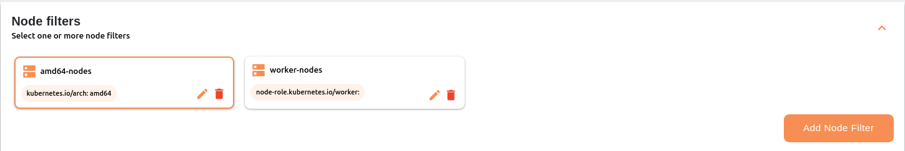
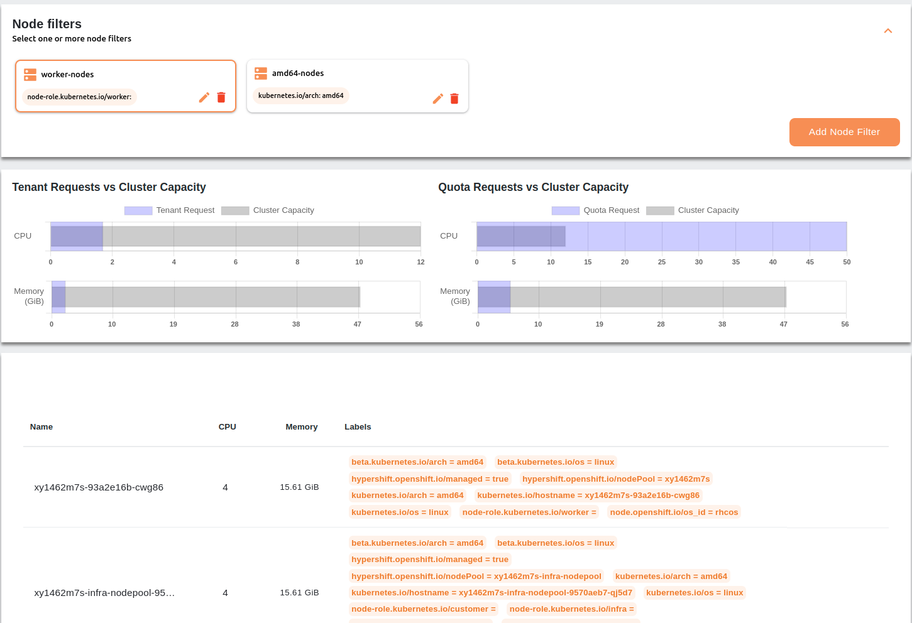
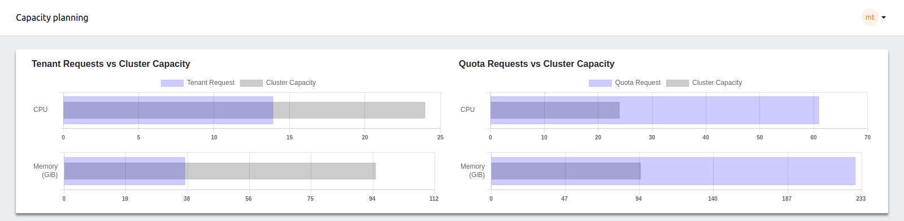
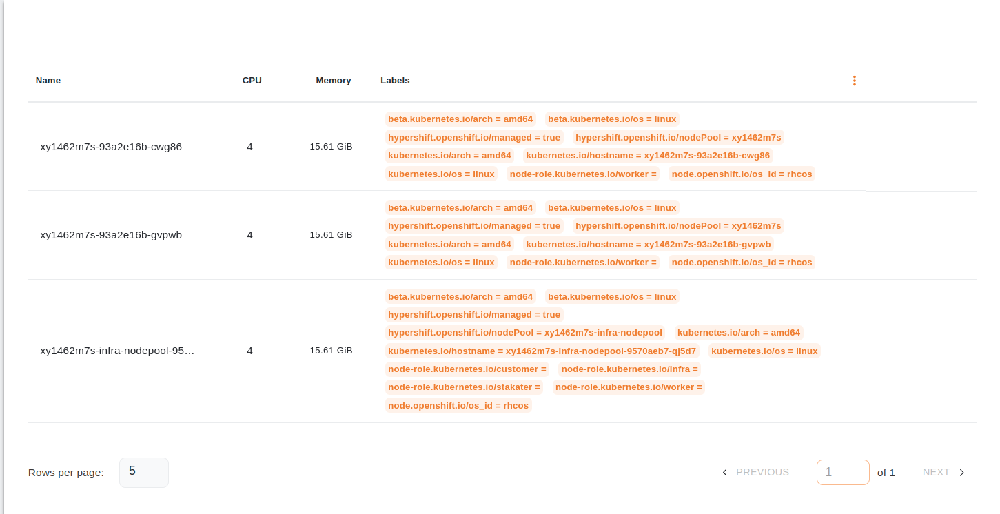
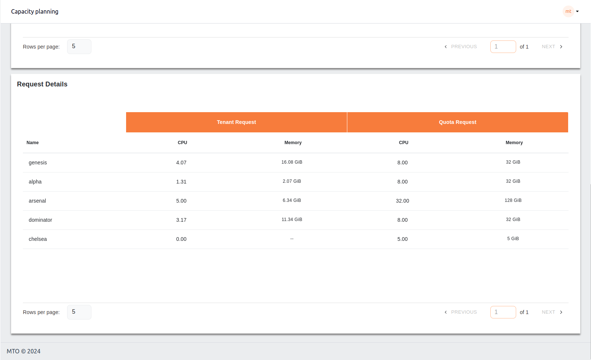

# Capacity Planning

The Capacity Planning feature in the app provides insights into resource usage and allocation across the cluster to help manage computing resources efficiently. It consists of three main sections:

## 1. Graphical Representation

### a. Node filtering based on Labels

This part will allow users to group nodes based on their labels, to change how the data should be visualized for them.

On clicking any of the node filters, the data in the next two parts will change accordingly.

### b. Tenant Requests vs. Cluster Capacity

This section displays bar charts that compare the current resource requests from tenants (like CPU and memory) with the total available cluster capacity. The charts visually represent how much of the cluster’s resources are currently being utilized versus what is available, helping identify over-utilization or under-utilization scenarios.

### c. Quota Requests vs. Cluster Capacity

Similar to the tenant requests, this section compares the quota requests against the total cluster capacity. It allows administrators to see if the quota assigned is in line with the cluster's actual capacity.

## 2. Worker-pool Details

A detailed table lists the worker nodes in the cluster, displaying each node’s CPU and memory capacity along with various labels that indicate the node’s configuration and role (e.g., worker, infra). This information helps in identifying resource distribution across nodes and managing workloads accordingly.

## 3. Request Details

This table provides a breakdown of the resource requests from different tenants, displaying both the requested resources (CPU and memory) and the allocated quotas. It helps to monitor if tenant requests align with the quotas set for each tenant, ensuring optimal resource management.

