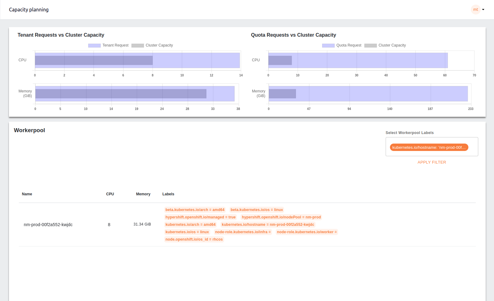

# Capacity Planning

The Capacity Planning feature in the app provides insights into resource usage and allocation across the cluster to help manage computing resources efficiently. It consists of three main sections:

## 1. Graphical Representation

### a. Tenant Requests vs. Cluster Capacity

This section displays bar charts that compare the current resource requests from tenants (like CPU and memory) with the total available cluster capacity. The charts visually represent how much of the cluster’s resources are currently being utilized versus what is available, helping identify over-utilization or under-utilization scenarios.

### b. Quota Requests vs. Cluster Capacity

Similar to the tenant requests, this section compares the quota requests against the total cluster capacity. It allows administrators to see if the quota assigned is in line with the cluster's actual capacity.

## 2. Worker-pool Details

A detailed table lists the worker nodes in the cluster, displaying each node’s CPU and memory capacity along with various labels that indicate the node’s configuration and role (e.g., worker, infra). This information helps in identifying resource distribution across nodes and managing workloads accordingly.

The worker-pool labels dropdown is used to filter the table data and graph based on the selected labels. If the selected label is common amongst the worker nodes, the filtered result is a list of all the worker nodes that contain the selected labels and update graph for filtered worker nodes.

If the label is specific for any worker node, selecting the label will filter the specific worker nodes containing the label and update the graph based on the filtered results.

To clear the filter you can remove applied labels and choose **Apply Filter** action. If no label is selected, it will ask you to **PROCEED** or **CANCEL**. If you choose to proceed the filters will be cleared returning the table and graph to default view.

## 3. Request Details

This table provides a breakdown of the resource requests from different tenants, displaying both the requested resources (CPU and memory) and the allocated quotas. It helps to monitor if tenant requests align with the quotas set for each tenant, ensuring optimal resource management.

