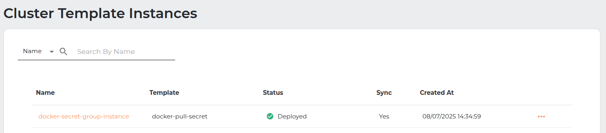
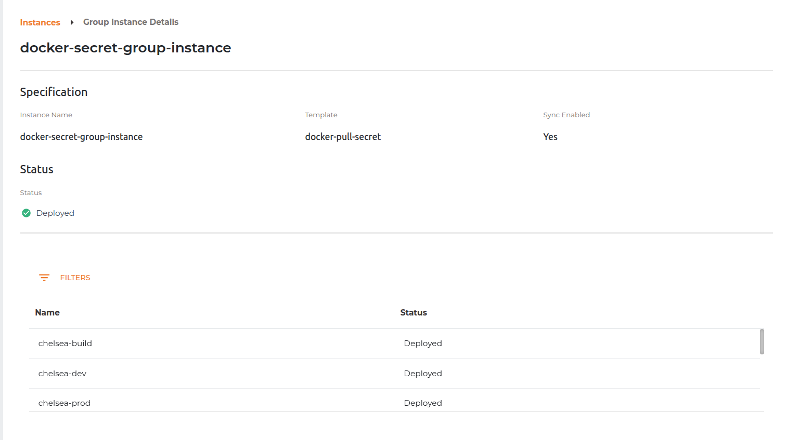
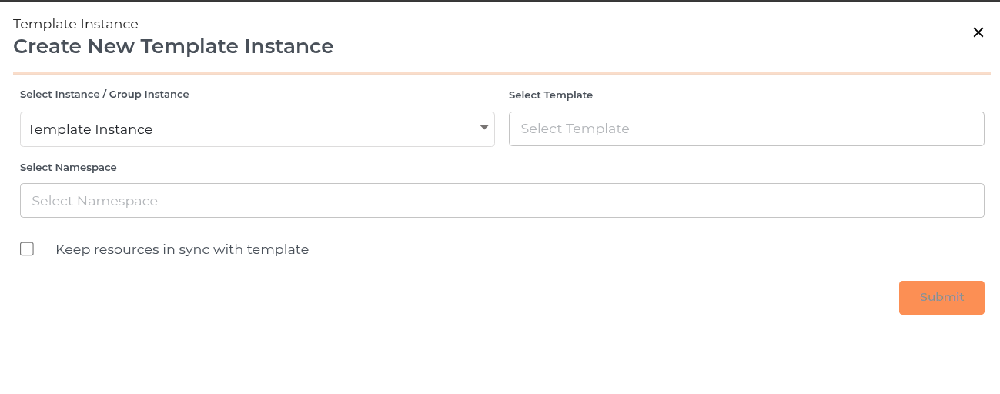
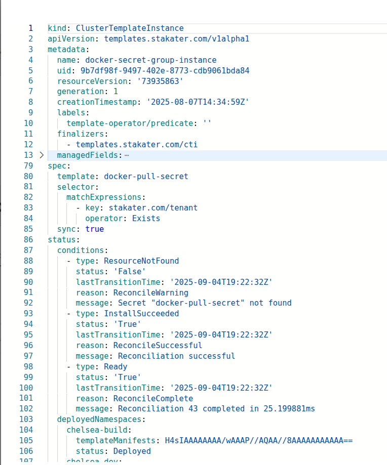
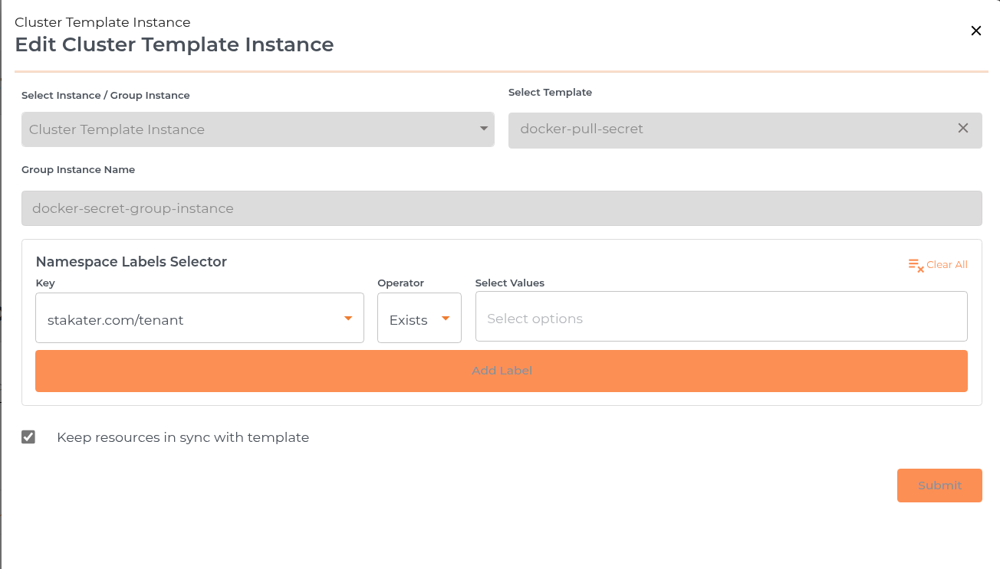

# Cluster Template Instances

[Cluster Template Instances](https://docs.stakater.com/template-operator/main/kubernetes-resources/cluster-template-instance.html) in the MTO Console allow users to deploy standardized resource configurations, such as Kubernetes manifests, Helm charts, Secrets, or ConfigMaps, into multiple namespaces that match specific label selectors. By using Cluster Template Instances, organizations can ensure consistency, repeatability, and compliance across multiple environments. Each Cluster Template Instance is based on a predefined template and can be managed, synchronized, or removed as needed, making it easy to propagate best practices and updates throughout your infrastructure.

## Details Section

By clicking on the Cluster Template Instance name user can be directed to the details section of the selected Cluster Template Instance. It has breadcrumb to redirect user back to the Template Instances table.

## Create Cluster Template Instance

The Cluster Template Instance creation process in the MTO Console is designed to be straightforward, allowing users to deploy a selected template into all namespaces matching specified label selectors, with optional synchronization. The process is presented in a drawer interface and consists of the following steps:

### Cluster Template Instance Info

- **Create Instance(s) Button:** Click the "Create Instance(s)" button at the top right of the Cluster Template Instances page to start the process.
- **Select Instance / Cluster Template Instance:** Choose "Cluster Template Instance" from the dropdown.
- **Select Template:** Pick the template you want to instantiate (e.g., docker-pull-secret).
- **Cluster Template Instance Name:** Enter a unique name for the Cluster Template Instance.
- **Namespace Labels Selector:** Add one or more label selectors to target namespaces. For each selector:
    - **Key:** Enter the label key (e.g., `stakater.com/quota`).
    - **Operator:** The operator is set to "In".
    - **Select Values:** Choose one or more values for the label key (e.g., `large`, `small`).
    - You can add multiple selectors to further refine the target namespaces.
- **Keep resources in sync with template:** (Optional) Check this box to ensure that resources deployed by this Cluster Template Instance remain synchronized with any updates to the template.

Click **Submit** to create the Cluster Template Instance.

### Result & Management

The new Cluster Template Instance will appear in the list with the following columns:

- **Name:** The name of the Cluster Template Instance.
- **Template:** The template used for the Cluster Template Instance.
- **Status:** Indicates if the Cluster Template Instance is deployed (e.g., green check for deployed).
- **Sync:** Shows if the resources are kept in sync with the template.
- **Created At:** Timestamp of Cluster Template Instance creation.
- **Actions:** Three-dot menu for additional actions (e.g., view YAML, edit, delete).

## YAML View

## Update Cluster Template Instance

When editing a Cluster Template Instance, the edit screen displays all configuration fields, including:

- Select Instance / Cluster Template Instance (type)
- Select Template
- Cluster Template Instance Name
- Namespace Labels Selector (with all keys, operators, and values visible)
- Keep resources in sync with template (checkbox)

However, (Select Instance / Cluster Template Instance, Select Template and Cluster Template Instance Name) fields are disabled and cannot be modified. Only the namespace labels selector can be modified.

## Delete Cluster Template Instance

A Cluster Template Instance can be deleted by clicking on the three-dot menu in the table.
