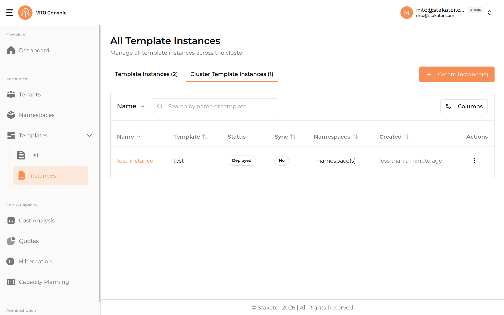
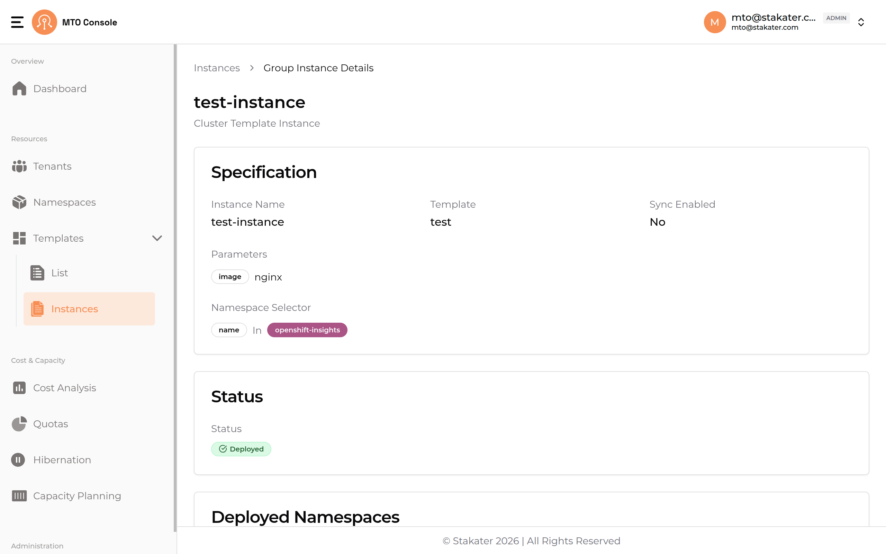
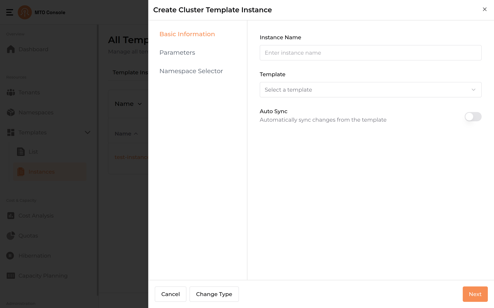
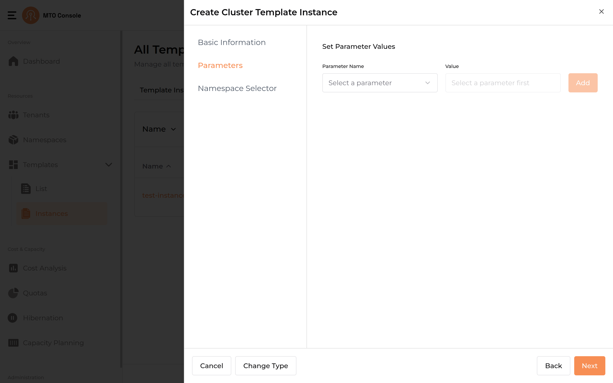
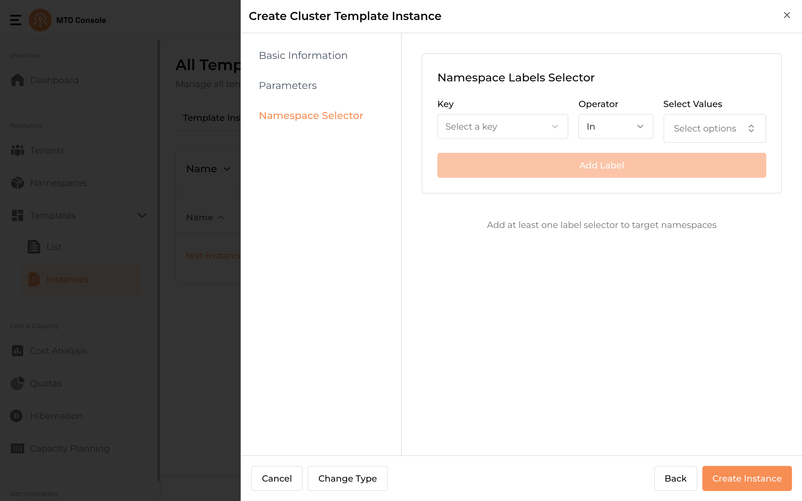
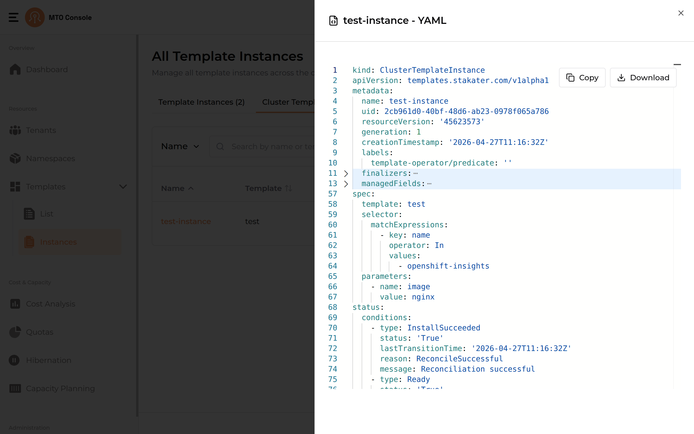

# Cluster Template Instances

[Cluster Template Instances](https://docs.stakater.com/template-operator/main/kubernetes-resources/cluster-template-instance.html) in the MTO Console allow users to deploy standardized resource configurations, such as Kubernetes manifests, Helm charts, Secrets, or ConfigMaps, into multiple namespaces that match specific label selectors. By using Cluster Template Instances, organizations can ensure consistency, repeatability, and compliance across multiple environments. Each Cluster Template Instance is based on a predefined template and can be managed, synchronized, or removed as needed, making it easy to propagate best practices and updates throughout your infrastructure.

The Cluster Template Instances tab on the Template Instances page lists each instance with the following columns: **Name**, **Template**, **Status**, **Sync**, **Namespaces** (the number of matched namespaces), **Created**, and an **Actions** kebab menu.

## Details Section

By clicking on the Cluster Template Instance name user can be directed to the details section of the selected Cluster Template Instance. It has breadcrumb to redirect user back to the Template Instances table.

The details page shows:

- **Specification:** Instance Name, Template, and Sync Enabled.
- **Parameters:** Key-value chips for each parameter set on the instance.
- **Namespace Selector:** The label selectors used to target namespaces.
- **Status:** Current deployment status badge.
- **Deployed Namespaces:** The list of namespaces where the resources have been applied.

## Create Cluster Template Instance

The Cluster Template Instance creation process in the MTO Console is designed to be straightforward, allowing users to deploy a selected template into all namespaces matching specified label selectors, with optional synchronization. The process is presented in a drawer interface with a three-step stepper: **Basic Information**, **Parameters**, and **Namespace Selector**.

Click the **Create Instance(s)** button at the top right of the Template Instances page to open the creation drawer. On the Select Instance Type screen, choose **Cluster Template Instance** to enter the cluster-scoped flow. The **Change Type** button on later steps lets you switch back to the namespace-scoped Template Instance flow without leaving the drawer.

### Basic Information

- **Instance Name:** Enter a unique name for the Cluster Template Instance.
- **Template:** Pick the template you want to instantiate (for example, `docker-pull-secret`).
- **Auto Sync:** Toggle on to automatically sync changes from the template to the deployed resources.

Click **Next** to continue to Parameters.

### Parameters

- **Parameter Name:** Select a parameter defined in the template.
- **Value:** Provide the value for the selected parameter.
- Click **Add** to include the parameter in the instance.

Click **Next** to continue to Namespace Selector.

### Namespace Selector

The **Namespace Labels Selector** targets namespaces by their labels.

- **Key:** Select a label key (for example, `stakater.com/quota`).
- **Operator:** Select the match operator (default: `In`).
- **Select Values:** Choose one or more values to match against (for example, `large`, `small`).
- Click **Add Label** to add the selector. Multiple selectors can be added to further refine the target namespaces.

At least one label selector must be added to target namespaces. Click **Create Instance** to save the Cluster Template Instance.

### Result & Management

The new Cluster Template Instance will appear in the Cluster Template Instances tab with the following columns:

- **Name:** The name of the Cluster Template Instance.
- **Template:** The template used for the Cluster Template Instance.
- **Status:** Indicates if the Cluster Template Instance is deployed (for example, `Deployed` for a successful deployment).
- **Sync:** Shows if the resources are kept in sync with the template.
- **Namespaces:** The number of matched namespaces where resources are deployed.
- **Created:** Timestamp of Cluster Template Instance creation.
- **Actions:** Three-dot menu for additional actions (view YAML, edit, delete).

## YAML View

A YAML representation of the Cluster Template Instance can be previewed by selecting **View YAML** from the Actions kebab menu on an instance row. The YAML drawer also provides **Copy** and **Download** options.

## Update Cluster Template Instance

Selecting **Edit** from the Actions kebab menu opens the same stepper drawer with all fields pre-populated. The **Instance Name** and **Template** in the Basic Information step are disabled and cannot be modified. The Auto Sync toggle, Parameters, and Namespace Selector remain editable.

## Delete Cluster Template Instance

A Cluster Template Instance can be deleted by selecting **Delete** from the Actions kebab menu on the instance row.
