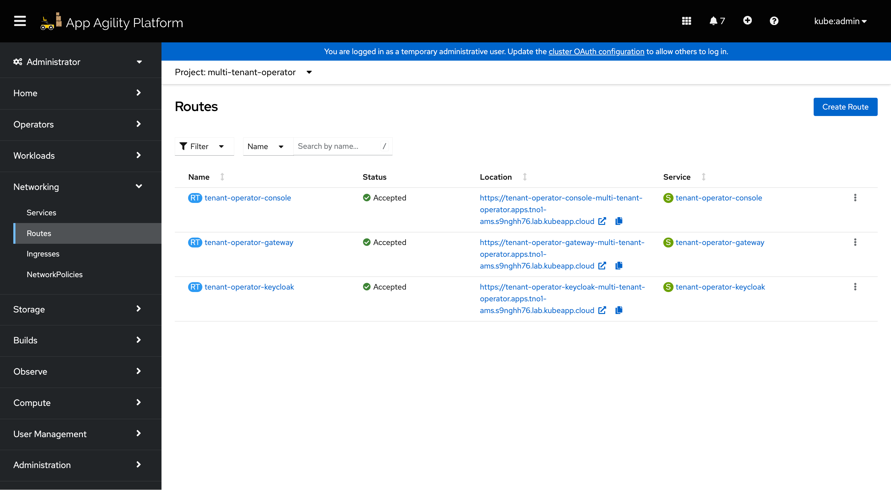
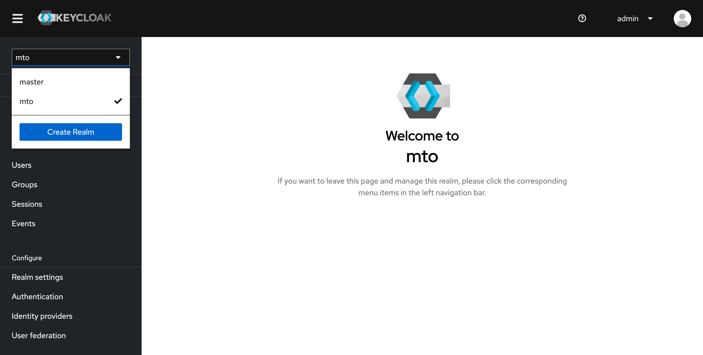
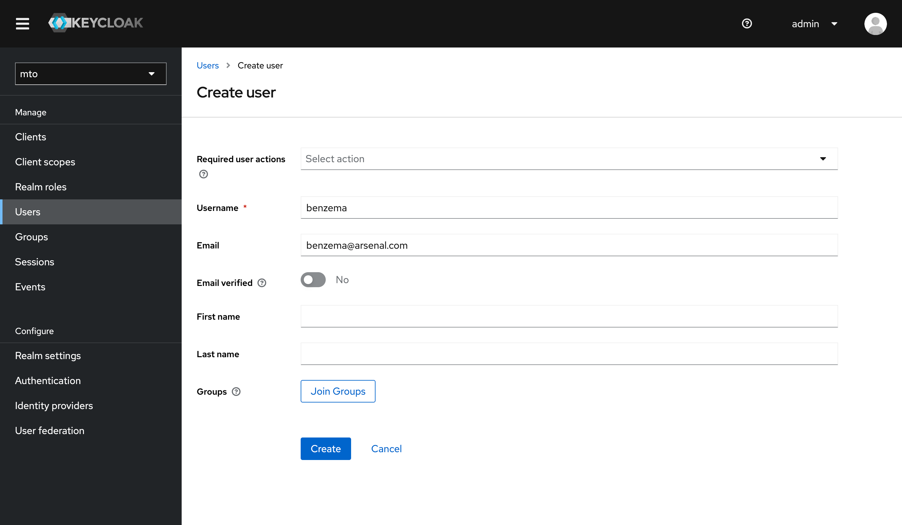
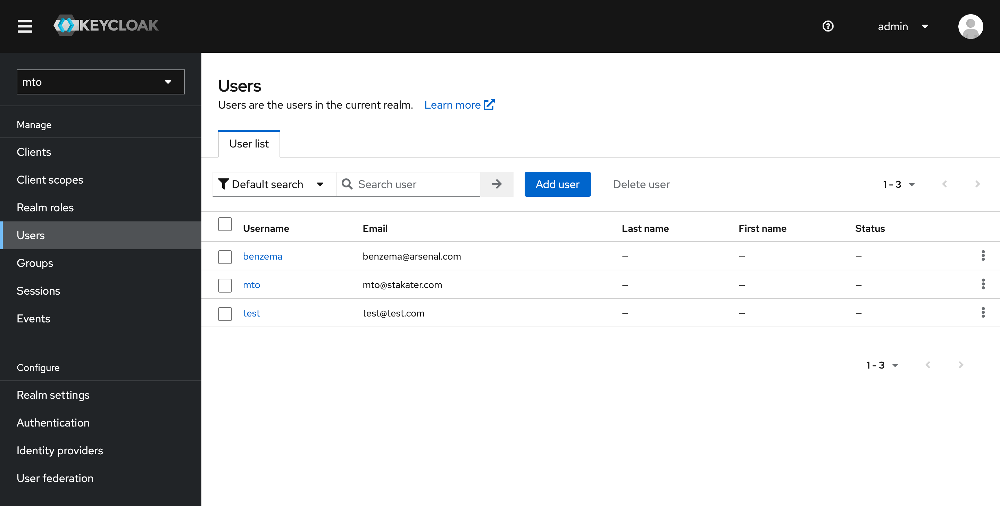

# Configuration

## User Roles and Permissions

### Administrators

Administrators have overarching access to the console, including the ability to view all namespaces and tenants. They have exclusive access to the IntegrationConfig, allowing them to view all the settings and integrations.


### Tenant Users

Regular tenant users can monitor and manage their allocated resources. However, they do not have access to the IntegrationConfig and cannot view resources across different tenants, ensuring data privacy and operational integrity.

## Caching and Database

MTO integrates a dedicated database to streamline resource management. Now, all resources managed by MTO are efficiently stored in a Postgres database, enhancing the MTO Console's ability to efficiently retrieve all the resources for optimal presentation.

The implementation of this feature is facilitated by the Bootstrap controller, streamlining the deployment process. This controller creates the PostgreSQL Database, establishes a service for inter-pod communication, and generates a secret to ensure secure connectivity to the database.

Furthermore, the introduction of a dedicated cache layer ensures that there is no added burden on the Kube API server when responding to MTO Console requests. This enhancement not only improves response times but also contributes to a more efficient and responsive resource management system.

## Authentication and Authorization

### Keycloak for Authentication

MTO Console incorporates Keycloak, a leading authentication module, to manage user access securely and efficiently. Keycloak is provisioned automatically by our controllers, setting up a new realm, client, and a default user named `mto`.

#### Benefits

- Industry Standard: Offers robust, reliable authentication in line with industry standards.
- Integration with Existing Systems: Enables easy linkage with existing Active Directories or SSO systems, avoiding the need for redundant user management.
- Administrative Control: Grants administrators full authority over user access to the console, enhancing security and operational integrity.

### PostgreSQL as Persistent Storage for Keycloak

MTO Console leverages PostgreSQL as the persistent storage solution for Keycloak, enhancing the reliability and flexibility of the authentication system.

It offers benefits such as enhanced data reliability, easy data export and import.

#### Benefits

- Persistent Data Storage: By using PostgreSQL, Keycloak's data, including realms, clients, and user information, is preserved even in the event of a pod restart. This ensures continuous availability and stability of the authentication system.
- Data Exportability: Customers can easily export Keycloak configurations and data from the PostgreSQL database.
- Transferability Across Environments: The exported data can be conveniently imported into another cluster or Keycloak instance, facilitating smooth transitions and backups.
- No Data Loss: Ensures that critical authentication data is not lost during system updates or maintenance.
- Operational Flexibility: Provides customers with greater control over their authentication data, enabling them to manage and migrate their configurations as needed.

### Built-in module for Authorization

The MTO Console is equipped with an authorization module, designed to manage access rights intelligently and securely.

#### Benefits

- User and Tenant Based: Authorization decisions are made based on the user's membership in specific tenants, ensuring appropriate access control.
- Role-Specific Access: The module considers the roles assigned to users, granting permissions accordingly to maintain operational integrity.
- Elevated Privileges for Admins: Users identified as administrators or members of the clusterAdminGroups are granted comprehensive permissions across the console.
- Database Caching: Authorization decisions are cached in the database, reducing reliance on the Kubernetes API server.
- Faster, Reliable Access: This caching mechanism ensures quicker and more reliable access for users, enhancing the overall responsiveness of the MTO Console.

## Setting Up User Access in Keycloak for MTO Console

This guide walks you through the process of adding new users in Keycloak and granting them access to Multi Tenant Operator (MTO) Console.

### Accessing Keycloak Console

- Log in to the OpenShift Console.
- Go to the 'Routes' section within the 'multi-tenant-operator' namespace.



- Click on the Keycloak console link provided in the Routes.
- Login using the admin credentials (default: admin/admin).

### Adding new Users in Keycloak

- In the Keycloak console, switch to the `mto` realm.



- Go to the `Users` section in the `mto` realm.
- Follow the prompts to add a new user.



- Once you add a new user, here is how the Users section would look like



### Accessing MTO Console

- Go back to the OpenShift Console, navigate to the Routes section, and get the URL for the MTO Console.
- Open the MTO Console URL and log in with the newly added user credentials.

Now, at this point, a user will be authenticated to the MTO Console. But in order to get access to view any Tenant resources, the user will need to be part of a Tenant.

### Granting Access to Tenant Resources

* Open Tenant CR: In the OpenShift cluster, locate and open the Tenant Custom Resource (CR) that you wish to give access to. You will see a YAML file similar to the following example:

```yaml
apiVersion: tenantoperator.stakater.com/v1beta3
kind: Tenant
metadata:
  name: arsenal
spec:
  quota: small
  accessControl:
    owners:
      users:
        - gabriel@arsenal.com
      groups:
        - arsenal
    editors:
      users:
        - hakimi@arsenal.com
    viewers:
      users:
        - neymar@arsenal.com
```

* Edit Tenant CR: Add the newly created user's email to the appropriate section (owners, editors, viewers) in the Tenant CR. For example, if you have created a user `john@arsenal.com` and wish to add them as an editor, the edited section would look like this:

```yaml
editors:
  users:
    - gabriel@arsenal.com
    - benzema@arsenal.com
```

* Save Changes: Save and apply the changes to the Tenant CR.

### Verifying Access

Once the above steps are completed, you should be able to access the MTO Console now and see alpha Tenant's details along with all the other resources such as namespaces and templates that John has access to.
