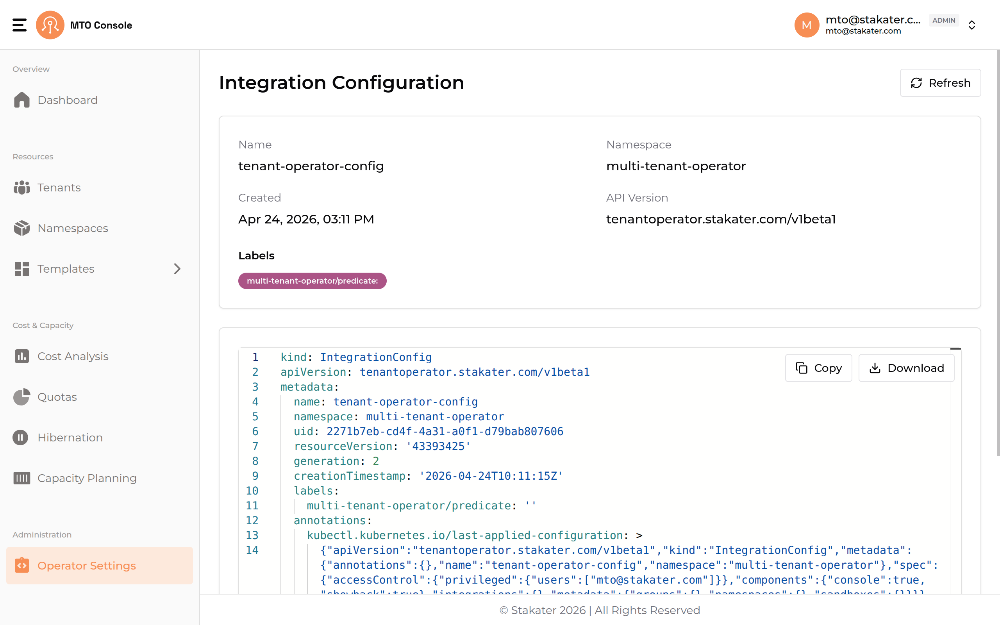

# Configuration

## User Roles and Permissions

### Administrators

Administrators have overarching access to the console, including the ability to view all namespaces and tenants. They have exclusive access to the IntegrationConfig, allowing them to view all the settings and integrations.



### Tenant Users

Regular tenant users can monitor and manage their allocated resources. However, they do not have access to the IntegrationConfig and cannot view resources across different tenants, ensuring data privacy and operational integrity.

## Caching and Database

MTO integrates a dedicated database to streamline resource management. Now, all resources managed by MTO are efficiently stored in a Postgres database, enhancing the MTO Console's ability to efficiently retrieve all the resources for optimal presentation.

The implementation of this feature is facilitated by the Bootstrap controller, streamlining the deployment process. This controller creates the PostgreSQL Database, establishes a service for inter-pod communication, and generates a secret to ensure secure connectivity to the database.

Furthermore, the introduction of a dedicated cache layer ensures that there is no added burden on the Kube API server when responding to MTO Console requests. This enhancement not only improves response times but also contributes to a more efficient and responsive resource management system.

## Authentication and Authorization

### Built-in module for Authorization

The MTO Console is equipped with an authorization module, designed to manage access rights intelligently and securely.

#### Benefits

- User and Tenant Based: Authorization decisions are made based on the user's membership in specific tenants, ensuring appropriate access control.
- Role-Specific Access: The module considers the roles assigned to users, granting permissions accordingly to maintain operational integrity.
- Elevated Privileges for Admins: Users identified as administrators or members of the clusterAdminGroups are granted comprehensive permissions across the console.
- Database Caching: Authorization decisions are cached in the database, reducing reliance on the Kubernetes API server.
- Faster, Reliable Access: This caching mechanism ensures quicker and more reliable access for users, enhancing the overall responsiveness of the MTO Console.

## Granting Access to Tenant Resources

- Open Tenant CR: In the OpenShift cluster, locate and open the Tenant Custom Resource (CR) that you wish to give access to. You will see a YAML file similar to the following example:

```yaml
apiVersion: tenantoperator.stakater.com/v1beta3
kind: Tenant
metadata:
  name: arsenal
spec:
  quota: small
  accessControl:
    owners:
      users:
        - gabriel@arsenal.com
      groups:
        - arsenal
    editors:
      users:
        - hakimi@arsenal.com
    viewers:
      users:
        - neymar@arsenal.com
```

- Edit Tenant CR: Add the user's email to the appropriate section (owners, editors, viewers) in the Tenant CR. For example, to add `john@arsenal.com` as an editor, the edited section would look like this:

```yaml
editors:
  users:
    - gabriel@arsenal.com
    - benzema@arsenal.com
```

- Save Changes: Save and apply the changes to the Tenant CR.

### Verifying Access

Once the above steps are completed, you should be able to access the MTO Console now and see alpha Tenant's details along with all the other resources such as namespaces and templates that John has access to.
