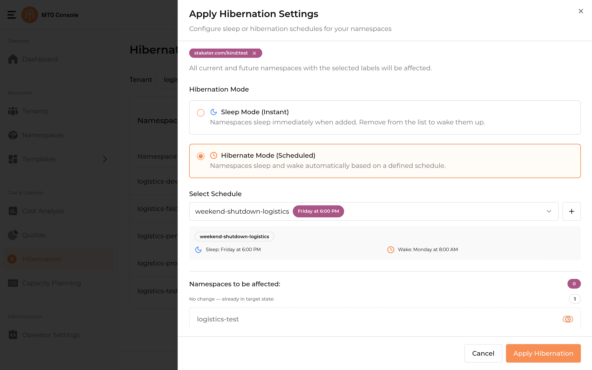
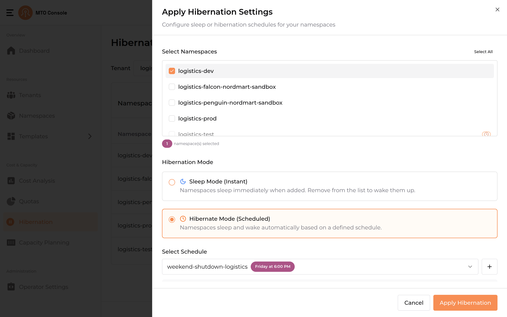
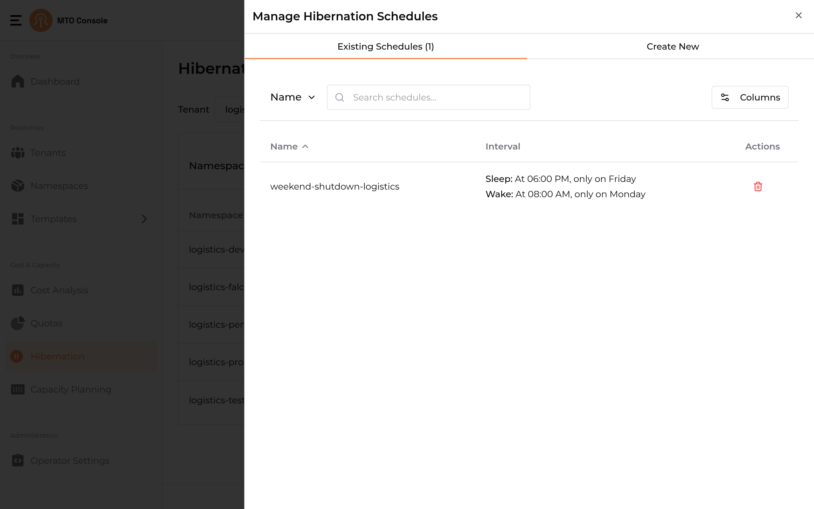
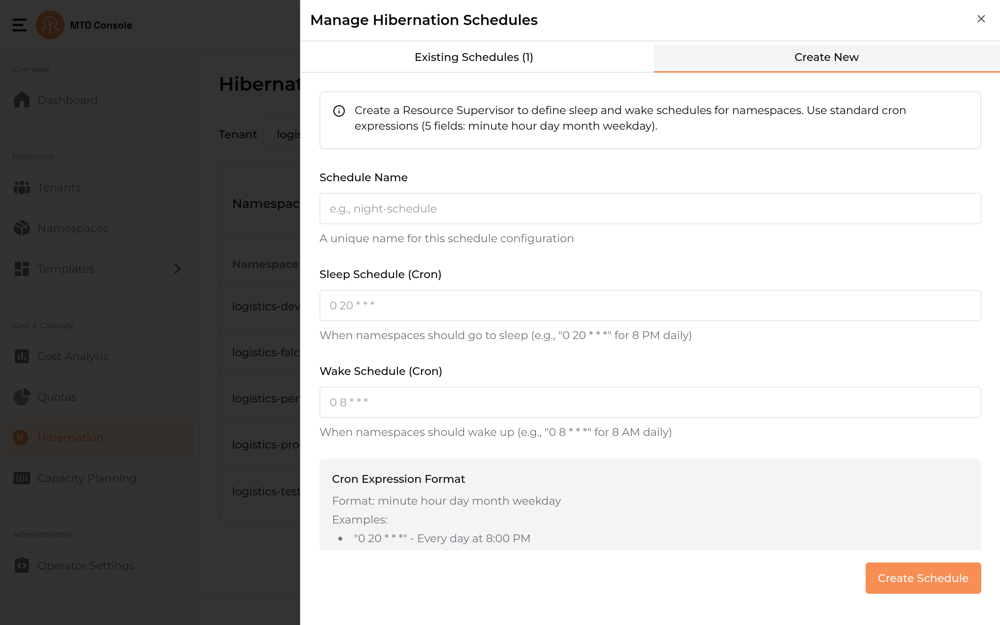

# Hibernation

The main purpose of the Hibernation workflow is, controlling resource consumption dynamically while enabling efficient management of namespaces based on their usage patterns and requirements.

Namespaces can be put to rest in two ways:

- **Sleep (Instant):** Namespaces sleep immediately and stay asleep until they are explicitly woken. There is no schedule — sleep and wake are manual.
- **Hibernate (Scheduled):** Namespaces sleep and wake automatically based on a cron schedule (a *hibernation schedule*). They are woken automatically at the schedule's wake time.

## Namespace List

Displays a list of namespaces associated with a selected tenant. The tenant filter and schedule filters allow users to scope the namespaces shown. The header also exposes the **Manage Schedules** action (to view and create hibernation schedules) and the **Apply Sleep / Hibernate** action.

### Columns

- **Namespace:** Name of the namespace.
- **Status:** A badge showing whether the namespace is currently `Active`, `Sleeping` (put to sleep instantly), or `Hibernating` (asleep on a schedule).
- **Schedule Details:** Shows the hibernation schedule attached to the namespace, if any. Hovering over a schedule reveals its sleep and wake details.
- **Actions:** A **Wake up** action for namespaces that are currently asleep. See [Waking a Namespace](#waking-a-namespace).

### Actions and Filters

- **Apply Sleep / Hibernate:** Opens the Apply Hibernation Settings drawer to put namespaces to sleep or attach them to a hibernation schedule.
- **Manage Schedules:** Opens the Manage Hibernation Schedules drawer to view, create, and delete schedules.
- **Tenant filter:** Switch the displayed namespaces to a specific tenant.
- **Schedule Filters:** Filter the list by namespace state — `All`, `Sleeping`, `Hibernated`, or `Active`.

### Waking a Namespace

Whether a sleeping namespace can be woken from the list depends on how it was targeted:

- **Targeted By Namespaces:** the **Wake up** action is enabled and wakes the namespace directly. In the example above, `logistics-prod` was put to sleep individually, so its **Wake up** action is active.
- **Targeted By Labels:** the **Wake up** action is disabled, because the label selector would simply put the namespace back to sleep. In the example above, `logistics-test` is hibernating via a label-based schedule, so its **Wake up** action is greyed out. To wake it, delete the schedule that put it to sleep (see [Managing Hibernation Schedules](#managing-hibernation-schedules)), or remove the matching label so it no longer falls under the selector.

## Apply Hibernation Settings

Clicking **Apply Sleep / Hibernate** opens a drawer titled **Apply Hibernation Settings**. The drawer has two independent selectors that determine how namespaces are affected:

- **Target Selection** — *what* namespaces to affect (`By Labels` or `By Namespaces`).
- **Hibernation Mode** — *how* they sleep (`Sleep Mode (Instant)` or `Hibernate Mode (Scheduled)`).

A **Current Status** panel at the top of the drawer shows the count of currently sleeping namespaces and namespaces currently scheduled. Use **View namespaces** to expand the underlying list.

### Target Selection

#### By Labels

Selects namespaces by Kubernetes labels. Use the **Select namespace labels** dropdown to search and pick one or more existing label `key:value` pairs. All current and future namespaces matching the selected labels will be affected.

In the example below, the label `stakater.com/kind:prod` is selected and the matching namespaces are shown under "Namespaces to be affected".

#### By Namespaces

Shows a namespace checklist with a **Select All** link. Users select namespaces directly from the list — there is no labels filter on this flow. Namespaces that are already asleep are shown but cannot be selected.

### Hibernation Mode

#### Sleep Mode (Instant)

Namespaces sleep immediately when added to the affected list, and wake up automatically when removed from the list. No schedule is required. The drawer's bottom action is **Apply Sleep Mode**.

#### Hibernate Mode (Scheduled)

Namespaces sleep and wake automatically based on a defined cron schedule. A schedule must be selected (or created) before the action can proceed.

The **Select Schedule** dropdown shows existing schedules and their sleep/wake details. Use the **+** button next to it to create a new schedule. The drawer's bottom action is **Apply Hibernation**.

Hibernate Mode can also be applied to an explicit set of namespaces using **By Namespaces**.

### Namespaces to be affected

Before applying, the **Namespaces to be affected** panel previews exactly which namespaces the current selection will change, along with a count.

- Namespaces that are already in the requested state are marked **No change — already in target state** and are excluded from the count.
- Namespaces in a conflicting state — for example, a **By Labels** selection for Sleep Mode that matches namespaces already hibernating on a schedule — are flagged as non-actionable, and **Apply** is disabled until the conflict is resolved.

## Managing Hibernation Schedules

Clicking **Manage Schedules** opens the **Manage Hibernation Schedules** drawer, which has two tabs: **Existing Schedules** and **Create New**.

### Existing Schedules

Lists the schedules defined for the selected tenant, each showing its **Interval** (the sleep and wake times). Schedules can be searched by name, and the **Columns** control adjusts which columns are shown. Use the delete action to remove a schedule — deleting a schedule wakes any namespaces that were hibernating on it.

### Creating a Hibernation Schedule

A schedule can be created from the **Create New** tab here, or from the **+** button next to the **Select Schedule** dropdown in the Apply Hibernation Settings drawer. Existing schedules can also be reused directly from that dropdown.

The create form has the following fields:

- **Schedule Name:** A unique name for the schedule.
- **Quick Presets:** Optional dropdown of preset schedules that auto-fill the Sleep and Wake schedules below.
- **Sleep Schedule:** A cron expression in `MM HH DD MM W` (Minute Hour Day Month Weekday) format.
- **Wake Schedule:** A cron expression in the same format.
- **Schedule Preview:** Shows the next occurrences of both the Sleep and Wake events for verification.

Click **Create Schedule** to save.

