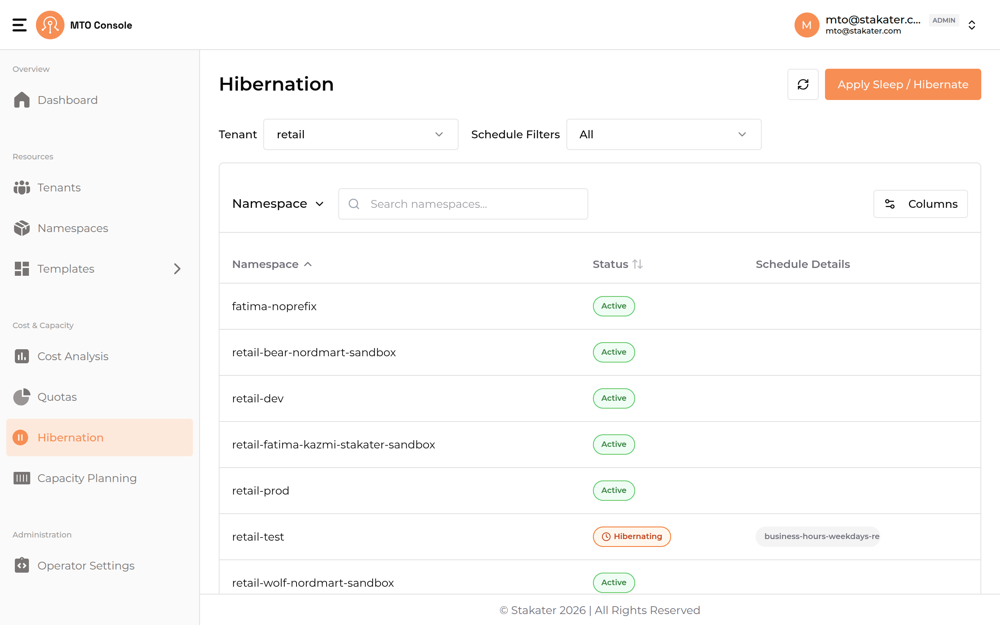
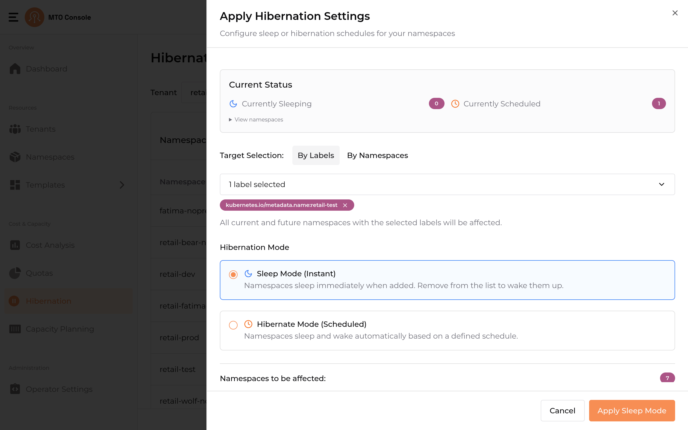
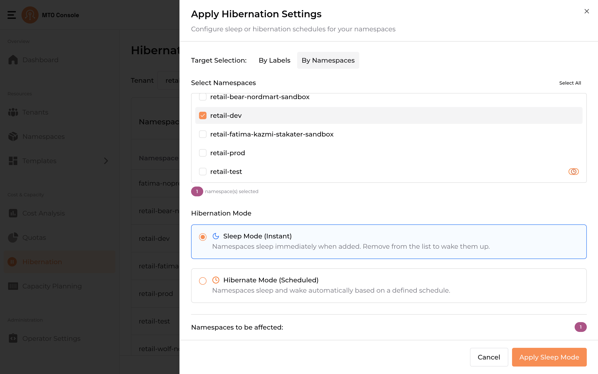
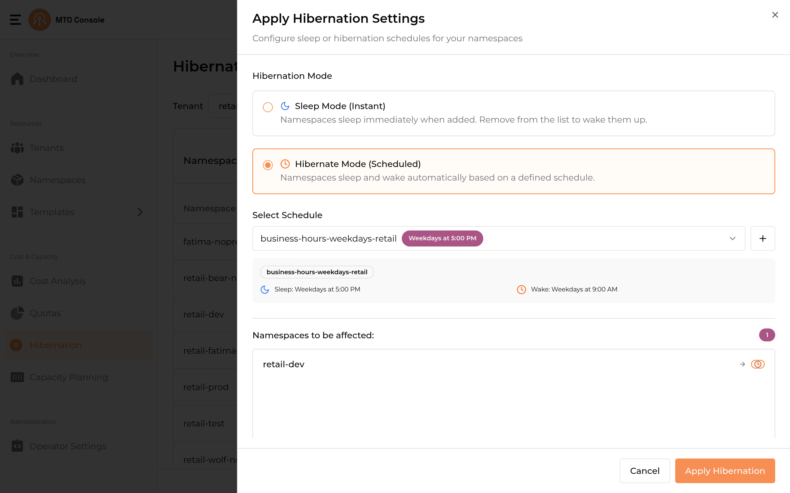
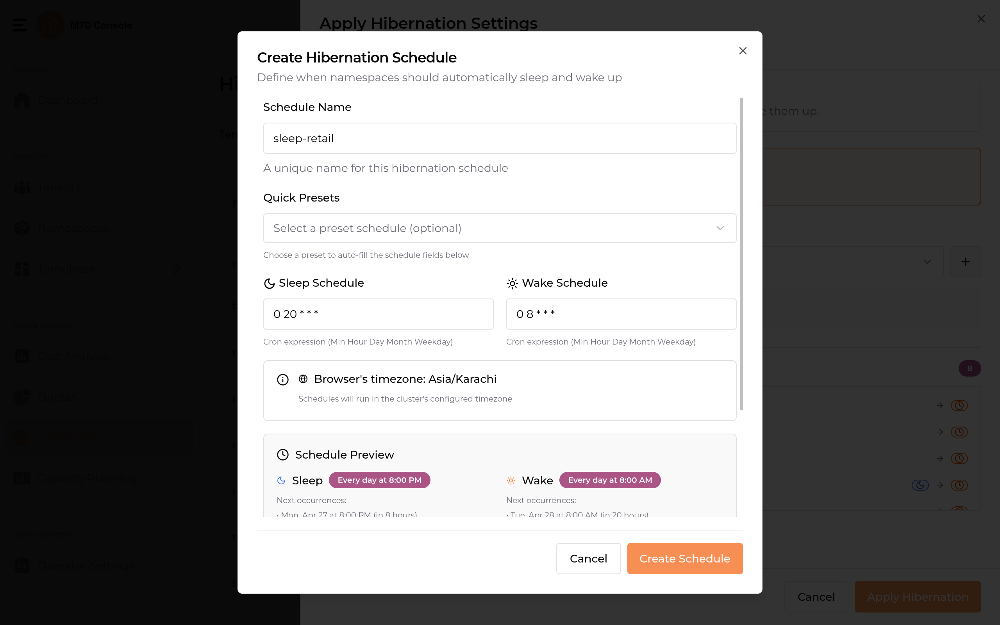

# Hibernation

The main purpose of the Hibernation workflow is, controlling resource consumption dynamically while enabling efficient management of namespaces based on their usage patterns and requirements.

## Namespace List

Displays a list of namespaces associated with a selected tenant. The tenant filter and schedule filters allow users to scope the namespaces shown.

### Columns

- **Namespace:** Name of the namespace.
- **Status:** A badge showing whether the namespace is currently `Active` or `Sleeping`.
- **Schedule Details:** Shows the hibernation schedule attached to the namespace, if any. Hovering over a schedule reveals its sleep and wake details.

### Actions and Filters

- **Apply Sleep / Hibernate:** Opens the Apply Hibernation Settings drawer to put namespaces to sleep or attach them to a hibernation schedule.
- **Tenant filter:** Switch the displayed namespaces to a specific tenant.
- **Schedule Filters:** Filter namespaces by their attached hibernation schedule.

## Apply Hibernation Settings

Clicking **Apply Sleep / Hibernate** opens a drawer titled **Apply Hibernation Settings**. The drawer has two independent selectors that determine how namespaces are affected:

- **Target Selection** — *what* namespaces to affect (`By Labels` or `By Namespaces`).
- **Hibernation Mode** — *how* they sleep (`Sleep Mode (Instant)` or `Hibernate Mode (Scheduled)`).

A **Current Status** panel at the top of the drawer shows the count of currently sleeping namespaces and namespaces currently scheduled.

### Target Selection

#### By Labels

Selects namespaces by Kubernetes labels. Users can input label selectors in the text box to target specific namespaces. All current and future namespaces matching the selected labels will be affected.

In the example below, the label `kubernetes.io/metadata.name:retail-dev` is selected and the matching namespace is shown under "Namespaces to be affected".

#### By Namespaces

Shows a namespace checklist with a **Select All** link. Users select namespaces directly from the list — there is no labels filter on this flow.

### Hibernation Mode

#### Sleep Mode (Instant)

Namespaces sleep immediately when added to the affected list, and wake up automatically when removed from the list. No schedule is required. The drawer's bottom action is **Apply Sleep Mode**.

#### Hibernate Mode (Scheduled)

Namespaces sleep and wake automatically based on a defined cron schedule. A schedule must be selected (or created) before the action can proceed.

The **Select Schedule** dropdown shows existing schedules. Use the **+** button next to it to create a new schedule. The drawer's bottom action is **Apply Hibernation**.

## Creating a Hibernation Schedule

Clicking the **+** button next to the Select Schedule dropdown opens the **Create Hibernation Schedule** modal.

- **Schedule Name:** A unique name for the schedule. The tenant name is appended after creation to indicate which tenant the schedule belongs to.
- **Quick Presets:** Optional dropdown of preset schedules that auto-fill the Sleep and Wake schedules below.
- **Sleep Schedule:** A cron expression in `MM HH DD MM W` (Minute Hour Day Month Weekday) format.
- **Wake Schedule:** A cron expression in the same format.
- **Browser timezone disclaimer:** Schedules will run in the cluster's configured timezone, which may differ from the browser's timezone.
- **Schedule Preview:** Shows the next occurrences of both Sleep and Wake events for verification.

Click **Create Schedule** to save.

