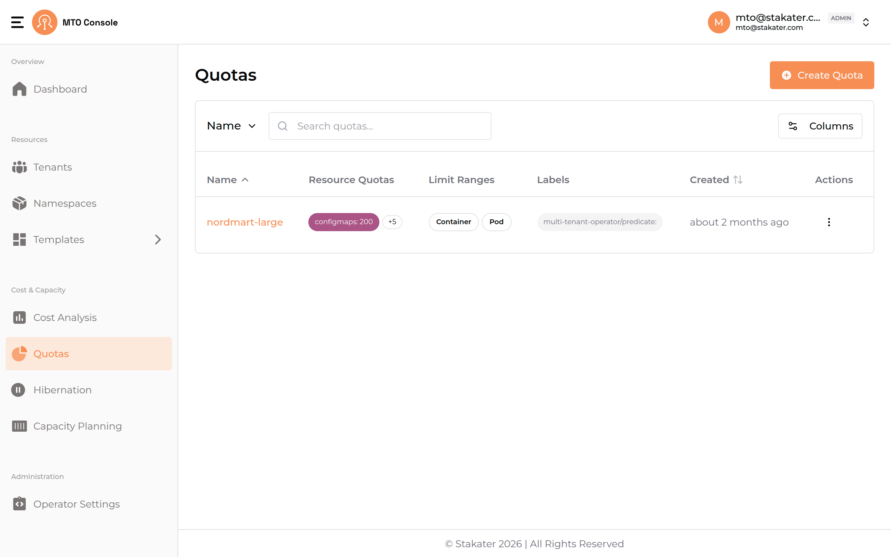
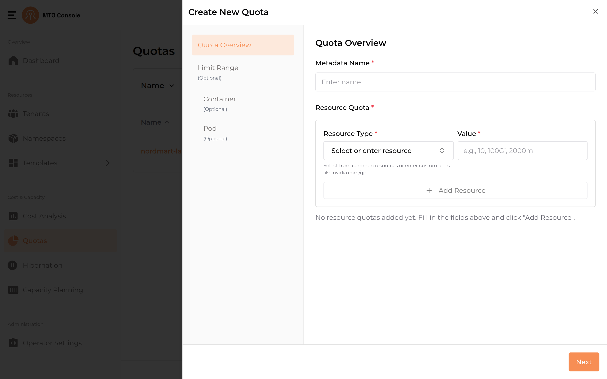
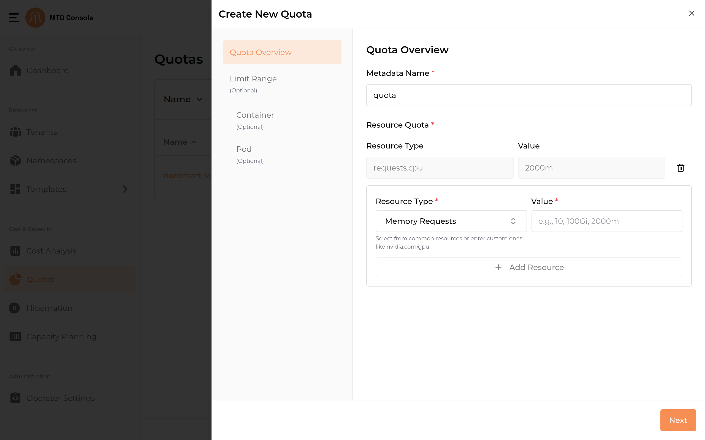
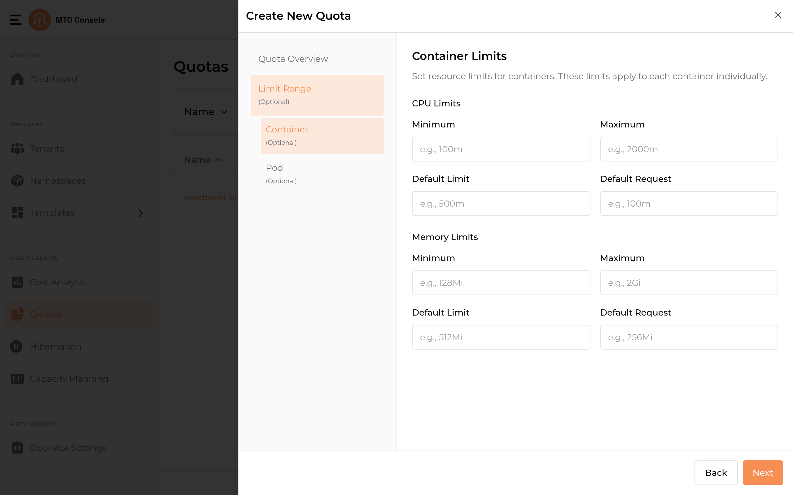
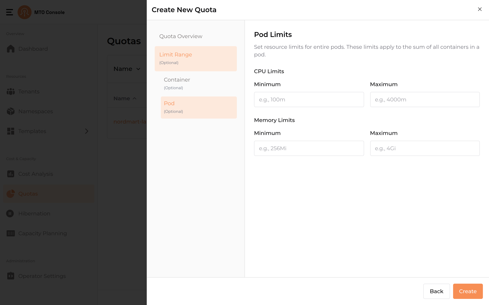

# Quotas

MTO's Quotas are crucial for managing resource allocation. In this section, administrators can assess the quotas assigned to each tenant, ensuring a balanced distribution of resources in line with operational requirements.



## Create Quota

Click the **Create Quota** button on the top-right of the Quotas page to open the creation drawer. The drawer uses a stepper layout with the following navigation items: **Quota Overview**, **Limit Range (Optional)**, **Container (Optional)**, and **Pod (Optional)**.

### Step 1: Quota Overview



This step combines the quota name and the resource quota definitions.

- Metadata Name
    - The name field is mandatory and must be unique.
    - If the name already exists, an inline error message is displayed.

- Error Handling
    - Regex Validation
    - The quota name must conform to the following regex pattern:

    ```regex
        /^[a-z0-9]+(-[a-z0-9]+)*$/
    ```

    - This ensures that quota names consist of lowercase alphanumeric characters and hyphens, and do not start or end with a hyphen.
    - Users must ensure the quota name meets the specified criteria. Also, the quota name should not already exist in order to create a new quota.

#### Resource Quota



1. Adding Resources
   - The **Resource Type** dropdown allows the selection of common resource types such as:
     - CPU Requests
     - Memory Requests
     - Config Maps
     - Secrets
     - Services
     - Load Balancer Services
   - Custom resources can also be entered (for example, `nvidia.com/gpu`).
   - Enter the corresponding **Value** for the selected resource (for example, `10`, `100Gi`, `2000m`).

1. Error Handling
   - If an invalid format is entered in the **Value** field, an inline error message is displayed.

1. Add Resource Button:
   - Allows users to add multiple resources sequentially.

### Step 2: Container (Optional)



Sets resource limits that apply to each container individually. The page is split into **CPU Limits** and **Memory Limits** sections, each accepting:

- **Minimum**
- **Maximum**
- **Default Limit**
- **Default Request**

#### Error Handling

- Inline errors guide users in correcting their inputs.

### Step 3: Pod (Optional)



Sets resource limits that apply to the sum of all containers in a pod. The page is split into **CPU Limits** and **Memory Limits** sections, each accepting only:

- **Minimum**
- **Maximum**

Unlike the Container step, Pod limits do not include Default Limit or Default Request fields.

#### Error Handling

- No validation errors occur unless an invalid value is entered.
- Inline errors guide users in correcting their inputs.

### Final Step: Save Quota

1. Create Button
   - Once all configurations are completed, users can click the **Create** button to save the quota.

1. Completion
   - The system validates all input fields before saving.
   - A confirmation message is displayed once the quota is successfully created.

### Notes

- The entire quota creation process is intuitive, with inline validation to guide users.
- Limit Range, Container, and Pod steps are all optional and can be skipped.

## Update Quota

From the **Actions** column on the Quotas list page, click the three-dot menu on a quota row and select the edit option to open the drawer with all the pre-populated quota configurations.

The update process follows the same stepper as the create process. The key difference is that the **Metadata Name** in **Quota Overview** cannot be edited or updated. All other steps and configurations remain the same, allowing users to modify resource quota and limit range values as needed.

## Delete Quota

From the **Actions** column on the Quotas list page, click the three-dot menu on a quota row and select the delete option. A confirmation modal will prompt the user to delete or cancel the operation.

## View YAML

From the **Actions** column on the Quotas list page, click the three-dot menu on a quota row and select the YAML option to view the quota's YAML representation.
