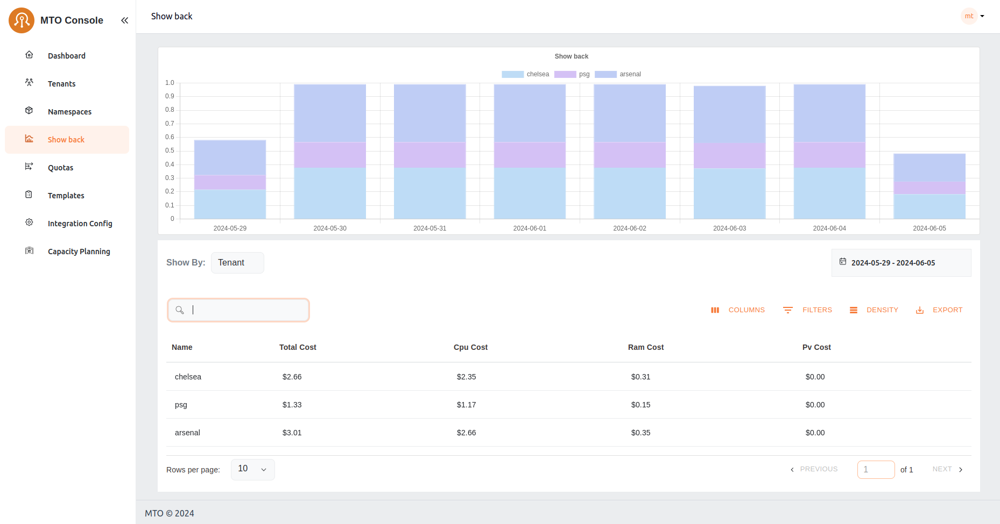

# Showback

The Showback feature is an essential financial governance tool, providing detailed insights into the cost implications of resource usage by tenant or namespace or other filters. This facilitates a transparent cost management and internal chargeback or showback process, enabling informed decision-making regarding resource consumption and budgeting.

