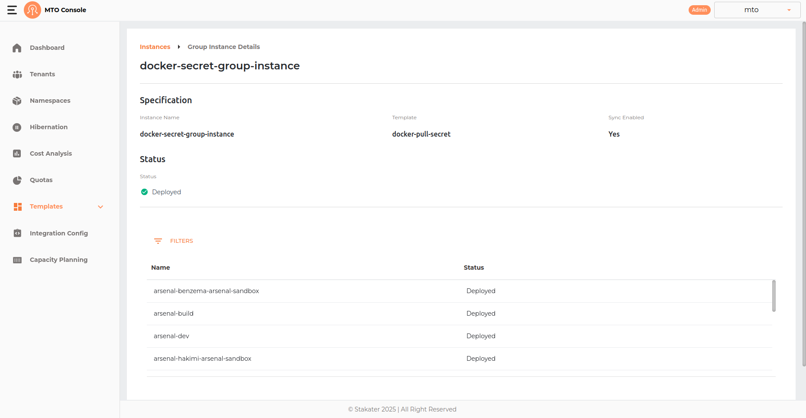
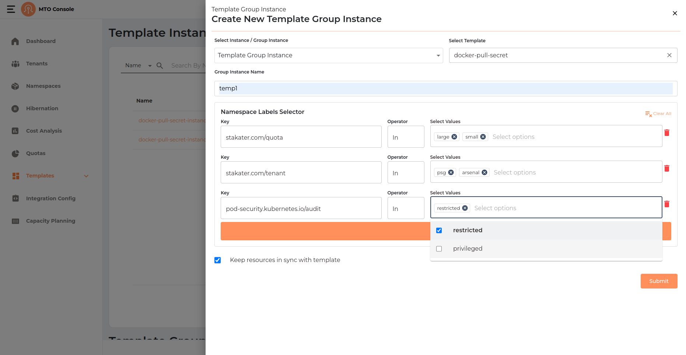
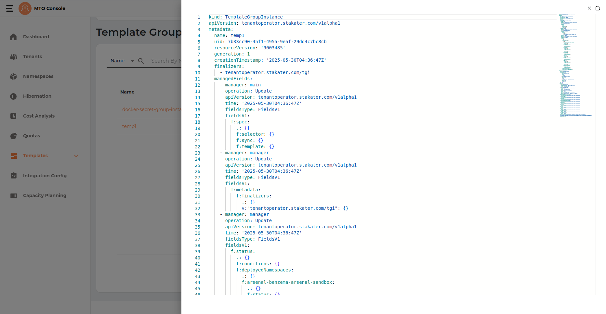
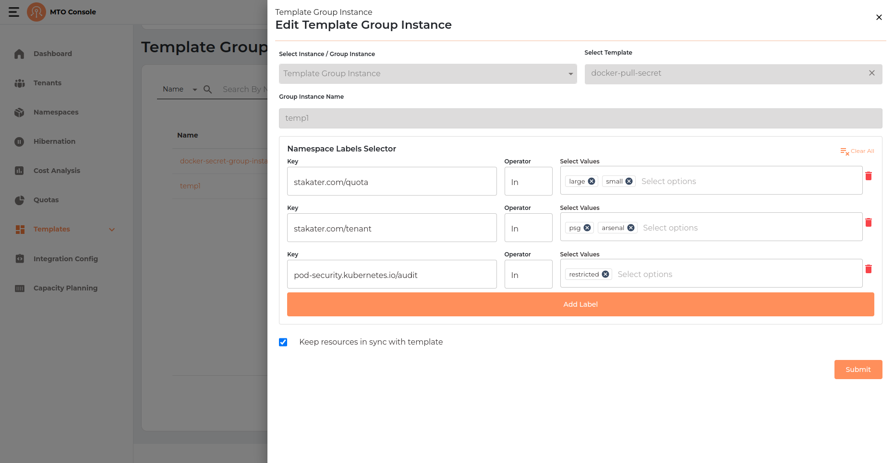

# Template Group Instances

Template Group Instances in the MTO Console allow users to deploy standardized resource configurations, such as Kubernetes manifests, Helm charts, secrets, or configmaps, into multiple namespaces that match specific label selectors. By using Template Group Instances, organizations can ensure consistency, repeatability, and compliance across multiple environments. Each group instance is based on a predefined template and can be managed, synchronized, or removed as needed, making it easy to propagate best practices and updates throughout your infrastructure.

## Details Section

By clicking on the Template Group Instance name user can be directed to the details section of the selected Template Group Instance. It has breadcrumb to redirect user back to the Template Instances table.

## Create Template Group Instance

The Template Group Instance creation process in the MTO Console is designed to be straightforward, allowing users to deploy a selected template into all namespaces matching specified label selectors, with optional synchronization. The process is presented in a drawer interface and consists of the following steps:

### Template Group Instance Info

- **Create Instance(s) Button:** Click the "Create Instance(s)" button at the top right of the Template Group Instances page to start the process.
- **Select Instance / Group Instance:** Choose "Template Group Instance" from the dropdown.
- **Select Template:** Pick the template you want to instantiate (e.g., docker-pull-secret).
- **Group Instance Name:** Enter a unique name for the group instance.
- **Namespace Labels Selector:** Add one or more label selectors to target namespaces. For each selector:
    - **Key:** Enter the label key (e.g., `stakater.com/quota`).
    - **Operator:** The operator is set to "In".
    - **Select Values:** Choose one or more values for the label key (e.g., `large`, `small`).
    - You can add multiple selectors to further refine the target namespaces.
- **Keep resources in sync with template:** (Optional) Check this box to ensure that resources deployed by this group instance remain synchronized with any updates to the template.

Click **Submit** to create the Template Group Instance.

### Result & Management

The new Template Group Instance will appear in the list with the following columns:

- **Name:** The name of the Template Group Instance.
- **Template:** The template used for the group instance.
- **Status:** Indicates if the group instance is deployed (e.g., green check for deployed).
- **Sync:** Shows if the resources are kept in sync with the template.
- **Created At:** Timestamp of group instance creation.
- **Actions:** Three-dot menu for additional actions (e.g., view YAML, edit, delete).

## YAML View

## Update Template Group Instance

When editing a Template Group Instance, the edit screen displays all configuration fields, including:

- Select Instance / Group Instance (type)
- Select Template
- Group Instance Name
- Namespace Labels Selector (with all keys, operators, and values visible)
- Keep resources in sync with template (checkbox)

However, (Select Instance / Group Instance, Select Template and Group Instance Name) fields are disabled and cannot be modified. Only the namespace labels selector can be modified.

## Delete Template Group Instance

A Template Group Instance can be deleted by clicking on the three-dot menu in the table.
