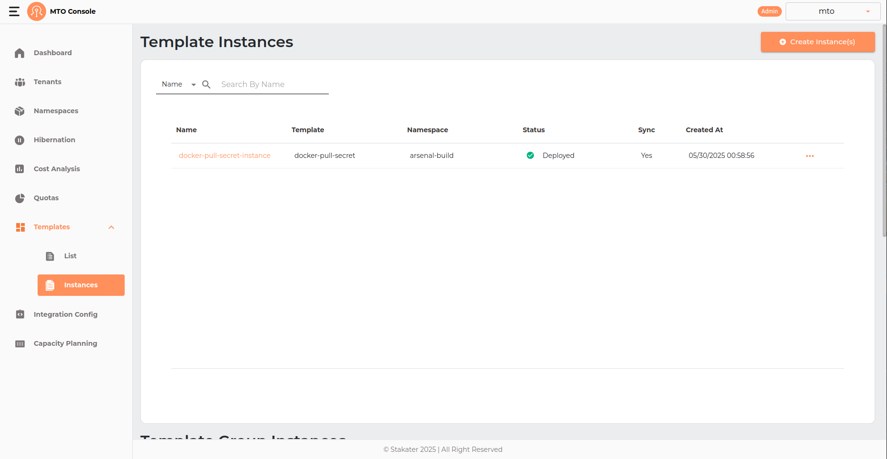
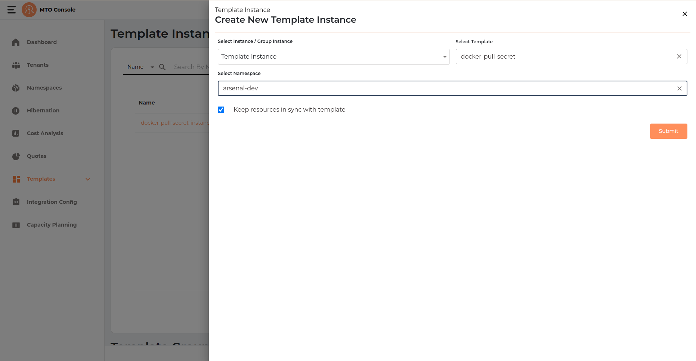
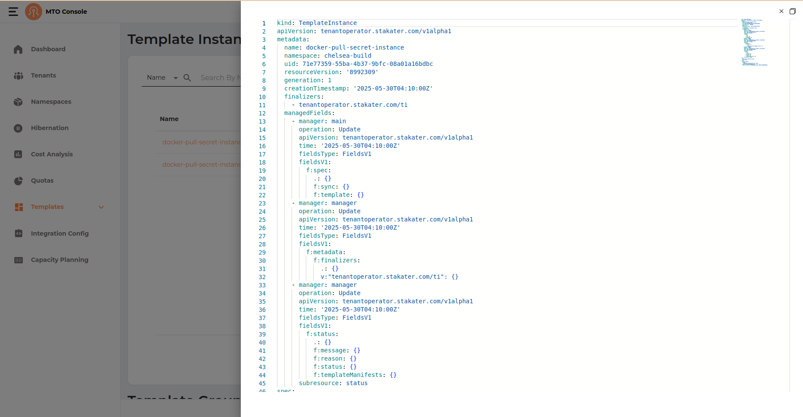

# Template Instances

Template Instances in the MTO Console allow users to deploy standardized resource configurations, such as Kubernetes manifests, Helm charts, secrets, or configmaps, into specific namespaces. By using Template Instances, organizations can ensure consistency, repeatability, and compliance across multiple environments. Each instance is based on a predefined template and can be managed, synchronized, or removed as needed, making it easy to propagate best practices and updates throughout your infrastructure.

## Create Template Instance

The Template Instance creation process in the MTO Console is designed to be straightforward, allowing users to deploy a selected template into a specific namespace with optional synchronization. The process is presented in a drawer interface and consists of the following steps:

### Template Instance Info

Create Instance(s) Button: Click the Create Instance(s) button at the top right of the Template Instances page to start the process.

By default selected type is Template Instance. But it can be modified to Template Group Instance.

### Instance Configuration

- Select Instance / Group Instance: Choose Template Instance from the dropdown.
- Select Template: Pick the template you want to instantiate (e.g., docker-pull-secret).
- Select Namespace: Choose the target namespace where the resources will be deployed (e.g., arsenal-dev).
- Keep resources in sync with template: (Optional) Check this box to ensure that resources deployed by this instance remain synchronized with any updates to the template.

Click Submit to create the Template Instance.

### Result & Management

The new Template Instance will appear in the list with the following columns:

- Name: The name of the Template Instance.
- Template: The template used for the instance.
- Namespace: The target namespace.
- Status: Indicates if the instance is deployed (e.g., green check for deployed).
- Sync: Shows if the resources are kept in sync with the template.
- Created At: Timestamp of instance creation.
- Actions: Three-dot menu for additional actions (e.g., view YAML, edit, delete).

## YAML View

## Update Template Instance

Template Instance can not be updated as all fields are disabled.

## Delete Template Instance

Template instance can be deleted by clicking on the three dot menu in the table.
