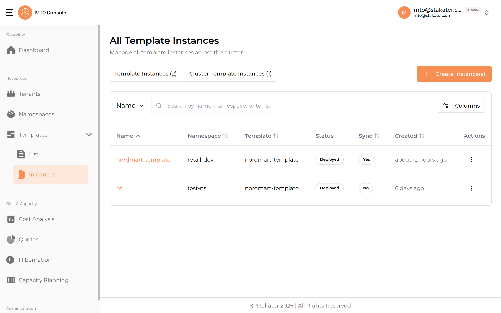
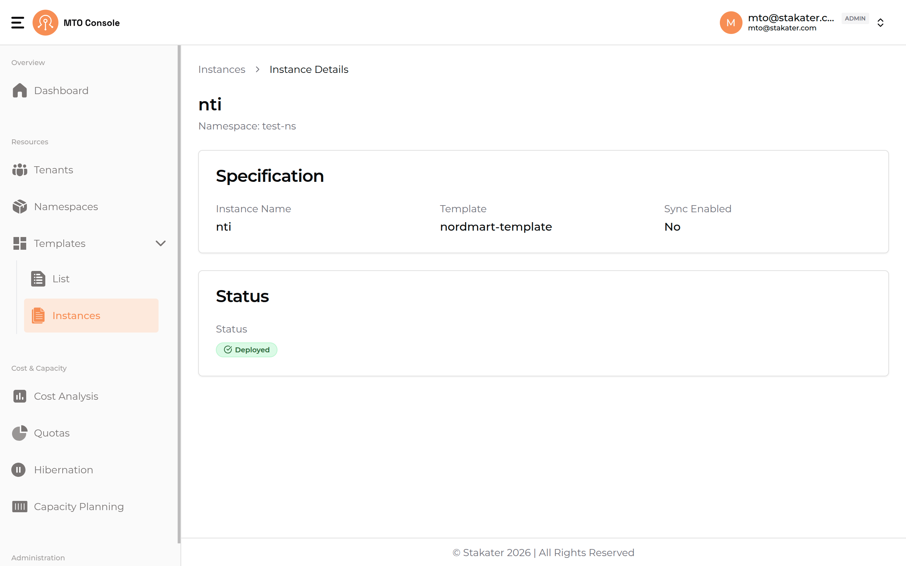
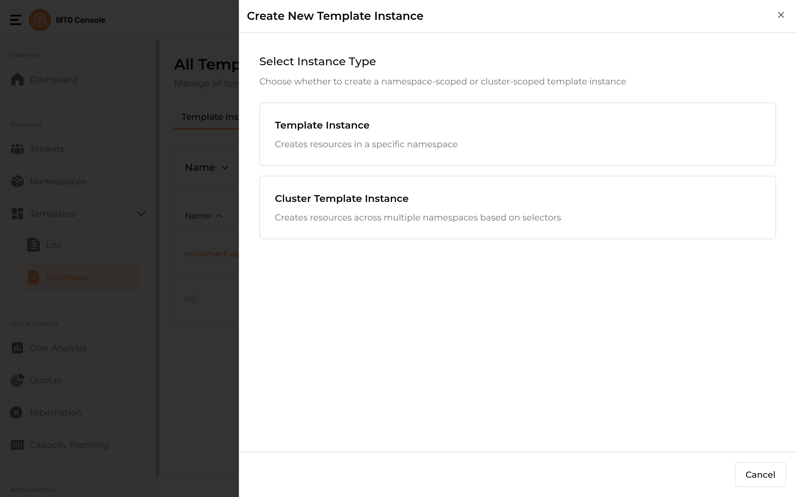
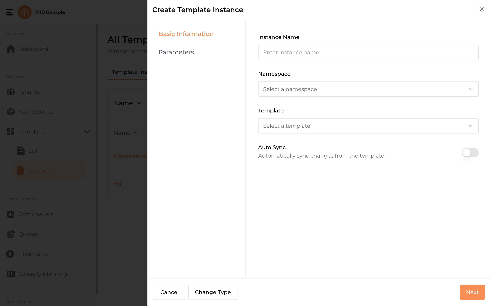
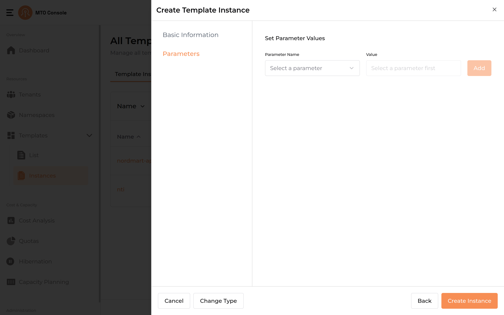
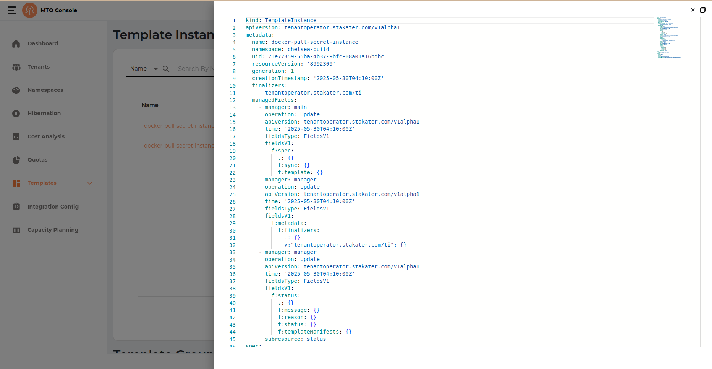

# Template Instances

[Template Instances](https://docs.stakater.com/template-operator/main/kubernetes-resources/template-instance.html) in the MTO Console allow users to deploy standardized resource configurations, such as Kubernetes manifests, Helm charts, Secrets, or ConfigMaps, into specific namespaces. By using Template Instances, organizations can ensure consistency, repeatability, and compliance across multiple environments. Each instance is based on a predefined template and can be managed, synchronized, or removed as needed, making it easy to propagate best practices and updates throughout your infrastructure.

The Template Instances page lists all instances across the cluster, organized into two tabs: **Template Instances** (namespace-scoped) and **Cluster Template Instances** (cluster-scoped). Each row shows **Name**, **Namespace**, **Template**, **Status**, **Sync**, **Created**, and an **Actions** kebab menu.

## Details Section

By clicking on the Template Instance name user can be directed to the details section of the selected Template Instance.
It has breadcrumb to redirect user back to the Template Instances table.

## Create Template Instance

The Template Instance creation process in the MTO Console is designed to be straightforward, allowing users to deploy a selected template into a specific namespace with optional synchronization. The process is presented in a drawer interface.

Click the **Create Instance(s)** button at the top right of the Template Instances page to open the creation drawer.

### Select Instance Type

The drawer first prompts you to choose the scope of the instance:

- **Template Instance:** Creates resources in a specific namespace.
- **Cluster Template Instance:** Creates resources across multiple namespaces based on selectors.

Select **Template Instance** to continue with the namespace-scoped flow described below. The cluster-scoped flow is documented separately on the [Cluster Template Instances](cluster-template-instances.md) page. The **Change Type** button on later steps lets you switch between the two scopes without leaving the drawer.

### Basic Information

- **Instance Name:** Enter a unique name for the instance.
- **Namespace:** Select the target namespace where the resources will be deployed (for example, `arsenal-dev`).
- **Template:** Pick the template to instantiate (for example, `docker-pull-secret`).
- **Auto Sync:** Toggle on to automatically sync changes from the template to the deployed resources.

Click **Next** to continue to Parameters.

### Parameters

- **Parameter Name:** Select a parameter defined in the template.
- **Value:** Provide the value for the selected parameter.
- Click **Add** to include the parameter in the instance.

Click **Create Instance** to save the Template Instance.

### Result & Management

The new Template Instance appears on the Template Instances tab of the list page with the following columns:

- **Name:** The name of the Template Instance.
- **Namespace:** The target namespace.
- **Template:** The template used for the instance.
- **Status:** Indicates if the instance is deployed (for example, `Deployed` for a successful deployment, `Failed` if it could not be applied).
- **Sync:** Shows if the resources are kept in sync with the template.
- **Created:** Timestamp of instance creation.
- **Actions:** Three-dot menu for additional actions (view YAML, edit, delete).

## YAML View

A YAML representation of the Template Instance can be previewed by selecting **View YAML** from the Actions kebab menu on an instance row.

## Update Template Instance

Template Instance can not be updated as all fields are disabled.

## Delete Template Instance

Template instance can be deleted by selecting **Delete** from the Actions kebab menu on the instance row.
