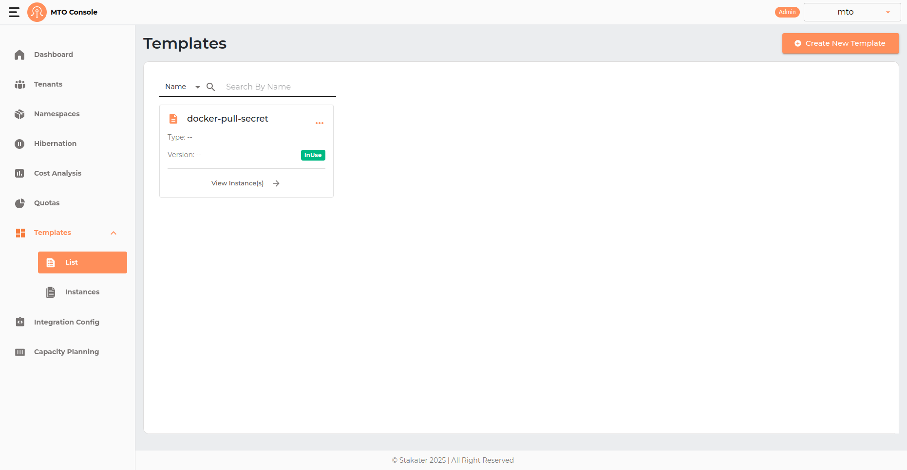
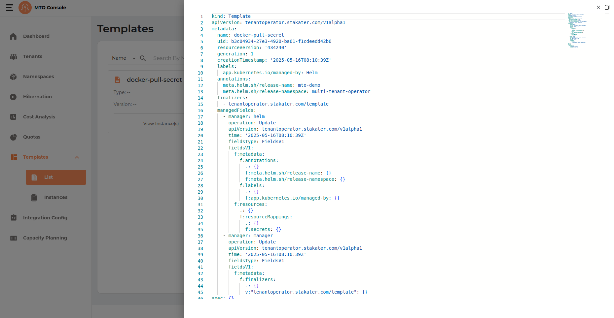

# Templates

The Templates section acts as a repository for standardized resource deployment patterns, which can be utilized to maintain consistency and reliability across tenant environments. Few examples include provisioning specific k8s manifests, helm charts, secrets or configmaps across a set of namespaces.



## Create Template

The template creation process in the MTO Console is designed to be intuitive and flexible, allowing users to define reusable deployment patterns for resources such as Kubernetes manifests, Helm charts, secrets, or configmaps. The process is presented in a drawer interface and consists of several key sections:

### Template Info


- **Name** The template name is a required field. Enter a unique and descriptive name for your template.
- **Type** Optionally specify the type of template.
- **Version** Optionally provide a version identifier for the template.
- **Upload Icon** You can upload a custom icon to visually distinguish your template in the list view.
- The Add Template button remains disabled until the required fields (at minimum, the template name and at least one resource) are provided.

### Parameters

This section allows you to define parameters that can be used within your template for customization.

- **Name & Value:** Add key-value pairs to parameterize your template.
- **Required Checkbox:** Mark parameters as required if they must be provided when the template is instantiated.
- **Add Button:** Click to add each parameter to the list.

Parameters help make your templates flexible and reusable across different environments.

### Resources

At least one resource must be specified for the template. You can add resources in the following ways:

#### Helm

Expand this section to provide Helm chart details if your template is based on a Helm deployment.


- **Release Name:** Enter a name for the Helm release. This will be used as the release identifier when the chart is deployed.
- **Private Checkbox:** If the Helm chart repository is private, check this box to indicate that authentication may be required.
- **Chart Repository:** Specify the URL or name of the Helm chart repository.
- **Chart Version:** Enter the version of the Helm chart you wish to deploy.
- **Chart Name:** Provide the name of the chart within the repository.
- **Set Values:** You can specify custom values to override chart defaults using the --set or --set-string options.
- **Type:** Select between --set (for standard values) and --set-string (for string values).
- **Name & Value:** Enter the key and value to set. Click Add to include each override. Added values are displayed as tags below the input fields, and can be removed if needed.
- **Values:** Optionally, you can provide a YAML block to specify multiple values at once. This is useful for more complex configurations or when you want to override several chart values together.

Example Value:

```yaml
redisPort: 6379
```

#### Resource Mappings

The Resource Mappings section allows you to define mappings for Kubernetes resources such as Secrets and configmaps, enabling advanced or custom deployment scenarios. This is useful for referencing or distributing existing resources across different namespaces.


- **Resource Type Dropdown:** Select the type of resource you want to map. The available options typically include
    - Secrets
    - configmaps
- **Name & Namespace:** Enter the name of the resource and the target namespace where it should be mapped.
- **Add Button:** Click Add to include the mapping in your template. Each mapping will appear as a tag below the input fields showing the resource name and its associated namespace.
- **Listing and Removal:** Added mappings are displayed in separate sections for Secrets and configmaps. Each mapping is shown as a tag (e.g., secret-s1 (namespace-n1) or configmap-c1 (namespace-n2)). Click the "X" on a tag to remove a mapping from the template.

#### Manifests

The Manifests section allows you to add raw Kubernetes manifests directly to your template. This is useful for provisioning standard Kubernetes resources such as Deployments, Services, configmaps, Secrets, NetworkPolicies, and more, using YAML definitions.


- **YAML Editor:** Enter one or more Kubernetes resource definitions in YAML format. Each manifest should follow standard Kubernetes syntax and can include any supported resource kind.
- **Multi-Resource Support:** You can define multiple resources in a single template by listing them under the manifests:** key as a YAML array.
- **Parameters:** You may use template parameters (defined in the Parameters section) within your manifests for dynamic substitution at deployment time. For example, ${PARAM_NAME} can be used as a placeholder for values provided during instantiation.
- **Validation:**
    - The editor provides basic YAML validation to help ensure your manifests are correctly formatted before adding the template.
    - If any parameter added to the manifest is missing from the added parameters list in the template and is set to required will result in an error on the top of the manifest indicating the user to add that parameter to the list.

## YAML View



A YAML representation of the template configuration can be previewed by user by clicking on the template card thee dots.

## Update Template

This flow is similar to create flow just that the name of the template can not be changed or modified.

## Delete Template

- The three dots on the template card open up a drop down menu containing options like (YAML, Edit and Delete).
- Template can only be deleted if it is not having the ```inuse``` tag on it.
