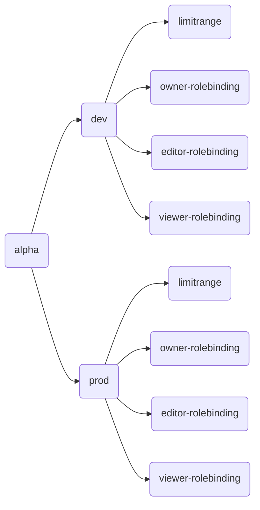
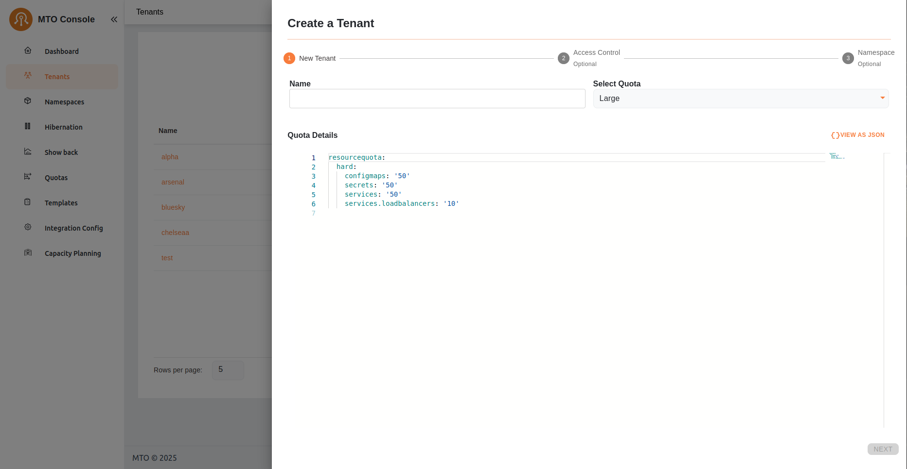
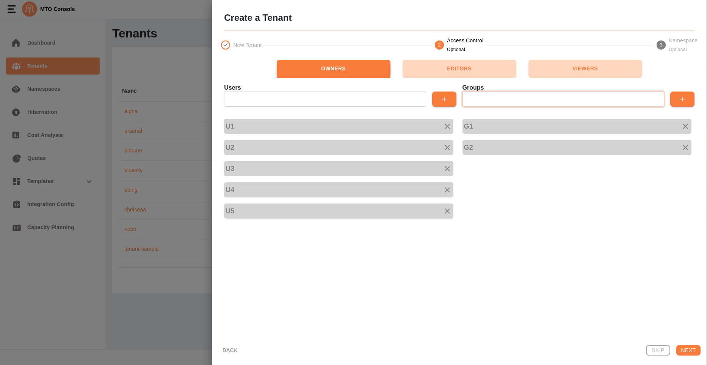
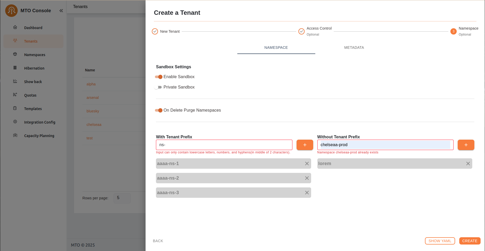
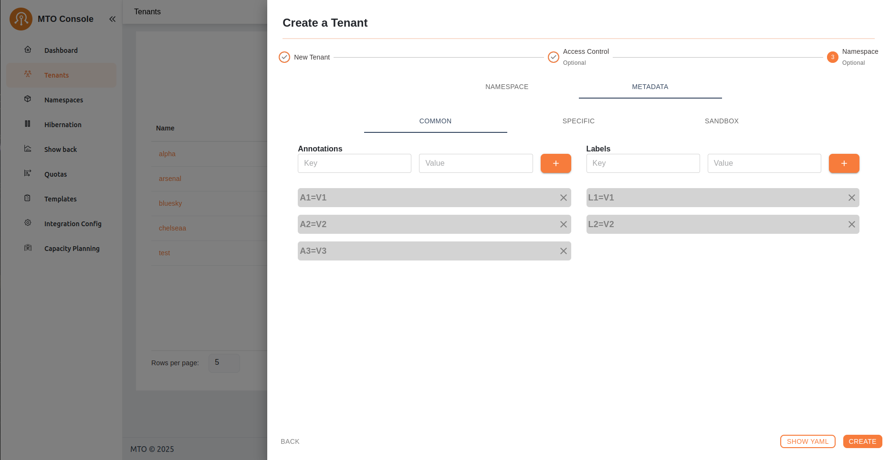
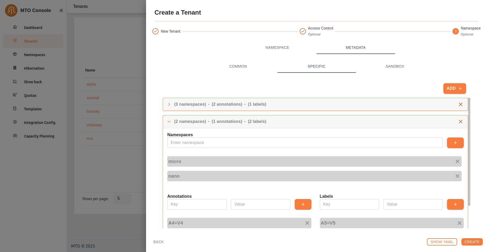
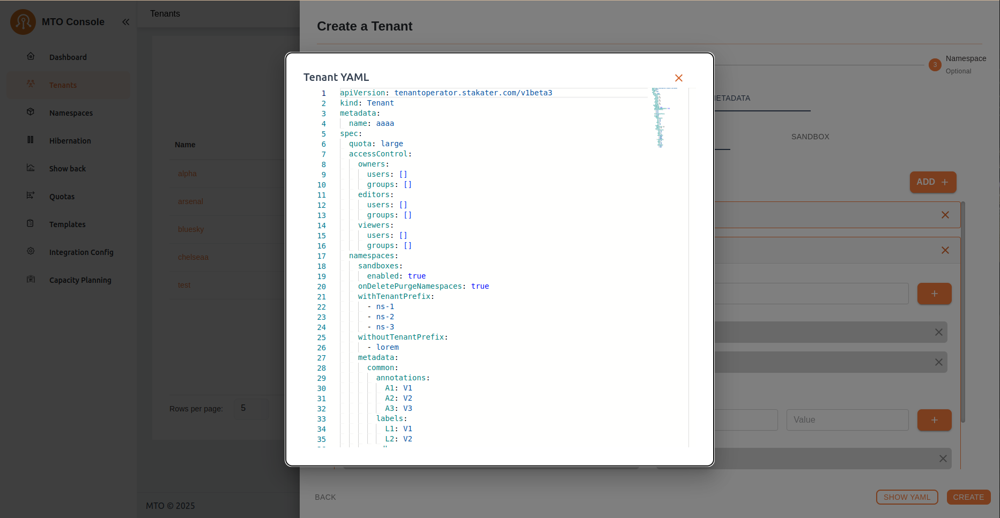

# Tenants

Here, admins have a bird's-eye view of all tenants, with the ability to delve into each one for detailed examination and management. This section is pivotal for observing the distribution and organization of tenants within the system. More information on each tenant can be accessed by clicking the view option against each tenant name.


## Live YAML and Graph View

In the MTO Console, each resource section is equipped with a "View" button, revealing the live YAML configuration for complete information on the resource. For Tenant resources, a supplementary "Graph" option is available, illustrating the relationships and dependencies of all resources under a Tenant. This dual-view approach empowers users with both the detailed control of YAML and the holistic oversight of the graph view.

You can find more details on graph visualization here: [Graph Visualization](../how-to-guides/graph-visualization.md)


Effortlessly associate tenants with their respective resources using the enhanced graph feature on the MTO Console. This dynamic graph illustrates the relationships between tenants and the resources they create, encompassing both MTO's proprietary resources and native Kubernetes/OpenShift elements.

Example Graph:



Explore with an intuitive graph that showcases the relationships between tenants and their resources. The MTO Console's graph feature simplifies the understanding of complex structures, providing you with a visual representation of your tenant's organization.

To view the graph of your tenant, follow the steps below:

- Navigate to `Tenants` page on the MTO Console using the left navigation bar.

- Click on `View` of the tenant for which you want to view the graph.

- Click on `Graph` tab on the tenant details page.


## Tenant Quota

In this view, users can access a dedicated tab to review the quota utilization for their Tenants. Within this tab, users have the option to toggle between two different views: **Aggregated Quota** and **Namespace Quota**.

### Aggregated Quota View


This view provides users with an overview of the combined resource allocation and usage across all namespaces within their tenant. It offers a comprehensive look at the total limits and usage of resources such as CPU, memory, and other defined quotas. Users can easily monitor and manage resource distribution across their entire tenant environment from this aggregated perspective.

### Namespace Quota View


Alternatively, users can opt to view quota settings on a per-namespace basis. This view allows users to focus specifically on the resource allocation and usage within individual namespaces. By selecting this option, users gain granular insights into the resource constraints and utilization for each namespace, facilitating more targeted management and optimization of resources at the namespace level.

## Tenant Utilization

In the **Utilization** tab of the tenant console, users are presented with a detailed table listing all namespaces within their tenant. This table provides essential metrics for each namespace, including CPU and memory utilization. The metrics shown include:

- **Cost:** The cost associated with CPU and memory utilization.
- **Request Average:** The average amount of CPU and memory resources requested.
- **Usage Average:** The average amount of CPU and memory resources used.
- **Max:** The maximum value between CPU and memory requests and used resources, calculated every 30 seconds and averaged over the selected running minutes.

Users can adjust the interval window using the provided selector to customize the time frame for the displayed data. This table allows users to quickly assess resource utilization across all namespaces, facilitating efficient resource management and cost tracking.


Upon selecting a specific namespace from the utilization table, users are directed to a detailed view that includes CPU and memory utilization graphs along with a workload table. This detailed view provides:

- **CPU and Memory Graphs:** Visual representations of the namespace's CPU and memory usage over time, enabling users to identify trends and potential issues at a glance.
- **Workload Table:** A comprehensive list of all workloads within the selected namespace, including pods, deployments, and stateful-sets. The table displays key metrics for each workload, including:
    - **Cost:** The cost associated with the workload's CPU and memory utilization.
    - **Request Average:** The average amount of CPU and memory resources requested by the workload.
    - **Usage Average:** The average amount of CPU and memory resources used by the workload.
    - **Max:** The maximum value between CPU and memory requests and used resources, calculated every 30 seconds and averaged over the running minutes.

This detailed view provides users with in-depth insights into resource utilization at the workload level, enabling precise monitoring and optimization of resource allocation within the selected namespace.


## Create Tenant

The tenant creation process involves a three-step drawer interface. This document outlines the validation checks and the criteria for progressing through these steps.

### Step 1: Enter Primary Info



The first step in creating a tenant is to provide a name for the tenant. Users must ensure the tenant name meets the specified criteria. The Next button remains disabled until the entered tenant name passes validation and a quota is selected.

#### Validation Criteria

- Regex Validation
    - The tenant name must conform to the following regex pattern:

    ```regex
        /^[a-z0-9]+(-[a-z0-9]+)*$/
    ```

    - This ensures that tenant names consist of lowercase alphanumeric characters and hyphens, and do not start or end with a hyphen.

- Uniqueness Check
    - The tenant name must be unique.
    - When tenant name is entered and user stops typing the tenant name is verified of its uniqueness through an API call to the backend for confirmation that the name does not already exist. If the name is unique the Next button is enabled and user can click on it. If the name is already taken, an error is displayed, and the user must choose a different name.

### Quota Details

The selected quota defines resource limits for the tenant. Example quota details are shown in JSON format as well as a toggle button to view them as YAML:

```yaml
resourcequota:
  hard:
    configmaps: '50'
    requests.cpu: '50'
    requests.memory: 5Gi
    secrets: '50'
    services: '050'
    services.loadbalancers: '1'
limitrange:
  limits:
    - type: Pod
      max:
        cpu: '1'
        memory: 1Gi
      min:
        cpu: 100m
        memory: 50Mi
```

### Enabling the Next Button

The Next button becomes enabled only when
    - The entered tenant name passes both regex validation and the uniqueness check.
    - A quota is selected from the dropdown menu.

### Error Handling

Error Handling on step 1 is based on the following factors

- If the tenant name fails regex validation, an inline error message indicates the naming rule.
- If the tenant name already exists, the user is prompted to enter a new name.

### Step 2: Access Control (Optional)



The second step allows users to configure access control for the tenant. This step is optional and provides three tabs for managing user roles: Owners, Editors, and Viewers.

If the user has some data entered into the step 2 section tabs, the skip option will be disabled. Otherwise, user can perform skip action by clicking on the Skip button.

### Input Fields and Listing Behavior

- Input Fields
    -Each tab (Owners, Editors, and Viewers) contains two input fields:
        - Users: Allows adding individual users.
        - Groups: Allows adding groups.
    - The input fields also act as filters for existing values.
    - If the entered value does not already exist in the list, it can be added.
- Listing Added Values
    - Values entered into the input fields are displayed as a scroll list below the fields.
    - Each added value is displayed with a remove button ("X") to allow easy deletion.

### Key Features

- Optional Configuration: Users can skip this step by clicking the Skip button.
- Filtering: As users type into the input fields, existing values matching the input are shown as suggestions for quick selection.
- Add New Values: If the entered value is not in the existing list, users can add it by confirming the input.
- Scroll Support: The lists have scroll view, ensuring all entries are accessible even when the list grows long.

### Navigating to the Next Step

- Users can proceed to the next step by clicking the Next button.
- The Next button is always enabled for this step as it is optional.

### Error Handling

No specific validations are required for this step since it is optional. However, users can remove or adjust entries as needed using the provided interface.

### Step 3: Namespace (Optional)

The third step allows users to optionally configure namespaces and metadata for the tenant. This step consists of two tabs:

### Namespace



- Toggles:
    - Enable Sandbox: Activates the sandbox environment for the tenant.
    - Private Sandbox: Makes the sandbox environment private.
    - On Delete Purge Namespaces: Ensures namespaces are purged upon deletion.
- Input Fields:
    - With Tenant Prefix:
        - Allows users to add namespaces with a tenant prefix.
        - Filters data based on existing namespaces.
    - Without Tenant Prefix:
        - Allows users to add namespaces without a tenant prefix.
        - Filters data and validates input to check for existing namespaces.
        - Displays an error if the namespace already exists (as shown in the UI).
- List Behavior:
    - Added namespaces are displayed in a scroll list below the input fields.
    - Each namespace is displayed with a remove button ("X") for easy deletion.

### Metadata

The Metadata tab is divided into three sub-tabs:

#### Common and Sandbox Tabs



- Both tabs allow users to add annotations and labels using Key and Value input fields.
- Inputs act as filters for existing values.
- No validation is required for these fields.
- Added annotations and labels are displayed in a scroll list with remove buttons ("X") for easy deletion.

#### Specific Tab



- Includes an Add Accordion button.
- Each accordion contains the following fields:
    - Namespaces: Users can add and filter namespaces. Each namespace is verified before being added to the list.
    - Annotations: Key-value pairs that act as filters for listed values.
    - Labels: Key-value pairs that act as filters for listed values.
- Each field displays added values in a scroll list with remove buttons ("X") for easy deletion.

### Key Features

- Optional Configuration: Users can skip this step by clicking the Create button directly.
- Filtering and Validation:
    - Inputs filter data based on existing values.
    - Namespace inputs validate entries to ensure uniqueness.
- Scroll Support: All lists have scroll view, ensuring accessibility for large datasets.

### Error Handling

- The "Without Tenant Prefix" input validates namespace uniqueness and displays an error if the namespace already exists.
- Namespaces in the accordions are being verified before being added. If they already exist they are not added and shown with an error message on the input.
- No validation errors occur for annotations or labels as they are free-form inputs.

### Completion

- Users finalize the tenant creation process by clicking the Create button.

### YAML View



- A YAML representation of the configuration can be previewed using the **Show YAML** button before creation.

## Update Tenant

User can click on the edit button in the table under the action items to open the drawer with all the pre-populated tenant configurations.

The update process follows a similar flow to the create process. However, the key difference is that the **tenant name** in **Step-1** cannot be edited or updated. All other steps and configurations remain the same, allowing users to modify access control, namespaces, and metadata as needed.

## Delete Tenant

By clicking on the delete option in the tenants table the user will be able to perform delete operation, and it may take a short while to delete the tenant.
