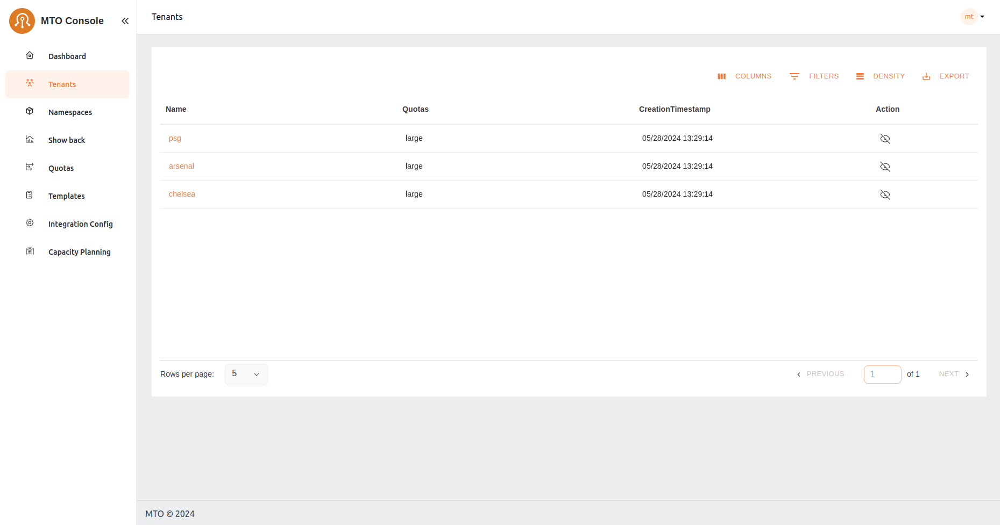
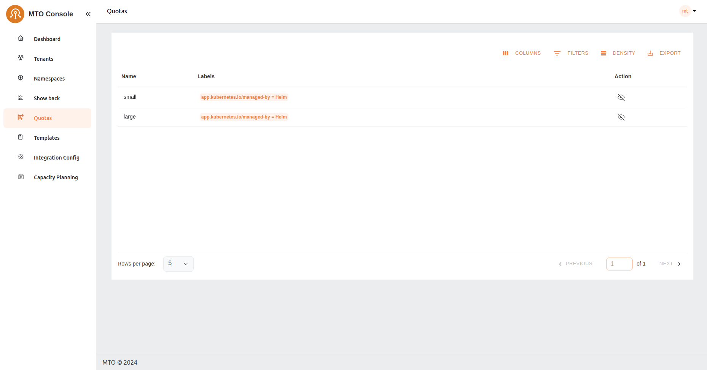
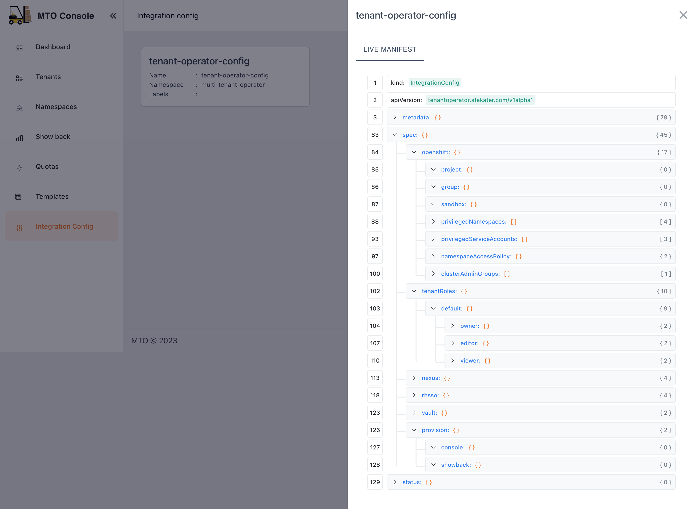

# MTO Console

## Introduction

The Multi Tenant Operator (MTO) Console is a comprehensive user interface designed for both administrators and tenant users to manage multi-tenant environments. The MTO Console simplifies the complexity involved in handling various aspects of tenants and their related resources.

## Dashboard Overview

The dashboard serves as a centralized monitoring hub, offering insights into the current state of tenants, namespaces, and quotas. It is designed to provide a quick summary/snapshot of MTO resources' status. Additionally, it includes a Showback graph that presents a quick glance of the seven-day cost trends associated with the namespaces/tenants based on the logged-in user.

By default, MTO Console will be disabled and has to be enabled by setting the below configuration in IntegrationConfig.

```yaml
components:
    console: true
    ingress:
      ingressClassName: <ingress-class-name>
      console:
        host: tenant-operator-console.<hostname>
        tlsSecretName: <tls-secret-name>
      gateway:
        host: tenant-operator-gateway.<hostname>
        tlsSecretName: <tls-secret-name>
      keycloak:
        host: tenant-operator-keycloak.<hostname>
        tlsSecretName: <tls-secret-name>
    showback: true
```  

`<hostname>` : hostname of the cluster  
`<ingress-class-name>` : name of the ingress class  
`<tls-secret-name>` : name of the secret that contains the TLS certificate and key  

>Note: `tls-secret-name` are optional. If not provided, MTO will use the default secrets.

Once the above configuration is set on the IntegrationConfig, MTO would start provisioning the required resources for MTO Console to be ready. In a few moments, you should be able to see the Console Ingress in the `multi-tenant-operator` namespace which gives you access to the Console.

For more details on the configuration, please visit [here](../how-to-guides/integration-config.md).


### Tenants

Here, admins have a bird's-eye view of all tenants, with the ability to delve into each one for detailed examination and management. This section is pivotal for observing the distribution and organization of tenants within the system. More information on each tenant can be accessed by clicking the view option against each tenant name.



### Namespaces

Users can view all the namespaces that belong to their tenant, offering a comprehensive perspective of the accessible namespaces for tenant members. This section also provides options for detailed exploration.


### Quotas

MTO's Quotas are crucial for managing resource allocation. In this section, administrators can assess the quotas assigned to each tenant, ensuring a balanced distribution of resources in line with operational requirements.



### Templates

The Templates section acts as a repository for standardized resource deployment patterns, which can be utilized to maintain consistency and reliability across tenant environments. Few examples include provisioning specific k8s manifests, helm charts, secrets or configmaps across a set of namespaces.


### Showback

The Showback feature is an essential financial governance tool, providing detailed insights into the cost implications of resource usage by tenant or namespace or other filters. This facilitates a transparent cost management and internal chargeback or showback process, enabling informed decision-making regarding resource consumption and budgeting.


## User Roles and Permissions

### Administrators

Administrators have overarching access to the console, including the ability to view all namespaces and tenants. They have exclusive access to the IntegrationConfig, allowing them to view all the settings and integrations.



### Tenant Users

Regular tenant users can monitor and manage their allocated resources. However, they do not have access to the IntegrationConfig and cannot view resources across different tenants, ensuring data privacy and operational integrity.

## Live YAML Configuration and Graph View

In the MTO Console, each resource section is equipped with a "View" button, revealing the live YAML configuration for complete information on the resource. For Tenant resources, a supplementary "Graph" option is available, illustrating the relationships and dependencies of all resources under a Tenant. This dual-view approach empowers users with both the detailed control of YAML and the holistic oversight of the graph view.

You can find more details on graph visualization here: [Graph Visualization](../reference-guides/graph-visualization.md)


## Caching and Database

MTO integrates a dedicated database to streamline resource management. Now, all resources managed by MTO are efficiently stored in a Postgres database, enhancing the MTO Console's ability to efficiently retrieve all the resources for optimal presentation.

The implementation of this feature is facilitated by the Bootstrap controller, streamlining the deployment process. This controller creates the PostgreSQL Database, establishes a service for inter-pod communication, and generates a secret to ensure secure connectivity to the database.

Furthermore, the introduction of a dedicated cache layer ensures that there is no added burden on the Kube API server when responding to MTO Console requests. This enhancement not only improves response times but also contributes to a more efficient and responsive resource management system.

## Authentication and Authorization

MTO Console ensures secure access control using a robust combination of Keycloak for authentication and a custom-built authorization module.

### Keycloak Integration

Keycloak, an industry-standard authentication tool, is integrated for secure user login and management. It supports seamless integration with existing ADs or SSO systems and grants administrators complete control over user access.

### Custom Authorization Module

Complementing Keycloak, our custom authorization module intelligently controls access based on user roles and their association with tenants. Special checks are in place for admin users, granting them comprehensive permissions.

For more details on Keycloak's integration, PostgreSQL as persistent storage, and the intricacies of our authorization module, please visit [here](./auth.md).

## Conclusion

The MTO Console is engineered to simplify complex multi-tenant management. The current iteration focuses on providing comprehensive visibility. Future updates could include direct CUD (Create/Update/Delete) capabilities from the dashboard, enhancing the console’s functionality. The Showback feature remains a standout, offering critical cost tracking and analysis. The delineation of roles between administrators and tenant users ensures a secure and organized operational framework.
