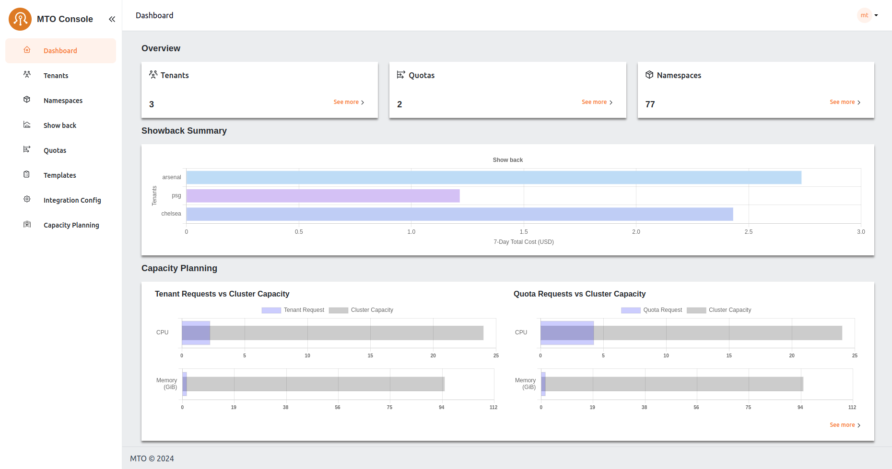

# MTO Console

## Introduction

The Multi Tenant Operator (MTO) Console is a comprehensive user interface designed for both administrators and tenant users to manage multi-tenant environments. The MTO Console simplifies the complexity involved in handling various aspects of tenants and their related resources.

## Dashboard Overview

The dashboard serves as a centralized monitoring hub, offering insights into the current state of tenants, namespaces, and quotas. It is designed to provide a quick summary/snapshot of MTO resources' status. Additionally, it includes a Showback graph that presents a quick glance of the seven-day cost trends associated with the namespaces/tenants based on the logged-in user.

By default, MTO Console will be disabled and has to be enabled by setting the below configuration in IntegrationConfig.

```yaml
components:
    console: true
    ingress:
      ingressClassName: <ingress-class-name>
      console:
        host: tenant-operator-console.<hostname>
        tlsSecretName: <tls-secret-name>
      gateway:
        host: tenant-operator-gateway.<hostname>
        tlsSecretName: <tls-secret-name>
      keycloak:
        host: tenant-operator-keycloak.<hostname>
        tlsSecretName: <tls-secret-name>
    showback: true
    trustedRootCert: <root-ca-secret-name>
```  

`<hostname>` : hostname of the cluster  
`<ingress-class-name>` : name of the ingress class  
`<tls-secret-name>` : name of the secret that contains the TLS certificate and key  
`<root-ca-secret-name>` : name of the secret that contains the root CA certificate

>Note: `trustedRootCert` and `tls-secret-name` are optional. If not provided, MTO will use the default root CA certificate and secrets respectively.

Once the above configuration is set on the IntegrationConfig, MTO would start provisioning the required resources for MTO Console to be ready. In a few moments, you should be able to see the Console Ingress in the `multi-tenant-operator` namespace which gives you access to the Console.

For more details on the configuration, please visit [here](../crds-api-reference/integration-config.md).


### Tenants

Here, admins have a bird's-eye view of all tenants, with the ability to delve into each one for detailed examination and management. This section is pivotal for observing the distribution and organization of tenants within the system. More information on each tenant can be accessed by clicking the view option against each tenant name.


### Tenants/Quota

#### Viewing Quota in the Tenant Console

In this view, users can access a dedicated tab to review the quota utilization for their Tenants. Within this tab, users have the option to toggle between two different views: **Aggregated Quota** and **Namespace Quota**.

#### Aggregated Quota View:


This view provides users with an overview of the combined resource allocation and usage across all namespaces within their tenant. It offers a comprehensive look at the total limits and usage of resources such as CPU, memory, and other defined quotas. Users can easily monitor and manage resource distribution across their entire tenant environment from this aggregated perspective.

#### Namespace Quota View:


Alternatively, users can opt to view quota settings on a per-namespace basis. This view allows users to focus specifically on the resource allocation and usage within individual namespaces. By selecting this option, users gain granular insights into the resource constraints and utilization for each namespace, facilitating more targeted management and optimization of resources at the namespace level.

### Tenants/Utilization

In the **Utilization** tab of the tenant console, users are presented with a detailed table listing all namespaces within their tenant. This table provides essential metrics for each namespace, including CPU and memory utilization. The metrics shown include:

- **Cost:** The cost associated with CPU and memory utilization.
- **Request Average:** The average amount of CPU and memory resources requested.
- **Usage Average:** The average amount of CPU and memory resources used.
- **Max:** The maximum value between CPU and memory requests and used resources, calculated every 30 seconds and averaged over the selected running minutes.

Users can adjust the interval window using the provided selector to customize the time frame for the displayed data. This table allows users to quickly assess resource utilization across all namespaces, facilitating efficient resource management and cost tracking.


Upon selecting a specific namespace from the utilization table, users are directed to a detailed view that includes CPU and memory utilization graphs along with a workload table. This detailed view provides:

- **CPU and Memory Graphs:** Visual representations of the namespace's CPU and memory usage over time, enabling users to identify trends and potential issues at a glance.
- **Workload Table:** A comprehensive list of all workloads within the selected namespace, including pods, deployments, and stateful-sets. The table displays key metrics for each workload, including:
    - **Cost:** The cost associated with the workload's CPU and memory utilization.
    - **Request Average:** The average amount of CPU and memory resources requested by the workload.
    - **Usage Average:** The average amount of CPU and memory resources used by the workload.
    - **Max:** The maximum value between CPU and memory requests and used resources, calculated every 30 seconds and averaged over the running minutes.

This detailed view provides users with in-depth insights into resource utilization at the workload level, enabling precise monitoring and optimization of resource allocation within the selected namespace.


### Namespaces

Users can view all the namespaces that belong to their tenant, offering a comprehensive perspective of the accessible namespaces for tenant members. This section also provides options for detailed exploration.


### Quotas

MTO's Quotas are crucial for managing resource allocation. In this section, administrators can assess the quotas assigned to each tenant, ensuring a balanced distribution of resources in line with operational requirements.


### Templates

The Templates section acts as a repository for standardized resource deployment patterns, which can be utilized to maintain consistency and reliability across tenant environments. Few examples include provisioning specific k8s manifests, helm charts, secrets or configmaps across a set of namespaces.


### Showback

The Showback feature is an essential financial governance tool, providing detailed insights into the cost implications of resource usage by tenant or namespace or other filters. This facilitates a transparent cost management and internal chargeback or showback process, enabling informed decision-making regarding resource consumption and budgeting.


## User Roles and Permissions

### Administrators

Administrators have overarching access to the console, including the ability to view all namespaces and tenants. They have exclusive access to the IntegrationConfig, allowing them to view all the settings and integrations.


### Tenant Users

Regular tenant users can monitor and manage their allocated resources. However, they do not have access to the IntegrationConfig and cannot view resources across different tenants, ensuring data privacy and operational integrity.

## Live YAML Configuration and Graph View

In the MTO Console, each resource section is equipped with a "View" button, revealing the live YAML configuration for complete information on the resource. For Tenant resources, a supplementary "Graph" option is available, illustrating the relationships and dependencies of all resources under a Tenant. This dual-view approach empowers users with both the detailed control of YAML and the holistic oversight of the graph view.

You can find more details on graph visualization here: [Graph Visualization](../how-to-guides/graph-visualization.md)


## Caching and Database

MTO integrates a dedicated database to streamline resource management. Now, all resources managed by MTO are efficiently stored in a Postgres database, enhancing the MTO Console's ability to efficiently retrieve all the resources for optimal presentation.

The implementation of this feature is facilitated by the Bootstrap controller, streamlining the deployment process. This controller creates the PostgreSQL Database, establishes a service for inter-pod communication, and generates a secret to ensure secure connectivity to the database.

Furthermore, the introduction of a dedicated cache layer ensures that there is no added burden on the Kube API server when responding to MTO Console requests. This enhancement not only improves response times but also contributes to a more efficient and responsive resource management system.

## Authentication and Authorization

### Keycloak for Authentication

MTO Console incorporates Keycloak, a leading authentication module, to manage user access securely and efficiently. Keycloak is provisioned automatically by our controllers, setting up a new realm, client, and a default user named `mto`.

#### Benefits

- Industry Standard: Offers robust, reliable authentication in line with industry standards.
- Integration with Existing Systems: Enables easy linkage with existing Active Directories or SSO systems, avoiding the need for redundant user management.
- Administrative Control: Grants administrators full authority over user access to the console, enhancing security and operational integrity.

### PostgreSQL as Persistent Storage for Keycloak

MTO Console leverages PostgreSQL as the persistent storage solution for Keycloak, enhancing the reliability and flexibility of the authentication system.

It offers benefits such as enhanced data reliability, easy data export and import.

#### Benefits

- Persistent Data Storage: By using PostgreSQL, Keycloak's data, including realms, clients, and user information, is preserved even in the event of a pod restart. This ensures continuous availability and stability of the authentication system.
- Data Exportability: Customers can easily export Keycloak configurations and data from the PostgreSQL database.
- Transferability Across Environments: The exported data can be conveniently imported into another cluster or Keycloak instance, facilitating smooth transitions and backups.
- No Data Loss: Ensures that critical authentication data is not lost during system updates or maintenance.
- Operational Flexibility: Provides customers with greater control over their authentication data, enabling them to manage and migrate their configurations as needed.

### Built-in module for Authorization

The MTO Console is equipped with an authorization module, designed to manage access rights intelligently and securely.

#### Benefits

- User and Tenant Based: Authorization decisions are made based on the user's membership in specific tenants, ensuring appropriate access control.
- Role-Specific Access: The module considers the roles assigned to users, granting permissions accordingly to maintain operational integrity.
- Elevated Privileges for Admins: Users identified as administrators or members of the clusterAdminGroups are granted comprehensive permissions across the console.
- Database Caching: Authorization decisions are cached in the database, reducing reliance on the Kubernetes API server.
- Faster, Reliable Access: This caching mechanism ensures quicker and more reliable access for users, enhancing the overall responsiveness of the MTO Console.

## Conclusion

The MTO Console is engineered to simplify complex multi-tenant management. The current iteration focuses on providing comprehensive visibility. Future updates could include direct CUD (Create/Update/Delete) capabilities from the dashboard, enhancing the console’s functionality. The Showback feature remains a standout, offering critical cost tracking and analysis. The delineation of roles between administrators and tenant users ensures a secure and organized operational framework.
