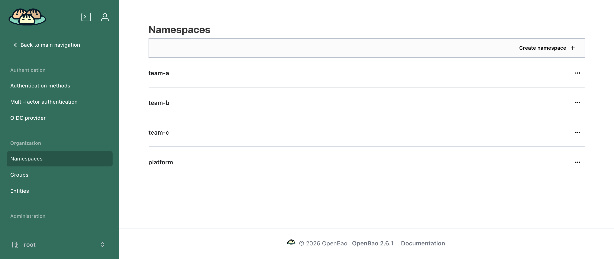
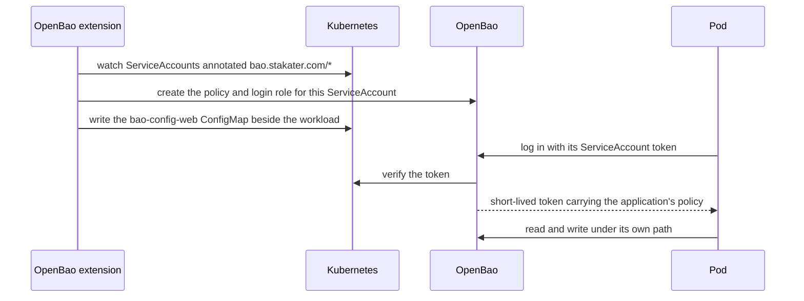
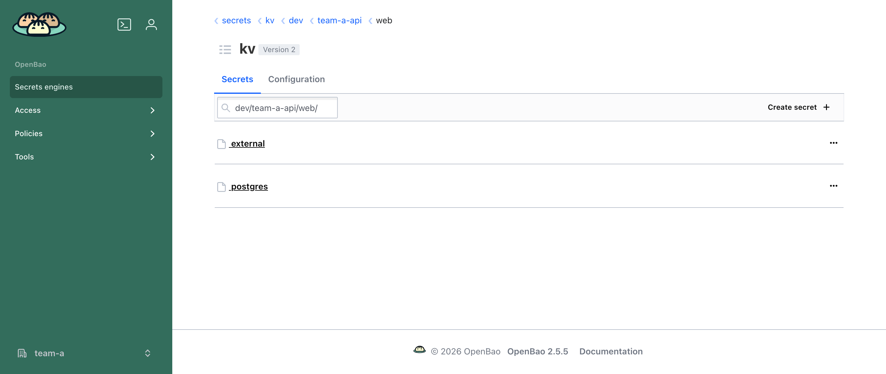
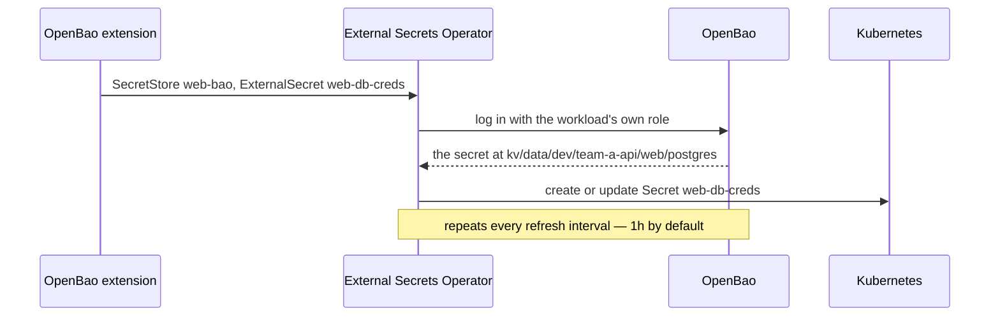
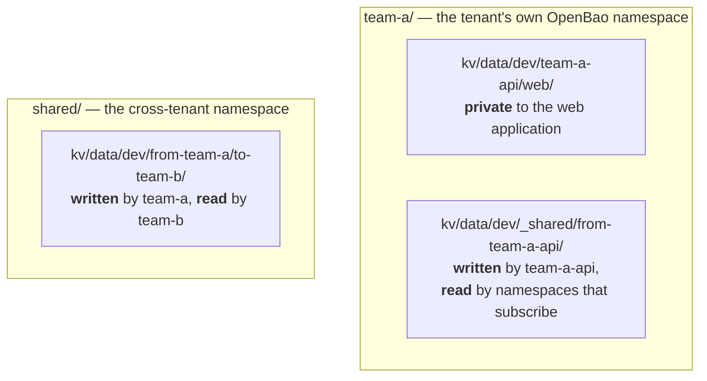
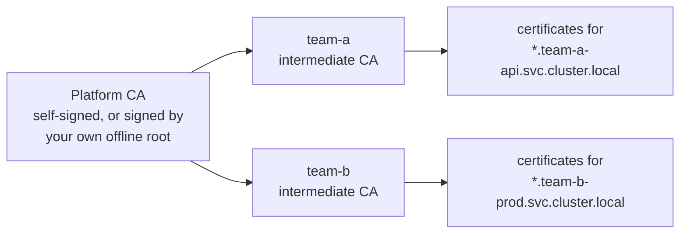
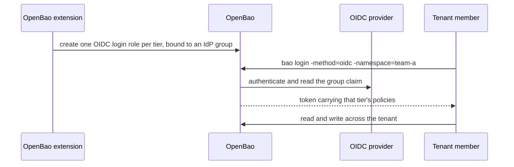

# OpenBao

[OpenBao](https://openbao.org/) is an identity-based secret and encryption management system: it authenticates and authorizes a client — a person or a workload — before giving it access to anything OpenBao holds.

With the Multi-Tenant Operator (MTO), cluster administrators can configure multi-tenancy within their cluster. The OpenBao extension carries that multi-tenancy into OpenBao: every tenant gets its own OpenBao namespace — with a secrets store, encryption keys and a certificate authority inside it — along with the policies and login roles that let the tenant's people and workloads reach them and nothing else.

Note that the OpenBao extension is optional.

## What it saves you

Setting a tenant up in OpenBao by hand means creating, per tenant: an OpenBao namespace; a KV secrets engine, a transit engine and a PKI certificate authority inside it; a policy for every application at every access level; a Kubernetes auth role for every ServiceAccount that logs in; and an OIDC role for every identity-provider group that should be able to sign in. All of it has to be revisited whenever a namespace is added, an application is deployed, or a team's access changes.

The extension derives all of it from the `Tenant` resource you already maintain, and keeps it in step as the tenant changes — creating what is now needed and removing what no longer applies.

The other half is what it removes from application teams. A developer never writes an OpenBao policy and never holds a static OpenBao credential. They declare what the application needs in annotations on its ServiceAccount, and the pod authenticates with the token Kubernetes already gives it.

## What using it looks like

Everything an application team writes fits on one screen. The ServiceAccount says what the application needs, the Deployment says which secret it wants delivered, and the container reads an ordinary Kubernetes `Secret`:

```yaml
apiVersion: v1
kind: ServiceAccount
metadata:
  name: web
  namespace: team-a-api
  annotations:
    bao.stakater.com/kv: "true"       # give this application a private secrets path
    bao.stakater.com/tier: editor     # it may read and write there
---
apiVersion: apps/v1
kind: Deployment
metadata:
  name: web
  namespace: team-a-api
  annotations:
    bao.stakater.com/kv-secret.db-creds: postgres   # deliver this secret
spec:
  template:
    spec:
      serviceAccountName: web
      containers:
        - name: web
          image: my/web:1.0
          envFrom:
            - secretRef:
                name: web-db-creds    # created and kept in sync for you
```

The OpenBao policy, the login role and the Kubernetes `Secret` are all created from those three annotations. The rest of this page explains what each piece does, and what else an application can ask for.

## What each tenant gets

| Capability | Default | What it is |
|:---|:---|:---|
| A private OpenBao namespace | on | Everything for the tenant lives under `<tenant>/`. One tenant cannot see or reach another tenant's namespace. |
| Secrets storage | on | A KV version 2 engine, with each application's secrets on its own path. |
| Encryption keys | on | A transit engine: the workload sends data and gets it back encrypted, and the key never leaves OpenBao. |
| Certificates | on | A PKI certificate authority per tenant, for serving TLS and for service-to-service mTLS. |
| Secret delivery | on | Secrets arrive as ordinary Kubernetes `Secret`s through the External Secrets Operator, so an application needs no OpenBao code. |
| Human login | off | Tenant members sign in through your OIDC identity provider, and their group membership decides their access. |
| cert-manager issuance | off | A cert-manager `Issuer` per namespace, so applications request certificates the usual way. |
| Cross-tenant trust | off | Opt-in, directional trust between two tenants' certificate authorities. |

Engines exist for every tenant, but they grant nothing on their own: a workload gets access only once its ServiceAccount is annotated. Access is never derived from the tenant's `accessControl` groups, as it is in the [Vault integration](../../integrations/vault/vault.md): workloads get access from ServiceAccount annotations, and people from identity-provider groups named after the tenant.



One OpenBao namespace per tenant, created with the `Tenant`. The `platform` namespace holds the certificate authority that signs each tenant's CA. A login to one tenant's namespace gives no access to any other.

## How tiers map to OpenBao access

A **tier** is set with `bao.stakater.com/tier` and applies to every engine the ServiceAccount enables.

| Tier | Secrets (KV) | Encryption (transit) |
|:---|:---|:---|
| `audit-read` | List names only — no values | None |
| `viewer` | Read, List | None |
| `editor` | Create, Read, Update, Patch, List | Encrypt, decrypt, rewrap |
| `admin` | Create, Read, Update, Patch, List, Delete | Encrypt, decrypt, rewrap, plus create, rotate and delete keys |

Transit needs write access, so `viewer` and `audit-read` get none of it. Certificates are the exception to the table: a workload that opts into PKI may issue and sign at any tier. For people signing in through OIDC, the tier bounds certificate access as well.

## Setting up the extension

These steps are done once per cluster, by a platform administrator, before any tenant gets an OpenBao namespace.

### Prerequisites

Install these first. The extension does not install them for you.

| Dependency | Needed for | Always required? |
|:---|:---|:---|
| An OpenBao server reachable from the cluster | Everything | Yes |
| OpenBao Config Operator | Applying the configuration to OpenBao | Yes |
| [template-operator-v2](../../concepts/template-operator/template.md) | Rendering the configuration per tenant | Yes |
| [cert-manager](https://cert-manager.io/) | template-operator-v2's webhook, and certificate issuance | Yes |
| [External Secrets Operator](https://external-secrets.io/) | Delivering secrets as Kubernetes `Secret`s | Only while secret delivery is on (the default) |
| [trust-manager](https://cert-manager.io/docs/trust/trust-manager/) | Cross-tenant certificate trust | Only if you turn it on |
| An OIDC identity provider | Human login | Only if you turn it on |

MTO labels each tenant namespace `stakater.com/tenant=<tenant-name>`, and the extension uses that label to find them.

### Enabling the extension

The extension is installed once per cluster; there is no per-tenant installation step. It watches `Tenant` resources cluster-wide and renders one set of configuration per tenant, which the OpenBao Config Operator then applies to OpenBao.

A tenant is picked up once its spec lists at least one namespace under `withTenantPrefix` or `withoutTenantPrefix`; add one to a skipped tenant and it is picked up on the next render. The check reads those two fields and nothing else: sandboxes do not count, and neither do namespaces attached to the tenant by label alone — a `Tenant` listing none is skipped even when labelled namespaces exist for it. A skipped tenant is silent rather than failing; it has no rendered configuration to report on.

The extension ships as the `openbao-config-mto-bootstrap` Helm chart, and these are its values — set them wherever your platform supplies Helm values for that chart. Everything under `parent` is passed down to every tenant, so this is where you point the cluster at your OpenBao server and decide which features are on:

```yaml
parent:
  baoServer: https://openbao.openbao.svc.cluster.local:8200
  env: dev                    # a segment in every secret path, so one server can hold several environments
  eso: enabled                # deliver secrets as Kubernetes Secrets
  certManager:
    enabled: false            # cert-manager Issuers per namespace
  sso:
    enabled: false            # human login through OIDC
    issuerUrl: ""
```

Values outside `parent` cover the cluster's own setup rather than the tenants' — `platformPki` for the certificate authority that signs each tenant's CA, and `safety` for what deletion does. The per-tenant engine details, such as certificate roles and what each tier may do, are values of the `openbao-config-mto` chart, which the bootstrap chart renders for you.

### Giving the operator its own credentials

The operator authenticates to OpenBao with its own Kubernetes ServiceAccount and stores no token anywhere. This needs a one-time bootstrap per OpenBao server: an auth mount for the cluster, a policy covering what the operator manages, and a role binding that policy to the operator's ServiceAccount.

!!! warning
    Never give the operator OpenBao's root token. In production, also set `baoServer` to an `https://` address, and set `baoCABundle` if OpenBao serves with a private CA.

## Giving an application a secret

This is the path most people take, and everything else on this page builds on it: annotate the workload, write a secret, read it from a pod. The examples use tenant `team-a` and its namespace `team-a-api`, which are created the ordinary way — see [Creating a tenant](../../guides/create-tenant.md). Nothing about the `Tenant` is OpenBao-specific.

### 1. Annotate the ServiceAccount

The ServiceAccount is the identity OpenBao authenticates, so this is where access is granted. Name the engine you want, and the tier to grant it at:

```yaml
apiVersion: v1
kind: ServiceAccount
metadata:
  name: web
  namespace: team-a-api
  annotations:
    bao.stakater.com/kv: "true"
    bao.stakater.com/tier: editor
```

`tier` is required alongside any engine — an engine annotation on its own grants nothing. For ServiceAccount `web`, in tenant `team-a`'s namespace `team-a-api`, this creates:

- an OpenBao policy scoped to that application's own path, `kv/data/dev/team-a-api/web/*`;
- a Kubernetes auth role, so the pod can trade its ServiceAccount token for a short-lived OpenBao token;
- a ConfigMap named `bao-config-web` in `team-a-api`, holding every address, role and path the workload needs.

The last path segment is the **application**, which defaults to the ServiceAccount name. Scoping to the application rather than the namespace is what stops two workloads in one namespace reading each other's secrets.



### 2. Write the first secret

Someone has to write the first secret, which means knowing the path to write it to. The `bao-apps` ConfigMap answers that — every namespace with at least one OpenBao-enabled ServiceAccount has one, listing an entry per application:

```console
$ kubectl get cm bao-apps -n team-a-api -o jsonpath='{.data.web}'
serviceAccount: "web"
tier: "editor"
engines: kv
kvPath: kv/data/dev/team-a-api/web/
```

Once a Deployment starts requesting secrets, a `requestedSecrets` line joins the entry. The `_namespace` entry carries the namespace's shared folder.

A person signed in through OIDC, or a pipeline with its own credentials, writes to that path:

```bash
bao login -method=oidc -namespace=team-a role=sso-team-a-admin
bao kv put -mount=kv dev/team-a-api/web/postgres username=app password=s3cr3t
```

In the OpenBao web UI, open the `kv` mount and browse `dev/team-a-api/web/`. The `/data/` segment in `kvPath` is an API artefact and does not appear in the UI.



The breadcrumb is the path from `bao-apps`: the `kv` mount, then `<env>/<namespace>/<app>/`. Everything under it belongs to that one application.

### 3. Read the secret from the pod

Load the ConfigMap into the pod, and everything the workload needs is in its environment:

```yaml
apiVersion: apps/v1
kind: Deployment
metadata:
  name: web
  namespace: team-a-api
spec:
  template:
    spec:
      serviceAccountName: web
      containers:
        - name: web
          image: my/web:1.0
          envFrom:
            - configMapRef:
                name: bao-config-web
```

```bash
export VAULT_TOKEN=$(bao write -field=token auth/kubernetes/login \
  role="${VAULT_K8S_ROLE}" \
  jwt=@/var/run/secrets/kubernetes.io/serviceaccount/token)

bao read "${VAULT_KV_APP_PATH}postgres"
```

The ConfigMap always carries the server address, the tenant's OpenBao namespace, the login role and the application's own paths:

| Key | Example | Meaning |
|:---|:---|:---|
| `VAULT_ADDR` | `https://openbao.openbao:8200` | OpenBao server URL |
| `VAULT_NAMESPACE` | `team-a/` | the tenant's OpenBao namespace |
| `VAULT_K8S_ROLE` | `team-a-team-a-api-web` | the login role for this ServiceAccount |
| `VAULT_KV_APP_PATH` | `kv/data/dev/team-a-api/web/` | where this application's secrets live |
| `VAULT_KV_SHARED_OUT_PATH` | `kv/data/dev/_shared/from-team-a-api/` | the namespace's shared folder |

Read these from the ConfigMap rather than copying them into your manifests — they differ per tenant and per application. Transit and PKI add their own keys when those engines are enabled.

!!! note
    Every engine is reached this same way: one login with the ServiceAccount token, then the paths from the ConfigMap. Once you know it, transit and PKI need nothing new.

## Delivering secrets as Kubernetes Secrets

Most applications should not call OpenBao at all. With the [External Secrets Operator](https://external-secrets.io/) (ESO), which is on by default, the extension wires up delivery: ESO logs into OpenBao for the workload, fetches the secret and keeps an ordinary Kubernetes `Secret` in sync with it.

For each ServiceAccount you give a tier, the extension creates a `SecretStore` named `<serviceaccount>-bao` that logs in with the same role as the workload. You then request secrets with annotations on the **Deployment** — each one produces one Kubernetes `Secret`, named `<serviceaccount>-<name>`:

```yaml
apiVersion: apps/v1
kind: Deployment
metadata:
  name: web
  namespace: team-a-api
  annotations:
    bao.stakater.com/kv-secret.db-creds: postgres        # the whole secret
    bao.stakater.com/kv-secret.api-key: external#token   # just the "token" field
spec:
  template:
    spec:
      serviceAccountName: web
      containers:
        - name: web
          image: my/web:1.0
          envFrom:
            - secretRef:
                name: web-db-creds
```

The value is `<leaf>[#<field>]`: with `#<field>`, only that field is copied into the Secret; without it, every field becomes a key.



The workload mounts the Secret and never learns that OpenBao exists. Two annotations cover the sharing cases below: `bao.stakater.com/kv-subscribe.<name>` reads from a sibling namespace's shared folder, and `bao.stakater.com/kv-import.<name>` reads from another tenant.

!!! note
    Every refresh is an OpenBao login. The default interval is one hour, and every workload logs in on it, so shortening the interval multiplies the load on OpenBao by the number of workloads.

## Sharing secrets

Sharing is opt-in on both sides, and the direction is fixed. There are three scopes, and the path tells you which one you are in:



### Between namespaces in one tenant

Each namespace owns a shared folder that only it can write to; other namespaces in the same tenant subscribe to read it. The folder is named after the writer, so a reader always knows where a value came from.

An `editor` or `admin` workload writes to its own folder with no extra annotation — the path is already in its ConfigMap as `VAULT_KV_SHARED_OUT_PATH`. The reader opts in:

```yaml
# a ServiceAccount in team-a-worker, reading what team-a-api shared
metadata:
  annotations:
    bao.stakater.com/tier: viewer
    bao.stakater.com/kv-subscribe-ns: team-a-api
```

Subscribing only ever grants read, so no namespace can write into another namespace's folder. You can only subscribe to namespaces in your own tenant.

### Between tenants

Cross-tenant secrets live in neither tenant. They go to the `shared/` OpenBao namespace, and both sides must opt in:

```yaml
# a team-a ServiceAccount — may write to team-b
bao.stakater.com/kv-export-tenant: team-b

# a team-b ServiceAccount — may read what team-a sent
bao.stakater.com/kv-import-tenant: team-a
```

Exporting grants nothing until the other tenant imports, and removing either annotation cuts the link.

## Encrypting data

Add `bao.stakater.com/transit: "true"` alongside an `editor` or `admin` tier, and the workload gets three encryption keys: one private to the application, one shared by every opted-in application in its namespace, and one shared across the tenant. Keys rotate every 90 days by default and never leave OpenBao.

The ConfigMap carries each key's encrypt and decrypt endpoints, so encrypting is one call:

```bash
curl -s --request POST \
  --header "X-Vault-Token: ${VAULT_TOKEN}" \
  --header "X-Vault-Namespace: ${VAULT_NAMESPACE}" \
  --data '{"plaintext":"'"$(echo -n 'hello' | base64)"'"}' \
  "${VAULT_ADDR}/v1/${VAULT_TRANSIT_APP_ENCRYPT}"
```

Two workloads that must exchange encrypted data use the tenant-shared key on both sides. Across tenants, `transit-export-tenant` and `transit-import-tenant` create one key per pair: the exporter may encrypt and decrypt, the importer may only decrypt.

## Issuing certificates

Each tenant gets its own certificate authority. By default it is an intermediate signed by a cluster-wide platform CA, so every tenant's certificates chain back to a single anchor. Trusting another tenant is still opt-in — the anchor alone grants nothing.



The shipped role issues certificates for `*.svc.cluster.local` names in the tenant's own namespaces, valid for 7 days.

**Through cert-manager**, which is the recommended route: turn on `parent.certManager.enabled` and each opted-in namespace gets an `Issuer` named after the tenant's certificate role. Applications then request certificates the normal way, and the private key is generated in the cluster and never sent to OpenBao:

```yaml
apiVersion: cert-manager.io/v1
kind: Certificate
metadata:
  name: web-tls
  namespace: team-a-api
spec:
  secretName: web-tls
  issuerRef:
    name: team-a-svc
    kind: Issuer
  commonName: web.team-a-api.svc.cluster.local   # required
  dnsNames:
    - web.team-a-api.svc.cluster.local
```

!!! note
    `commonName` is not optional. A `Certificate` carrying only `dnsNames` is refused at signing time; it sits at `Ready=False`, and the reason appears on the `CertificateRequest`, not on the `Certificate`.

**Directly from OpenBao**, with `bao.stakater.com/pki: "true"` on the ServiceAccount, the ConfigMap offers two endpoints: `VAULT_PKI_SIGN_PATH`, where you send a certificate signing request and the private key never leaves the pod, and `VAULT_PKI_ISSUE_PATH`, where OpenBao generates the key and returns it over the network. Prefer signing.

Namespaces in one tenant share a CA, so they already trust one another. Across tenants, trust is opt-in and decided by the consuming side: `bao.stakater.com/pki-trust-tenant` to trust a peer's server certificates when you call it, and `bao.stakater.com/pki-allow-tenant` to accept that peer as a client calling you. Accepting implies trusting; trusting never implies accepting.

## Human login

With `sso.enabled`, people sign in to OpenBao through your identity provider and their access follows their groups. For each tier, the extension creates a login role bound to an identity-provider group named `<tenant>-<tier>s` by default — so members of `team-a-admins` get the `admin` tier in `team-a`. Unlike a workload, which is confined to one namespace, a signed-in person gets that tier across the whole tenant.



```bash
bao login -method=oidc -namespace=team-a role=sso-team-a-admin
```

Sessions are short — 15 minutes by default, 1 hour at most — because removing someone from a group in the identity provider does not revoke tokens already issued.

## Annotation reference

The keys follow one grammar, so you can work out a name instead of looking it up:

- `bao.stakater.com/<engine>` — turn an engine on: `kv`, `transit`, `pki`.
- `bao.stakater.com/<engine>-<verb>-<scope>` — a sharing **grant**, always on the ServiceAccount. `export` and `import` cross a tenant boundary, `subscribe` stays inside one tenant. Values are comma-separated lists.
- `bao.stakater.com/<engine>-<request>.<name>` — a delivery **request**, always on the Deployment. `<name>` becomes the Kubernetes `Secret`.
- `tier` and `app` carry no engine: they qualify the identity itself.

Grants go on the ServiceAccount, because that is the identity OpenBao authenticates. Requests go on the Deployment, because that is the workload receiving the secret. A key on the wrong object is reported as an error beside the workload rather than ignored.

**On the ServiceAccount:**

| Annotation | Engine | What it does |
|:---|:---|:---|
| `bao.stakater.com/tier` | all | **Required alongside any engine.** `audit-read`, `viewer`, `editor` or `admin`. |
| `bao.stakater.com/kv` | KV | `"true"` — read and write this application's own secrets path. |
| `bao.stakater.com/transit` | Transit | `"true"` — use the application, namespace and tenant encryption keys. |
| `bao.stakater.com/pki` | PKI | `"true"` — issue certificates directly from OpenBao. |
| `bao.stakater.com/app` | KV, Transit | Optional. Names the application that owns these secrets; defaults to the ServiceAccount name. |
| `bao.stakater.com/kv-subscribe-ns` | KV | Read the shared folders of other namespaces in the same tenant. |
| `bao.stakater.com/kv-export-tenant` | KV | Share secrets out to other tenants. |
| `bao.stakater.com/kv-import-tenant` | KV | Read secrets other tenants shared in. |
| `bao.stakater.com/transit-export-tenant` | Transit | Share an encryption key out to other tenants. |
| `bao.stakater.com/transit-import-tenant` | Transit | Use an encryption key another tenant shared in. |
| `bao.stakater.com/pki-allow-tenant` | PKI | Accept these tenants as inbound mTLS clients. Implies trusting their CA. |
| `bao.stakater.com/pki-trust-tenant` | PKI | Trust these tenants' server certificates when calling them, without accepting them inbound. |

**On the Deployment** — each one creates a Kubernetes `Secret` named `<serviceaccount>-<name>`:

| Annotation | Reads from | Needs, on the ServiceAccount |
|:---|:---|:---|
| `bao.stakater.com/kv-secret.<name>` | this application's own path | `kv` |
| `bao.stakater.com/kv-subscribe.<name>` | a sibling namespace's shared folder | `kv-subscribe-ns` |
| `bao.stakater.com/kv-import.<name>` | another tenant's shared space | `kv-import-tenant` |

Values take the form `<leaf>[#<field>]` — with a field, only that field is copied into the `Secret`; without one, every field becomes a key. The subscribe and import forms are prefixed with the source: `team-a-api/postgres` and `team-a/creds`.

## Operating it

### Checking what was created

For tenant `team-a`, the resources the extension renders:

```bash
kubectl -n openbao-config-operator-system get \
  obns,obse,obam,obkac,obkar,obp,obtk,obpkic,obpkir \
  -l templates.v2.stakater.com/instance=openbao-config-mto-team-a
```

One read covers the health of every tenant at once:

```bash
kubectl -n openbao-config-operator-system \
  get templateinstances.templates.v2.stakater.com openbao-config-mto-parent \
  -o jsonpath='{.status.outputs.tiReady}' | jq .
```

Anything other than `True` for a tenant means its configuration did not reach OpenBao. The neighbouring `tiRendered` and `tiApplied` fields say whether it failed to render or was refused on apply.

### When a workload cannot log in

- The ServiceAccount needs **both** an engine annotation and `bao.stakater.com/tier`. An engine on its own grants nothing.
- Annotation values are strings — `"true"` must be quoted, or Kubernetes rejects it as a boolean.
- The `bao-config-<serviceaccount>` ConfigMap appears only once the ServiceAccount is annotated. If it is missing, the annotation has not been picked up.
- Grants go on the ServiceAccount and secret requests go on the Deployment. A key on the wrong object is reported as an error beside the workload rather than silently ignored.
- If a whole tenant is missing, check its `Tenant` lists a namespace under `withTenantPrefix` or `withoutTenantPrefix` — a tenant listing none is skipped silently — and that its namespaces carry `stakater.com/tenant=<tenant-name>`.

### What deletion does

Deleting a resource does not destroy the data behind it, by default.

| What is deleted | What happens |
|:---|:---|
| An engine, an OpenBao namespace or an auth mount | Retained. The OpenBao object and everything stored under it survives; re-creating an identical resource adopts it back. |
| A policy, login role, group or alias | Deleted, so the access it granted is revoked. |

The practical consequence: **deleting an MTO `Tenant` does not destroy its OpenBao data.** Its secrets, encryption keys and certificate authority are retained while its policies and login roles are removed, so access closes but the data is recoverable by re-creating the tenant.

!!! warning
    To remove a tenant's data for real, delete the tenant and then, with an OpenBao administrator token, delete its OpenBao namespace — `bao namespace delete <tenant>` cascades through everything inside it.

Removing an annotation from a ServiceAccount revokes what it granted, so access follows the workload definition rather than lingering in OpenBao.

## Reference

- OpenBao Config Operator — the operator that applies this configuration to OpenBao.
- [Tenant](../../concepts/tenant.md) — the resource this extension reads.
