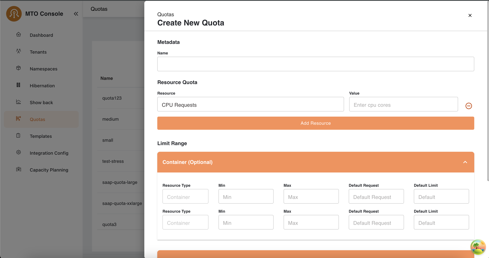
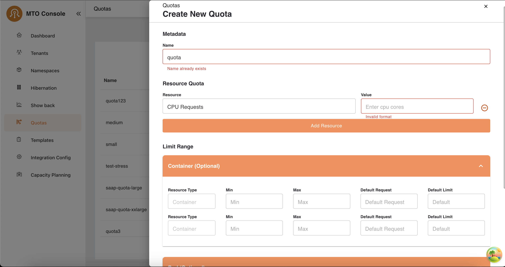
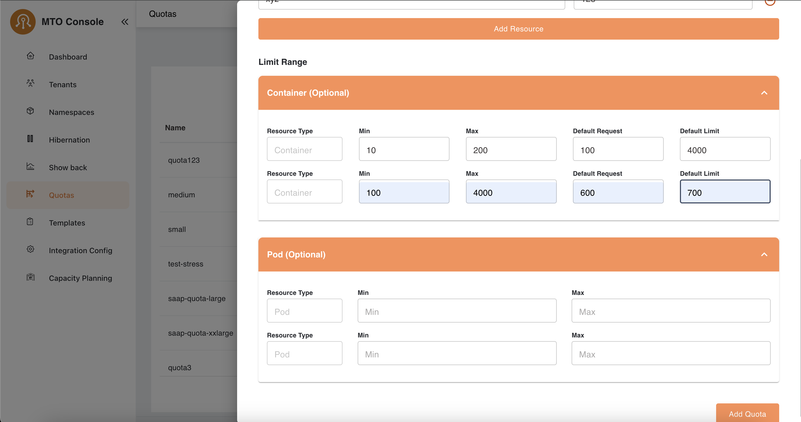

# Quota

## Create

## Overview

The quota creation process allows administrators to define resource limits and optional configurations for containers and pods. This document outlines the steps to create a new quota, including the metadata, resource quota, and limit range configurations.

### Step 1: Metadata



- Name Field
    - The name field is mandatory and must be unique.
    - If the name already exists, an inline error message is displayed.

- Error Handling
    - Regex Validation
    - The quota name must conform to the following regex pattern:

    ```regex
        /^[a-z0-9]+(-[a-z0-9]+)*$/
    ```

    - This ensures that quota names consist of lowercase alphanumeric characters and hyphens, and do not start or end with a hyphen.
    - The metadata section in the drawer while creating a quota is to provide a name for the quota. Users must ensure the quota name meets the specified
    criteria. Also, the quota name should not already exist in order to create a new quota.

### Step 2: Resource Quota



1. Adding Resources
   - The **Resource** dropdown allows the selection of resource types such as:
     - CPU Requests
     - Memory Requests
     - Config Maps
     - Secrets
     - Services
     - Load Balancer Services
   - Enter the corresponding **Value** for the selected resource.

1. Error Handling
   - If an invalid format is entered in the **Value** field, an inline error message is displayed.

1. Add Resource Button:
   - Allows users to add multiple resources sequentially.

### Step 3: Limit Range (Optional)



The limit range section provides optional configurations for containers and pods. It includes:

1. Container
   - Configure limits for container resources by entering:
     - **Min** and **Max** values for resource types.
     - **Default Request** and **Default Limit** values.

1. Pod
   - Similar to the container section, allows configuration for pod-level resources.

1. Error Handling
   - No validation errors occur unless an invalid value is entered.
   - Inline errors guide users in correcting their inputs.

### Final Step: Save Quota

1. Add Quota Button
   - Once all configurations are completed, users can click the **Add Quota** button to save the quota.

1. Completion
   - The system validates all input fields before saving.
   - A confirmation message is displayed once the quota is successfully created.

### Notes

- The entire quota creation process is intuitive, with inline validation to guide users.
- Optional configurations like "Limit Range" allow flexibility based on use cases.

## Update

User can click on the edit button in the table under the action items to open the drawer with all the pre-populated quota configurations.

The update process follows a similar flow to the create process. However, the key difference is that the **quota name** in **Step-1** cannot be edited or updated. All other steps and configurations remain the same, allowing users to modify resource quota, limit range values as needed.

## Delete

By clicking on the delete option in the quota table the user will be able to perform delete operation, a confirmation modal will open which will prompt the user to delete or cancel operation.
