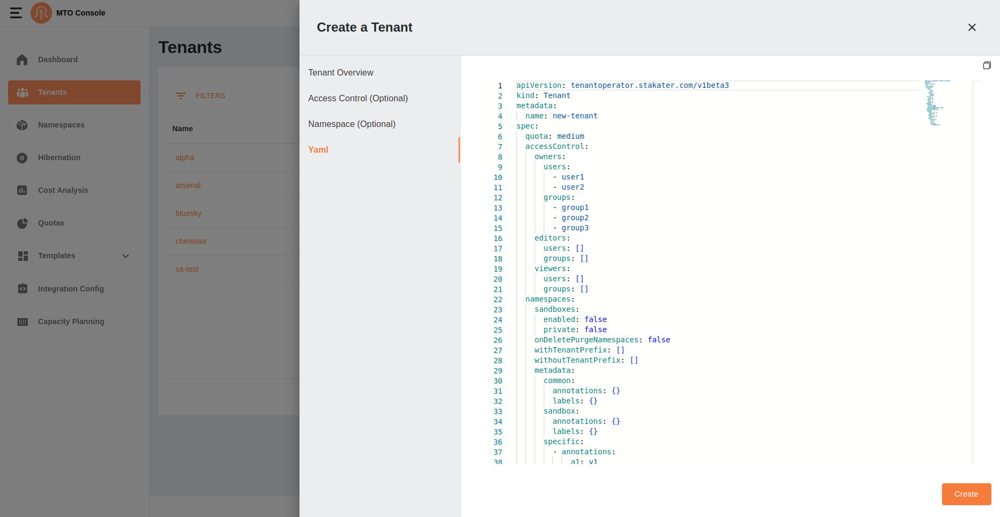

# Tenant

## Create

## Overview

The tenant creation process involves a three-step drawer interface. This document outlines the validation checks and the criteria for progressing through these steps.

## Step 1: Enter Primary Info


The first step in creating a tenant is to provide a name for the tenant. Users must ensure the tenant name meets the specified criteria. The Next button remains disabled until the entered tenant name passes validation and a quota is selected.

### Validation Criteria

- Regex Validation
    - The tenant name must conform to the following regex pattern:

    ```regex
        /^[a-z0-9]+(-[a-z0-9]+)*$/
    ```

    - This ensures that tenant names consist of lowercase alphanumeric characters and hyphens, and do not start or end with a hyphen.

- Uniqueness Check
    - The tenant name must be unique.
    - When tenant name is entered and user stops typing the tenant name is verified of it's uniqueness through an API call to the backend for confirmation that the name does not already exist. If the name is unique the Next button is enabled and user can click on it. If the name is already taken, an error is displayed, and the user must choose a different name.

### Quota Details

The selected quota defines resource limits for the tenant. Example quota details are shown in JSON format as well as a toggle button to view them as YAML:

```yaml
resourcequota:
  hard:
    configmaps: '50'
    requests.cpu: '50'
    requests.memory: 5Gi
    secrets: '50'
    services: '050'
    services.loadbalancers: '1'
limitrange:
  limits:
    - type: Pod
      max:
        cpu: '1'
        memory: 1Gi
      min:
        cpu: 100m
        memory: 50Mi
```

### Enabling the Next Button

The Next button becomes enabled only when
    - The entered tenant name passes both regex validation and the uniqueness check.
    - A quota is selected from the dropdown menu.

### Error Handling

Error Handling on step 1 is based on the following factors

- If the tenant name fails regex validation, an inline error message indicates the naming rule.
- If the tenant name already exists, the user is prompted to enter a new name.

## Step 2: Access Control (Optional)


The second step allows users to configure access control for the tenant. This step is optional and provides three tabs for managing user roles: Owners, Editors, and Viewers.

If the user has some data entered into the step 2 section tabs, the skip option will be disabled. Otherwise, user can perform skip action by clicking on the Skip button.

### Input Fields and Listing Behavior

- Input Fields
    -Each tab (Owners, Editors, and Viewers) contains two input fields:
        - Users: Allows adding individual users.
        - Groups: Allows adding groups.
    - The input fields also act as filters for existing values.
    - If the entered value does not already exist in the list, it can be added.
- Listing Added Values
    - Values entered into the input fields are displayed as a scroll list below the fields.
    - Each added value is displayed with a remove button ("X") to allow easy deletion.

### Key Features

- Optional Configuration: Users can skip this step by clicking the Skip button.
- Filtering: As users type into the input fields, existing values matching the input are shown as suggestions for quick selection.
- Add New Values: If the entered value is not in the existing list, users can add it by confirming the input.
- Scroll Support: The lists have scroll view, ensuring all entries are accessible even when the list grows long.

### Navigating to the Next Step

- Users can proceed to the next step by clicking the Next button.
- The Next button is always enabled for this step as it is optional.

### Error Handling

No specific validations are required for this step since it is optional. However, users can remove or adjust entries as needed using the provided interface.

## Step 3: Namespace (Optional)

The third step allows users to optionally configure namespaces and metadata for the tenant. This step consists of two tabs:

### Namespace


- Toggles:
    - Enable Sandbox: Activates the sandbox environment for the tenant.
    - Private Sandbox: Makes the sandbox environment private.
    - On Delete Purge Namespaces: Ensures namespaces are purged upon deletion.
- Input Fields:
    - With Tenant Prefix:
        - Allows users to add namespaces with a tenant prefix.
        - Filters data based on existing namespaces.
    - Without Tenant Prefix:
        - Allows users to add namespaces without a tenant prefix.
        - Filters data and validates input to check for existing namespaces.
        - Displays an error if the namespace already exists (as shown in the UI).
- List Behavior:
    - Added namespaces are displayed in a scroll list below the input fields.
    - Each namespace is displayed with a remove button ("X") for easy deletion.

### Metadata

The Metadata tab is divided into three sub-tabs:

#### Common and Sandbox Tabs


- Both tabs allow users to add annotations and labels using Key and Value input fields.
- Inputs act as filters for existing values.
- No validation is required for these fields.
- Added annotations and labels are displayed in a scroll list with remove buttons ("X") for easy deletion.

#### Specific Tab


- Includes an Add Accordion button.
- Each accordion contains the following fields:
    - Namespaces: Users can add and filter namespaces. Each namespace is verified before being added to the list.
    - Annotations: Key-value pairs that act as filters for listed values.
    - Labels: Key-value pairs that act as filters for listed values.
- Each field displays added values in a scroll list with remove buttons ("X") for easy deletion.

### Key Features

- Optional Configuration: Users can skip this step by clicking the Create button directly.
- Filtering and Validation:
    - Inputs filter data based on existing values.
    - Namespace inputs validate entries to ensure uniqueness.
- Scroll Support: All lists have scroll view, ensuring accessibility for large datasets.

### Error Handling

- The "Without Tenant Prefix" input validates namespace uniqueness and displays an error if the namespace already exists.
- Namespaces in the accordions are being verified before being added. If they already exist they are not added and shown with an error message on the input.
- No validation errors occur for annotations or labels as they are free-form inputs.

### Completion

- Users finalize the tenant creation process by clicking the Create button.

### YAML View



- A YAML representation of the configuration can be previewed using the **Show YAML** button before creation.

## Update

User can click on the edit button in the table under the action items to open the drawer with all the pre-populated tenant configurations.

The update process follows a similar flow to the create process. However, the key difference is that the **tenant name** in **Step-1** cannot be edited or updated. All other steps and configurations remain the same, allowing users to modify access control, namespaces, and metadata as needed.

## Delete

By clicking on the delete option in the tenants table the user will be able to perform delete operation, and it may take a short while to delete the tenant.
