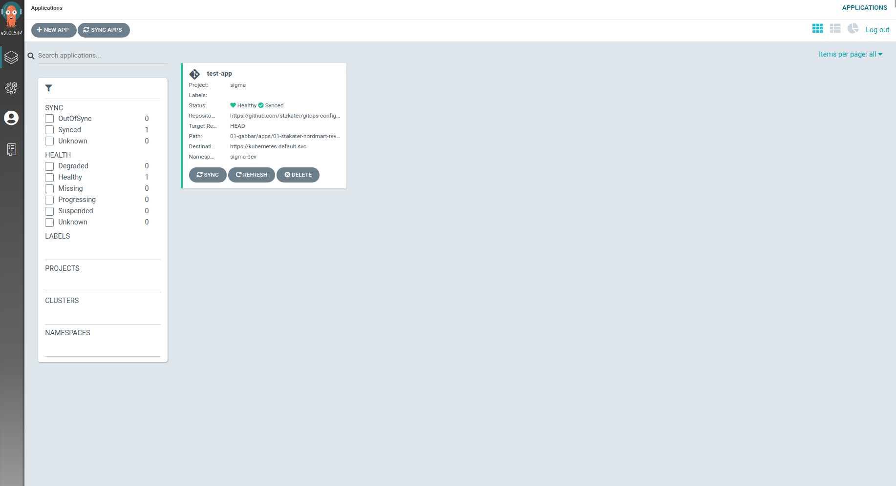

# Enabling Multi-Tenancy in ArgoCD

## ArgoCD integration in Multi Tenant Operator

With the Multi-Tenant Operator (MTO), cluster administrators can configure multi-tenancy within their cluster. The integration of ArgoCD with MTO allows for the configuration of multi-tenancy in ArgoCD applications and AppProjects.

MTO can be configured to create AppProjects for each tenant. These AppProjects enable tenants to create ArgoCD Applications that can be synced to namespaces owned by them. Cluster admins can blacklist certain namespace resources and allow specific cluster-scoped resources as needed (see the NamespaceResourceBlacklist and ClusterResourceWhitelist sections in [Integration Config docs](../crds-api-reference/integration-config.md) and [Tenant Custom Resource docs](../crds-api-reference/tenant.md)).

Note that ArgoCD integration in MTO is optional.

## Default ArgoCD configuration

We have set a default ArgoCD configuration in Multi Tenant Operator that fulfils the following use cases:

- Tenants can only see their ArgoCD applications in the ArgoCD frontend.
- Tenant 'Owners' and 'Editors' have full access to their ArgoCD applications.
- Tenants in the 'Viewers' group have read-only access to their ArgoCD applications.
- Tenants can sync all namespace-scoped resources, except those that are blacklisted.
- Tenants can sync only cluster-scoped resources that are allow-listed.
- Tenant 'Owners' can configure their own GitOps source repositories at the tenant level.
- Cluster admins can prevent specific resources from syncing via ArgoCD.
- Cluster admins have full access to all ArgoCD applications and AppProjects.
- ArgoCD integration is on a per-tenant level; namespace-scoped applications are synced only to tenant namespaces.

## Creating ArgoCD AppProjects for your tenant

To ensure each tenant has their own ArgoCD AppProjects, administrators must first specify the ArgoCD namespace in the [IntegrationConfig](../crds-api-reference/integration-config.md):

```yaml
apiVersion: tenantoperator.stakater.com/v1beta1
kind: IntegrationConfig
metadata:
  name: tenant-operator-config
  namespace: multi-tenant-operator
spec:
  ...
  argocd:
    namespace: openshift-operators
  ...
```

Administrators then create an Extension CR associated with the tenant:

```yaml
apiVersion: tenantoperator.stakater.com/v1alpha1
kind: Extensions
metadata:
  name: extensions-sample
spec:
  tenantName: tenant-sample
  argoCDConfig:
    purgeAppProjectOnDelete: true
    appProject:
      sourceRepos:
        - "github.com/stakater/repo"
      clusterResourceWhitelist:
        - group: ""
          kind: "Pod"
      namespaceResourceBlacklist:
        - group: "v1"
          kind: "ConfigMap"
```

This creates an AppProject for the tenant:

```bash
oc get AppProject -A
NAMESPACE             NAME           AGE
openshift-operators   tenant-sample  5d15h
```

Example of the created AppProject:

```yaml
apiVersion: argoproj.io/v1alpha1
kind: AppProject
metadata:
  name: tenant-sample
  namespace: openshift-operators
spec:
  destinations:
    - namespace: tenant-sample-build
      server: "https://kubernetes.default.svc"
    - namespace: tenant-sample-dev
      server: "https://kubernetes.default.svc"
    - namespace: tenant-sample-stage
      server: "https://kubernetes.default.svc"
  roles:
    - description: >-
        Role that gives full access to all resources inside the tenant's
        namespace to the tenant owner groups
      groups:
        - saap-cluster-admins
        - stakater-team
        - tenant-sample-owner-group
      name: tenant-sample-owner
      policies:
        - "p, proj:tenant-sample:tenant-sample-owner, *, *, tenant-sample/*, allow"
    - description: >-
        Role that gives edit access to all resources inside the tenant's
        namespace to the tenant owner group
      groups:
        - saap-cluster-admins
        - stakater-team
        - tenant-sample-edit-group
      name: tenant-sample-edit
      policies:
        - "p, proj:tenant-sample:tenant-sample-edit, *, *, tenant-sample/*, allow"
    - description: >-
        Role that gives view access to all resources inside the tenant's
        namespace to the tenant owner group
      groups:
        - saap-cluster-admins
        - stakater-team
        - tenant-sample-view-group
      name: tenant-sample-view
      policies:
        - "p, proj:tenant-sample:tenant-sample-view, *, get, tenant-sample/*, allow"
  sourceRepos:
    - "https://github.com/stakater/gitops-config"
```

Users belonging to the tenant group will now see only applications created by them in the ArgoCD frontend:



!!! note
    For ArgoCD Multi Tenancy to work properly, any default roles or policies attached to all users must be removed.

## Preventing ArgoCD from Syncing Certain Namespaced Resources

To prevent tenants from syncing ResourceQuota and LimitRange resources to their namespaces, administrators can specify these resources in the blacklist section of the ArgoCD configuration in the [IntegrationConfig](../crds-api-reference/integration-config.md):

```yaml
apiVersion: tenantoperator.stakater.com/v1beta1
kind: IntegrationConfig
metadata:
  name: tenant-operator-config
  namespace: multi-tenant-operator
spec:
  ...
  integrations:
    argocd:
      namespace: openshift-operators
      namespaceResourceBlacklist:
        - group: ""
          kind: ResourceQuota
        - group: ""
          kind: LimitRange
  ...
```

This configuration ensures these resources are not synced by ArgoCD if added to any tenant's project directory in GitOps. The AppProject will include the blacklisted resources:

```yaml
apiVersion: argoproj.io/v1alpha1
kind: AppProject
metadata:
  name: tenant-sample
  namespace: openshift-operators
spec:
  ...
  namespaceResourceBlacklist:
    - group: ''
      kind: ResourceQuota
    - group: ''
      kind: LimitRange
  ...
```

## Allowing ArgoCD to Sync Certain Cluster-Wide Resources

To allow tenants to sync the Environment cluster-scoped resource, administrators can specify this resource in the allow-list section of the ArgoCD configuration in the IntegrationConfig's spec:

```yaml
apiVersion: tenantoperator.stakater.com/v1beta1
kind: IntegrationConfig
metadata:
  name: tenant-operator-config
  namespace: multi-tenant-operator
spec:
  ...
  integrations:
    argocd:
      namespace: openshift-operators
      clusterResourceWhitelist:
        - group: ""
          kind: Environment
  ...
```

This configuration ensures these resources are synced by ArgoCD if added to any tenant's project directory in GitOps. The AppProject will include the allow-listed resources:

```yaml
apiVersion: argoproj.io/v1alpha1
kind: AppProject
metadata:
  name: tenant-sample
  namespace: openshift-operators
spec:
  ...
  clusterResourceWhitelist:
  - group: ""
    kind: Environment
  ...
```

## Overriding NamespaceResourceBlacklist and/or ClusterResourceWhitelist Per Tenant

To override the `namespaceResourceBlacklist` and/or `clusterResourceWhitelist` set via Integration Config for a specific tenant, administrators can specify these in the `argoCDConfig` section of the Extension CR:


```yaml
apiVersion: tenantoperator.stakater.com/v1alpha1
kind: Extensions
metadata:
  name: extensions-blue-sky
spec:
  tenantName: blue-sky
  argoCDConfig:
    purgeAppProjectOnDelete: true
    appProject:
      sourceRepos:
        - "github.com/stakater/repo"
      clusterResourceWhitelist:
        - group: ""
          kind: "Pod"
      namespaceResourceBlacklist:
        - group: "v1"
          kind: "ConfigMap"
```

This configuration allows for tailored settings for each tenant, ensuring flexibility and control over ArgoCD resources.
