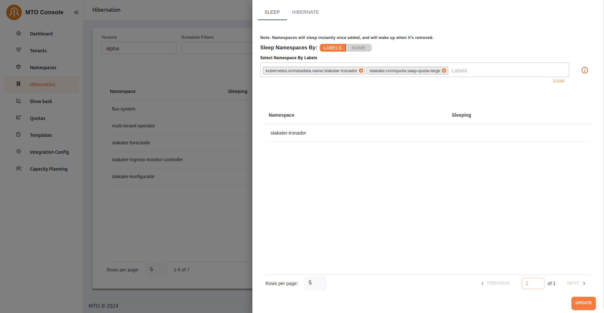
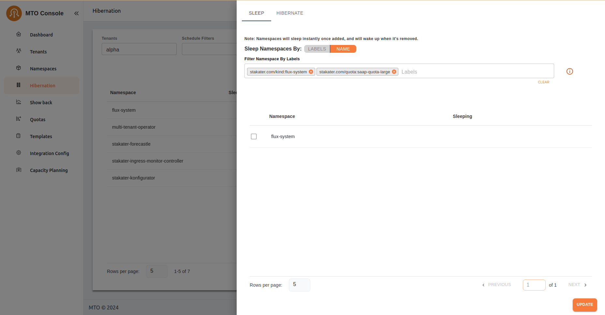
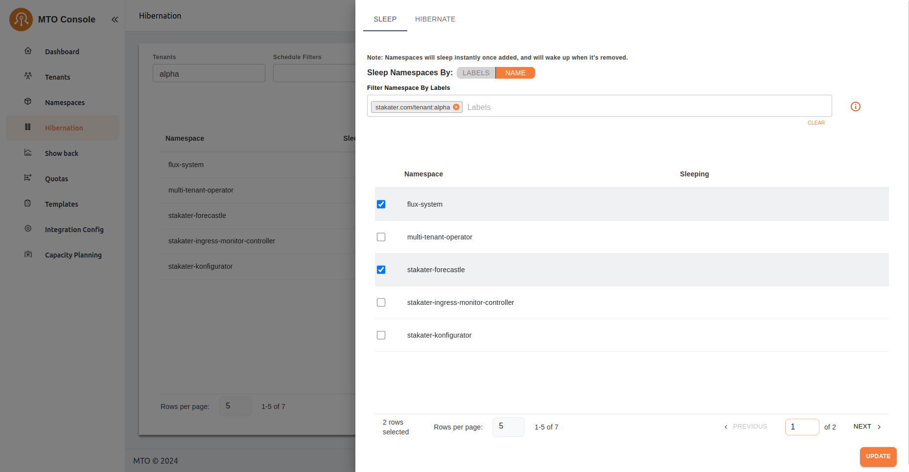
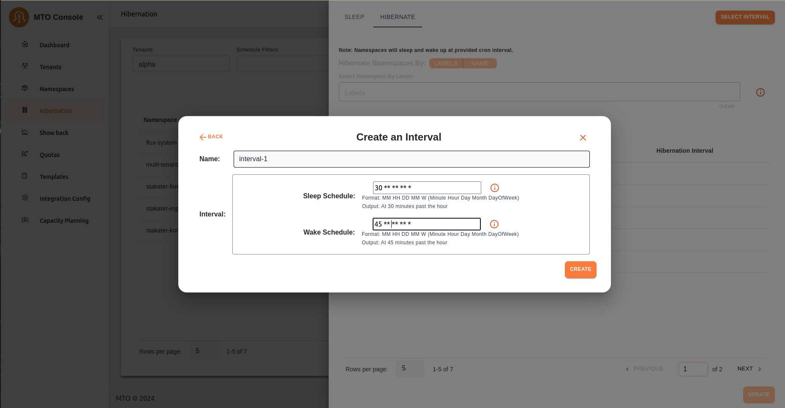
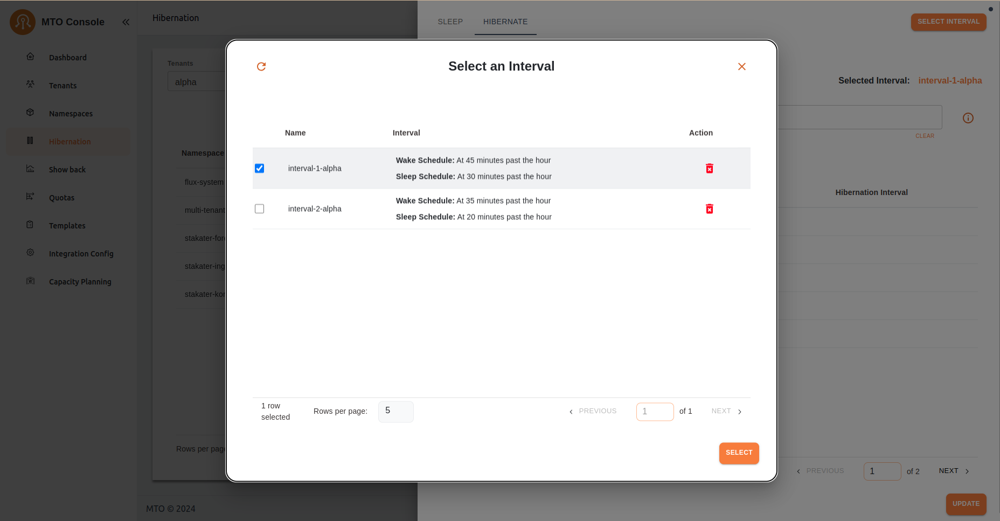
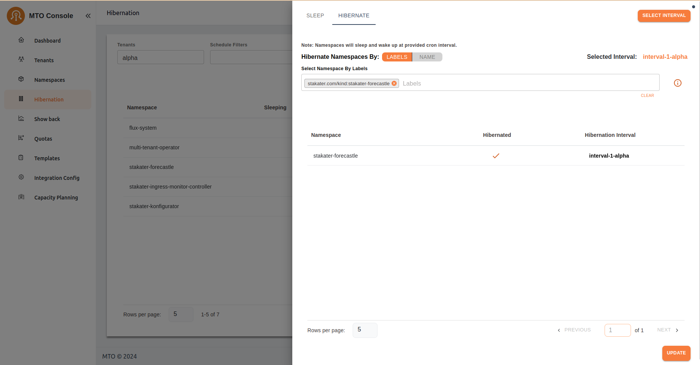
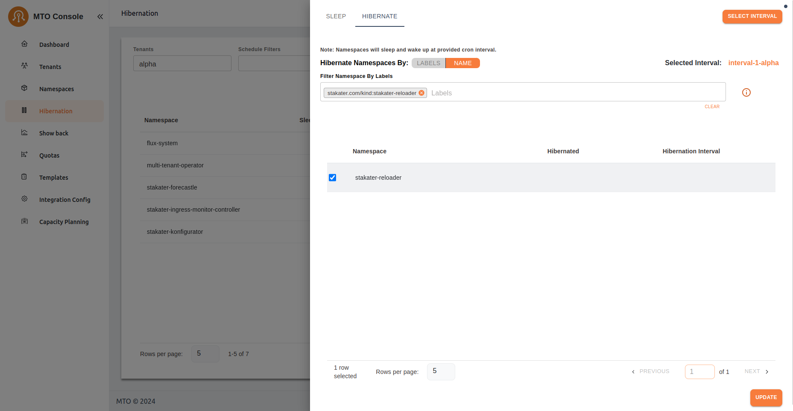
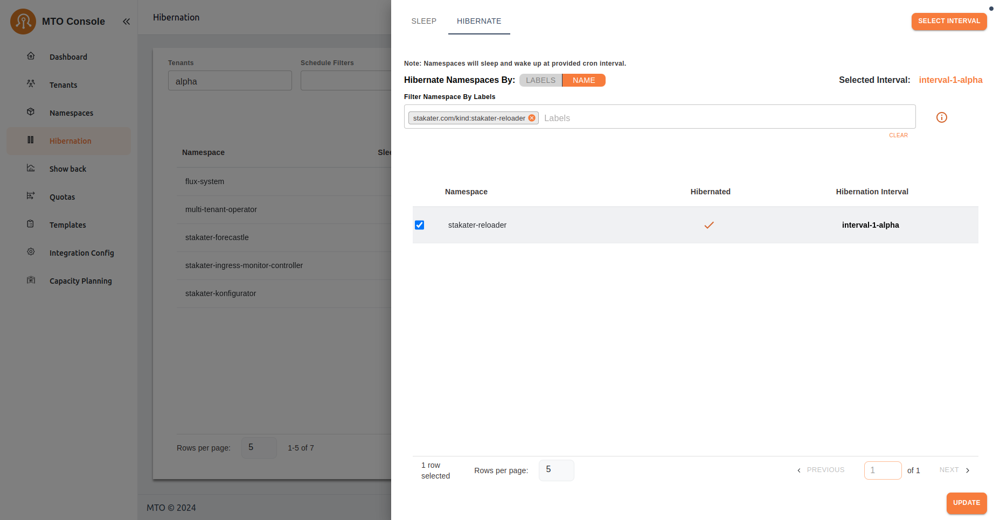

# Hibernation Workflow

The main purpose of the Hibernation workflow is, controlling resource consumption dynamically while enabling efficient management of namespaces based on their usage patterns and requirements.

## Sleep Tab

The "SLEEP" tab is active, indicating that namespaces can be put into sleep mode based on certain criteria.

### Sleep Namespace by Labels

- The interface allows namespaces to be put to sleep based on "LABELS". In this view, the "LABELS" option is selected.
- This approach allows filtering of namespaces using Kubernetes labels. Users can input label selectors in the text box to search amongst the available labels and target specific namespaces based on the unique labels.
- In the example below are the selected labels:
    - ```text kubernetes.io/metadata.name:stakater-tronador```
    - ```text stakater.com/quota:saap-quota-large```

- After applying the label filters, ```stakater-tronador``` appears in the list of matching namespaces. The "Sleeping" column shows no indication of sleep state, suggesting it isn't yet asleep.
- Users can click on the **Update** button to put the filtered namespace rows to sleep based on labels selected. As this will then be reflected in the table below and the main table.



### Sleep Namespace by Name

- The interface shows the "NAME" option selected instead of "LABELS".
- Labels selection here will act as a filter for the table rows and allow user to filter the namespaces based on the applied/selected labels.
- This allows users to select the namespaces by their names idividually, after being filtered based on the labels filter.
- The filter input accepts namespace names or partial matches to narrow down the list. Here, two filters are applied:
    - ```text stakater.com/kind:flux-system```
    - ```text stakater.com/quota:saap-quota-large```
- The filtered result displays ```flux-system``` as a match. A checkbox is provided next to the namespace, likely allowing selection for sleep actions.
- Users can click on the **Update** button to put the filtered namespace rows to sleep based on namespaces selected by name. As this will then be reflected in the table below and the main Hibernation table.



- Another example can be seen where the ```stakater.com/tenant:alpha``` is selected and rows based on the selected labels are filtered.
- User can select the namespaces individually by name to put them to sleep.



## Hibernation Tab

The "HIBERNATE" tab is active, indicating that namespaces can be put into hibernation mode based on selected schedule.

Unlike "SLEEP" tab, hibernate requires an interval to be selected in order to do any action on the tab.

### Creating an Interval

- User can create a hibernation interval with custom schedules for when the namespace should enter sleep mode and when it should wake up.
- The schedules should be a cron value as it will be reflected below the input.
- The schedule name after creation will append the tenant name to it's end indicating the tenant it belongs to for clarification.
- Each interval is defined by a **Sleep Schedule** and a **Wake Schedule** in cron format **(e.g., "30 ** * * *" for 30 minutes past each hour)**.



### Selecting an Interval

- Before applying hibernation to any namespace, an interval must be selected
- This selection is mandatory; without choosing an interval, the hibernation action cannot proceed, ensuring a clear and structured schedule is always in place.



### Hibernate Namespace by Labels

- The interface allows namespaces to be put to hibernation state based on "LABELS". In this view, the "LABELS" option is selected.
- This approach allows filtering of namespaces using Kubernetes labels. Users can input label selectors in the text box to search amongst the available labels and target specific namespaces based on the unique labels.
- In the example below are the selected labels: ```text stakater.com/kind.stakater-forecastle```.
- After applying the label filters, ```stakater-forecastle``` appears in the list of matching namespaces. The "Hibernated" column shows no indication of hibernation state, suggesting it isn't yet hibernated.
- Users can click on the **Update** button to hibernate the namespace based on labels selected. As this will then be reflected in the table below and the main table.


- After the filtered namespaces are hibernated the hibernation interval can be seen in the column and value can be read by hovering over the interval.



### Hibernate Namespace by Name

- The interface shows the "NAME" option selected instead of "LABELS".
- Labels selection here will act as a filter for the table rows and allow user to filter the namespaces based on the applied/selected labels.
- The filter input accepts namespace names or partial matches to narrow down the list. Here, one filters are applied: ```text stakater.com/kind:flux-reloader```
- The filtered result displays ```stakater-reloader``` as a match. A checkbox is provided next to the namespace, likely allowing selection for hibernating the namespace.
- Users can click on the **Update** button to put the filtered namespace rows to sleep based on namespaces selected by name. As this will then be reflected in the table below and the main Hibernation table.



- After the selected namespaces are hibernated the hibernation interval can be seen in the column and value can be read by hovering over the interval.



## Common Elements for Both Tabs

- Sleep and Hibernate Tabs: Users can toggle between "SLEEP" and "HIBERNATE" actions, indicating separate states or behaviors for namespaces.
- Rows per page selection: Users can adjust how many namespaces are displayed on the page, with a default of 5 in this view.
- Update Button: Located at the bottom, allowing users to apply the changes made, such as putting the selected namespaces to sleep.
