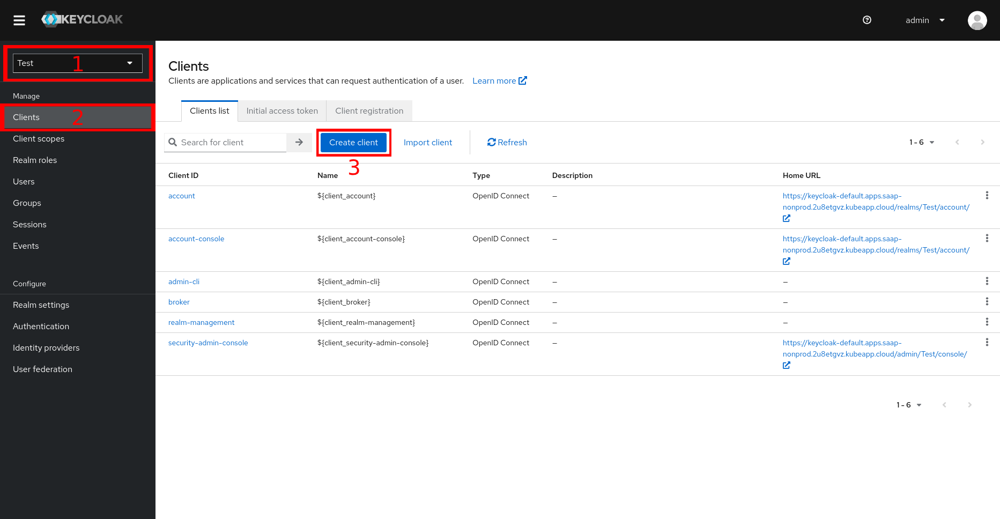
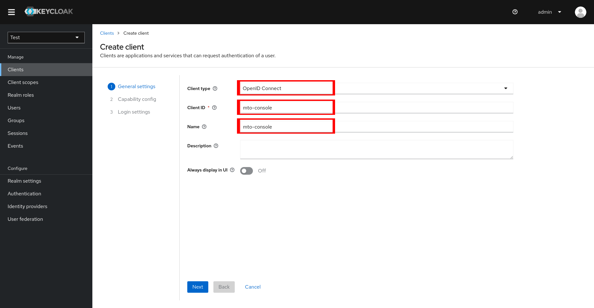

# Integrating External Keycloak

MTO Console uses Keycloak for authentication and authorization. By default, the MTO Console uses an internal Keycloak instance that is provisioned by the Multi Tenant Operator in its own namespace. However, you can also integrate an external Keycloak instance with the MTO Console.

This guide will help you integrate an external Keycloak instance with the MTO Console.

## Prerequisites

- An OpenShift cluster with Multi Tenant Operator installed.
- An external Keycloak instance.

## Steps

**Navigate to the Keycloak console.**

- Go to your realm.
- Click on the `Clients`.
- Click on the `Create` button to create a new client.



**Create a new client.**

- Fill in the `Client ID`, `Client Name` and `Client Protocol` fields.



- Add `Valid Redirect URIs` and `Web Origins` for the client.


> **Note:** The `Valid Redirect URIs` and `Web Origins` should be the URL of the MTO Console.

- Click on the `Save` button.

## Update Integration Config

- Update the `IntegrationConfig` CR with the following configuration.

```yaml
integrations: 
  keycloak:
    realm: <realm>
    address: <keycloak-address>
    clientName: <client-name>
```

- Now, the MTO Console will be integrated with the external Keycloak instance.
