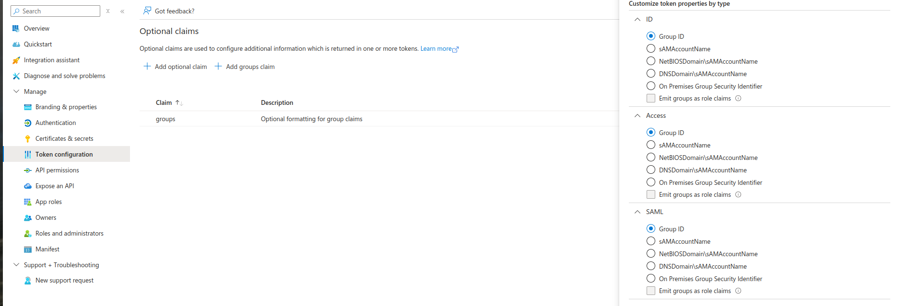
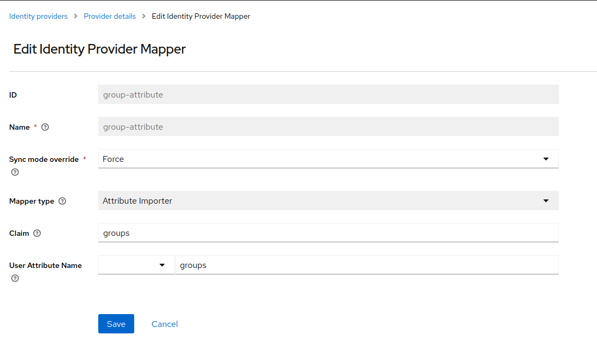
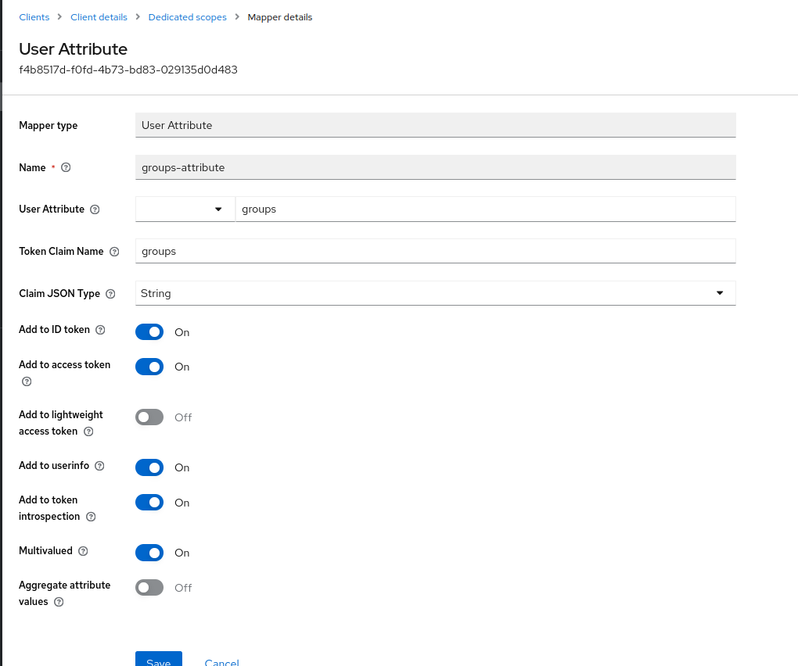

# Vault OIDC Integration with Keycloak

This guide provides step-by-step instructions for integrating **Vault** with **Keycloak** using **Azure AD** for OIDC-based authentication. The setup focuses on using **group IDs** for access control, as Azure AD only provides group IDs in its tokens, not group names.

## Prerequisites

- Azure Active Directory (Azure AD) configured for OIDC.
- Keycloak setup with an Identity Provider (IdP) pointing to Azure AD.
- HashiCorp Vault installed and configured.

## Steps to Implement Group-Based Access Control with Group IDs

### Step 1: Configure Azure AD to Include Group IDs in Tokens

1. **Navigate to Azure AD:**
   - Go to **Azure AD → App Registrations**.

1. **Set up Optional Claims:**
   - In the Azure AD App Registration for your Keycloak, configure an **optional claim** for the app configured with keycloak to include **group IDs** in the tokens.

   

### Step 2: Create an Attribute Importer Mapper in Keycloak

1. **Create Attribute Importer Mapper:**

   Use `IdentityProviderMapper` to configure the attribute importer that extracts the **groups claim** (containing group IDs) from the Azure AD token and stores it in the `groups` attribute in Keycloak:

   ```yaml
   apiVersion: identityprovider.keycloak.crossplane.io/v1alpha1
   kind: IdentityProviderMapper
   metadata:
     name: groups-attribute
   spec:
     deletionPolicy: Delete
     forProvider:
       extraConfig:
         claim: groups
         syncMode: FORCE
         user.attribute: groups
       identityProviderAlias: <idp-alias>
       identityProviderMapper: oidc-user-attribute-idp-mapper
       name: group-attribute
       realmSelector:
         matchLabels:
           realmName: <realm-name>
   ```

   - **`claim: groups`** specifies that the group claim from the token should be used.
   - **`user.attribute: groups`** stores the group IDs in the `groups` attribute for the user in Keycloak.
   - **`syncMode: FORCE`** forces Keycloak to overwrite any existing attribute value for a user with the latest value from the Identity Provider.

   

### Step 3: Set Up a Mapper for Vault Client in Keycloak

1. **Create ProtocolMapper:**

   Use `ProtocolMapper` to configure the mapper that forwards the `groups` attribute (which contains group IDs) from the user's profile into the token. This ensures that Vault receives the group IDs when processing tokens.

   ```yaml
   apiVersion: client.keycloak.crossplane.io/v1alpha1
   kind: ProtocolMapper
   metadata:
     name: <mapper-name>
   spec:
     deletionPolicy: Delete
     forProvider:
       clientIdSelector:
         matchLabels:
           clientName: vault
           realmName: <realm-name>
       config:
         jsonType.label: String
         multivalued: 'true'
         userinfo.token.claim: 'true'
         introspection.token.claim: 'true'
         id.token.claim: 'true'
         user.attribute: groups
         lightweight.claim: 'false'
         claim.name: groups
         access.token.claim: 'true'
       name: groups-attribute
       protocol: openid-connect
       protocolMapper: oidc-usermodel-attribute-mapper
       realmId: <realm-name>
   ```

   - **`user.attribute: groups`** forwards the `groups` attribute to the token.
   - **`claim.name: groups`** specifies the claim name that Vault will use to retrieve the group IDs.

   

### Step 4: Patch Tenant Spec with Azure AD Group IDs for RBAC

1. **Patch the Tenant Spec:**
   - Modify the existing **Tenant** resource to include the Azure AD group IDs under `accessControl`. This will ensure the correct group-based RBAC is applied for Vault.

1. **Example Patch for Tenant Spec:**
   Here’s an example of how to patch the **Tenant** with the group ID from Azure AD:

   ```yaml
   apiVersion: tenantoperator.stakater.com/v1beta3
   kind: Tenant
   metadata:
     name: arsenal
   spec:
     accessControl:
       owners:
         groups:
           - <object-id>
   ```

   - **`owners.groups`** should be updated with the relevant Azure AD group IDs to enforce access control based on the users’ group memberships.

## Conclusion

By following these steps, you can successfully integrate Vault with Keycloak for OIDC authentication, using Azure AD group IDs for access control. This configuration allows for granular, group-based permissions while working with the limitations of Azure AD’s token output.
