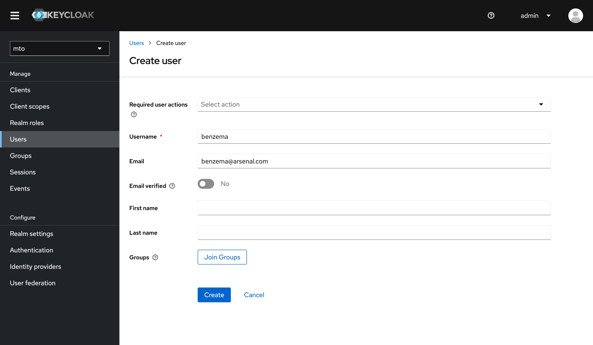
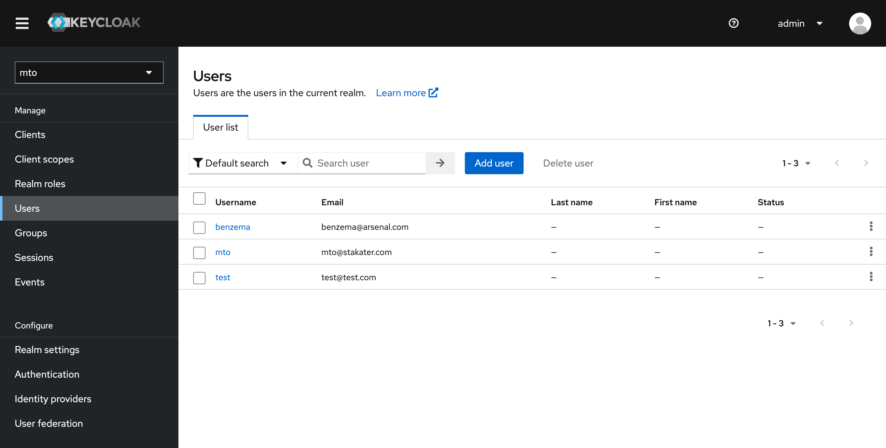

# Setting Up User Access in Keycloak for MTO Console

This guide walks you through the process of adding new users in Keycloak and granting them access to Multi Tenant Operator (MTO) Console.

## Accessing Keycloak Console

* Log in to the OpenShift Console.
* Go to the 'Routes' section within the 'multi-tenant-operator' namespace.


* Click on the Keycloak console link provided in the Routes.
* Login using the admin credentials (default: admin/admin).

## Adding new Users in Keycloak

* In the Keycloak console, switch to the `mto` realm.


* Go to the `Users` section in the `mto` realm.
* Follow the prompts to add a new user.



* Once you add a new user, here is how the Users section would look like



## Accessing MTO Console

* Go back to the OpenShift Console, navigate to the Routes section, and get the URL for the MTO Console.
* Open the MTO Console URL and log in with the newly added user credentials.

Now, at this point, a user will be authenticated to the MTO Console. But in order to get access to view any Tenant resources, the user will need to be part of a Tenant.

## Granting Access to Tenant Resources

* Open Tenant CR: In the OpenShift cluster, locate and open the Tenant Custom Resource (CR) that you wish to give access to. You will see a YAML file similar to the following example:

```yaml
apiVersion: tenantoperator.stakater.com/v1beta2
kind: Tenant
metadata:
  name: arsenal
spec:
  quota: small
  owners:
    users:
        - gabriel@arsenal.com
  groups:
    - arsenal
  editors:
    users:
        - hakimi@arsenal.com
  viewers:
    users:
        - neymar@arsenal.com
```

* Edit Tenant CR: Add the newly created user's email to the appropriate section (owners, editors, viewers) in the Tenant CR. For example, if you have created a user `john@arsenal.com` and wish to add them as an editor, the edited section would look like this:

```yaml
editors:
  users:
    - gabriel@arsenal.com
    - benzema@arsenal.com
```

* Save Changes: Save and apply the changes to the Tenant CR.

## Verifying Access

Once the above steps are completed, you should be able to access the MTO Console now and see alpha Tenant's details along with all the other resources such as namespaces and templates that John has access to.
