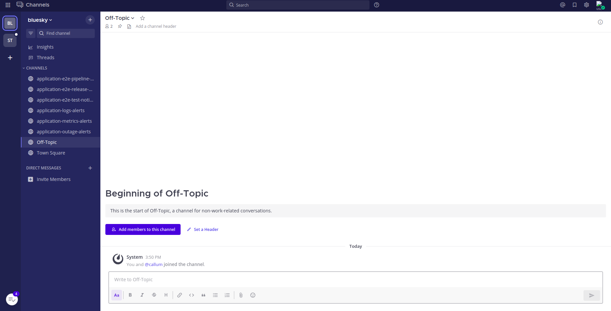

# Creating Mattermost Teams for your tenant

## Requirements

`MTO-Mattermost-Integration-Operator`

Please contact stakater to install the Mattermost integration operator before following the below-mentioned steps.

## Steps to enable integration

Bill wants some tenants to also have their own Mattermost Teams. To make sure this happens correctly, Bill will first add the `stakater.com/mattermost: true` label to the tenants.
The label will enable the `mto-mattermost-integration-operator` to create and manage Mattermost Teams based on Tenants.

```yaml
apiVersion: tenantoperator.stakater.com/v1beta2
kind: Tenant
metadata:
  name: sigma
  labels:
    stakater.com/mattermost: 'true'
spec:
  owners:
    users:
      - user
  editors:
    users:
      - user1
  quota: medium
  sandbox: false
  namespaces:
    withTenantPrefix:
      - dev
      - build
      - prod
```

Now user can log In to Mattermost to see their Team and relevant channels associated with it.



The name of the Team is similar to the Tenant name. Notification channels are pre-configured for every team, and can be modified.
