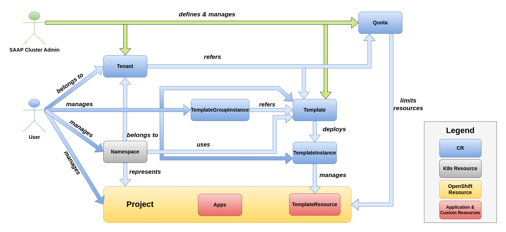

---
head:
  - - meta
    - name: keywords
      content: SEO plugin
---

# Overview

OpenShift is designed to support a single tenant platform, hence making it difficult for cluster admins to host multi-tenancy in a single OpenShift cluster. If multi-tenancy is achieved by sharing a cluster, it can have many advantages, e.g. efficient resource utilization, less configuration effort and easier sharing of cluster-internal resources among different tenants. OpenShift and all managed applications provide enough primitive resources to achieve multi-tenancy, but it requires professional skills and deep knowledge of OpenShift.

This is where Multi Tenant Operator (MTO) comes in and provides easy to manage/configure multi-tenancy. MTO provides wrappers around OpenShift resources to provide a higher level of abstraction to users. With MTO admins can configure Network and Security Policies, Resource Quotas, Limit Ranges, RBAC for every tenant, which are automatically inherited by all the namespaces and users in the tenant. Depending on the user's role, they are free to operate within their tenants in complete autonomy.
MTO supports initializing new tenants using GitOps management pattern. Changes can be managed via PRs just like a typical GitOps workflow, so tenants can request changes, add new users, or remove users.

The idea of MTO is to use namespaces as independent sandboxes, where tenant applications can run independently of each other. Cluster admins shall configure MTO's custom resources, which then become a self-service system for tenants. This minimizes the efforts of the cluster admins.

MTO enables cluster admins to host multiple tenants in a single OpenShift Cluster, i.e.:

* Share an **OpenShift cluster** with multiple tenants
* Share **managed applications** with multiple tenants
* Configure and manage tenants and their sandboxes

MTO is also [OpenShift certified](https://catalog.redhat.com/software/operators/detail/618fa05e3adfdfc43f73b126)

Fig 1.1 Overview of MTO architecture

Fig 1.2 Overview of MTO
