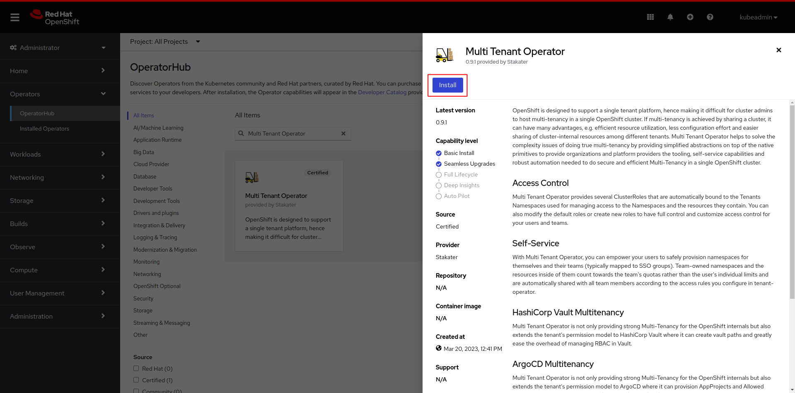
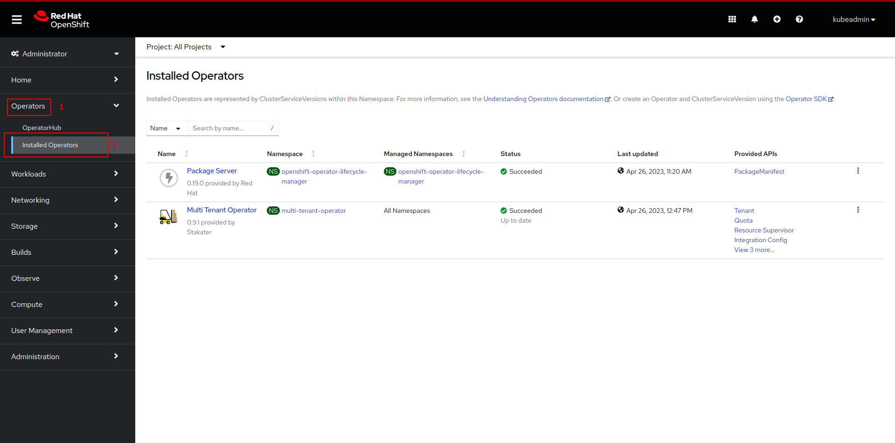
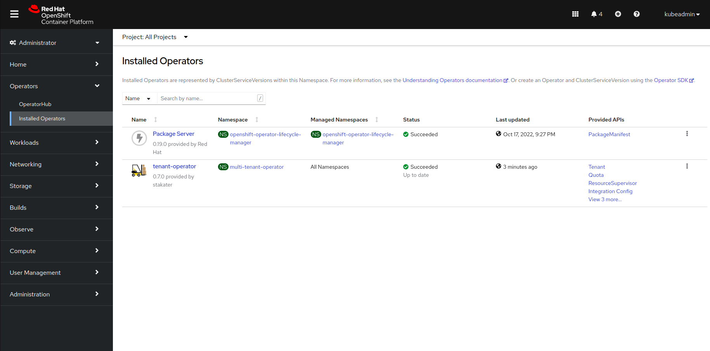

# Installation

This document contains instructions on installing and configuring Multi Tenant Operator using OpenShift MarketPlace or Helm. Following are the 4 different ways available:

1. [OpenShift OperatorHub](#installing-via-operatorhub)

2. [Subscription](#installing-via-subscription)

3. [Helm](#installing-via-helm)

4. [HelmRelease](#installing-via-helm-release)

## Requirements

* An **OpenShift** cluster [v4.7 - v4.11]
* [**Helm-CLI**](https://helm.sh/docs/intro/install/) (Optional: *[For installing via Helm](#installing-via-helm)*)
* **Helm-Operator** (Optional: *[For installing via Helm release](#installing-via-helm-release)*)

## Installing via OperatorHub

* After opening OpenShift console click on `Operators`, followed by `OperatorHub` from the side menu


* Now search for `tenant-operator` and then click on `tenant-operator`


* Click on the `install` button



* Select `multi-tenant-operator` to install the operator in `multi-tenant-operator` project from `Installed Namespace` dropdown menu. After configuring `Update approval` click on the `install` button.


* Wait for the operator to be installed


* Once successfully installed, MTO will be ready to enforce multi-tenancy in your cluster


> Note: MTO will be installed in `multi-tenant-operator` namespace.

### Configuring IntegrationConfig

IntegrationConfig is required to configure the settings of multi-tenancy for MTO.

* We recommend using the following IntegrationConfig as a starting point

```yaml
apiVersion: tenantoperator.stakater.com/v1alpha1
kind: IntegrationConfig
metadata:
  name: tenant-operator-config
  namespace: openshift-operators
spec:
  openshift:
    privilegedNamespaces:
      - default
      - ^openshift-*
      - ^kube-*
      - ^redhat-*
    privilegedServiceAccounts:
      - ^system:serviceaccount:default-*
      - ^system:serviceaccount:openshift-*
      - ^system:serviceaccount:kube-*
      - ^system:serviceaccount:redhat-*
```

For more details and configurations check out [IntegrationConfig](./integration-config.md).

> ⚠️ A default IntegrationConfig with the name `tenant-operator-config` will be present in MTO's installed namespace

### Uninstall

You can uninstall MTO by following these steps:

* Decide on whether you want to retain tenant namespaces or not. If yes, please set `spec.onDelete.cleanNamespaces` to `false` for all those tenants whose namespaces you want to retain. For more details check out [onDelete](./usecases/tenant.md#retaining-tenant-namespaces-when-a-tenant-is-being-deleted)

* After making the required changes open OpenShift console and click on `Operators`, followed by `Installed Operators` from the side menu



* Now click on uninstall and confirm uninstall.


* Now the operator has been uninstalled.

* `Optional:` you can also manually remove MTO's CRDs and its resources from the cluster.

## Installing via Subscription

* Create namespace `multi-tenant-operator`

```bash
oc create namespace multi-tenant-operator
namespace/multi-tenant-operator created
```

* Create a subscription YAML for MTO and apply it in `multi-tenant-operator` namespace. To enable console set `.spec.config.env[].ENABLE_CONSOLE` to `true`. This will create a route resource, which can be used to access the Multi-Tenant-Operator console.

```bash
oc create -f - << EOF
apiVersion: operators.coreos.com/v1alpha1
kind: Subscription
metadata:
  name: tenant-operator
  namespace: multi-tenant-operator
spec:
  channel: alpha
  installPlanApproval: Automatic
  name: tenant-operator
  source: certified-operators
  sourceNamespace: openshift-marketplace
  startingCSV: tenant-operator.v0.9.0
  config:
    env:
      - name: ENABLE_CONSOLE
        value: 'true'
EOF
subscription.operators.coreos.com/tenant-operator created
```

* After creating the `subscription` custom resource open OpenShift console and click on `Operators`, followed by `Installed Operators` from the side menu


* Wait for the installation to complete



* Once the installation is complete click on `Workloads`, followed by `Pods` from the side menu and select `multi-tenant-operator` project


* Once pods are up and running, MTO will be ready to enforce multi-tenancy in your cluster


### Configuring IntegrationConfig

IntegrationConfig is required to configure the settings of multi-tenancy for MTO.

* We recommend using the following IntegrationConfig as a starting point:

```yaml
apiVersion: tenantoperator.stakater.com/v1alpha1
kind: IntegrationConfig
metadata:
  name: tenant-operator-config
  namespace: openshift-operators
spec:
  openshift:
    privilegedNamespaces:
      - default
      - ^openshift-*
      - ^kube-*
      - ^redhat-*
    privilegedServiceAccounts:
      - ^system:serviceaccount:default-*
      - ^system:serviceaccount:openshift-*
      - ^system:serviceaccount:kube-*
      - ^system:serviceaccount:redhat-*
```

For more details and configurations check out [IntegrationConfig](./integration-config.md).

> ⚠️ A default IntegrationConfig with the name `tenant-operator-config` will be present in MTO's installed namespace

### Uninstall

You can uninstall MTO by following these steps:

* Decide on whether you want to retain tenant namespaces or not. If yes, please set `spec.onDelete.cleanNamespaces` to `false` for all those tenants whose namespaces you want to retain. For more details check out [onDelete](./usecases/tenant.md#retaining-tenant-namespaces-when-a-tenant-is-being-deleted)

* Delete the subscription resource

```bash
oc delete subscription tenant-operator -n multi-tenant-operator
subscription.operators.coreos.com "tenant-operator" deleted
```

* Now open OpenShift console and click on `Operators`, followed by `Installed Operators` from the side menu


* Now click on delete ClusterServiceVersion and confirm delete.


* Now the operator has been uninstalled.

* `Optional:` you can also manually remove MTO's CRDs and its resources from the cluster.

## Installing via Helm

### 1. Create Namespace

```bash
oc create namespace stakater-tenant-operator
```

Create a new namespace `stakater-tenant-operator`, where MTO will be deployed.

### 2. Create Secret

```bash
oc apply -f stakater-docker-secret.yaml
```

Create a secret called `stakater-docker-secret` in *stakater-tenant-operator* namespace to pull MTO image from Docker Hub.

*The secret will be provided by **Stakater***

### 3. Add Helm Repository

In order to install MTO with Helm, first add the Stakater Helm repository.

```bash
helm repo add stakater https://stakater.github.io/stakater-charts
```

Scan the new repository for charts.

```bash
helm repo update
```

### 4. Install Multi Tenant Operator

```bash
helm repo update

helm install tenant-operator stakater/tenant-operator --namespace stakater-tenant-operator \
--set image.repository=stakaterdockerhubpullroot/tenant-operator \
--set imagePullSecrets[0].name=stakater-docker-secret \
--set resources.limits.cpu=1000m \
--set resources.limits.memory=2Gi \
--set resources.requests.cpu=100m \
--set resources.requests.memory=128Mi \
--set integrationConfig.create=true
```

Once the image has been pulled `Multi Tenant Operator` will be ready for use.

### 5. Configuring IntegrationConfig

A default `IntegrationConfig` is installed with MTO, which can be found in `stakater-tenant-operator` namespace under the name `tenant-operator-config`. For more details check out [IntegrationConfig](./integration-config.md).

## Installing via Helm Release

### 1. Create Namespace

```bash
oc create namespace stakater-tenant-operator
```

Create a new namespace `stakater-tenant-operator`, where MTO will be deployed.

### 2. Create Secret

```bash
oc apply -f -n stakater-tenant-operator stakater-docker-secret.yaml
```

Create a secret called `stakater-docker-secret` in *stakater-tenant-operator* namespace to pull MTO image from Docker Hub.

*The secret will be provided by **Stakater***

### 3. Create Multi Tenant Operator Helm Release

```yaml
apiVersion: helm.fluxcd.io/v1
kind: HelmRelease
metadata:
  name: tenant-operator
  namespace: stakater-tenant-operator
spec:
  releaseName: stakater
  chart:
    repository: https://stakater.github.io/stakater-charts
    name: tenant-operator
    version: 0.7.0
  values:
    integrationConfig:
      create: true
    image:
      repository: stakaterdockerhubpullroot/tenant-operator
      tag:  v0.7.0
      pullPolicy: IfNotPresent
    imagePullSecrets:
    - name: stakater-docker-secret
    resources:
      limits:
        cpu: 1000m
        memory: 2Gi
      requests:
        cpu: 100m
        memory: 128Mi
```

This Helm release will deploy MTO.

Once the image has been pulled `Multi Tenant Operator` will be ready for use.

### 4. Configuring IntegrationConfig

A default `IntegrationConfig` is installed with MTO, which can be found in `stakater-tenant-operator` namespace under the name `tenant-operator-config`. For more details check out [IntegrationConfig](./integration-config.md).

## Notes

* If MTO is deployed in a newly created namespace, restart its pod once so MTO can retrieve webhook-server-cert provided by OpenShift (if the pod is started before the secret was made).
* For more details on how to use MTO please refer [use-cases](./../multi-tenant-operator/usecases/quota.md).
* For more details on how to extend your MTO manager ClusterRole please refer [use-cases](./../multi-tenant-operator/usecases/manager-clusterrole.md).
