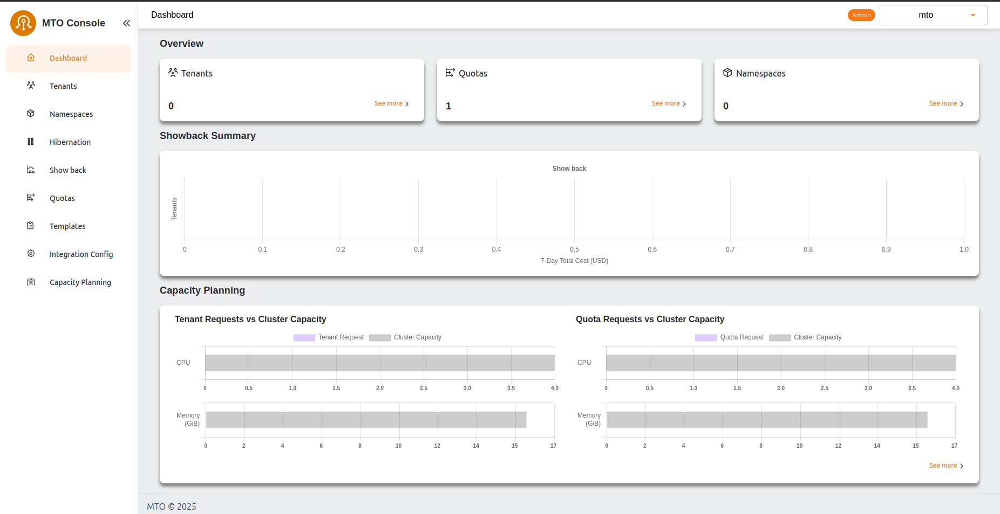

# MTO Installation Guide

Once the [necessary preparations](./preparation.md) are complete, you can proceed with the installation section.

The installation process consists of two steps:

1. [Install MTO Core](#install-mto-core)
1. [Enable MTO Console](#enable-mto-console)

## Install MTO Core

We will be using helm to install the operator.

```bash
helm install tenant-operator oci://ghcr.io/stakater/public/charts/multi-tenant-operator --version 1.1.0 --namespace multi-tenant-operator --create-namespace
```

We will wait for the pods to come in running state.

```bash
NAME                                                              READY   STATUS    RESTARTS   AGE
tenant-operator-namespace-controller-768f9459c4-758kb             2/2     Running   0          5m
tenant-operator-pilot-controller-7c96f6589c-d979f                 2/2     Running   0          5m
tenant-operator-resourcesupervisor-controller-566f59d57b-xbkws    2/2     Running   0          5m
tenant-operator-template-quota-intconfig-controller-7fc99462dz6   2/2     Running   0          5m
tenant-operator-templategroupinstance-controller-75cf68c872pljv   2/2     Running   0          5m
tenant-operator-templateinstance-controller-d996b6fd-cx2dz        2/2     Running   0          5m
tenant-operator-tenant-controller-57fb885c84-7ps92                2/2     Running   0          5m
tenant-operator-webhook-5f8f675549-jv9n8                          2/2     Running   0          5m
```

## Enable MTO Console

Execute the following command to enable MTO console

```bash
kubectl patch integrationconfig tenant-operator-config \
  -n multi-tenant-operator --type merge --patch "{
  \"spec\": {
    \"components\": {
      \"console\": true,
      \"ingress\": {
        \"console\": {
          \"host\": \"console.<FULL_SUBDOMAIN>\",
          \"tlsSecretName\": \"<SECRET_NAME>\"
        },
        \"gateway\": {
          \"host\": \"gateway.<FULL_SUBDOMAIN>\",
          \"tlsSecretName\": \"<SECRET_NAME>\"
        },
        \"keycloak\": {
          \"host\": \"keycloak.<FULL_SUBDOMAIN>\",
          \"tlsSecretName\": \"<SECRET_NAME>\"
        },
        \"ingressClassName\": \"nginx\"
      },
      \"showback\": true
    }
  }
}"
```

Placeholder         | Description
------------        |------------
`<FULL_SUBDOMAIN>`  | Full subdomain of the EKS cluster e.g. `iinhdnh6.demo.kubeapp.cloud`
`<SECRET_NAME>`     | Name of the secret that should be used as TLS secret

Wait for the pods to be ready with the following command

```bash
kubectl wait --for=condition=ready pod -n multi-tenant-operator --all --timeout=300s
```

List the ingresses to access the URL of MTO Console

```bash
> kubectl get ingress -n multi-tenant-operator

NAME                       CLASS   HOSTS                                  ADDRESS                                                                          PORTS     AGE
tenant-operator-console    nginx   console.iinhdnh6.demo.kubeapp.cloud    ae51c179026a94c90952fc50d5d91b52-a4446376b6415dcb.elb.eu-north-1.amazonaws.com   80, 443   23m
tenant-operator-gateway    nginx   gateway.iinhdnh6.demo.kubeapp.cloud    ae51c179026a94c90952fc50d5d91b52-a4446376b6415dcb.elb.eu-north-1.amazonaws.com   80, 443   23m
tenant-operator-keycloak   nginx   keycloak.iinhdnh6.demo.kubeapp.cloud   ae51c179026a94c90952fc50d5d91b52-a4446376b6415dcb.elb.eu-north-1.amazonaws.com   80, 443   24m

```

## MTO Console Admin Login

Patch the following integration config to give previledged access to MTO's default admin user

```bash
kubectl patch integrationconfigs.tenantoperator.stakater.com -n multi-tenant-operator tenant-operator-config --type=merge --patch "{
    \"spec\": {
        \"accessControl\": {
            \"privileged\": {
                \"users\": [
                    \"mto@stakater.com\"
                ]
            }
        }
    }
}"
```

Open the Console URL and Log In with the admin user. Default username and password is `mto`


Dashboard will open after the successful login. Currently we donot have any tenants



<!-- TODO login as admin in the console? and show some content? No tenants are created until this point so no content yet-->
<!-- TODO nothing needs to be done in the mto keycloak? No -->

## What's Next

Now lets [create our first tenant on EKS](./validation.md).
