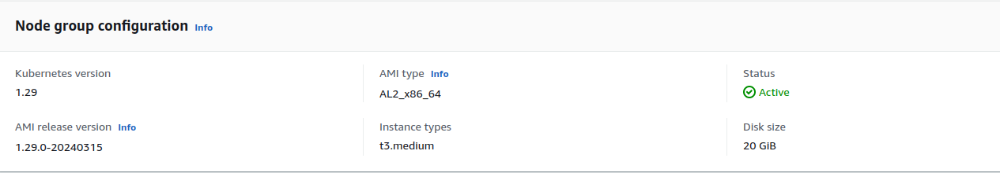
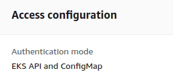
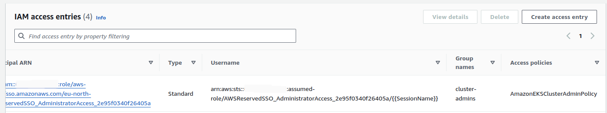

# Install MTO on EKS

This document covers how to deploy Multi Tenant Operator with an [Amazon EKS (Elastic Kubernetes Service)](https://aws.amazon.com/eks/) cluster.

## Prerequisites

- You need kubectl as well, with a minimum version of 1.18.3. If you need to install, see [Install kubectl](https://kubernetes.io/docs/tasks/tools/#kubectl).
- To install MTO, you need Helm CLI as well. Visit [Installing Helm](https://helm.sh/docs/intro/install/) to get Helm CLI
- You need to have a user in [AWS Console](https://console.aws.amazon.com/), which we will use as the administrator having enough permissions for accessing the cluster and creating groups with users
- A running EKS Cluster. [Creating an EKS Cluster](https://docs.aws.amazon.com/eks/latest/userguide/create-cluster.html) provides a good tutorial to create a demo cluster
- [AWS Route 53 DNS](https://docs.aws.amazon.com/Route53/latest/DeveloperGuide/setting-up-route-53.html) or similar DNS service must be configured

- [AWS Elastic Load Balancer](https://docs.aws.amazon.com/elasticloadbalancing/latest/userguide/load-balancer-getting-started.html) must be configured

- Following components must be installed and configured on cluster before installation

    * NGINX Ingress Controller
    * CertManager
    * CertManager's ClusterIssuer for Let's Encrypt
    * Let's Encrypt Secret
    * EBS CSI Driver
    * Storage Class for EBS
    * Wildcard DNS Record Entry
    * Wildcard Certificate

    [MTO prerequisites installation guide](./mto-prereq-installation.md) provides a detailed walkthrough of dependency installation

## Setting up an EKS Cluster

In this example, we have already set-up a small EKS cluster with the following node group specifications



We have access configuration set as both, EKS API and Configmap, so that admin can access the cluster using EKS API and map IAM users to our EKS cluster using `aws-auth` configmap.



And we have a policy `AmazonEKSClusterAdminPolicy` attached with our user which makes it a cluster admin. To be noted, the user is also added in the `cluster-admins` group which we will later use while installing MTO.



## Installing MTO

We will be using helm to install the operator, here we have set `bypassedGroups` as `cluster-admins` because our admin user is part of that group as seen in above screenshot.

```bash
helm install tenant-operator oci://ghcr.io/stakater/public/charts/multi-tenant-operator --version 0.12.62 --namespace multi-tenant-operator --create-namespace --set bypassedGroups=cluster-admins
```

We will wait for the pods to come in running state.

```bash
NAME                                                              READY   STATUS    RESTARTS   AGE
tenant-operator-namespace-controller-768f9459c4-758kb             2/2     Running   0          5m
tenant-operator-pilot-controller-7c96f6589c-d979f                 2/2     Running   0          5m
tenant-operator-resourcesupervisor-controller-566f59d57b-xbkws    2/2     Running   0          5m
tenant-operator-template-quota-intconfig-controller-7fc99462dz6   2/2     Running   0          5m
tenant-operator-templategroupinstance-controller-75cf68c872pljv   2/2     Running   0          5m
tenant-operator-templateinstance-controller-d996b6fd-cx2dz        2/2     Running   0          5m
tenant-operator-tenant-controller-57fb885c84-7ps92                2/2     Running   0          5m
tenant-operator-webhook-5f8f675549-jv9n8                          2/2     Running   0          5m
```

## Enable MTO Console

Execute the following command to enable MTO console

```bash
kubectl patch integrationconfig tenant-operator-config \
  -n multi-tenant-operator --type merge --patch "{
  \"spec\": {
    \"components\": {
      \"console\": true,
      \"ingress\": {
        \"console\": {
          \"host\": \"console.<FULL_SUBDOMAIN>\",
          \"tlsSecretName\": \"<SECRET_NAME>\"
        },
        \"gateway\": {
          \"host\": \"gateway.<FULL_SUBDOMAIN>\",
          \"tlsSecretName\": \"<SECRET_NAME>\"
        },
        \"keycloak\": {
          \"host\": \"keycloak.<FULL_SUBDOMAIN>\",
          \"tlsSecretName\": \"<SECRET_NAME>\"
        },
        \"ingressClassName\": \"nginx\"
      },
      \"showback\": true
    }
  }
}"
```

Wait for the pods to be ready with the following command

```bash
kubectl wait --for=condition=ready pod -n multi-tenant-operator --all --timeout=300s
```

List the routes to access the URL of MTO Console

```bash
kubectl get routes -n multi-tenant-operator
```

## What's Next

MTO installation has been completed. Now we can [create our first tenant on EKS using MTO](./create-tenants.md).
