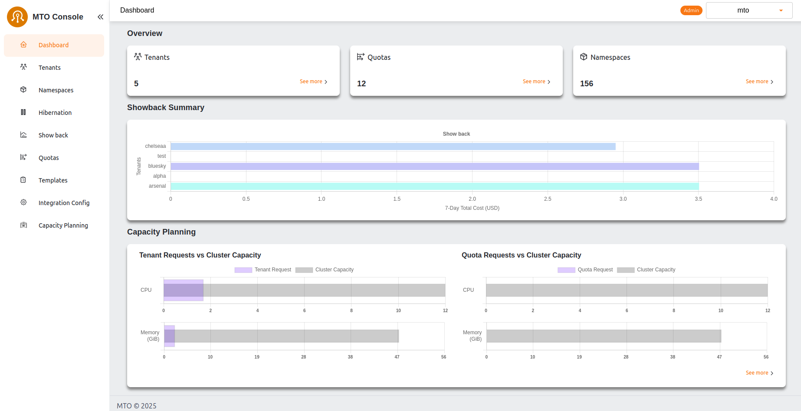

# MTO Validation Guide

This document provides detailed insights on creating MTO Tenants on EKS cluster. In this tutorial we will assume setup 2 tenants named logistics and retail for an imaginary ecommerce company.

## Prerequisites

MTO must be installed on EKS cluster. [MTO EKS installation guide](./mto-installation.md) provides a detailed walk-through of MTO installation on EKS.

## User Interaction with the Cluster

We will use two types of users to interact with the cluster, IAM users created via AWS Console and SSO Users.

### Creating IAM Users

We will create a group named `logistics-owner` and then add a user to that group.
To create a group named `logistics-owner` use the following command

```terminal
$ aws iam create-group --group-name logistics-owner

Output:
{
    "Group": {
        "Path": "/",
        "GroupName": "logistics-owner",
        "GroupId": "AGPAZFWZTAEJYEKE56O3P",
        "Arn": "arn:aws:iam::630742778131:group/logistics-owner",
        "CreateDate": "2025-02-03T13:08:56Z"
    }
}
```

Create a user named `falcon@nordmart.com`

```terminal
$ aws iam create-user --user-name falcon@nordmart.com

Output:
{
    "User": {
        "Path": "/",
        "UserName": "falcon@nordmart.com",
        "UserId": "AIDAZFWZTAEJ7ILHDKLLD",
        "Arn": "arn:aws:iam::630742778131:user/falcon@nordmart.com",
        "CreateDate": "2025-02-03T13:09:51Z"
    }
}
```

We have created a user named `falcon@nordmart.com` in AWS Console, with ARN `arn:aws:iam::630742778131:user/falcon@nordmart.com`.

Create a JSON file to attach the policy. This policy will allow the user to access the cluster.

```json
{
    "Statement": [
        {
            "Action": "eks:DescribeCluster",
            "Effect": "Allow",
            "Resource": "*"
        }
    ],
    "Version": "2012-10-17"
}
```

Attach a policy to user

```bash
aws iam put-user-policy --user-name $name --policy-document file://policy.json --policy-name ClusterAccess
```

Add user to `logistics-owner` group

```bash
aws iam add-user-to-group --user-name "falcon@nordmart.com" --group-name "logistics-owner"
```

Generate the access keys that can be used to log in into the cluster. Executing the following command will provide the Access Key Id and Access Secret Key Id that can be used to log in

```bash
aws iam create-access-key --user-name "falcon@nordmart.com"
```

Use the following command to map this user in `aws-auth` configmap in `kube-system` namespace.

```bash
eksctl create iamidentitymapping --cluster "<CLUSTER_NAME>" \ 
                                 --region "<AWS_REGION>" \
                                 --arn "<USER_ARN>" \
                                 --username "falcon@nordmart.com" \
                                 --group "logistics-dev" \
                                 --no-duplicate-arns
```

Since we haven't attached any RBAC with this user at the moment, trying to access anything in the cluster would throw an error

```terminal
$ kubectl get svc

Error from server (Forbidden): services is forbidden: User "falcon@nordmart.com" cannot list resource "services" in API group "" in the namespace "default"
```

Repeat the same steps to create a group and a user for retail tenant.

### Setting up Tenant for Users

Now, we will set tenants for the above-mentioned users.

We will start by creating a `Quota CR` with some resource limits

```yaml
kubectl apply -f - <<EOF
apiVersion: tenantoperator.stakater.com/v1beta1
kind: Quota
metadata:
  name: small
spec:
  limitrange:
    limits:
    - max:
        cpu: 800m
      min:
        cpu: 200m
      type: Container
  resourcequota:
    hard:
      configmaps: "10"
      memory: "8Gi"
EOF
```

Now, we will mention this `Quota` in two `Tenant` CRs

```yaml
kubectl apply -f - <<EOF
apiVersion: tenantoperator.stakater.com/v1beta3
kind: Tenant
metadata:
  name: logistics
spec:
  namespaces:
    withTenantPrefix:
    - dev
    - build
  accessControl:
    owners:
      users:
      - falcon@nordmart.com
  quota: small
EOF
```

```yaml
kubectl apply -f - <<EOF
apiVersion: tenantoperator.stakater.com/v1beta3
kind: Tenant
metadata:
  name: retail
spec:
  namespaces:
    withTenantPrefix:
    - dev
    - build
  accessControl:
    owners:
      users:
      - bear@nordmart.com
  quota: small
EOF
```

Notice that the only difference in both tenant specs are the users.

### Accessing Tenant Namespaces

After the creation of `Tenant` CRs, now users can access namespaces in their respective tenants and preform create, update, delete functions.

Listing the namespaces by cluster admin will show us the recently created tenant namespaces

```bash
$ kubectl get namespaces

NAME                    STATUS   AGE
cert-manager            Active   8d
default                 Active   9d
kube-node-lease         Active   9d
kube-public             Active   9d
kube-system             Active   9d
multi-tenant-operator   Active   8d
random                  Active   8d
logistics-dev           Active   5s
logistics-build         Active   5s
retail-dev              Active   5s
retail-build            Active   5s
```

### Logistics Users on Tenant Namespaces

We will now try to deploy a pod from user `falcon@nordmart.com` in its tenant namespace `tenant-iam-dev`

```bash
$ kubectl run nginx --image nginx -n logistics-dev

pod/nginx created
```

And if we try the same operation in the other tenant with the same user, it will fail

```bash
$ kubectl run nginx --image nginx -n retail-dev

Error from server (Forbidden): pods is forbidden: User "falcon@nordmart.com" cannot create resource "pods" in API group "" in the namespace "retail-dev"
```

To be noted, `falcon@nordmart.com` can not list namespaces

```bash
$ kubectl get namespaces

Error from server (Forbidden): namespaces is forbidden: User "falcon@nordmart.com" cannot list resource "namespaces" in API group "" at the cluster scope
```

### Retail Users on Tenant Namespaces

We will repeat the above operations for our SSO user `bear@nordmart.com` as well

```bash
$ kubectl run nginx --image nginx -n retail-dev

pod/nginx created
```

Trying to do operations outside the scope of its own tenant will result in errors

```bash
$ kubectl run nginx --image nginx -n retail-dev

Error from server (Forbidden): pods is forbidden: User "bear@nordmart.com" cannot create resource "pods" in API group "" in the namespace "tenant-iam-dev"
```

To be noted, `bear@nordmart.com` can not list namespaces

```bash
$ kubectl get namespaces

Error from server (Forbidden): namespaces is forbidden: User "bear@nordmart.com" cannot list resource "namespaces" in API group "" at the cluster scope
```

## Using MTO Console

### Prerequisites

- Ensure that MTO Console is enabled by running the following command

  ```bash
  $ kubectl get integrationconfig tenant-operator-config -o=jsonpath='{.spec.components}' -n multi-tenant-operator

  {"console":true,"showback":true}
  ```

  If console is set to false then [enable the MTO Console](./mto-installation.md#enable-mto-console) before proceeding to next step

- **A Keycloak user with same username as AWS IAM user** should be created. Follow our [Setting Up User Access in Keycloak for MTO Console](../../how-to-guides/keycloak.md) guide to create a Keycloak user.

### MTO Console Log In

List the ingresses to access the URL of MTO Console

```bash
kubectl get ingress -n multi-tenant-operator

NAME                       CLASS   HOSTS                                  ADDRESS                                                                          PORTS     AGE
tenant-operator-console    nginx   console.iinhdnh6.demo.kubeapp.cloud    ae51c179026a94c90952fc50d5d91b52-a4446376b6415dcb.elb.eu-north-1.amazonaws.com   80, 443   23m
tenant-operator-gateway    nginx   gateway.iinhdnh6.demo.kubeapp.cloud    ae51c179026a94c90952fc50d5d91b52-a4446376b6415dcb.elb.eu-north-1.amazonaws.com   80, 443   23m
tenant-operator-keycloak   nginx   keycloak.iinhdnh6.demo.kubeapp.cloud   ae51c179026a94c90952fc50d5d91b52-a4446376b6415dcb.elb.eu-north-1.amazonaws.com   80, 443   24m

```

Open the URL and Log In with the Keycloak user credentials.


Dashboard will open after the successful login. Now you can navigate different tenants and namespaces using MTO Console


