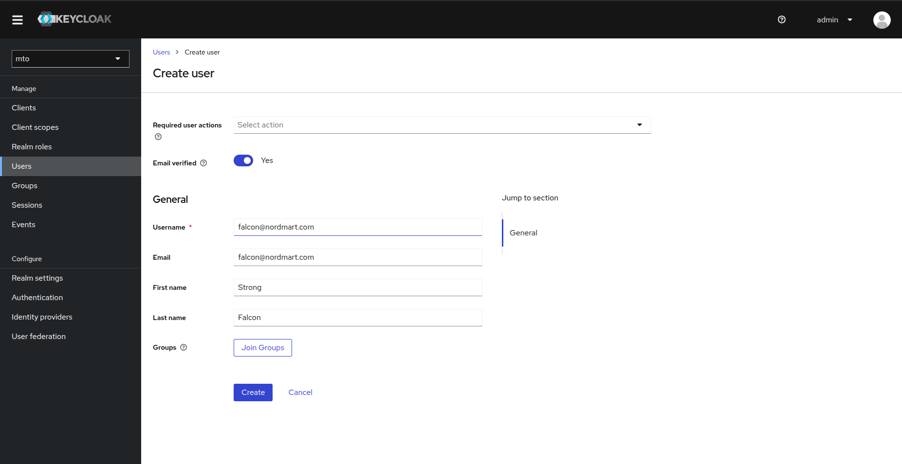
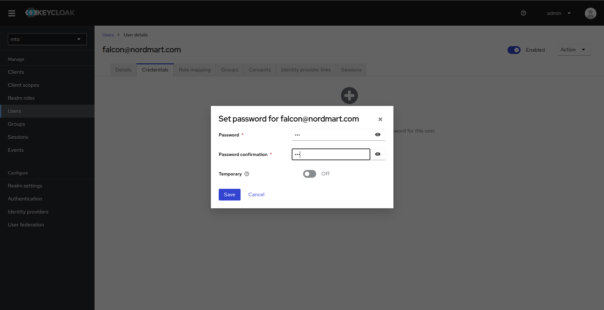
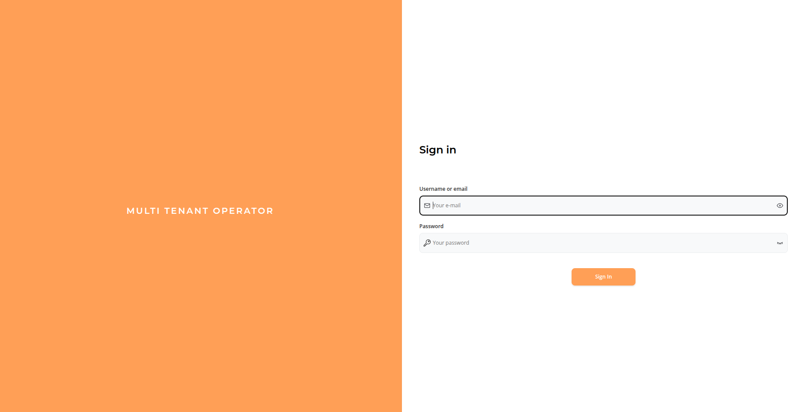

# MTO Validation Guide

In this guide, we will set up **two tenants**—**Logistics** and **Retail**—for an imaginary e-commerce company, each with one user.

- **Falcon** will be the user assigned to the **Logistics** tenant.  
- **Bear** will be the user assigned to the **Retail** tenant.

## 1. Create & Configure Azure Users & Groups

### 1.1. Create a user

Fetch the cluster ID using following command. We will use cluster ID to assign role to our logistics group

```bash
AKS_ID=$(az aks show --resource-group "$RG_NAME" --name "$CLUSTER_NAME" --query id -o tsv)
```

Create an active directory group named `logistics`

```bash
GROUP_ID=$(az ad group create --display-name "logistics" --mail-nickname "logistics" --query "id" --output tsv)
```

Assign Azure Kubernetes Service Cluster User Role to `logistics` group

```bash
az role assignment create --assignee "$GROUP_ID" --role "Azure Kubernetes Service Cluster User Role" --scope "$AKS_ID"
```

Create a user with username `falcon@nordmart.com`

```bash
az ad user create --display-name "Golden Falcon" \
                    --user-principal-name "falcon@nordmart.com" \
                    --password "<PASSWORD>" 
```

Fetch the user id with following command

```bash
ad_user_id=$(az ad user show --id "falcon@nordmart.com" --query "id" --output tsv)
```

Add user to `logistics` group

```bash
az ad group member add --group "logistics" --member-id "<USER_ID>"
```

Repeat the same steps to create another group `retail` with user `bear@nordmart.com` for retail tenant.

## 2. Create Keycloak user for MTO Console

### 2.1. Create Keycloak User

A Keycloak user with same username as IAM user needs to be created for MTO Console. In this section we will create a Keycloak user for Logistics tenant

Ensure that MTO Console is enabled by executing the following command

```bash
$ kubectl get integrationconfig tenant-operator-config -o=jsonpath='{.spec.components}' -n multi-tenant-operator
{"console":true,"showback":true}
```

List the ingresses to access the URL of MTO Console

```bash
kubectl get ingress -n multi-tenant-operator

NAME                       CLASS   HOSTS                                  ADDRESS                                                                          PORTS     AGE
tenant-operator-console    nginx   console.iinhdnh6.demo.kubeapp.cloud    ae51c179026a94c90952fc50d5d91b52-a4446376b6415dcb.elb.eu-north-1.amazonaws.com   80, 443   23m
tenant-operator-gateway    nginx   gateway.iinhdnh6.demo.kubeapp.cloud    ae51c179026a94c90952fc50d5d91b52-a4446376b6415dcb.elb.eu-north-1.amazonaws.com   80, 443   23m
tenant-operator-keycloak   nginx   keycloak.iinhdnh6.demo.kubeapp.cloud   ae51c179026a94c90952fc50d5d91b52-a4446376b6415dcb.elb.eu-north-1.amazonaws.com   80, 443   24m

```

1. Navigate to Keycloak and Login using default credentials `admin/admin`

1. Change the Realm from `master` to `mto`

1. Navigate to Users and Click Add User

1. Provide a username, this username must be same as IAM username `falcon@nordmart.com` in our case

    

1. Navigate to Credentials tab and set a password

    

Repeat the same steps to create another user `bear@nordmart.com`

## 3. Create MTO Quota

As cluster admin create a `Quota CR` with some resource limits:

```sh
kubectl apply -f - <<EOF
apiVersion: tenantoperator.stakater.com/v1beta1
kind: Quota
metadata:
  name: small
spec:
  limitrange:
    limits:
    - max:
        cpu: 800m
      min:
        cpu: 200m
      type: Container
  resourcequota:
    hard:
      configmaps: "10"
      memory: "8Gi"
EOF
```

## 4. Create MTO Tenants

As cluster admin create 2 tenants `logistics` and `retail` with one user each:

```sh
kubectl apply -f - <<EOF
apiVersion: tenantoperator.stakater.com/v1beta3
kind: Tenant
metadata:
  name: logistics
spec:
  namespaces:
    withTenantPrefix:
    - dev
    - build
  accessControl:
    owners:
      users:
      - falcon@nordmart.com
  quota: small
EOF
```

```sh
kubectl apply -f - <<EOF
apiVersion: tenantoperator.stakater.com/v1beta3
kind: Tenant
metadata:
  name: retail
spec:
  namespaces:
    withTenantPrefix:
    - dev
    - build
  accessControl:
    owners:
      users:
      - bear@nordmart.com
  quota: small
EOF
```

Notice that the only difference in both tenant specs are the users.

## 5. List namespaces as cluster admin

Listing the namespaces as cluster admin will show following namespaces:

```sh
$ kubectl get namespaces

NAME                    STATUS   AGE
cert-manager            Active   8d
default                 Active   9d
kube-node-lease         Active   9d
kube-public             Active   9d
kube-system             Active   9d
multi-tenant-operator   Active   8d
random                  Active   8d
logistics-dev           Active   5s
logistics-build         Active   5s
retail-dev              Active   5s
retail-build            Active   5s
```

## 6. Validate Falcon permissions

### 6.1. Switch to falcon

Run the Azure CLI login command to interactively login as `falcon@nordmart.com`. Running the following command will open browser for interactive login

```bash
az login
```

Run the following command to update the kubecontext with logged in user

```bash
az aks get-credentials --resource-group "<RESOURCE_GROUP_NAME>" --name "<CLUSTER_NAME>"
```

### 6.2. Check CLI permissions

We will now try to deploy a pod from user `falcon@nordmart.com` in its tenant namespace `logistics-dev`

```bash
$ kubectl run nginx --image nginx -n logistics-dev

pod/nginx created
```

And if we try the same operation in the other tenant with the same user, it will fail

```bash
$ kubectl run nginx --image nginx -n retail-dev

Error from server (Forbidden): pods is forbidden: User "falcon@nordmart.com" cannot create resource "pods" in API group "" in the namespace "retail-dev"
```

To be noted, `falcon@nordmart.com` can not list namespaces

```bash
$ kubectl get namespaces

Error from server (Forbidden): namespaces is forbidden: User "falcon@nordmart.com" cannot list resource "namespaces" in API group "" at the cluster scope
```

### 6.3. Validate Console permissions

Navigate to MTO Console URL and Log In with the Keycloak user credentials.



Dashboard will open after the successful login. Now you can navigate different tenants and namespaces using MTO Console


## 7. Validate Bear permissions

### 7.1. Switch to bear

Run the Azure CLI login command to interactively login as `bear@nordmart.com`. Running the following command will open browser for interactive login

```bash
az login
```

### 7.2. Check CLI permissions

We will repeat the above operations for our retail user `bear@nordmart.com` as well

```bash
$ kubectl run nginx --image nginx -n retail-dev

pod/nginx created
```

Trying to do operations outside the scope of its own tenant will result in errors

```bash
$ kubectl run nginx --image nginx -n retail-dev

Error from server (Forbidden): pods is forbidden: User "bear@nordmart.com" cannot create resource "pods" in API group "" in the namespace "retail-dev"
```

To be noted, `bear@nordmart.com` can not list namespaces

```bash
$ kubectl get namespaces

Error from server (Forbidden): namespaces is forbidden: User "bear@nordmart.com" cannot list resource "namespaces" in API group "" at the cluster scope
```

### 7.3. Validate Console permissions

Navigate to MTO Console URL and Log In with the Keycloak user credentials.


Dashboard will open after the successful login. Now you can navigate different tenants and namespaces using MTO Console


