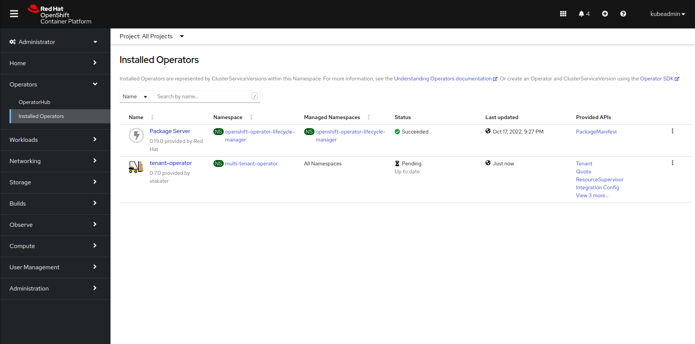
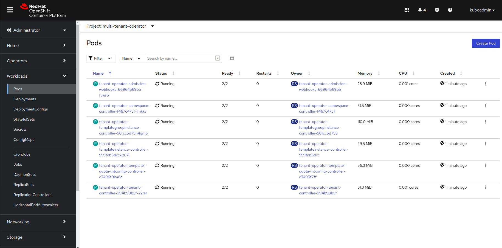
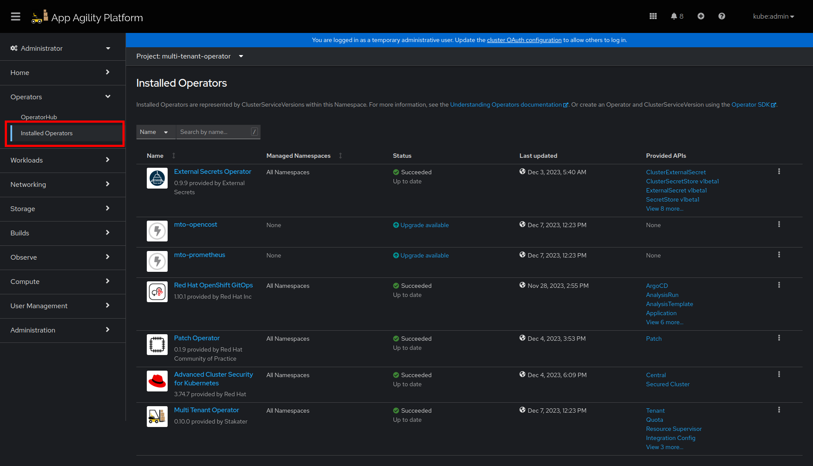
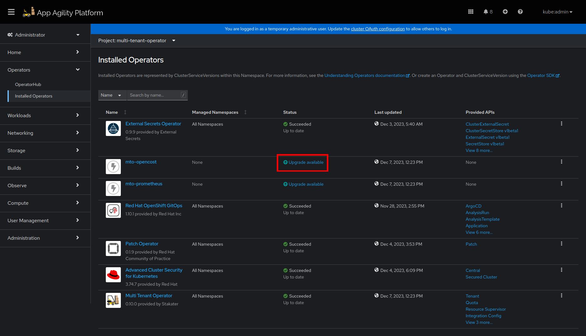
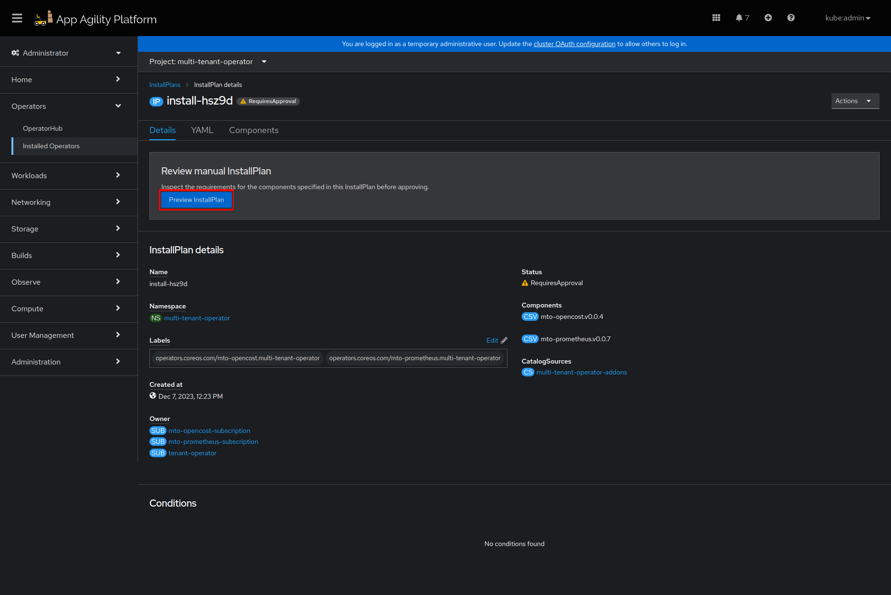
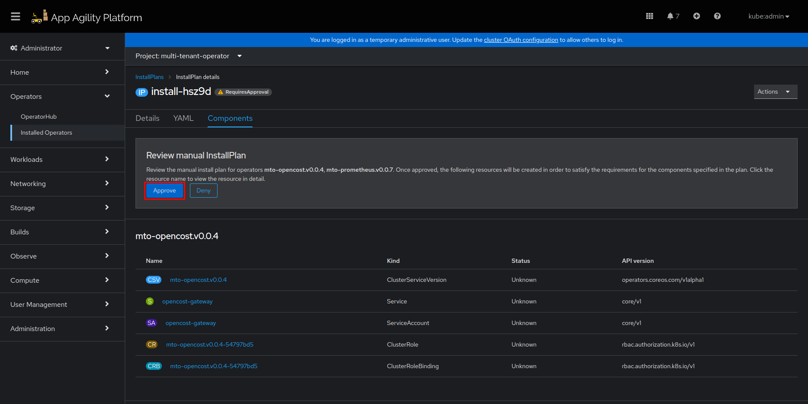

# On OpenShift

This document contains instructions on installing, uninstalling and configuring Multi Tenant Operator using OpenShift MarketPlace.

1. [OpenShift OperatorHub UI](#installing-via-operatorhub-ui)

1. [CLI/GitOps](#installing-via-cli-or-gitops)

1. [Enabling Console](#enabling-console)

1. [Uninstall](#uninstall-via-operatorhub-ui)

## Requirements

* An **OpenShift** cluster [v4.8 - v4.15]

## Installing via OperatorHub UI

* After opening OpenShift console click on `Operators`, followed by `OperatorHub` from the side menu


* Now search for `Multi Tenant Operator` and then click on `Multi Tenant Operator` tile


* Click on the `install` button


* Select `Updated channel`. Select `multi-tenant-operator` to install the operator in `multi-tenant-operator` namespace from `Installed Namespace` dropdown menu. After configuring `Update approval` click on the `install` button.

> Note: Use `stable` channel for seamless upgrades. For `Production Environment` prefer `Manual` approval and use `Automatic` for `Development Environment`


* Wait for the operator to be installed


* Once successfully installed, MTO will be ready to enforce multi-tenancy in your cluster


> Note: MTO will be installed in `multi-tenant-operator` namespace.

## Installing via CLI OR GitOps

* Create namespace `multi-tenant-operator`

```bash
oc create namespace multi-tenant-operator
namespace/multi-tenant-operator created
```

* Create an OperatorGroup YAML for MTO and apply it in `multi-tenant-operator` namespace.

```bash
oc create -f - << EOF
apiVersion: operators.coreos.com/v1
kind: OperatorGroup
metadata:
  name: tenant-operator
  namespace: multi-tenant-operator
EOF
operatorgroup.operators.coreos.com/tenant-operator created
```

* Create a subscription YAML for MTO and apply it in `multi-tenant-operator` namespace. To enable console set `.spec.config.env[].ENABLE_CONSOLE` to `true`. This will create a route resource, which can be used to access the Multi-Tenant-Operator console.

```bash
oc create -f - << EOF
apiVersion: operators.coreos.com/v1alpha1
kind: Subscription
metadata:
  name: tenant-operator
  namespace: multi-tenant-operator
spec:
  channel: stable
  installPlanApproval: Automatic
  name: tenant-operator
  source: certified-operators
  sourceNamespace: openshift-marketplace
  startingCSV: tenant-operator.v0.10.0
EOF
subscription.operators.coreos.com/tenant-operator created
```

> Note: To bring MTO via GitOps, add the above files in GitOps repository.

* After creating the `subscription` custom resource open OpenShift console and click on `Operators`, followed by `Installed Operators` from the side menu



* Wait for the installation to complete


* Once the installation is complete click on `Workloads`, followed by `Pods` from the side menu and select `multi-tenant-operator` project


* Once pods are up and running, MTO will be ready to enforce multi-tenancy in your cluster



For more details and configurations check out [IntegrationConfig](../crds-api-reference/integration-config.md).

## Enabling Console

To enable console GUI for MTO, go to `Search` -> `IntegrationConfig` -> `tenant-operator-config` and make sure the following fields are set to `true`:

```yaml
spec:
  components:
    console: true
    showback: true
```

> Note: If your `InstallPlan` approval is set to `Manual` then you will have to manually approve the `InstallPlan` for MTO console components to be installed.

### Manual Approval

* Open OpenShift console and click on `Operators`, followed by `Installed Operators` from the side menu.



* Now click on `Upgrade available` in front of `mto-opencost` or `mto-prometheus`.



* Now click on `Preview InstallPlan` on top.



* Now click on `Approve` button.



* Now the `InstallPlan` will be approved, and MTO console components will be installed.

## Uninstall via OperatorHub UI

You can uninstall MTO by following these steps:

* Decide on whether you want to retain tenant namespaces and ArgoCD AppProjects or not. If yes, please set `spec.onDelete.cleanNamespaces` to `false` for all those tenants whose namespaces you want to retain, and `spec.onDelete.cleanAppProject` to `false` for all those tenants whose AppProject you want to retain. For more details check out [onDelete](../tutorials/tenant/deleting-tenant.md)

* After making the required changes open OpenShift console and click on `Operators`, followed by `Installed Operators` from the side menu


* Now click on uninstall and confirm uninstall.


* Now the operator has been uninstalled.

* `Optional:` you can also manually remove MTO's CRDs and its resources from the cluster.

## Notes

* For details on licensing of MTO please refer [Free vs Paid Tier](./free-vs-paid-tier.md).
* For more details on how to use MTO please refer [Tenant tutorial](../tutorials/tenant/create-tenant.md).
* For details on how to extend your MTO manager ClusterRole please refer [extend-default-clusterroles](../how-to-guides/extend-default-roles.md).
