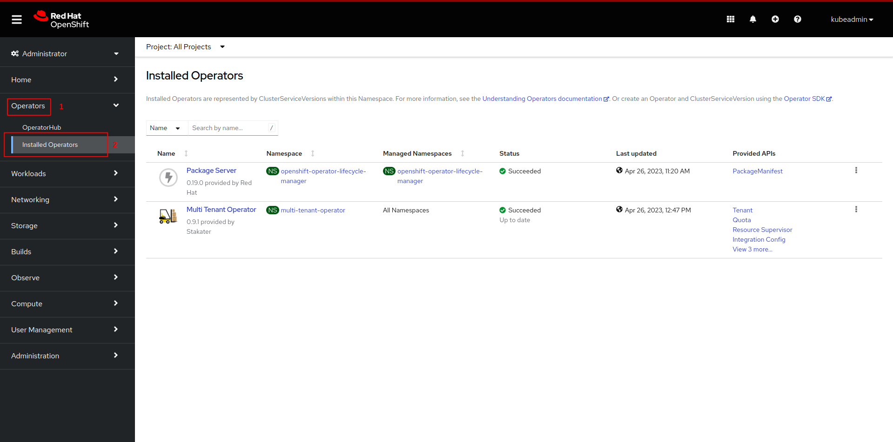

# Uninstall via OperatorHub UI on OpenShift

You can uninstall MTO by following these steps:

* Decide on whether you want to retain tenant namespaces and ArgoCD AppProjects or not.
For more details check out [onDeletePurgeNamespaces](../kubernetes-resources/tenant/how-to-guides/delete-tenant.md#configuration-for-retaining-resources)
[onDeletePurgeAppProject](../kubernetes-resources/extensions.md#configuring-argocd-integration)

* In case you have enabled console and showback, you will have to disable it first by navigating to `Search` -> `IntegrationConfig` -> `tenant-operator-config` and set `spec.components.console` and `spec.components.showback` to `false`.

* Remove IntegrationConfig CR from the cluster by navigating to `Search` -> `IntegrationConfig` -> `tenant-operator-config` and select `Delete` from actions dropdown.

* After making the required changes open OpenShift console and click on `Operators`, followed by `Installed Operators` from the side menu

* Now click on uninstall and confirm uninstall.

* Now the operator has been uninstalled.

* `Optional:` you can also manually remove MTO's CRDs and its resources from the cluster.

## Notes

* For more details on how to use MTO please refer [Tenant's tutorial](../kubernetes-resources/tenant/how-to-guides/create-tenant.md).
* For more details on how to extend your MTO manager ClusterRole please refer [extend-default-clusterroles](../kubernetes-resources/tenant/how-to-guides/extend-default-roles.md).
