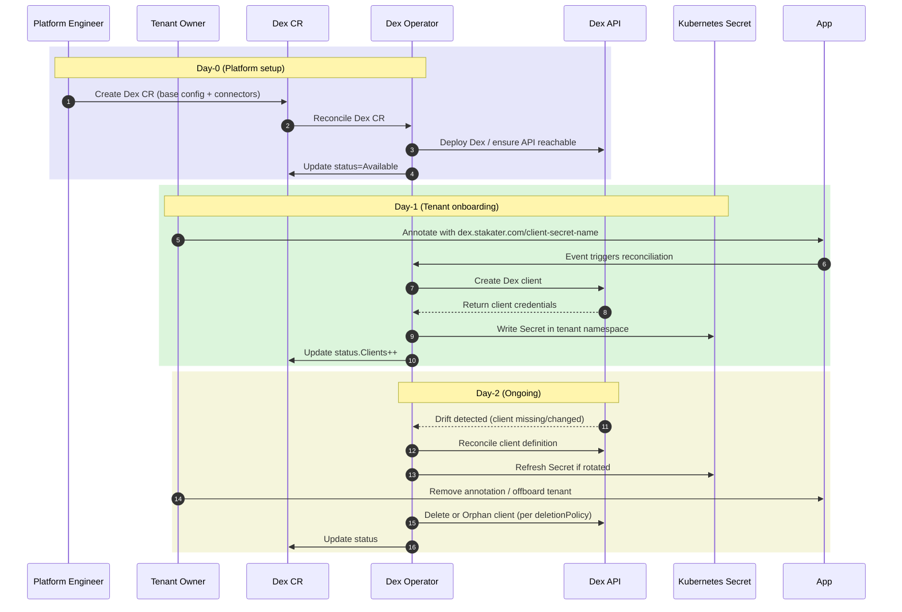
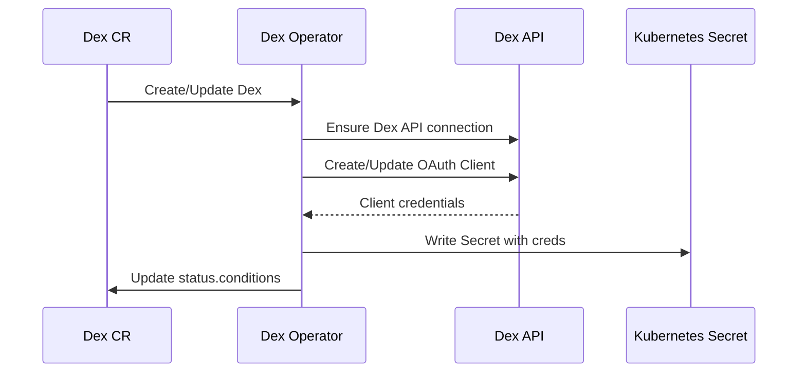

# Dex IdP Operator

> **Purpose:** A single source of truth for deploying, operating, and extending the **Dex IdP Operator (Dex)**. It serves both **platform engineers** (how to install/use) and **developers** (how it works under the hood).

---

## 1) What is it?

The **Dex IdP Operator** automates the deployment and lifecycle management of [Dex](https://dexidp.io), an **OpenID Connect (OIDC) identity provider** for Kubernetes platforms.  

It enables:

- Declarative management of **Dex clients and connectors** through Kubernetes CRDs.
- Consistent authentication setup across clusters and tenants.
- Secure provisioning of **OAuth2 client credentials** to applications (e.g., Grafana, Prometheus, ArgoCD).
- Day-0 (bootstrap), Day-1 (onboarding), and Day-2 (operations) workflows around Dex as the identity provider.

---

## 2) Audience

* **Platform engineers:** Install/configure Dex Operator, define policies, manage Dex clients, manage connectors, troubleshoot authentication issues.
* **Developers of Dex Operator:** Understand controller logic, reconciliation flows, CRDs, templates, idempotency, testing.
* **Tenant/App teams:** Consume Dex-issued credentials via annotations and secrets for their applications.

---

## 3) Architecture

```mermaid
---
config:
  layout: dagre
title: Dex Operator
---
flowchart TD

    subgraph Kubernetes Cluster
      subgraph dex-operator [dex-operator namespace]
        Operator[Dex Operator Controller]
        DexCR[Dex CR]
      end

      subgraph dex [dex-instance namespace]
        DexPod[(Dex Pod)]
        DexAPI[(Dex API)]
      end

      subgraph tenant-ns ["Tenant/App namespace(s)"]
        App[(App / Grafana / Prometheus)]
        Secret[(K8s Secret with OIDC creds)]
      end
    end

    DexCR --> Operator
    Operator --> DexAPI
    Operator --> Secret
    App --> Secret
````

---

## 4) Scope & Boundaries

* **Dex Operator manages:**

  * Dex CR lifecycle.
  * Dex clients (create/update/delete).
  * Connectors (e.g., LDAP, GitHub, OIDC upstream providers).
  * Secrets containing OAuth2 credentials (client ID, client secret).
  * Status conditions and metrics for visibility.

* **Out of scope:**

  * Managing identity provider backends themselves (LDAP servers, GitHub apps, SAML providers).
  * End-user authentication flows (Dex handles this natively).
  * Application-level RBAC/authorization (belongs to consuming app).

---

## 5) Prerequisites

* **CRDs installed**: Dex CRDs applied by the Helm chart.
* **Network/TLS**: Pods must be able to reach Dex; CA trust chain available.
* **RBAC**: Operator has cluster-scoped read-only access to `Tenants` (if used), and namespaced access to create `Secrets`.

---

## 6) Install (Platform Engineer)

### 6.1 Create namespace & install controller

```bash
kubectl create ns dex-operator || true
helm upgrade --install dex-operator \
  oci://<your-registry>/dex-operator \
  -n dex-operator \
  -f values.yaml
```

> The `values.yaml` should minimally configure operator RBAC, Dex API access, and resource requests. A reference sample is provided in the Helm chart.

### 6.2 Create Dex CR

```yaml
apiVersion: dex.stakater.com/v1alpha1
kind: Dex
metadata:
  name: dex
  namespace: dex-instance
spec:
  config: {}   # Dex config block (connectors, static clients, etc.)
  
  deployment:
    metadata: {}
    spec:
      template:
        metadata: {}
        spec: {}

  service:
    metadata:
      annotations:
        service.beta.openshift.io/serving-cert-secret-name: dex-tls
    spec:
      ports:
        - name: http
          port: 5556
          protocol: TCP
          targetPort: http

  route:
    metadata: {}
    spec:
      port:
        targetPort: http
      tls:
        termination: edge
      to:
        kind: Service
        name: dex-instance
        weight: 100
      wildcardPolicy: None

  serviceAccount:
    automountServiceAccountToken: true
    metadata:
      annotations:
        serviceaccounts.openshift.io/oauth-redirectreference.dex: '{"kind":"OAuthRedirectReference","apiVersion":"v1","reference":{"kind":"Route","name":"dex"}}'

  scaffolding:
    mode: OnAnnotation
    annotations:
      create: "dex.stakater.com/client-secret-name"

  deletionPolicy: Delete
```

---

## 7) Using it (Platform Engineer & App Teams)

### 7.1 Behavior Summary

* Creating a `Dex` CR triggers the operator to deploy and manage Dex.
* When tenants/apps are annotated with `dex.stakater.com/client-secret-name`, the operator provisions a Dex client and writes its credentials to a Kubernetes `Secret` in the tenant’s namespace:

  * The **client name** is the name of the annotated CR.
  * The **Secret name** is the value of the annotation.
* On CR or tenant deletion, Dex clients are cleaned up (unless `deletionPolicy: Orphan` is set).
* Status is continuously updated in the `Dex` CR.

---

## 8) Lifecycle

The Dex Operator supports **Day-0 (platform setup), Day-1 (tenant onboarding), and Day-2 (ongoing operations)** scenarios.  

### 8.1 Status reporting

The operator updates the `status` field of the `Dex` CR with:

* `Available`: Dex API reachable.
* `Clients`: Count of managed clients.
* `LastSyncTime`: Last successful reconciliation.
* `Conditions`: Error states, drift detection.

---

### 8.2 Day-0 / Day-1 / Day-2 Flows



---

### 8.3 Lifecycle Examples

* **Day-0 (Platform setup):**

  * Deploy Dex Operator via Helm.
  * Create `Dex` CR with base configuration and connectors.

* **Day-1 (Tenant onboarding):**

  * Tenant team annotates Grafana datasource with `dex.stakater.com/client-secret-name=grafana-creds`.
  * Dex Operator provisions Dex client and Secret automatically.

* **Day-2 (Ongoing):**

  * Operator detects drift (missing client, stale Secret).
  * Reconciliation repairs state.
  * Tenant offboarding → Operator deletes Dex client (or orphans if specified).

---

## 9) Operations & Security (Platform Engineer)

### 9.1 Access Control

* Credentials to Dex API stored in Kubernetes Secrets.
* Secret rotation is handled automatically by the operator.

### 9.2 Auditability

* Dex Operator emits Kubernetes **Events** on reconciliation actions.
* Prometheus metrics exposed for monitoring:

  * `dex_operator_reconcile_duration_seconds`
  * `dex_operator_reconcile_failures_total`
  * `dex_operator_managed_clients_total`

### 9.3 Failure Recovery

* Exponential backoff retry loops.
* Forced reconciliation via annotation:

  ```bash
  kubectl annotate dex dex dex.force-reconcile=true --overwrite
  ```

### 9.4 Security Notes

* Never enable `insecureSkipVerify` in production.
* Always reference client secrets via `SecretRef`, never inline.
* Validate connector configurations against strict patterns.
* RBAC principle of least privilege for Operator’s ServiceAccount.

### 9.5 RBAC minimum

* Cluster: get/list/watch `Tenants` (if available).
* Namespaced: get/create/update/delete `Secrets` in namespaces.
* No broad access to arbitrary namespaces.

---

## 10) Developer Guide (How it Works)

### 10.1 Controllers (Reconcilers)

* **Dex Controller:** Reconciles Dex CRs, manages Dex deployment, API connectivity, and clients.
* **Tenant/Annotation Watcher:** Detects annotated resources.
* **Secret Controller:** Ensures client secrets are projected to namespaces.

---

### 10.2 Reconciliation Flow



---

### 10.3 Watches & Scale Hygiene

* **Strict watches:**

  * Cluster-scoped watch on Tenant CRs.
  * No direct watch on all tenant namespaces.
* **Triggers:**

  * Tenant add/update/delete → reconcile Dex client.
  * Periodic sync with Dex API for drift detection.

---

### 10.4 Drift & Deletion Policy

```yaml
spec:
  deletionPolicy: Delete   # Delete client in Dex
  deletionPolicy: Orphan   # Leave client in Dex
```

* Drift detection ensures Dex API state matches CRD spec.
* Operator corrects differences on next reconciliation.

---

### 10.5 Templates (Renderers)

* Uses Go templates or structured JSON to render Dex client spec.
* Supports customization for scopes, redirect URIs, claims.

---

### 10.6 Testing Strategy

* Unit tests for reconciliation logic (mock Dex API).
* Integration tests with test Dex instance.
* e2e tests using `envtest` or kind cluster.
* Idempotency tests (apply same CR multiple times → no drift).

---

### 10.7 Performance Notes

* Scales with number of clients (linear).
* Drift sync interval configurable (default: 5m).
* Rate limits respected on Dex API calls.

---

## 11) Appendices

### 11.1 Glossary

* **Dex**: OIDC identity provider.
* **CRD**: CustomResourceDefinition.
* **Tenant**: Logical grouping of applications/users.
* **Client**: OAuth2 client registered in Dex.

---

### 11.2 Troubleshooting

* **Dex status\:Unavailable** → Check Dex API URL and credentials.
* **Secrets not created** → Verify tenant annotation matches scaffolding mode.
* **Reconcile loops failing** → Inspect Dex Operator logs for API errors.

---

### 11.3 CRD Reference

* **Dex**:

  | Field                   | Description                               |
  | ----------------------- | ----------------------------------------- |
  | `spec.config`           | Main configuration (YAML/JSON Dex config) |
  | `spec.deployment`       | Deployment parameters                     |
  | `spec.route`            | Route parameters                          |
  | `spec.service`          | Service parameters                        |
  | `spec.serviceAccount`   | ServiceAccount parameters                 |
  | `spec.scaffolding.mode` | Scaffolding mode                          |
  | `spec.deletionPolicy`   | Deletion policy                           |
  | `status.Available`      | Dex API reachable                         |
  | `status.Clients`        | Count of managed clients                  |
  | `status.LastSyncTime`   | Last successful reconciliation            |
  | `status.Conditions`     | Error states, drift detection             |

---

### 11.4 Connector Examples

#### OpenShift OIDC Connector

```yaml
spec:
  config:
    connectors:
    - type: openshift
      id: openshift
      name: OpenShift
      config:
        issuer: https://api.mycluster.example.cloud
        clientID: system:serviceaccount:dex-instance:dex
        clientSecret: ${SA_TOKEN}
        redirectURI: https://dex.example.com/callback
```

#### GitHub Connector

```yaml
spec:
  config:
    connectors:
    - type: github
      id: github
      name: GitHub
      config:
        clientID: ${GITHUB_CLIENT_ID}
        clientSecret: ${GITHUB_CLIENT_SECRET}
        orgs:
        - name: my-org
```

---

### 11.5 Sample Clients

#### Static Client for Grafana

```yaml
spec:
  config:
    staticClients:
    - id: grafana
      name: Grafana
      secret: ${GRAFANA_CLIENT_SECRET}
      redirectURIs:
      - https://grafana.example.com/login/generic_oauth
```

#### Static Client for ArgoCD

```yaml
spec:
  config:
    staticClients:
    - id: argocd
      name: ArgoCD
      secret: ${ARGOCD_CLIENT_SECRET}
      redirectURIs:
      - https://argocd.example.com/auth/callback
```

---

### 11.6 Lifecycle Examples

* **Day-0 (Platform setup):**

  * Deploy Dex Operator via Helm.
  * Create `Dex` CR with base configuration and connectors.

* **Day-1 (Tenant onboarding):**

  * Tenant team annotates Grafana datasource with `dex.stakater.com/client-secret-name=grafana-creds`.
  * Dex Operator provisions Dex client and Secret automatically.

* **Day-2 (Ongoing):**

  * Operator detects drift (missing client, stale Secret).
  * Reconciliation repairs state.
  * Tenant offboarding → Operator deletes Dex client (or orphans if specified).
