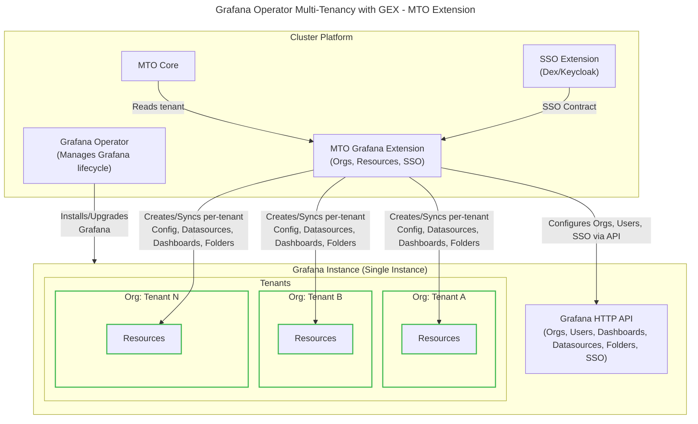
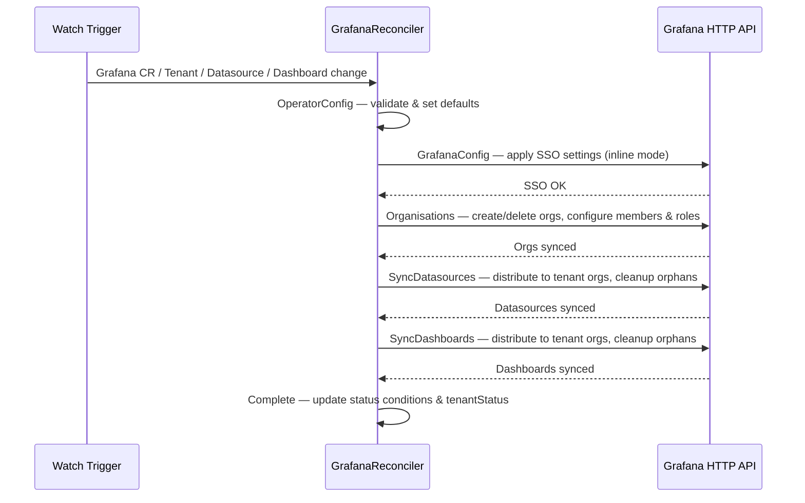
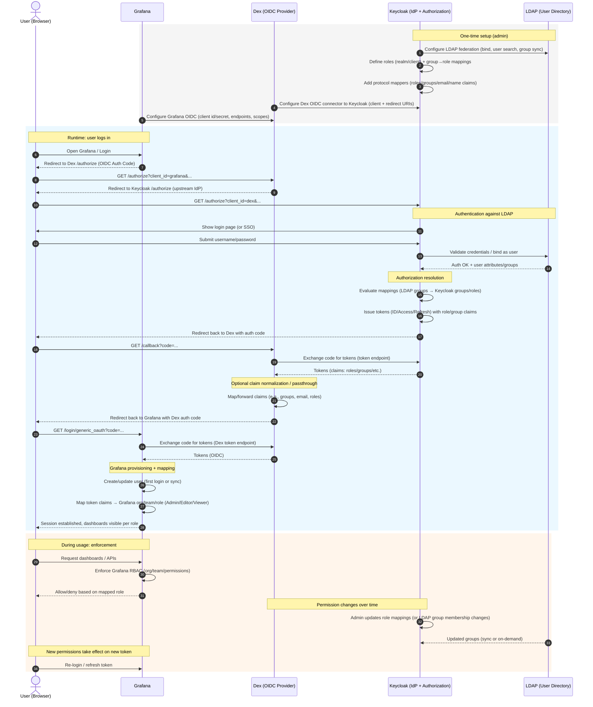

# MTO Grafana Extension

> **Purpose:** A single source of truth for deploying, operating, and extending the **MTO Grafana Extension (GEX)**. It serves both **platform engineers** (how to install/use) and **developers** (how it works under the hood).

---

## 1) What is it?

The Grafana Extension (GEX) integrates **Grafana** with **MTO Tenants** to deliver:

* Per-tenant isolation of Dashboards and Data Sources via **Grafana Organisations**. Each tenant maps to its own Grafana org.
* **OAuth** for humans (via OAuth, e.g., Dex/Keycloak/Entra) and basic auth for API access for machines.

GEX operates against a **single Grafana instance** and scales tenants as orgs inside it.  
It **does not install or operate Grafana itself** — it only wires Grafana to your MTO tenants via the Grafana HTTP API.

---

## 2) Audience

* **Platform engineers:** Install/configure, define policies, enable tenants/app teams, troubleshoot.
* **Developers of GEX:** Understand controllers, Day-0/1/2 flows, CRDs, idempotency and tests.
* **Tenant/App teams:** Annotate dashboards/datasources for tenant-specific provisioning.

---

## 3) Architecture


```mermaid
---
config:
  layout: dagre
title: Grafana Operator Multi-Tenancy with GEX - MTO Extension
---
flowchart TD
  subgraph ClusterPlatform["Cluster Platform"]
    MTO["MTO Core"]
    SSO["SSO Extension<br>(Dex/Keycloak)"]
    GRO["Grafana Operator<br>(Manages Grafana lifecycle)"]
    GEX["MTO Grafana Extension<br>(Orgs, Resources, SSO)"]
  end

  subgraph GRAFANA["Grafana Instance (Single Instance)"]
    subgraph T1["Org: Tenant A"]
        ResA["Resources"]
    end
    subgraph T2["Org: Tenant B"]
        ResB["Resources"]
    end
    subgraph Tn["Org: Tenant N"]
        ResN["Resources"]
    end
    subgraph Tenants["Tenants"]
      direction LR
          T1
          T2
          Tn
    end
    API["Grafana HTTP API<br>(Orgs, Users, Dashboards, Datasources, Folders, SSO)"]
  end

  SSO -- SSO Contract --> GEX
  MTO -- Reads tenant --> GEX
  GRO -- Installs/Upgrades<br>Grafana --> GRAFANA
  GEX -- "Creates/Syncs per-tenant<br>Config, Datasources, Dashboards, Folders" --> ResA & ResB & ResN
  GEX -- Configures Orgs, Users, SSO via API --> API

  T1:::isolation
  T2:::isolation
  Tn:::isolation
  ResA:::isolation
  ResB:::isolation
  ResN:::isolation
  classDef isolation color:#333333fill:#f6ffe7,stroke:#3FB950,stroke-width:2px
```

---

## 4) Scope & Boundaries

* **GEX manages:**

    * creation of organisation per tenant
    * organisation members
    * configmap in Kubernetes
    * configuration of orgs, users, SSO, datasources, dashboards, and folders via the Grafana HTTP API
* **SSO extension manages:**

    * Your IdP (Dex/Keycloak/Entra) & publishes an SSO **contract** (issuer, groupsClaim, `grafana` clientID/secret, group patterns) via CR **status** or a labeled **Secret**.
* **Out of scope:**

    * Operating Grafana (resources, storage, backup/restore, version upgrades).
    * Grafana resources (plugins, dashboards, etc...) that are not provisioned through GEX i.e. installed directly into Grafana by user with [correct permissions][1]

> GEX configures Grafana via the HTTP API. It does not modify Grafana Operator CRDs, avoiding installation lifecycle conflicts.

---

## 5) Prerequisites

1. **Grafana** reachable via service url (`http://grafana.telemetry.svc.cluster.local`).
1. **Grafana** must be in **[multi-org mode](#1111-what-is-multi-org-mode-in-grafana)** and allow API admin access.
1. **SSO extension** installed and configured; publishes **issuer**, **groupsClaim**, and `grafana` client.
1. **Network/TLS**: Pods allowed to egress to Grafana; trust chain available.

---

## 6) Install (Platform Engineer)

### 6.1 Create namespace & install controller

```bash
kubectl create ns mto-system || true
helm upgrade --install mto-grafana-extension \
  oci://<your-registry>/mto-grafana-extension \
  -n mto-system \
  -f values.yaml
```

> The `values.yaml` should minimally configure operator RBAC and resource requests. A reference sample is provided in the Helm chart.

### 6.2 Create GrafanaExtension CR

```yaml
# GrafanaExtension: wires your MTO tenants to an existing Grafana cluster.
# - Ensures Grafana SSO auth for users.
# - Sets up per-tenant isolated organisations with roles.
# - Sets up pre-configured resources (Datasources, Dashboard, Folders,...) per-tenant.
apiVersion: telemetry.tenantoperator.stakater.com/v1alpha1
kind: Grafana
metadata:
  name: cluster-default                 # One per grafana instance (typical). Keep in mto-system.
  namespace: mto-system

spec:
  server:
    name: grafana-instance
    namespace: telemetry

  sso:
    mode: inline
    idp:
      issuer: https://idp.example.com
      clientId: grafana
      clientSecret: abc123
      redirectUri: https://grafana.external.url/login/generic_oauth
      scope: openid email profile groups offline_access
      idTokenAttributeName: id_token
      roleAttributeName: groups
      orgAttributeName: groups
      emailAttributePath: email
      loginAttributePath: preferred_username
      nameAttributePath: name
      emailAttributeName: email:primary
      authUrl: https://idp.example.com/dex/auth
      tokenUrl: https://idp.example.com/dex/token
      apiUrl: https://idp.example.com/dex/api

  tenantRoleMapping:
    admin:
      grafanaRole: grafanaadmin
      pattern: clusteradmin || cluster-admin
    owner:
      grafanaRole: admin
      pattern: tenant-{{ .Tenant }}-{{ .Role }}s
    editor:
      grafanaRole: editor
      pattern: tenant-{{ .Tenant }}-{{ .Role }}s
    viewer:
      grafanaRole: viewer
      pattern: tenant-{{ .Tenant }}-{{ .Role }}s
    tieBreakStrategy: highest 
    fallback: deny

  scaffolding:
    mode: OnAnnotation
    annotations:
      enable: "mto.grafana/disabled"
      tenant: "mto.grafana/tenant"

  deletionPolicy: Delete
```

> GEX uses the Grafana HTTP API to manage configuration directly in the Grafana database.
> See [Appendix 11.5](#115-sso-modes) for how SSO modes map to this API.

---

## 7) Using it (Platform Engineer & App Teams)

By default, **all GrafanaDashboards and GrafanaDatasources are provisioned to all tenants**.
Annotations are only needed to explicitly **disable** or **restrict** provisioning.

---

### 7.1 Disable a Datasource

```yaml
apiVersion: grafana.integreatly.org/v1beta1
kind: GrafanaDatasource
metadata:
  ...
  annotations:
    mto.grafana/disabled: "true"
```

---

### 7.2 Restrict a Dashboard to certain tenants

```yaml
apiVersion: grafana.integreatly.org/v1beta1
kind: GrafanaDashboard
metadata:
  ...
  annotations:
    mto.grafana/tenant: "tenant-a,tenant-b"
```

---

### 7.3 Behavior Summary

By default, **all dashboards and datasources are provisioned to all tenants**.
Annotations override this behavior.

| Annotation                       | Applies To           | Result                                                                                           |
| -------------------------------- | -------------------- | ------------------------------------------------------------------------------------------------ |
| *(none)*                         | Dashboard/Datasource | Provisioned to **all tenants**                                                                   |
| `mto.grafana/disabled: "true"`   | Dashboard/Datasource | Provisioned to **no tenants**                                                                    |
| `mto.grafana/tenant: "tenant-x"` | Dashboard/Datasource | Provisioned **only** to the listed tenant(s). Multiple tenants allowed via comma-separated list. |
| Both `disabled` + `tenant` set   | Dashboard/Datasource | `disabled` takes precedence → provisioned to **no tenants**                                      |

> Namespaces without a Tenant CR are ignored. Resources in such namespaces will not be provisioned.

---

## 8) Lifecycle

### 8.1 Status reporting

The operator continuously updates the `status` field of the `GrafanaExtension` CR with cluster-wide and tenant-specific information.

#### 8.1.1 Status in GrafanaExtension

```yaml
status:
  observedGeneration: 2
  phase: Ready
  conditions:
    - type: OperatorConfig
      status: "True"
      reason: Success
      message: OperatorConfig: Success
    - type: GrafanaConfig
      status: "True"
      reason: Success
      message: GrafanaConfig: Success
    - type: Organisations
      status: "True"
      reason: Success
      message: Organisations: Success
    - type: SyncDatasources
      status: "True"
      reason: Success
      message: SyncDatasources: Success
    - type: SyncDashboards
      status: "True"
      reason: Success
      message: SyncDashboards: Success
    - type: Ready
      status: "True"
      reason: Success
      message: All dependencies healthy.
      lastTransitionTime: "2025-09-02T20:00:00Z"
  tenantStatus:
    totalTenants: 3
    reconciled: 2
    failed: 1
    details:
      - tenant: "tenant-a"
        namespace: "tenant-a-apps"
        lastSyncTime: "2025-09-02T19:59:30Z"
      - tenant: "tenant-b"
        namespace: "tenant-b-apps"
        lastSyncTime: "2025-09-02T19:59:10Z"
        error: "failed to upsert datasource: permission denied"
```

---

## 9) Operations & Security (Platform Engineer)

### 9.1 Access Control

* GEX connects to Grafana using **credentials** created by the Grafana Operator.
* Credentials are stored in Kubernetes Secrets.
* When credentials rotate, GEX re-establishes connection automatically.

### 9.2 Auditability

* GEX emits Kubernetes **Events** on reconciliation.
* Prometheus metrics

    * **Failure counters**
        * `grafana_extension_reconciliation_errors_total`
        * `grafana_extension_api_call_errors_total`
    * **Other operational metrics**
        * `grafana_extension_reconciliations_total`
        * `grafana_extension_reconciliation_duration_seconds`
        * `grafana_extension_api_calls_total`
        * `grafana_extension_api_call_duration_seconds`
        * `grafana_extension_tenants_managed`
        * `grafana_extension_organizations_managed`
        * `grafana_extension_dashboards_managed`
        * `grafana_extension_datasources_managed`
        * `grafana_extension_grafana_health_status`
        * `grafana_extension_last_successful_sync_timestamp`

### 9.3 Failure Recovery

* Reconcile loops use standard **controller-runtime requeue** on transient errors.
* The operator retries automatically on the next reconciliation cycle.

### 9.4 Security Notes

* Never enable `insecureSkipVerify` in production.
* Always reference OAuth client secrets via SecretRef, never inline.
* Enforce strict group patterns to prevent cross-tenant access.

### 9.5 RBAC minimum

* Read (get/list/watch) Tenant (cluster-scoped).
* Read (get/list/watch) GrafanaDashboard, GrafanaDatasource in `spec.server.namespace`.
* Read Secrets for Grafana admin/API credentials in the Grafana namespace.
* No access to arbitrary tenant namespaces.

---

## 10) Developer Guide (How it Works)

### 10.1 Controller & Reconciliation Stages

GEX uses a **single controller** (`GrafanaReconciler`) that watches the `Grafana` CR as its primary resource. On each reconciliation it executes **six sequential stages**, each implemented as a sub-reconciler:

| # | Stage | Responsibility |
|---|-------|---------------|
| 1 | **OperatorConfig** | Validates spec, sets defaults (scaffolding mode, deletion policy, role mapping patterns) |
| 2 | **GrafanaConfig** | Applies SSO settings to Grafana via HTTP API (inline mode); secret mode is read-only |
| 3 | **Organisations** | Creates/deletes Grafana organisations to match Tenant CRs; configures org members and role mappings |
| 4 | **SyncDatasources** | Distributes `GrafanaDatasource` resources to tenant orgs with tenant-scoped UIDs and `X-Scope-OrgID` headers; cleans up orphans |
| 5 | **SyncDashboards** | Distributes `GrafanaDashboard` resources to tenant orgs in managed folders; cleans up orphans |
| 6 | **Complete** | Placeholder for finishing touches |

Each stage updates a corresponding `status.condition`. If a stage fails, the operator stops and retries on the next reconciliation cycle.

**Watch triggers:**

* `Grafana` CR — primary resource (ignores status-only updates)
* `Tenant` — cluster-scoped; any Tenant change enqueues all `Grafana` CRs
* `GrafanaDatasource` — fires when a datasource becomes `DatasourceSynchronized=True` or its spec changes while already synchronized
* `GrafanaDashboard` — fires on spec changes; filtered to the namespace matching `spec.server.namespace`

---

### 10.2 Reconciliation Flow (sequence diagram)


```mermaid
sequenceDiagram
    participant Watch as Watch Trigger
    participant GEX as GrafanaReconciler
    participant API as Grafana HTTP API

    Watch->>GEX: Grafana CR / Tenant / Datasource / Dashboard change
    GEX->>GEX: OperatorConfig — validate & set defaults
    GEX->>API: GrafanaConfig — apply SSO settings (inline mode)
    API-->>GEX: SSO OK
    GEX->>API: Organisations — create/delete orgs, configure members & roles
    API-->>GEX: Orgs synced
    GEX->>API: SyncDatasources — distribute to tenant orgs, cleanup orphans
    API-->>GEX: Datasources synced
    GEX->>API: SyncDashboards — distribute to tenant orgs, cleanup orphans
    API-->>GEX: Dashboards synced
    GEX->>GEX: Complete — update status conditions & tenantStatus
```

> Each stage sets a `status.condition`. On failure the operator stops at the failing stage, updates the CR status, and retries on the next reconciliation cycle.

---

### 10.3 Watch Model

* **`Grafana` CR** — primary resource; status-only updates (no generation change) are ignored.
* **`Tenant`** — cluster-scoped watch; any Tenant change enqueues all `Grafana` CRs.
* **`GrafanaDatasource`** — fires when `DatasourceSynchronized` condition becomes `True`, or when the spec changes on an already-synchronized datasource. Filtered to datasources whose namespace matches `spec.server.namespace`.
* **`GrafanaDashboard`** — fires on spec changes (generation bump); filtered to the namespace matching `spec.server.namespace`.

---

### 10.4 Templates (Renderers)

* Role mapping patterns support Go templating with `{{ .Tenant }}` and `{{ .Role }}` substitution.
    * Example: `tenant-{{ .Tenant }}-{{ .Role }}s` renders to `tenant-acme-owners` for tenant `acme` with role `owner`.
* Datasource UIDs are made tenant-scoped: `{baseUID}-{tenantName}` (max 40 characters).
* Loki datasource URLs are rewritten per tenant for path-based isolation.
* `X-Scope-OrgID` headers are injected per tenant org for multi-tenant backends (Loki, Mimir, Tempo).

---

### 10.5 Testing Strategy

* **Unit tests:** per-reconciler tests for OperatorConfig, GrafanaConfig, Organisations, Datasources, Dashboards, scaffolding annotation filtering, and status computation.
* **E2E tests:** run against a real Grafana instance — cover tenant org lifecycle, datasource/dashboard reconciliation, scaffolding annotations, and SSO settings with Dex login flow.

---

### 10.6 Performance Notes

* GrafanaDashboard and GrafanaDatasource watches are filtered to `spec.server.namespace` to limit informer scope.
* Dashboard search and orphan cleanup use pagination (limit 1000 per page).
* Expose metrics for reconcile duration and API latency (`grafana_extension_reconciliation_duration_seconds`, `grafana_extension_api_call_duration_seconds`).

---

## 11) Appendices

### 11.1 Glossary

* **Org** → Grafana organisation = tenant isolation boundary.
* **SSO contract** → Published by SSO extension, consumed by GEX.
* **Tenant CR** → Defines tenants in MTO.
* **SSO** → Single Sign-On = user only sign in once
* **DRY** → Don't Repeat Yourself
* **BYO** → Bring Your Own
* **IdP** → Identity Provider

### 11.1.1 What is **multi-org mode** in Grafana?

Grafana has a concept of **organisations** — logical partitions inside a single Grafana instance.

Each org has its own users, dashboards, folders, and datasources.

* Single-org setup: Grafana is used as one shared org. (This is what you get by default in most Helm charts).
* Multi-org setup: You allow multiple orgs to exist and be managed. GEX relies on this, since it provisions one org per tenant.

#### Requirements for multi-org

```ini
[users]
auto_assign_org = true
allow_org_create = true

[auth.basic]
enabled = true   # required for operator to talk to Grafana API

[auth.anonymous]
enabled = false  # must be disabled; isolation breaks otherwise
```

**Other implied requirements**:

* **Admin user available** with rights to create orgs and users
* **Root URL configured** in `[server]` for OAuth callbacks
* **No restrictive licensing** (GEX uses only community features)

---

### 11.2 Troubleshooting

* `401 Unauthorized`: Check Grafana admin secret.
* `SSOConfigured: False`: Check IdP contract in SSO extension.
* Dashboards not showing: Verify tenant annotation and org membership.

---

### 11.3 CRD Reference

* `GrafanaExtension` schema (fields documented above).

| Field  | Description |
| ------ | ----------- |
| spec.server.name | Name of the Grafana instance |
| spec.server.namespace | Namespace that Grafana instance lives in. |
| spec.sso.mode | Selected mode on how to configure SSO. See [Appendix 11.5](#115-sso-modes) |
| spec.tenantRoleMapping.[admin\|owner\|editor\|viewer] | The configuration of MTO-roles to Grafana Roles |
| spec.tenantRoleMapping.[admin\|owner\|editor\|viewer].grafanaRole | Which Grafana Role to map to |
| spec.tenantRoleMapping.[admin\|owner\|editor\|viewer].pattern | The partial string of the group claim to match to. Separate values with \|\| (OR condition)  |
| spec.tenantRoleMapping.tieBreakStrategy | If a user matches against multiple roles, which role should be assigned. Possible values: `highest` (default) - the role with the highest permission is assigned. `lowest` - the role with the lowest permission is assigned. `deny` - user is denied any roles, i.e. abort. |
| spec.tenantRoleMapping.fallback | Default role when there is no match. Possible values: `deny` (default) - deny access. `allow` - user is granted the default role. `<rolename>` - user is assigned `<rolename>` rights. |
| spec.scaffolding | Allows GEX to detect other CRs based on the annotations |
| spec.scaffolding.mode | `OnAnnotation` (default) - Scaffolding is triggered or configured based on the presence and values of specific annotations. |
| spec.scaffolding.annotations | Annotations to look for |
| spec.deletionPolicy | `Delete` (default) or `Orphan`. Controls what happens to Grafana organisations when a Tenant CR is removed. |

---

### 11.4 Lifecycle Examples (Day-0 / Day-1 story)

* **Day-0 (Platform setup):**

    * Platform team installs Grafana + Grafana Operator.
    * Deploys GEX (`GrafanaExtension` CR).
    * Connects to SSO Extension contract.
    * GEX connects to Grafana via HTTP API.

* **Day-1 (Tenant onboarding):**

    * App team creates `Tenant` CR.
    * GEX auto-creates Grafana org.
    * Default dashboards + datasources provisioned.
    * Users login via IdP → assigned roles automatically.

* **Day-2 (Ongoing):**

    * App team adds annotated dashboards in their namespace.
    * GEX syncs them into the right org.
    * Rotation of IdP secrets handled automatically via SSO Extension.

---

### 11.5 SSO modes

| Mode | Where config comes from | Use case / Best for |
| ---- | ----------------------- | ------------------- |
| secret | External Secret | BYO IdP config, no SSOExtension |
| inline | Inline in CR (`idp:` block) | Simple setups, GitOps friendly (careful with secrets) |
| disabled | None | Dev/test, legacy |

> Regardless of how GEX obtains SSO config, it always applies it via the Grafana HTTP API.
> This ensures dynamic updates without requiring Grafana restarts or CR modifications.
>
> **Workaround**
> If your IdP doesn't supply `groups` and/or `roles`, or you want to only use username to map users to organisations, you may set `orgAttributeName` to the same value as `loginAttributePath`.
> The extension will then use the value as a single-user group/role then.

* **mode = secret**

  ```yaml
    sso:
      mode: secret
      secretRef:
        name: grafana-sso-credentials
  ```

  Expected Secret format:

  ```yaml
  apiVersion: v1
  kind: Secret
  metadata:
    name: grafana-sso-credentials
    namespace: telemetry
  stringData:
    issuer: https://idp.example.com
    clientId: grafana
    clientSecret: supersecret
    redirectUri: https://grafana.external.url/login/generic_oauth

    scope: openid email profile groups offline_access # (optional, default: openid email profile groups offline_access)
    idTokenAttributeName: id_token # (optional, default: id_token)
    roleAttributeName: groups # (optional, default: groups, usually either `groups` or `roles`)
    emailAttributePath: email # (optional, default: email)
    loginAttributePath: preferred_username # (optional, default: preferred_username)
    nameAttributePath: name # (optional, default: name)
    emailAttributeName: "email:primary" # (optional, default: email:primary)
    authUrl: https://idp.example.com/dex/auth # (optional, default: {{ issuer }}/dex/auth)
    tokenUrl: https://idp.example.com/dex/token # (optional, default: {{ issuer }}/dex/token)
    apiUrl: https://idp.example.com/dex/api # (optional, default: {{ issuer }}/dex/api)
  ```

* **mode = inline**

  ```yaml
    sso:
      mode: inline
      idp:
        issuer: https://idp.example.com
        clientId: grafana
        clientSecret: abc123
        redirectUri: https://grafana.external.url/login/generic_oauth
        scope: openid email profile groups offline_access # (optional, default: openid email profile groups offline_access)
        idTokenAttributeName: id_token # (optional, default: id_token)
        roleAttributeName: groups # (optional, default: groups, usually either `groups` or `roles`)
        orgAttributeName: groups # (optional, default: groups)
        emailAttributePath: email # (optional, default: email)
        loginAttributePath: preferred_username # (optional, default: preferred_username)
        nameAttributePath: name # (optional, default: name)
        emailAttributeName: "email:primary" # (optional, default: email:primary)
        authUrl: https://idp.example.com/dex/auth # (optional, default: {{ issuer }}/dex/auth)
        tokenUrl: https://idp.example.com/dex/token # (optional, default: {{ issuer }}/dex/token)
        apiUrl: https://idp.example.com/dex/api # (optional, default: {{ issuer }}/dex/api)
  ```

* **mode = disabled**
  
  Skips SSO configuration entirely.
  
  Grafana will continue using its existing auth config.

  This is useful only for development or legacy clusters.

  ```yaml
    sso:
      mode: disabled
  ```

---

## Authentication and Authorization Flow


```mermaid
sequenceDiagram
  autonumber
  actor U as User (Browser)
  participant G as Grafana
  participant D as Dex (OIDC Provider)
  participant K as Keycloak (IdP + Authorization)
  participant L as LDAP (User Directory)

  rect rgb(245,245,245)
    note over K,L: One-time setup (admin)
    K->>L: Configure LDAP federation (bind, user search, group sync)
    K->>K: Define roles (realm/client) + group→role mappings
    K->>K: Add protocol mappers (roles/groups/email/name claims)
    D->>K: Configure Dex OIDC connector to Keycloak (client + redirect URIs)
    G->>D: Configure Grafana OIDC (client id/secret, endpoints, scopes)
  end

  rect rgb(235,248,255)
    note over U,G: Runtime: user logs in
    U->>G: Open Grafana / Login
    G-->>U: Redirect to Dex /authorize (OIDC Auth Code)
    U->>D: GET /authorize?client_id=grafana&...
    D-->>U: Redirect to Keycloak /authorize (upstream IdP)
    U->>K: GET /authorize?client_id=dex&...

    note over K,L: Authentication against LDAP
    K->>U: Show login page (or SSO)
    U->>K: Submit username/password
    K->>L: Validate credentials / bind as user
    L-->>K: Auth OK + user attributes/groups

    note over K: Authorization resolution
    K->>K: Evaluate mappings (LDAP groups → Keycloak groups/roles)
    K->>K: Issue tokens (ID/Access/Refresh) with role/group claims
    K-->>U: Redirect back to Dex with auth code
    U->>D: GET /callback?code=...
    D->>K: Exchange code for tokens (token endpoint)
    K-->>D: Tokens (claims: roles/groups/etc.)

    note over D: Optional claim normalization / passthrough
    D->>D: Map/forward claims (e.g., groups, email, roles)
    D-->>U: Redirect back to Grafana with Dex auth code
    U->>G: GET /login/generic_oauth?code=...
    G->>D: Exchange code for tokens (Dex token endpoint)
    D-->>G: Tokens (OIDC)

    note over G: Grafana provisioning + mapping
    G->>G: Create/update user (first login or sync)
    G->>G: Map token claims → Grafana org/team/role (Admin/Editor/Viewer)
    G-->>U: Session established, dashboards visible per role
  end

  rect rgb(255,245,235)
    note over U,G: During usage: enforcement
    U->>G: Request dashboards / APIs
    G->>G: Enforce Grafana RBAC (org/team/permissions)
    G-->>U: Allow/deny based on mapped role

    note over K,D: Permission changes over time
    K->>K: Admin updates role mappings (or LDAP group membership changes)
    L-->>K: Updated groups (sync or on-demand)
    note over U,G: New permissions take effect on new token
    U->>G: Re-login / refresh token
  end
```

## References

[1]: https://grafana.com/docs/grafana/latest/administration/roles-and-permissions/#organization-roles "Roles and Permissions"
