# Grafana

[Grafana](https://grafana.com/) is an observability platform for dashboards, metrics, logs and traces. It already has a tenancy boundary built in — the **organisation** — and a user only ever sees the dashboards and data sources of the organisation they are currently in.

With the Multi-Tenant Operator (MTO), cluster administrators can configure multi-tenancy within their cluster. The Grafana integration extends that multi-tenancy into Grafana: one shared Grafana serves every tenant, each team sees only its own dashboards, metrics, logs and traces, and dashboards are written once for the cluster rather than once per team.

Note that Grafana integration in MTO is optional, and ships as a separate extension.

## What it saves you

A Grafana organisation is a hard boundary — nothing crosses it. Every tenant therefore needs its own copy of everything, which by hand means repeating five steps per tenant, then repeating them again whenever a dashboard changes, a data source is added, or a tenant comes or goes.

| Per tenant | By hand | With the extension |
|:---|:---|:---|
| Organisation | Create it | Derived from the `Tenant` |
| Data sources | Re-create each one with a unique UID and the tenant's `X-Scope-OrgID` — plus a tenant URL path for Loki | Derived, one copy per organisation |
| Dashboards | Import each one, then repoint every panel, target and variable at that organisation's own data source | Derived, references rewritten |
| Folders | Rebuild the tree | Derived on first use |
| Access | Add an `org_mapping` entry per identity-provider group | Derived from the tenant name |

It multiplies: ten tenants with eight dashboards and three data sources each is a few hundred objects to create and then keep correct. Derived instead, it is eleven definitions — and the eleventh tenant costs nothing, arriving complete on the next reconcile.

Two properties follow that hand-maintenance struggles to hold:

- **Isolation is structural, not conventional.** Visibility is bounded by Grafana's own organisation boundary, and every data source copy carries its tenant's `X-Scope-OrgID`, so queries through it return that tenant's partition and no other.
- **One Grafana serves everyone.** An instance per tenant — each with its own upgrades, dashboards, alerting and cost — stops being necessary.

For application teams the work disappears rather than moves. A developer commits one dashboard definition, optionally naming the tenants it is for, and it lands in those organisations with its queries already pointed at the right tenant's data — no organisation switching, no UID edits. Access follows identity too: add someone to a team's group and their Grafana role is waiting at next sign-in.

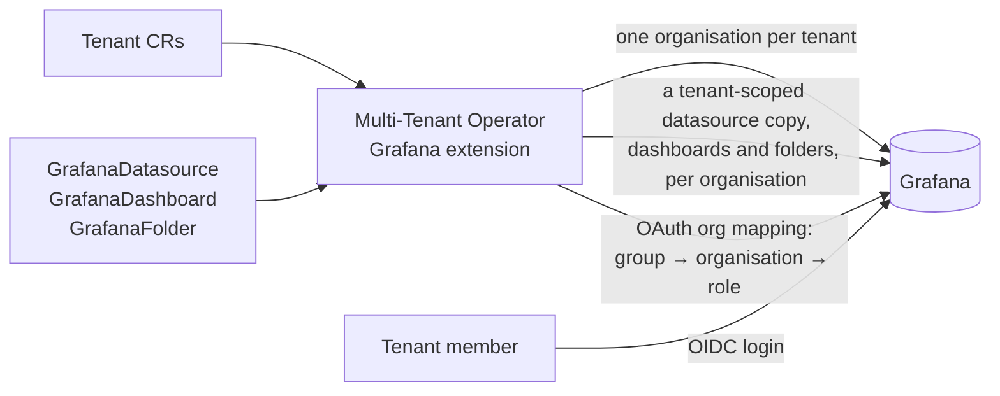
```mermaid
flowchart LR
  T["Tenant CRs"] --> M["Multi-Tenant Operator<br/>Grafana extension"]
  C["GrafanaDatasource<br/>GrafanaDashboard<br/>GrafanaFolder"] --> M
  M -->|"one organisation per tenant"| G[("Grafana")]
  M -->|"a tenant-scoped datasource copy,<br/>dashboards and folders, per organisation"| G
  M -->|"OAuth org mapping:<br/>group → organisation → role"| G
  U["Tenant member"] -->|"OIDC login"| G
```

*Per tenant, the only thing written by hand is the `Tenant` resource. Dashboards and data sources are written once for the cluster, not once per tenant; everything inside Grafana is derived.*

## What each tenant gets

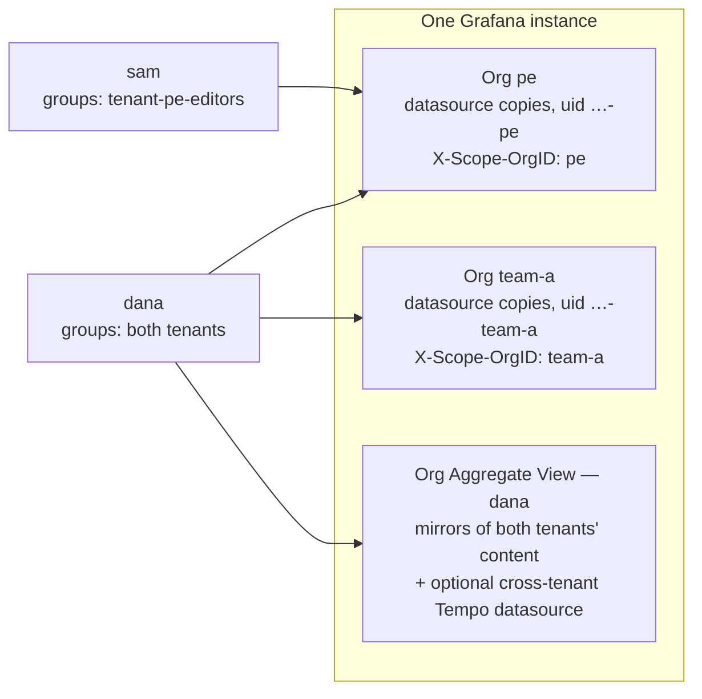
```mermaid
flowchart LR
  SAM["sam<br/>groups: tenant-pe-editors"]
  DANA["dana<br/>groups: both tenants"]
  subgraph GI["One Grafana instance"]
    OB["Org pe<br/>datasource copies, uid …-pe<br/>X-Scope-OrgID: pe"]
    OA["Org team-a<br/>datasource copies, uid …-team-a<br/>X-Scope-OrgID: team-a"]
    AV["Org Aggregate View — dana<br/>mirrors of both tenants' content<br/>+ optional cross-tenant Tempo datasource"]
  end
  SAM --> OB
  DANA --> OB
  DANA --> OA
  DANA --> AV
```

*One instance, one organisation per tenant, one data source copy per organisation. `sam` belongs to a single tenant and can reach only its organisation. `dana` belongs to both, so they also get an aggregated view — holding those two tenants and nothing else.*

| Capability | Default | What it is |
|:---|:---|:---|
| A private organisation | on | A Grafana organisation named exactly after the tenant. Members of one tenant cannot see another tenant's dashboards or data sources. |
| Tenant-scoped data sources | on | One copy of each data source per organisation, with UID `<base-uid>-<tenant>` and `X-Scope-OrgID` set to the tenant name, so a single definition returns only that tenant's data. |
| Dashboards with rewritten queries | on | Each dashboard's data source references — in panels, targets and template variables — are repointed at that organisation's own data source copy. |
| Folders | on | `GrafanaFolder` titles are replicated into an organisation as dashboards referencing them are synced. A dashboard with no folder lands in a per-organisation folder named `Default`. |
| Human login | on | Tenant members sign in through your OIDC provider, and their identity-provider group membership decides which organisations they see and with what role. |
| Per-tenant targeting | on | Annotations on a data source or dashboard choose which tenants receive it. Without annotations it goes to every tenant. |
| Aggregated views | off | One extra organisation per user, mirroring the content of every tenant they belong to, so multi-tenant users stop switching organisations. |
| Cross-tenant traces | off | A single union Tempo data source inside the aggregated view, so one distributed trace can be followed across tenants. |
| Shared user dashboards | off | Dashboards a user builds inside their own aggregated view are shared with colleagues whose tenant access covers the same data. |

MTO keeps all of it in step with the cluster:

- an organisation is created when a tenant appears, and deleted when the tenant is removed;
- data source copies are re-asserted on every reconcile, so an edit made in the Grafana UI is undone within one cycle;
- a dashboard or data source is removed from every organisation when its definition is deleted;
- the OAuth org mapping is rewritten whenever the set of tenants changes.

### On a running cluster

Every screenshot on this page comes from one demo instance: two tenants, `pe` and `team-a`, and `dana`, a member of both. The YAML examples further down use `bluesky` and `arsenal` instead.

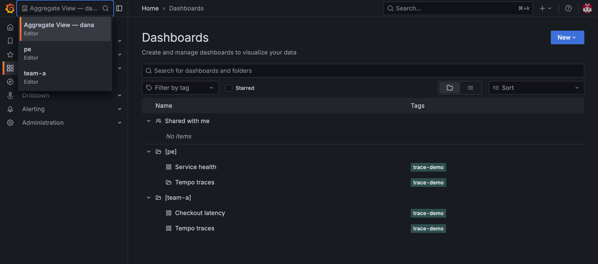

*`dana` belongs to both tenants, so the switcher offers `pe`, `team-a` and their own aggregated view — and nothing else. They are Editor in both tenants, and Editor in the aggregated view too, that being the lower of the two.*

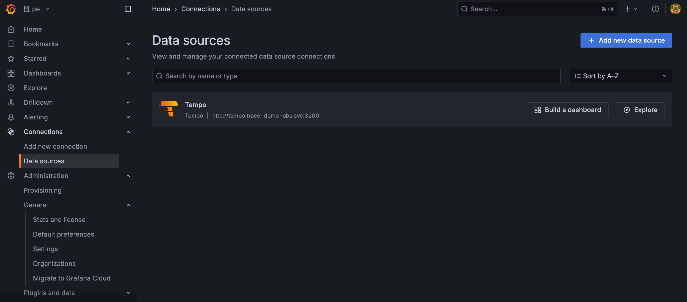

*Inside `pe`, one data source, still named plainly `Tempo`. The tenant lives in its UID — `tempo-pe` — and in the `X-Scope-OrgID` header, not in anything the team reads on screen.*

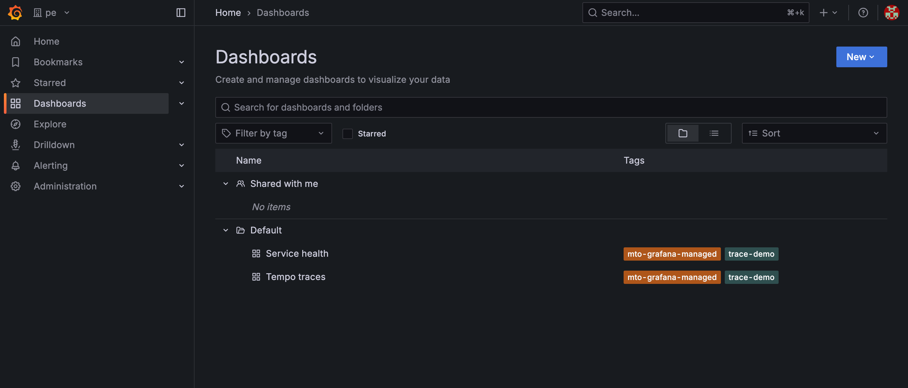

*`pe` holds only `pe`'s dashboards; a member here has no route to `team-a`'s. Neither dashboard declared a folder, so both landed in the per-organisation `Default` folder. The `mto-grafana-managed` tag is what cleanup keys on — dashboards made by hand never carry it, so the operator never deletes them.*

## How tenant roles map to Grafana access

Access is decided by the identity-provider groups in the user's token. For each tenant, the extension renders a group name from a pattern and writes an OAuth org-mapping entry pointing that group at the tenant's organisation with a Grafana role.

| Tenant role | Default group pattern | Grafana role | Where it applies |
|:---|:---|:---|:---|
| Owner | `tenant-<tenant>-owners` | Admin | The tenant's organisation |
| Editor | `tenant-<tenant>-editors` | Editor | The tenant's organisation |
| Viewer | `tenant-<tenant>-viewers` | Viewer | The tenant's organisation |
| Cluster administrator | `clusteradmin \|\| cluster-admin` | Grafana server administrator | Every organisation |

For tenant `pe`, a user whose token carries `tenant-pe-editors` gets **Editor** in the **pe** organisation. Someone carrying `tenant-pe-owners` and `tenant-team-a-viewers` gets Admin in one and Viewer in the other, in the same session.

!!! note
    Grafana access follows the **group names your identity provider emits**, not the `accessControl` lists on the `Tenant` resource. The extension builds the expected group name from the tenant name and the `pattern` field — it does not read the tenant's `users` or `groups` entries. If your identity provider names groups differently, change `pattern` rather than the tenant.

!!! note
    The default `fallback: deny` is easy to misread: it does not block the login. The extension sets `roleAttributeStrict: false` on purpose, so a user whose real roles arrive through `org_mapping` is never locked out. What `deny` means is that a user matching no pattern gets no server-level role and no tenant organisation — they can sign in, and find nothing there.

## Setting up the integration

These steps are done once per cluster, by a platform administrator, before any tenant gets an organisation.

### Prerequisites

Please contact Stakater to install the Grafana extension before following the steps below. It ships separately from MTO, and once running it watches all namespaces, so the `Grafana` resource can live wherever you prefer — the examples here use `mto-extension-grafana-system`.

You will also need:

- A Grafana instance managed by the [Grafana Operator](https://grafana.github.io/grafana-operator/docs/) — a `grafana.integreatly.org/v1beta1` `Grafana` resource. The extension configures an existing instance; it does not install or manage Grafana itself.
- The admin credentials secret the Grafana Operator creates alongside that instance: `<grafana-instance-name>-admin-credentials`, holding `GF_SECURITY_ADMIN_USER` and `GF_SECURITY_ADMIN_PASSWORD`, in the instance's namespace. The extension calls the Grafana API with those credentials.
- MTO installed, with at least one `Tenant`.
- For user login, an OIDC provider — Dex, Keycloak, Microsoft Entra ID or any other — issuing a `groups` claim. Without one, set `sso.mode: disabled` and use Grafana's built-in accounts.

### Enabling the integration

Administrators point the extension at the Grafana instance with a `Grafana` resource. This one resource is the whole configuration surface:

```yaml
apiVersion: telemetry.tenantoperator.stakater.com/v1alpha1
kind: Grafana
metadata:
  name: mto-extension-grafana
  namespace: mto-extension-grafana-system
spec:
  server:
    name: grafana              # the Grafana Operator instance to manage
    namespace: telemetry
  sso:
    mode: secret
    secretRef:
      name: grafana-sso-credentials
  tenantRoleMapping:
    admin:
      grafanaRole: grafanaadmin
      pattern: clusteradmin || cluster-admin
    owner:
      grafanaRole: admin
      pattern: tenant-{{ .Tenant }}-{{ .Role }}s
    editor:
      grafanaRole: editor
      pattern: tenant-{{ .Tenant }}-{{ .Role }}s
    viewer:
      grafanaRole: viewer
      pattern: tenant-{{ .Tenant }}-{{ .Role }}s
    tieBreakStrategy: highest
    fallback: deny
  scaffolding:
    mode: OnAnnotation
```

Two fields carry more weight than their size suggests:

- **`spec.server`** names the Grafana instance, and also fixes the namespace content is read from. `GrafanaDatasource`, `GrafanaDashboard` and `GrafanaFolder` resources **must live in `spec.server.namespace`** — the extension ignores them anywhere else.
- **`pattern`** supports Go templating with `{{ .Tenant }}` (the tenant name) and `{{ .Role }}` (`owner`, `editor` or `viewer`), which is what lets one pattern cover every tenant, present and future.

!!! warning
    Exactly one `Grafana` resource may target a given instance. Organisations, data sources and dashboards are discovered from the instance itself and carry no per-resource ownership, so two of them on one instance would delete each other's content. If a duplicate is created, the extension keeps the longest-established one reconciling — earliest `metadata.creationTimestamp`, ties broken on `<namespace>/<name>`. The newcomer is refused: its `status.phase` becomes `Blocked`, Ready goes false with reason `Blocked`, and a `DuplicateInstanceTarget` warning event is emitted. An accidental duplicate can never take the instance from the resource already managing it.

### Connecting single sign-on

`spec.sso.mode` takes three values:

| Mode | Use case |
|:---|:---|
| `secret` (default) | Identity-provider details come from a Kubernetes secret. Recommended for production. |
| `inline` | Details written directly in `spec.sso.idp`. Convenient for development; puts a client secret in the resource. |
| `disabled` | No OAuth configuration is written. Grafana's built-in accounts only, and no organisation mapping. |

In `secret` mode, create the secret **in the same namespace as the `Grafana` extension resource**:

```yaml
apiVersion: v1
kind: Secret
metadata:
  name: grafana-sso-credentials
  namespace: mto-extension-grafana-system
type: Opaque
stringData:
  issuer: https://dex.example.com
  clientId: grafana-client
  clientSecret: <client-secret>
  redirectUri: https://grafana.example.com/login/generic_oauth
```

- `issuer`, `clientId`, `clientSecret` and `redirectUri` are required.
- `scope` defaults to `openid email profile groups offline_access`.
- `authUrl`, `tokenUrl` and `apiUrl` default to `{issuer}/dex/auth`, `{issuer}/dex/token` and `{issuer}/dex/api` — set them explicitly for any provider that is not Dex.

!!! warning
    If you override `scope`, it must still contain `openid`, `email`, `profile` and `groups`. The extension validates all four and refuses to configure SSO without them — `groups` in particular is what the whole organisation mapping is built from.

From this the extension writes Grafana's `generic_oauth` settings: one `org_mapping` entry per tenant role — so three per tenant, for owners, editors and viewers — plus a `role_attribute_path` that detects cluster administrators only. Keeping tenant roles out of `role_attribute_path` is deliberate: Grafana would otherwise take the highest of the two and flatten per-organisation roles into one role everywhere.

You do not need to label the secret. The extension adds `mto.grafana/sso-secret: "true"` on first reconcile so its informer cache watches only SSO secrets.

## Giving a tenant a dashboard

This is the path most people take, and everything else on this page builds on it: create the tenant, add a data source once for the whole cluster, add a dashboard, sign in as a tenant member. The examples use tenant `bluesky` and a Grafana instance in namespace `telemetry`.

### 1. Create the tenant

Administrators create a tenant as usual — no Grafana-specific fields are involved:

```yaml
apiVersion: tenantoperator.stakater.com/v1beta3
kind: Tenant
metadata:
  name: bluesky
spec:
  quota: small
  accessControl:
    owners:
      groups:
        - bluesky-owner-group
  namespaces:
    withTenantPrefix:
      - dev
```

Within one reconcile the extension creates a Grafana organisation named `bluesky` and adds its entries to the OAuth org mapping, so `tenant-bluesky-owners`, `tenant-bluesky-editors` and `tenant-bluesky-viewers` now resolve to that organisation.

Confirm it, here and after every later step — the extension reports per-tenant progress in its own status:

```bash
kubectl get grafana mto-extension-grafana -n mto-extension-grafana-system \
  -o jsonpath='{.status.tenantStatus.details}'
```

An entry for `bluesky` with a recent `lastSyncTime` and no `error` means the tenant is fully reconciled.

### 2. Add a data source, once, for every tenant

Write one `GrafanaDatasource` in the Grafana instance's namespace. The extension turns it into one tenant-scoped copy per organisation.

**Any data source type works.** The extension does not care what it is querying — if the data source carries an `X-Scope-OrgID` header slot, it can be partitioned per tenant. A typical platform runs three of them side by side, and two types get extra handling:

| Type | What the extension does | Worth knowing |
|:---|:---|:---|
| Any type with the header | UID becomes `<base>-<tenant>`, and the header value becomes the tenant name | The baseline for every type |
| `loki` | Also rewrites the **last path segment of the URL** to the tenant name | Matches Loki's per-tenant path convention |
| `tempo` | Also becomes eligible for the cross-tenant union data source in aggregated views | Tempo is the only type that gets a union data source |

Mimir is the one to watch: there is no `mimir` data source type. Use `type: prometheus` and set `jsonData.prometheusType: Mimir`.

The worked example below uses Loki, because it exercises the most — header injection *and* the URL rewrite. Mimir and Tempo follow the same shape:

```yaml
apiVersion: grafana.integreatly.org/v1beta1
kind: GrafanaDatasource
metadata:
  name: loki-datasource
  namespace: telemetry              # must be spec.server.namespace
spec:
  allowCrossNamespaceImport: true   # required
  resyncPeriod: 10m
  valuesFrom:
    - targetPath: "secureJsonData.httpHeaderValue1"
      valueFrom:
        secretKeyRef:
          name: grafana-auth-token
          key: token
  datasource:
    uid: loki-ds                    # required
    name: Loki
    type: loki
    access: proxy
    url: https://loki-gateway:8080/api/logs/v1/application/
    jsonData:
      httpHeaderName1: "Authorization"
      httpHeaderName2: "X-Scope-OrgID"   # required
    secureJsonData:
      httpHeaderValue1: "Bearer ${token}"
      # httpHeaderValue2 is filled in by the extension with the tenant name
```

Three things are required, and are the usual reason a data source never appears:

- **`spec.allowCrossNamespaceImport: true`.** The extension skips any data source without it — which is also how you keep a data source in that namespace outside MTO's control.
- **A non-empty, unique `spec.datasource.uid`.** Grafana caps a UID at 40 characters and the per-tenant copy is `<base>-<tenant>`; if that would run over, the extension keeps a readable prefix and appends a short hash rather than failing. A short base UID simply keeps the derived ones legible. Duplicate UIDs — and duplicate data source names — are resolved in favour of the oldest resource, and the newer one is skipped with an error in status.
- **An `httpHeaderName<N>` entry whose value is exactly `X-Scope-OrgID`.** That is the slot the tenant name goes into; without it the data source cannot be scoped and is skipped.

The Grafana Operator must also have set `DatasourceSynchronized=True` on the resource before the extension picks it up.

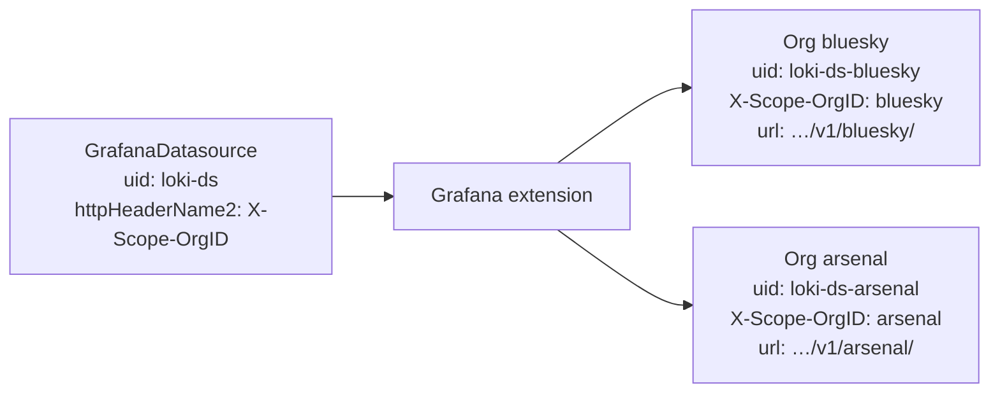
```mermaid
flowchart LR
  CR["GrafanaDatasource<br/>uid: loki-ds<br/>httpHeaderName2: X-Scope-OrgID"] --> E["Grafana extension"]
  E --> B["Org bluesky<br/>uid: loki-ds-bluesky<br/>X-Scope-OrgID: bluesky<br/>url: …/v1/bluesky/"]
  E --> A["Org arsenal<br/>uid: loki-ds-arsenal<br/>X-Scope-OrgID: arsenal<br/>url: …/v1/arsenal/"]
```

*One definition, one copy per organisation. For every type the UID gains a tenant suffix and the `X-Scope-OrgID` header takes the tenant name; Loki alone also gets the tenant in its URL path.*

So in the `bluesky` organisation this yields UID `loki-ds-bluesky`, header `X-Scope-OrgID: bluesky`, and URL `…/api/logs/v1/bluesky/`. The data source's **name** is untouched, so it still reads as plain `Loki` to everyone inside the organisation.

To see it, switch to the `bluesky` organisation in Grafana, or list that organisation's data sources over the API — the same org-scoped call the extension itself makes, using the admin credentials from the instance's `<grafana-instance-name>-admin-credentials` secret:

```bash
curl -su "$GF_USER:$GF_PASS" -H "X-Grafana-Org-Id: <bluesky-org-id>" \
  http://grafana-service.telemetry.svc:3000/api/datasources
```

#### Metrics and traces alongside logs

Mimir and Tempo need only the `datasource` block swapped. Everything else — `allowCrossNamespaceImport`, the header slot, `valuesFrom` — is identical:

```yaml
  # Mimir: there is no "mimir" type — use prometheus, and say so in jsonData
  datasource:
    uid: mimir-ds
    name: Mimir
    type: prometheus
    access: proxy
    url: http://mimir-nginx.mimir.svc/prometheus
    jsonData:
      httpHeaderName1: "Authorization"
      httpHeaderName2: "X-Scope-OrgID"
      prometheusType: Mimir
      httpMethod: POST
```

```yaml
  # Tempo: the only type eligible for the cross-tenant union datasource
  datasource:
    uid: tempo-ds
    name: Tempo
    type: tempo
    access: proxy
    url: http://tempo.tempo.svc:3200
    jsonData:
      httpHeaderName1: "Authorization"
      httpHeaderName2: "X-Scope-OrgID"
```

!!! warning
    Data sources that link to each other by UID — Tempo's `tracesToLogsV2`, `tracesToMetrics`, `lokiSearch` and `serviceMap`, or Prometheus `exemplarTraceIdDestinations` — are **not** rewritten. The extension tenant-scopes a data source's own UID, but nested `datasourceUid` values inside `jsonData` are copied through unchanged, so a reference to `loki-ds` stays `loki-ds` in every tenant organisation, where the data source is really `loki-ds-<tenant>`. Trace-to-logs and exemplar jumps will not resolve there. Dashboard panels are unaffected — those references *are* rewritten.

### 3. Add a dashboard

```yaml
apiVersion: grafana.integreatly.org/v1beta1
kind: GrafanaDashboard
metadata:
  name: loki-dashboard
  namespace: telemetry              # must be spec.server.namespace
spec:
  allowCrossNamespaceImport: true   # required
  resyncPeriod: 10m
  folderRef: platform-folder        # optional; a GrafanaFolder in this namespace
  json: |
    {
      "uid": "loki-overview",
      "title": "Loki Overview",
      "panels": [
        {
          "title": "Log Volume",
          "type": "timeseries",
          "datasource": { "type": "loki", "uid": "loki-ds" },
          "targets": [
            {
              "datasource": { "type": "loki", "uid": "loki-ds" },
              "expr": "sum(rate({job=\"app\"}[5m]))"
            }
          ]
        }
      ]
    }
```

A dashboard needs:

- `allowCrossNamespaceImport: true`;
- a UID, from either `spec.customUID` or the `uid` field in the JSON — `customUID` wins if both are set;
- `DashboardSynchronized=True` from the Grafana Operator.

**Reference data sources in object form** — `{"type": ..., "uid": ...}` — using the same base UID as the `GrafanaDatasource`. The extension then rewrites `loki-ds` to `loki-ds-bluesky` in the bluesky copy, and to each other tenant's UID in theirs.

- If the UID matches no managed data source, it falls back to matching on `type`, which only resolves when exactly one managed data source has that type. With two, the reference is left alone and a warning is logged.
- String references such as `"-- Grafana --"` or `"${DS_PROMETHEUS}"` are left untouched.

**For folders, prefer `spec.folderRef` over `spec.folderUID`.** Both need a `GrafanaFolder` resource to exist — the Grafana Operator will not mark the dashboard synchronized otherwise — but `folderRef` names the dependency instead of implying it through a matching UID. The extension creates the folder, with its title, in a tenant's organisation the first time a dashboard referencing it is synced there.

Every dashboard the extension writes also carries an `mto-grafana-managed` tag. Orphan cleanup deletes only dashboards carrying it, which is exactly why a dashboard you create by hand in the Grafana UI is safe from the operator, in any folder.

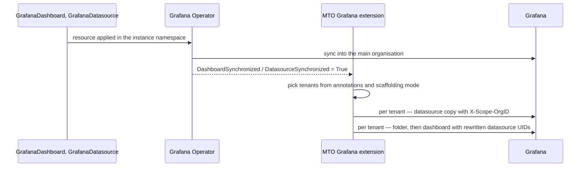
```mermaid
sequenceDiagram
    participant Git as GrafanaDashboard, GrafanaDatasource
    participant GO as Grafana Operator
    participant MTO as MTO Grafana extension
    participant G as Grafana
    Git->>GO: resource applied in the instance namespace
    GO->>G: sync into the main organisation
    GO-->>MTO: DashboardSynchronized / DatasourceSynchronized = True
    MTO->>MTO: pick tenants from annotations and scaffolding mode
    MTO->>G: per tenant — datasource copy with X-Scope-OrgID
    MTO->>G: per tenant — folder, then dashboard with rewritten datasource UIDs
```

### 4. Sign in as a tenant member

A user whose token carries `tenant-bluesky-owners` signs in through OIDC and lands in the `bluesky` organisation as Admin, seeing the dashboard with its panels already querying bluesky's data.

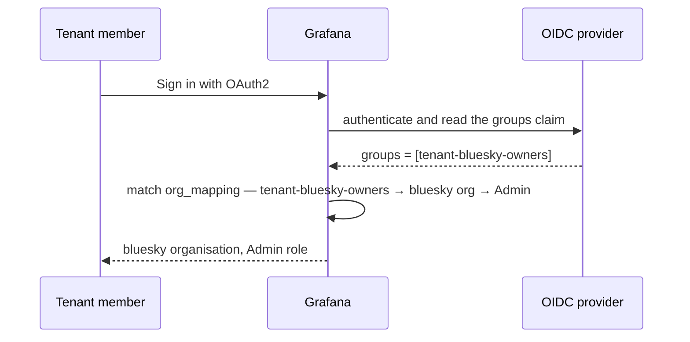
```mermaid
sequenceDiagram
    participant User as Tenant member
    participant G as Grafana
    participant IdP as OIDC provider
    User->>G: Sign in with OAuth2
    G->>IdP: authenticate and read the groups claim
    IdP-->>G: groups = [tenant-bluesky-owners]
    G->>G: match org_mapping — tenant-bluesky-owners → bluesky org → Admin
    G-->>User: bluesky organisation, Admin role
```

If the same user also carried `tenant-arsenal-viewers`, they would additionally have Viewer in the `arsenal` organisation and could switch between the two.

## Choosing which tenants get a resource

By default every managed data source and dashboard goes to every tenant. `spec.scaffolding.mode` decides whether annotations are consulted:

| Mode | Behaviour |
|:---|:---|
| `OnAnnotation` (default) | Annotations on the resource select tenants. |
| `Always` | Annotations are ignored; everything syncs to every tenant. |

Under `OnAnnotation`:

| Annotation on the resource | Effect |
|:---|:---|
| `mto.grafana/tenant: "bluesky,arsenal"` | Sync only to the listed tenants. Comma- or space-separated, case-insensitive. |
| `mto.grafana/disabled: "true"` | Skip this resource entirely. |
| *(neither)* | Sync to every tenant. |

```yaml
apiVersion: grafana.integreatly.org/v1beta1
kind: GrafanaDashboard
metadata:
  name: loki-dashboard
  namespace: telemetry
  annotations:
    mto.grafana/tenant: "bluesky,arsenal"
```

Three details worth knowing:

- `disabled` is checked **before** `tenant`, so a resource carrying both is skipped whatever it lists.
- An **empty** `mto.grafana/tenant` value matches no tenants at all — a quiet way to disable a resource by accident. Use `mto.grafana/disabled` when that is what you mean.
- Both keys can be renamed through `spec.scaffolding.annotations`: its `tenant` entry overrides the tenant key, and its `enable` entry overrides the disabled key.

!!! warning
    The `Never` and `OnLabel` modes are accepted by the schema but are not implemented, and currently behave like `Always` — everything syncs to every tenant. Do not set `Never` expecting it to stop syncing; disable individual resources with `mto.grafana/disabled` instead.

## One organisation across a user's tenants

Isolation has a cost, and it falls on the people who cross tenants: platform engineers, on-call responders, anyone who owns several services. Grafana shows one organisation at a time, so answering "which of my six tenants is unhealthy?" means visiting six organisations one after another — during an incident, at the worst possible moment.

Aggregated views remove that. Each user gets one extra organisation, `Aggregate View — <login>`, mirroring the dashboards, data sources and folders of every tenant they belong to — everything they are entitled to see, on one screen, with nothing they are not. Enable `unionTraceDatasource` as well and a single distributed trace can be followed across tenant boundaries, which no per-tenant data source can do.

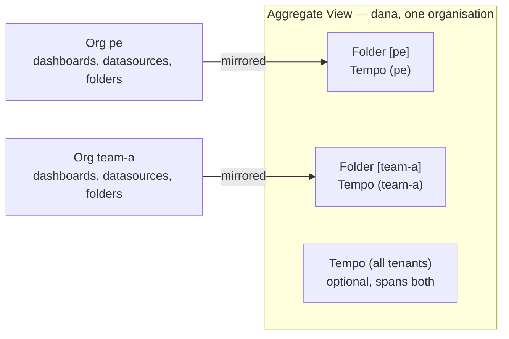
```mermaid
flowchart LR
  OB["Org pe<br/>dashboards, datasources, folders"] -->|"mirrored"| FB
  OA["Org team-a<br/>dashboards, datasources, folders"] -->|"mirrored"| FA
  subgraph AV["Aggregate View — dana, one organisation"]
    FB["Folder [pe]<br/>Tempo (pe)"]
    FA["Folder [team-a]<br/>Tempo (team-a)"]
    UN["Tempo (all tenants)<br/>optional, spans both"]
  end
```

*Content is copied in from each tenant the user belongs to, and labelled with where it came from. The union trace data source is the one thing that is not a copy of anything — it spans the whole view.*

Everything inside it is labelled by origin, so it stays obvious which tenant a panel is reading from. Each tenant's dashboards land in their own folder, titled from `folderPrefix` — which is what keeps two tenants' copies of the same platform dashboard apart:

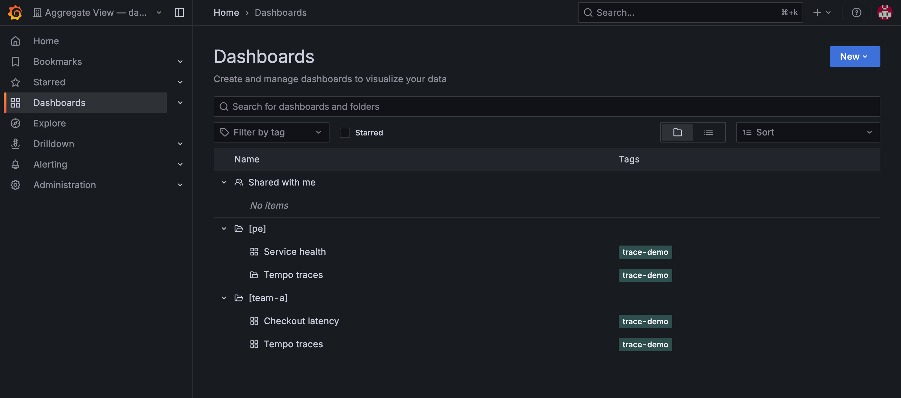

*One user's aggregated view. Each folder holds that tenant's own dashboard — `Service health` for `pe`, `Checkout latency` for `team-a` — alongside `Tempo traces`, which both tenants run and which therefore appears twice. The `[pe]` and `[team-a]` prefixes are the only thing telling the two copies apart.*

Data sources are labelled the same way: every mirror carries its tenant as a suffix, whatever its type — `Tempo (pe)`, `Tempo (team-a)`, and a `Mimir (pe)` or `Loki (pe)` alongside them if those tenants have such data sources. The optional cross-tenant data source is Tempo only, and is named `Tempo (all tenants)`.

```yaml
spec:
  aggregatedViews:
    enabled: true
    folderPrefix: "[{{ .Tenant }}] "     # optional
    useMinTenantRole: false              # optional
    mirrorManualDashboards: false        # optional
    shareUserDashboards: false           # optional
    unionTraceDatasource:                # optional
      enabled: false
```

| Field | Default | What it does |
|:---|:---|:---|
| `enabled` | `false` | Turns the feature on. Turning it off again leaves existing view organisations in place rather than deleting them. |
| `folderPrefix` | `[<tenant>]` and a trailing space | Title prefix for each tenant's folder inside the view. `{{ .Tenant }}` is the only variable. |
| `useMinTenantRole` | `false` | Viewer in the view by default. When `true`, the user gets the **lowest** of their tenant roles. |
| `mirrorManualDashboards` | `false` | Also mirror dashboards created by hand in a tenant organisation, not just those backed by a `GrafanaDashboard`. |
| `shareUserDashboards` | `false` | Share dashboards a user builds inside their own view with colleagues whose tenant access covers the same data. Needs `useMinTenantRole: true` to do anything — a Viewer cannot create a dashboard to share. |
| `unionTraceDatasource.enabled` | `false` | Add one cross-tenant Tempo data source to each view. |

### Roles inside the view

The default Viewer role is the safe choice, but Grafana **Explore** requires Editor or above, so ad-hoc queries and trace exploration are unavailable from the view until you set `useMinTenantRole: true`. That grants the **lowest** of the user's tenant roles, ranked Admin > Editor > Viewer:

- Admin in **every** tenant → Admin in the view.
- Editor in the weakest tenant → Editor in the view.
- Viewer in **any one** tenant → Viewer in the view. The most restrictive tenant wins.

So Explore becomes available to anyone whose weakest tenant role is Editor or better. Viewer is also the floor: an unrecognised role counts as Viewer, so a malformed membership can never promote someone. Grafana Editors cannot manage organisation membership, so none of this opens a path to cross-tenant content.

### Cross-tenant traces

Multi-tenant Tempo partitions traces by `X-Scope-OrgID`, so a per-tenant data source only ever returns one tenant's spans and a request crossing tenants cannot be followed end to end. Enabling `unionTraceDatasource` adds one `<name> (all tenants)` Tempo data source whose `X-Scope-OrgID` is the pipe-joined set of tenants already in that view, which Tempo merges on read.

- **Access-preserving by construction** — a view only ever contains the user's own tenants, so the union can never reach one they are not a member of.
- **Additive** — the per-tenant data sources stay.
- **Tempo only.** It needs a synchronized Tempo `GrafanaDatasource` carrying an `X-Scope-OrgID` header; one without is skipped with a warning.
- Users in a single tenant get no union data source, as it would duplicate their per-tenant copy.
- Pair it with `useMinTenantRole: true` to query it from Explore.

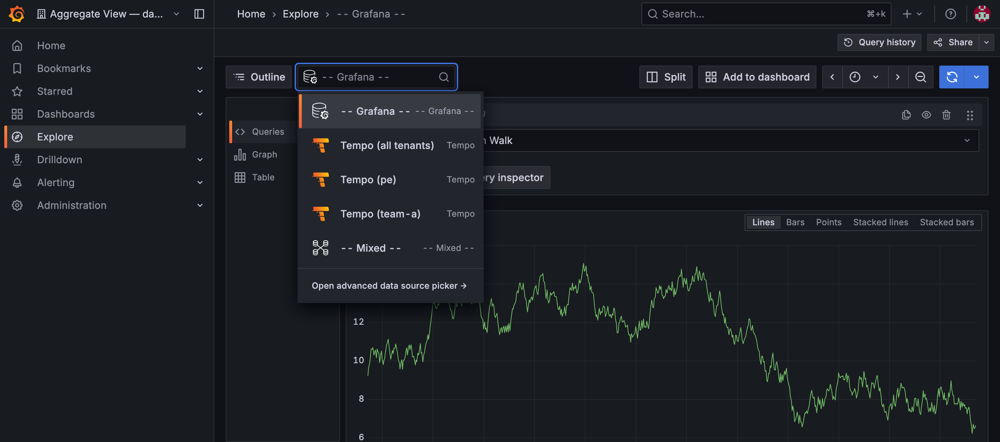

*Explore inside an aggregated view. The user can query either tenant on its own, or `Tempo (all tenants)` to follow one trace across both. Explore is available here at all because `useMinTenantRole` granted Editor — at the default Viewer it would be closed.*

### What mirrored content does and does not allow

Mirrored content is operator-owned and read-oriented:

- Mirror **data sources** are re-asserted every cycle, so a manual edit is undone within one reconcile.
- Mirror **dashboards** are hash-compared and only re-pushed when the source changes. That avoids reloading everyone's browser each cycle, but it also means an edit saved to a mirror survives until the source changes or the mirror is deleted.
- Make changes in the tenant organisation or in Git; they flow into every view that mirrors them.

The view follows the user's access:

- Losing access to a tenant removes that tenant's content from the view.
- Losing every tenant makes the view eligible for removal after a grace period — but a view holding dashboards the user created themselves is kept for manual review.
- Per-user state, including content counts and last sync time, is reported under `status.aggregatedViews`.

## Operating it

### Checking what was created

```bash
kubectl get grafana -n mto-extension-grafana-system
kubectl describe grafana mto-extension-grafana -n mto-extension-grafana-system
```

The status is the first place to look:

- `status.phase` — the one-word summary: `Ready`, `Progressing`, `Failed`, or `Blocked` for a duplicate resource that has been refused.
- `status.tenantStatus` — totals for tenants seen, reconciled and failed, plus a per-tenant `details` list carrying each tenant's last sync time and last error.
- `status.conditions` — the Ready condition, whose reason narrows the phase down: `Success`, `Reconciling`, `WaitingForDependencies`, `PartialSuccess`, `Error` or `Blocked`.
- `status.aggregatedViews` — per-user view state, with phase `Active`, `PartialMirror` or `Failed`.
- `status.strayMirrorTenantOrgs` — tenant organisations that unexpectedly contain mirror content. Reported for visibility only; never deleted.

Inside Grafana, using the credentials from `<grafana-instance-name>-admin-credentials`:

```bash
SECRET=grafana-admin-credentials    # <grafana-instance-name>-admin-credentials
GF_USER=$(kubectl get secret "$SECRET" -n telemetry \
  -o jsonpath='{.data.GF_SECURITY_ADMIN_USER}' | base64 -d)
GF_PASS=$(kubectl get secret "$SECRET" -n telemetry \
  -o jsonpath='{.data.GF_SECURITY_ADMIN_PASSWORD}' | base64 -d)

curl -su "$GF_USER:$GF_PASS" http://grafana-service.telemetry.svc:3000/api/orgs
curl -su "$GF_USER:$GF_PASS" http://grafana-service.telemetry.svc:3000/api/v1/sso-settings/generic_oauth
```

The organisation list should hold one entry per tenant. In the SSO settings, `orgMapping` should carry `group:orgID:role` triples for each tenant, and `roleAttributePath` should contain only the cluster-admin expression — tenant patterns appearing there are what flattens per-organisation roles into one role everywhere.

### When something does not appear

| Symptom | What to check |
|:---|:---|
| A data source is missing from every organisation | `allowCrossNamespaceImport: true`; the resource is in `spec.server.namespace`; `jsonData` has an `httpHeaderName<N>` equal to `X-Scope-OrgID`; `spec.datasource.uid` is non-empty and unique; `DatasourceSynchronized=True` |
| A dashboard is missing from every organisation | `allowCrossNamespaceImport: true`; the namespace; a UID via `spec.customUID` or the JSON; a `GrafanaFolder` exists for any referenced folder; `DashboardSynchronized=True` |
| It appears in some organisations only | That is the annotations working — check `mto.grafana/tenant` and the scaffolding mode |
| Panels report the data source was not found | The dashboard's UID matches no managed data source and the type fallback could not resolve it, because more than one shares that type. Use the same base UID as the `GrafanaDatasource` |
| A user signs in but sees no tenant | Their groups match no rendered pattern. Compare the token's `groups` claim against the patterns; add the user to the right group, or change `pattern` to match your provider's naming |
| A user has the same role everywhere | Tenant patterns have reached `roleAttributePath`. Check the SSO settings above |
| Dashboard edits made in the UI keep reverting | Expected — the resource is the source of truth. Duplicate the dashboard to experiment, then move the change into the resource |

The reconcile cadence is `spec.resyncInterval`: 30 seconds by default, floored at 10 seconds, so most corrections land within one cycle. With aggregated views enabled the default tightens to 10 seconds, because new SSO users are only discovered by polling.

### What deletion does

- Deleting a `Tenant` deletes its Grafana organisation, and with it the dashboards and data sources inside.
- Deleting a `GrafanaDashboard` or `GrafanaDatasource` removes it from every tenant organisation on the next reconcile.
- Removing a tenant from a `mto.grafana/tenant` annotation removes the resource from that tenant only.

Content follows the definition rather than lingering in Grafana.

!!! warning
    Aggregated-view organisations are not deleted automatically when `aggregatedViews.enabled` is set back to `false`, or when the extension is removed. Grafana rejects deletion of an organisation while the auto-added admin is still a member, so these are left for administrators to remove. Mirrored content inside them stops being updated as soon as the feature is off.

Setting `spec.deletionPolicy` is currently accepted but has no effect — the field is reserved, and the behaviour above applies either way.

## Reference

Configuration lives entirely in the `Grafana` resource (`grafanas.telemetry.tenantoperator.stakater.com`).

| Field | Default | Description |
|:---|:---|:---|
| `spec.server.name` | required | Name of the Grafana Operator instance to manage |
| `spec.server.namespace` | required | Its namespace, and the only namespace content resources are read from |
| `spec.sso.mode` | `secret` | `secret`, `inline` or `disabled` |
| `spec.sso.secretRef.name` | — | Secret holding the identity-provider details, in the extension's namespace |
| `spec.sso.idp` | — | Inline identity-provider details, for `mode: inline` |
| `spec.tenantRoleMapping.<role>.pattern` | `tenant-{{ .Tenant }}-{{ .Role }}s` | Group name to match, per role |
| `spec.tenantRoleMapping.<role>.grafanaRole` | see role table | `grafanaadmin`, `admin`, `editor`, `viewer` or `none` |
| `spec.tenantRoleMapping.tieBreakStrategy` | `highest` | Resolution when two patterns render identically: `highest`, `lowest`, `deny` |
| `spec.tenantRoleMapping.fallback` | `deny` | Server-level role when nothing matches: `deny`, `allow`, `viewer`, `editor`, `admin` |
| `spec.scaffolding.mode` | `OnAnnotation` | `OnAnnotation` or `Always` |
| `spec.scaffolding.annotations` | — | Overrides the annotation keys, via its `tenant` and `enable` entries |
| `spec.resyncInterval` | `30s`, or `10s` with aggregated views | Reconcile cadence, floored at `10s` |
| `spec.aggregatedViews` | disabled | Per-user aggregated views; see above |
| `spec.deletionPolicy` | `Delete` | Reserved; not acted on today |

Identity-provider fields, whether inline under `spec.sso.idp` or as keys in the SSO secret:

| Field | Default | Description |
|:---|:---|:---|
| `issuer` | required | OIDC provider URL |
| `clientId` | required | OAuth2 client ID |
| `clientSecret` | required | OAuth2 client secret |
| `redirectUri` | required | Grafana callback URL, ending in `/login/generic_oauth` |
| `scope` | `openid email profile groups offline_access` | OAuth2 scopes |
| `authUrl` | `{issuer}/dex/auth` | Authorization endpoint |
| `tokenUrl` | `{issuer}/dex/token` | Token endpoint |
| `apiUrl` | `{issuer}/dex/api` | User-info endpoint |
| `loginAttributePath` | `preferred_username` | `JMESPath` expression for the username |
| `orgAttributeName` | `groups` | Claim used for organisation mapping |
| `roleAttributeName` | `groups` | Claim used for cluster-admin detection |
