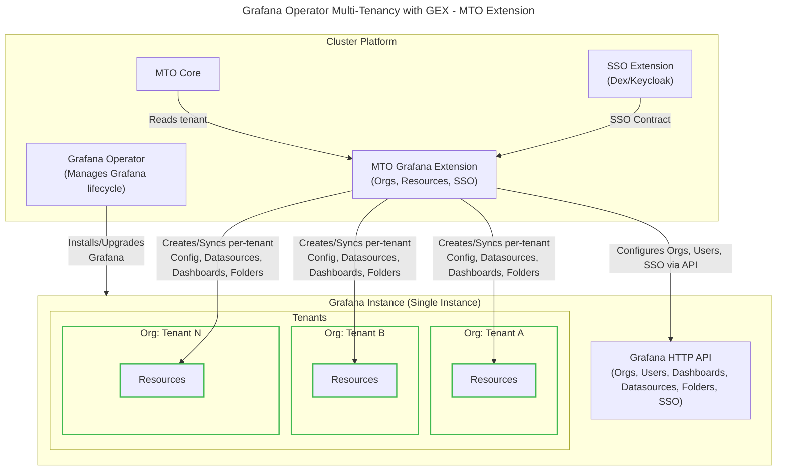
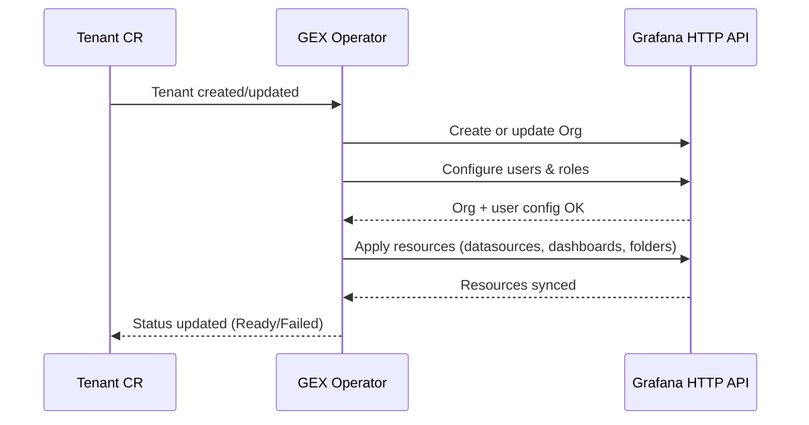

# MTO Grafana Extension

> **Purpose:** A single source of truth for deploying, operating, and extending the **MTO Grafana Extension (GEX)**. It serves both **platform engineers** (how to install/use) and **developers** (how it works under the hood).

---

## 1) What is it?

The Grafana Extension (GEX) integrates **Grafana** with **MTO Tenants** to deliver:

* Per-tenant isolation of Dashboards and Data Sources via **Grafana Organisations**. Each tenant maps to its own Grafana org.
* **OAuth** for humans (via OAuth, e.g., Dex/Keycloak/Entra) and basic auth for API access for machines.

GEX operates against a **single Grafana instance** and scales tenants as orgs inside it.  
It **does not install or operate Grafana itself** — it only wires Grafana to your MTO tenants via the Grafana HTTP API.

---

## 2) Audience

* **Platform engineers:** Install/configure, define policies, enable tenants/app teams, troubleshoot.
* **Developers of GEX:** Understand controllers, Day-0/1/2 flows, CRDs, idempotency and tests.
* **Tenant/App teams:** Annotate dashboards/datasources for tenant-specific provisioning.

---

## 3) Architecture



---

## 4) Scope & Boundaries

* **GEX manages:**

  * creation of organisation per tenant
  * organisation members
  * configmap in Kubernetes
  * configuration of orgs, users, SSO, datasources, dashboards, and folders via the Grafana HTTP API
* **SSO extension manages:**

  * Your IdP (Dex/Keycloak/Entra) & publishes an SSO **contract** (issuer, groupsClaim, `grafana` clientID/secret, group patterns) via CR **status** or a labeled **Secret**.
* **Out of scope:**

  * Operating Grafana (resources, storage, backup/restore, version upgrades).
  * Grafana resources (plugins, dashboards, etc...) that are not provisioned through GEX i.e. installed directly into Grafana by user with [correct permissions][1]

> GEX configures Grafana via the HTTP API. It does not modify Grafana Operator CRDs, avoiding installation lifecycle conflicts.

---

## 5) Prerequisites

1. **Grafana** reachable via service url (`http://grafana.telemetry.svc.cluster.local`).
2. **Grafana** must be in **[multi-org mode](#1111-what-is-multi-org-mode-in-grafana)** and allow API admin access.
3. **SSO extension** installed and configured; publishes **issuer**, **groupsClaim**, and `grafana` client.
4. **Network/TLS**: Pods allowed to egress to Grafana; trust chain available.

---

## 6) Install (Platform Engineer)

### 6.1 Create namespace & install controller

```bash
kubectl create ns mto-system || true
helm upgrade --install mto-grafana-extension \
  oci://<your-registry>/mto-grafana-extension \
  -n mto-system \
  -f values.yaml
```

> The `values.yaml` should minimally configure operator RBAC and resource requests. A reference sample is provided in the Helm chart.

### 6.2 Create GrafanaExtension CR

```yaml
# GrafanaExtension: wires your MTO tenants to an existing Grafana cluster.
# - Ensures Grafana SSO auth for users.
# - Sets up per-tenant isolated organisations with roles.
# - Sets up pre-configured resources (Datasources, Dashboard, Folders,...) per-tenant.
apiVersion: extensions.mto.stakater.com/v1alpha1
kind: GrafanaExtension
metadata:
  name: cluster-default                 # One per grafana instance (typical). Keep in mto-system.
  namespace: mto-system

spec:
  server:
    url: http://grafana.telemetry.svc.cluster.local:3000
    namespace: telemetry
    authSecretRef:
      name: grafana-admin-credentials

  sso:
    mode: cluster
    clusterRef:
      name: default
    roleResolution:
      claim: groups
      patterns:
        - role: owner
          match: "tenant-{{ .tenant }}-owners"
        - role: editor
          match: "tenant-{{ .tenant }}-editors"
        - role: viewer
          match: "tenant-{{ .tenant }}-viewers"
      tieBreakStrategy: highest
      fallback: deny

  tenantRoleMapping:
    owner:  admin
    editor: editor
    viewer: none

  scaffolding:
    mode: OnAnnotation
    annotations:
      enable: "mto.grafana/disabled"
      tenant: "mto.grafana/tenant"
  deletionPolicy: Delete
```

> GEX uses the Grafana HTTP API to manage configuration directly in the Grafana database.
> See [Appendix 11.5](#115-sso-modes) for how SSO modes map to this API.

---

## 7) Using it (Platform Engineer & App Teams)

By default, **all GrafanaDashboards and GrafanaDatasources are provisioned to all tenants**.
Annotations are only needed to explicitly **disable** or **restrict** provisioning.

---

### 7.1 Disable a Datasource

```yaml
apiVersion: grafana.integreatly.org/v1beta1
kind: GrafanaDatasource
metadata:
  ...
  annotations:
    mto.grafana/disabled: "true"
```

---

### 7.2 Restrict a Dashboard to certain tenants

```yaml
apiVersion: grafana.integreatly.org/v1beta1
kind: GrafanaDashboard
metadata:
  ...
  annotations:
    mto.grafana/tenant: "tenant-a,tenant-b"
```

---

### 7.3 Behavior Summary

By default, **all dashboards and datasources are provisioned to all tenants**.
Annotations override this behavior.

| Annotation                       | Applies To           | Result                                                                                           |
| -------------------------------- | -------------------- | ------------------------------------------------------------------------------------------------ |
| *(none)*                         | Dashboard/Datasource | Provisioned to **all tenants**                                                                   |
| `mto.grafana/disabled: "true"`   | Dashboard/Datasource | Provisioned to **no tenants**                                                                    |
| `mto.grafana/tenant: "tenant-x"` | Dashboard/Datasource | Provisioned **only** to the listed tenant(s). Multiple tenants allowed via comma-separated list. |
| Both `disabled` + `tenant` set   | Dashboard/Datasource | `disabled` takes precedence → provisioned to **no tenants**                                      |

> Namespaces without a Tenant CR are ignored. Resources in such namespaces will not be provisioned.

---

## 8) Lifecycle

### 8.1 Status reporting

The operator continuously updates the `status` field of the `GrafanaExtension` CR with cluster-wide and tenant-specific information.

#### 8.1.1 Status in GrafanaExtension

```yaml
status:
  observedGeneration: 2
  phase: Ready
  grafana:
    version: 10.4.0
    url: http://grafana.telemetry.svc.cluster.local
  sso:
    provider: keycloak
    mode: cluster
  conditions:
    - type: Ready
      status: "True"
      reason: AllTenantsReconciled
      message: 15/15 tenants reconciled
      lastTransitionTime: "2025-09-02T20:00:00Z"
    - type: GrafanaConnectionEstablished
      status: "True"
      reason: ConnectionSuccessful
      message: Connected to Grafana at http://grafana.telemetry.svc.cluster.local
    - type: SSOConfigured
      status: "True"
      reason: AuthEnabled
      message: OIDC authentication configured
  tenantStatus:
    totalTenants: 15
    reconciled: 14
    failed: 1
    details:
      - tenant: "my-tenant-1"
        namespace: "my-app-namespace"
        lastSyncTime: "2025-09-02T19:59:30Z"
        error: "Failed to create datasource: permission denied"
```

---

## 9) Operations & Security (Platform Engineer)

### 9.1 Access Control

* GEX connects to Grafana using **credentials** created by the Grafana Operator.
* Credentials are stored in Kubernetes Secrets.
* When credentials rotate, GEX re-establishes connection automatically.

### 9.2 Auditability

* GEX emits Kubernetes **Events** on reconciliation failures.
* Prometheus metrics are exposed:

  * `gex_tenant_reconciles_total`
  * `gex_tenant_failures_total`
  * `gex_grafana_api_latency_seconds`

### 9.3 Failure Recovery

* All reconcile loops use **exponential backoff**.
* Force reconciliation via annotation:

```bash
kubectl annotate grafanaextension cluster-default gex.force-reconcile=true --overwrite
```

### 9.4 Security Notes

* Never enable `insecureSkipVerify` in production.
* Always reference OAuth client secrets via SecretRef, never inline.
* Enforce strict group patterns to prevent cross-tenant access.
* Grafana API calls are retried with backoff and respect tenant scaling. If Grafana API rate-limits are hit, reconciliation is delayed.

### 9.5 RBAC minimum

- Read (get/list/watch) Tenant (cluster-scoped).
- Read (get/list/watch) GrafanaDashboard, GrafanaDatasource in spec.watchNamespace.
- Read Secrets for Grafana admin/API credentials in the referenced namespace.
- No access to arbitrary tenant namespaces.

---

## 10) Developer Guide (How it Works)

### 10.1 Controllers (Reconcilers)

* **TenantOrgReconciler**
  * Watches: `Tenant` (cluster-scoped)
  * Ensures: matching Grafana org exists; applies role mapping/membership as configured.

* **AppResourceReconciler**
  * Watches: `GrafanaDashboard`, `GrafanaDatasource` in the namespace that Grafana lives 
  * Ensures: resources are provisioned to the correct set of orgs (default = all orgs; annotations can restrict/disable).

* **ClusterAuthReconciler**
  * Ensures: SSO settings via `/api/v1/sso-settings` align with selected mode (cluster/secret/inline/disabled).

---

### 10.2 Reconciliation Flow (sequence diagram)



---

### 10.3 Watches & Scale Hygiene

**Watch model (strict & intentional):***

* Tenant CRs: cluster-scoped watch (names + members). No tenant namespace watches.

* Grafana resources: watch only the spec.watchNamespace for GrafanaDashboard and GrafanaDatasource.

* Reconcile triggers:

  * Tenant add/update/delete → (create/update/delete) Grafana org per `deletionPolicy`.

  * `GrafanaDashboard`/`Datasource` add/update/delete → propagate to target org set (default all; honor annotations).

* Periodic light sync with Grafana API for drift detection (org inventory, resource presence).

---

### 10.4 Drift & Deletion Policy

* Trigger: Tenant CR deletion.
* Behavior:
```yaml
spec:
  deletionPolicy: Delete   # Delete org in Grafana
  # or
  deletionPolicy: Orphan   # Leave org in Grafana
```

---

### 10.5 Templates (Renderers)

* Dashboards and datasources support templating with `{{ .tenant }}` substitution.
* Templates are validated with a **dry run** before provisioning.
* Golden tests ensure renderer output is stable across changes.

---

### 10.6 Testing Strategy

* **Unit:** golden tests for renderer templates with fixtures.
* **Envtest:** verify org creation and resource sync using fake API server.
* **Kind e2e:** deploy Grafana, Dex/Keycloak, apply tenants; verify org creation, OIDC login, dashboard sync.
* **Fault injection:** rotate client secret or TLS cert; confirm operator reconciles safely.

---

### 10.7 Performance Notes

* Restrict informers to tenant-selected namespaces.
* Batch Grafana API calls when safe.
* Avoid re-provisioning unchanged dashboards.
* Expose metrics for reconcile duration and API latency (`grafana_api_latency_seconds`).

---

## 11) Appendices

### 11.1 Glossary

* **Org** → Grafana organisation = tenant isolation boundary.
* **SSO contract** → Published by SSO extension, consumed by GEX.
* **Tenant CR** → Defines tenants in MTO.
* **SSO** → Single Sign-On = user only sign in once
* **DRY** → Don't Repeat Yourself
* **BYO** → Bring Your Own
* **IdP** → Identity Provider

### 11.1.1 What is **multi-org mode** in Grafana?

Grafana has a concept of **organisations** — logical partitions inside a single Grafana instance.

Each org has its own users, dashboards, folders, and datasources.

* Single-org setup: Grafana is used as one shared org. (This is what you get by default in most Helm charts).
* Multi-org setup: You allow multiple orgs to exist and be managed. GEX relies on this, since it provisions one org per tenant.

**Requirements for multi-org**

```ini
[users]
auto_assign_org = true
allow_org_create = true

[auth.basic]
enabled = true   # required for operator to talk to Grafana API

[auth.anonymous]
enabled = false  # must be disabled; isolation breaks otherwise
```

**Other implied requirements**:

* **Admin user available** with rights to create orgs and users
* **Root URL configured** in `[server]` for OAuth callbacks
* **No restrictive licensing** (GEX uses only community features)

---

### 11.2 Troubleshooting

* `401 Unauthorized`: Check Grafana admin secret.
* `SSOConfigured: False`: Check IdP contract in SSO extension.
* Dashboards not showing: Verify tenant annotation and org membership.

---

### 11.3 CRD Reference

* `GrafanaExtension` schema (fields documented above).

| Field  | Description |
| ------ | ----------- |
| spec.server.url | Service url to Grafana |
| spec.server.namespace | Namespace that Grafana instance lives in. |
| spec.server.authSecretRef.name | Name of **Secret** that holds admin credentials to Grafana. This is _usually_ created by Grafana Operator |
| spec.sso.mode | Selected mode on how to configure sso. See [Appendix 11.5](#115-sso-modes) |
| spec.sso.clusterRef | See [Appendix 11.5](#115-sso-modes) |
| spec.sso.roleResolution.claim | JSON node in OAuth Access Token, that holds user roles/groups |
| spec.sso.patterns[] | Mapping of OAuth Roles to Grafana Roles |
| spec.sso.tieBreakStrategy | If a user matches against multiple roles, which role should be assigned. Possible values: `highest` (default)- the role with highest permission is assigned. `lowest` - the role with lowest permission is assigned. `deny` - user is denies any roles, i.e. abort. |
| spec.sso.fallback | Default role when there is no match. Possible values: `deny` (default) - deny access. `allow` - user is granted the default role. `<rolename>` - user is assigned `<rolename>` rights. |
| spec.sso.tenantRoleMapping | Map `spec.sso.patterns[]` to Grafana Roles |
| spec.sso.scaffolding | Allows GEX to detect other CRs based on the annotations |
| spec.sso.scaffolding.mode | `OnAnnotation` (default) - Scaffolding is triggered or configured based on the presence and values of specific annotations. Possible other values: `Always` (Not supported), `Never` (Not supported), or `OnLabel` (Not supported) |
| spec.sso.scaffolding.annotations | Annotations to look for |
| spec.sso.deletionPolicy | See [Appendix 10.4](#104-drift--deletion-policy) |

---

### 11.4 Lifecycle Examples (Day-0 / Day-1 story)

* **Day-0 (Platform setup):**

  * Platform team installs Grafana + Grafana Operator.
  * Deploys GEX (`GrafanaExtension` CR).
  * Connects to SSO Extension contract.
  * GEX connects to Grafana via HTTP API.

* **Day-1 (Tenant onboarding):**

  * App team creates `Tenant` CR.
  * GEX auto-creates Grafana org.
  * Default dashboards + datasources provisioned.
  * Users login via IdP → assigned roles automatically.

* **Day-2 (Ongoing):**

  * App team adds annotated dashboards in their namespace.
  * GEX syncs them into the right org.
  * Rotation of IdP secrets handled automatically via SSO Extension.

---

### 11.5 SSO modes

| Mode | Where config comes from | Use case / Best for |
| ---- | ----------------------- | ------------------- |
| cluster | `SSOExtension` CR (`clusterRef`) | Standard setup, DRY, auto-rotation |
| secret | External Secret | BYO IdP config, no SSOExtension |
| inline | Inline in CR (`idp:` block) | Simple setups, GitOps friendly (careful with secrets) |
| disabled | None | Dev/test, legacy |

> Regardless of how GEX obtains SSO config, it always applies it via the Grafana HTTP API.
> This ensures dynamic updates without requiring Grafana restarts or CR modifications.

* **mode = cluster** (recommended)

  ```yaml
    sso:
      mode: cluster
      clusterRef:
        name: default
  ```

* **mode = secret**

  ```yaml
    sso:
      mode: secret
      secretRef:
        name: grafana-sso-credentials
  ```

  Expected Secret format:

  ```yaml
  apiVersion: v1
  kind: Secret
  metadata:
    name: grafana-sso-credentials
    namespace: telemetry
  stringData:
    issuer: https://idp.example.com
    clientID: grafana
    clientSecret: supersecret
    groupsClaim: groups
  ```

* **mode = inline**

  ```yaml
    sso:
      mode: inline
      idp:
        issuer: https://idp.example.com
        clientID: grafana
        clientSecret: abc123
        redirectUri: https://grafana.external.url/login/generic_oauth
  ```

* **mode = disabled**
  
  Skips SSO configuration entirely.
  
  Grafana will continue using its existing auth config.

  This is useful only for development or legacy clusters.

  ```yaml
    sso:
      mode: disabled
  ```


##

[1]: <https://grafana.com/docs/grafana/latest/administration/roles-and-permissions/#organization-roles> "Roles and Permissions"
