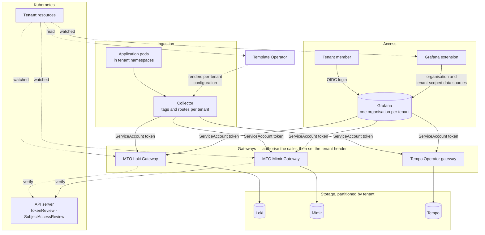

# LGTM stack

Your `Tenant` resources already say who your teams are: which namespaces they own, what they may use, and who may act for them. This integration extends that same definition into observability.

One shared LGTM stack — [Loki](https://grafana.com/oss/loki/), [Grafana](https://grafana.com/), [Tempo](https://grafana.com/oss/tempo/) and [Mimir](https://grafana.com/oss/mimir/) — then serves every tenant, and each one reaches only its own logs, metrics, traces and dashboards. Nothing about a tenant is described twice: the `Tenant` that governs its namespaces and access is the tenant the observability stack partitions on.

This page covers the stack as a whole — how telemetry is collected per tenant, and what holds the boundary in front of each component. Grafana's own side of it, from organisations and data sources to dashboards and sign-in, is covered by the [Grafana integration](../grafana/readme.md) page.

## What a tenant gets

A tenant member signs in through your identity provider and lands in the Grafana organisation belonging to their tenant. Inside it is that tenant's telemetry and nothing else.

| They get | Detail |
|:---|:---|
| Their own logs, metrics and traces | Every query is answered from that tenant's partition of Loki, Mimir and Tempo, and no other |
| Ad-hoc queries | Explore, LogQL, PromQL and TraceQL, plus live tailing of Loki logs, for members with an editing role |
| Their own alerting rules | The Loki and Mimir rulers, and Mimir's Alertmanager, are served per tenant |
| Their own organisation in Grafana | Named after the tenant, holding dashboards whose panels already point at that tenant's data |
| A role that follows their group | Identity-provider group membership decides which organisations a member sees, and with what role |

Members who belong to several tenants can have more, though none of it is on by default. They can be given one organisation holding every tenant they belong to, rather than switching between them; a data source that follows a single request from one tenant's service into another tenant's; and the option to share a dashboard built there with colleagues whose access covers the same data. All three are configured on the Grafana extension — see [One organisation across a user's tenants](../grafana/readme.md#one-organisation-across-a-users-tenants).

## What you do not have to do

None of that is configured per tenant, and that is the point.

The alternative to one shared stack is one per tenant: multiplied storage, multiplied upgrades, and no way to follow a request across tenants. But a shared stack is only multi-tenant *capable*. Configuring it by hand means keeping a second definition of your tenants in every component that needs one.

| To serve a tenant | By hand | Here |
|:---|:---|:---|
| Say who the tenants are | A list kept in the collector, in each gateway and in Grafana, separately | Read from your `Tenant` resources |
| Per-tenant collector configuration | A route or remote-write block written for each tenant | Rendered from the tenant list by the Template Operator |
| An organisation per tenant | Create each, then keep the set current as tenants change | Derived |
| Data sources | One copy per tenant per signal, each with the right header, and the right URL for Loki | Derived from one definition |
| Dashboards | Import into every organisation, then point every panel at that organisation's own data source | Derived, with references rewritten |
| Who can see what | An org-mapping entry per identity-provider group, per tenant | Derived from the tenant |
| Onboarding | Repeat all of the above | Nothing: it is already a `Tenant` |
| Offboarding | Undo all of the above, everywhere | Its organisation and content go with the `Tenant` |

By hand this multiplies quickly. Ten tenants, three signals and eight shared dashboards comes to ten organisations, thirty data sources, eighty dashboards, thirty org-mapping entries and a routing entry per tenant in the collector — about a hundred and sixty objects to create, and then to keep correct every time a dashboard changes or a tenant arrives. Here it is eleven definitions written once for the cluster: three data sources and eight dashboards. Everything per-tenant is either derived by the operators or rendered from the tenant list by the Template Operator, never authored. The eleventh tenant costs nothing, where by hand it would cost another sixteen.

More valuable than the saving is that two definitions cannot disagree when there is only one. The gateways and the Grafana extension watch `Tenant` resources, and the Template Operator renders from them, so what observability enforces tracks what the cluster grants rather than tracking it at whatever interval someone remembers to reconcile the two. A tenant removed from Kubernetes cannot be left behind with an organisation that still queries its old data — the characteristic failure of a hand-maintained tenant list.

## How it works

Telemetry goes in through a collector and comes back out through Grafana. Both directions cross the same gateways, and the tenant is settled there rather than taken on trust.

### Getting telemetry in

One platform-managed collector serves the whole cluster. It derives each tenant from the namespace its source pod runs in, so workloads need no observability configuration of their own.

An OpenTelemetry Collector is the usual choice, but not the only one — the gateways accept the native protocol of each backend alongside OTLP: Prometheus remote write for metrics, Loki's push API for logs. Whatever writes must do two things: present a ServiceAccount token the gateway authorises, and name the tenant it is writing for.

That second requirement shapes how each one is configured. A collector reads the namespace from each record and routes accordingly, so a single pipeline covers every tenant. Prometheus cannot do that, because remote-write headers are fixed per block — one instance covering many namespaces, such as OpenShift's user workload monitoring, would label every series with the same tenant. It therefore needs a block per tenant, each filtered to that tenant's namespaces.

Neither is written per tenant by hand. The Template Operator that ships with MTO reads your `Tenant` resources and renders the per-tenant configuration — collector routes, remote-write blocks — from that one list, so the repetition is generated from the same source as everything else on this page. It can also be set to reconcile what it rendered, reverting drift.

### What settles the tenant

With multi-tenancy turned on, Loki, Mimir and Tempo each read the tenant from an `X-Scope-OrgID` header, and none of them authenticates it. All three tell you to run an authenticating reverse proxy in front, and to let that proxy set the header. Grafana's boundary is the organisation, and it has no idea which organisation belongs to which tenant. So all four need something alongside them:

| Signal | Component | What settles the tenant | Detail |
|:---|:---|:---|:---|
| Logs | Loki | MTO Loki Gateway | Authorises every request against your tenants, in place of the gateway a `LokiStack` would otherwise run |
| Metrics | Mimir | MTO Mimir Gateway | Authorises every request against your tenants. Mimir has no authenticating layer of its own |
| Traces | Tempo | Tempo Operator gateway | Tempo partitions traces itself; the operator's gateway authenticates and authorises per tenant |
| Dashboards | Grafana | The Grafana extension | Organisations, tenant-scoped data source copies, and access mapped from identity-provider groups |

Both MTO gateways check a caller the same way. The request carries a Kubernetes ServiceAccount token; the gateway verifies it with the TokenReview API, confirms the tenant is one of those it watches, and authorises that caller for that tenant — against an allow-list, or Kubernetes RBAC.

Where they differ is how the tenant is named. A Loki request names it in the URL, as `/api/logs/v1/{tenant}/…`, and the gateway sets the header from that path, discarding whatever header and credentials the caller sent. A Mimir request names it in the header, which the gateway validates and then re-sets from the value it authorised. Either way, a caller reaches only a tenant it was authorised for.

The collector and Grafana are both such callers, each with a ServiceAccount of its own. Going in, the collector names the tenant it routed the telemetry to. Coming out, the tenant comes from the data source the extension wrote for that tenant's organisation — so which tenant a query belongs to is settled by which organisation the person is in.

!!! note
    The MTO gateways use only standard Kubernetes APIs, so they run on any distribution — vanilla Kubernetes, EKS, GKE, AKS or OpenShift.

!!! warning
    Tempo must run behind its gateway, and that gateway's tenants must be kept aligned with yours, because unlike the Loki and Mimir gateways it does not read `Tenant` resources. Tempo on its own accepts whichever tenant a request names, so the gateway is what makes the trace boundary hold.

## What it is made of

Most of the stack is upstream. MTO supplies the pieces that make the tenant boundary real.

| Component | How it can be deployed | Role here |
|:---|:---|:---|
| Loki | The Loki Operator as a `LokiStack`, or its Helm chart | Stores logs, partitioned by tenant |
| Mimir | The `mimir-distributed` Helm chart | Stores metrics, partitioned by tenant |
| Tempo | The Tempo Operator as a `TempoStack`, or the `tempo-distributed` chart | Stores traces, partitioned by tenant, behind its gateway |
| Collector | The OpenTelemetry Operator, its Helm chart or plain manifests | Tags telemetry with its source tenant and writes it through the gateways |
| Grafana | The Grafana Operator | Dashboards and exploration, one organisation per tenant |
| Template Operator | Ships with MTO | Renders per-tenant configuration, such as collector routes and remote-write blocks, from your `Tenant` resources |
| MTO Loki Gateway, MTO Mimir Gateway | Stakater | Verify the caller on every Loki and Mimir request, then set the tenant header |
| The Grafana extension | Stakater | Derives organisations, data sources, dashboards and access from your tenants |

Where both an operator and a chart exist, either will do, and the choice can follow whatever a cluster already runs — on OpenShift that is usually the operator, since Red Hat ships its own Loki, Tempo and OpenTelemetry operators. Three components are narrower than that, for reasons worth knowing rather than working around:

- **Tempo** — both routes deploy Tempo, and both ship a gateway, but the two are not equivalent. The chart's is an nginx proxy offering basic authentication, which identifies a caller without tying it to a tenant. The operator's authenticates with OIDC and authorises per tenant, which is what the trace boundary depends on.
- **Mimir** — Grafana publishes the chart and no operator of its own, so the chart is the route.
- **Grafana** — the extension configures an instance the Grafana Operator owns, so that operator is required rather than preferred.

Stakater can deploy the whole stack, or only the MTO components in front of an LGTM stack you already run. Either way two requirements hold: multi-tenancy must be enabled on Loki, Mimir and Tempo, and whatever collects telemetry must tag it with the source pod's namespace.

## What you can tailor

The tenant boundary is the part that stays constant. Most of what surrounds it is a choice, and much of it can be changed after the stack is running.

| Choice | Options |
|:---|:---|
| Which signals you run | Logs, metrics and traces are independent — run any combination, and add another later |
| How telemetry is written | OTLP from a collector, Prometheus remote write for metrics, or Loki's push API for logs |
| Who deploys the stack | Stakater deploys all of it, or only the MTO components in front of one you already run |
| How callers are authorised at the gateways | A ServiceAccount allow-list, or Kubernetes RBAC through SubjectAccessReview |
| Which requests the gateways accept | The standard route set for each backend, plus any extra routes you add |
| How the Loki gateway reaches Loki | TLS managed with a `LokiStack`, or certificates from a Secret you supply |
| How tenant members sign in | Identity-provider details from a Secret, written inline, or single sign-on turned off |
| Which tenants receive a dashboard or data source | Every tenant, or only the ones an annotation names |
| Which group names grant which role | A templated pattern per role, so one pattern covers every tenant |
| Views across several tenants | Off, or on with a choice of role, cross-tenant traces, and dashboard sharing |

The last four rows — sign-in, targeting, role patterns and cross-tenant views — belong to the Grafana extension and are set on its `Grafana` resource. The [Grafana integration](../grafana/readme.md) page covers each in full, with field names and defaults.

One check confirms the whole chain, however you assemble it. Sign in as a member of one tenant, confirm you can see that tenant's logs, metrics and traces, then confirm a request for another tenant's data is refused.

## Where to go next

- [Grafana integration](../grafana/readme.md) — organisations, data sources, dashboards, single sign-on and cross-tenant views in full.
- [Create a tenant](../../guides/create-tenant.md) — the resource everything else is derived from.
