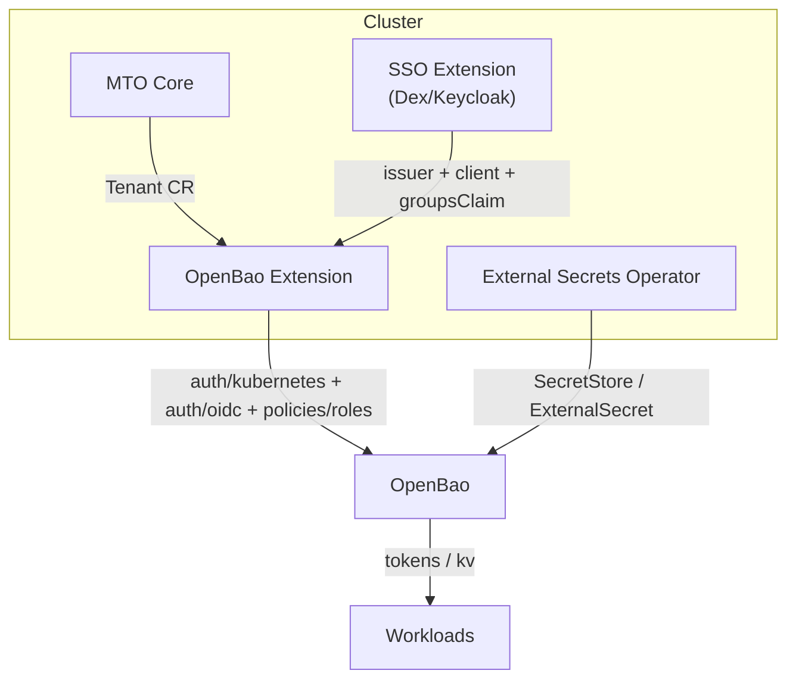

# MTO OpenBao Extension

> **Purpose:** A single source of truth for deploying, operating, and extending the **MTO OpenBao Extension (OBX)**. It serves both **platform engineers** (how to install/use) and **developers** (how it works under the hood).

---

## 1) What is it?

The OpenBao Extension (OBX) integrates **OpenBao** (Vault‑compatible) with **MTO Tenants** to deliver:

* Per‑tenant **KV v2** secret isolation (and optional **Transit** / **PKI** prefixes).
* **Kubernetes auth** for workloads (ServiceAccounts) and **OIDC/JWT** for humans (via SSO extension, e.g., Dex/Keycloak/Entra).
* Optional app‑level auto‑scaffolding via **External Secrets Operator (ESO)** or **CSI Secrets Store**.

> OBX **does not** install or operate the Bao cluster; it wires Bao to your MTO tenants.

---

## 2) Audience

* **Platform engineers:** Install/configure, define policies, enable tenants/app teams, troubleshoot.
* **Developers of OBX:** Understand controllers, Day‑0/1/2 flows, CRDs, idempotency and tests.

---

## 3) Architecture



---

## 4) Scope & Boundaries

* **OBX manages (on Bao):** `auth/kubernetes`, `auth/oidc|jwt`, tenant policies, roles, identity groups & aliases, and optional SecretStore/ESO objects in Kubernetes.
* **SSO extension manages:** Your IdP (Dex/Keycloak/Entra) & publishes an SSO **contract** (issuer, groupsClaim, `openbao` clientID/secret, group patterns) via CR **status** or a labeled **Secret**.
* **Out of scope:** Operating Bao (HA, storage, unseal, backup/restore, DR).

---

## 5) Prerequisites

1. **OpenBao** reachable (`https://bao.example.com:8200`) and a **scoped management token** (least privilege; see Appendix A policy).
2. **SSO extension** installed and configured; publishes **issuer**, **groupsClaim**, and `openbao` client.
3. **External Secrets Operator** (if using ESO mode), or **CSI Secrets Store** if using CSI.
4. **Network/TLS**: Pods allowed to egress to Bao; trust chain available.

---

## 6) Path Schema & Conventions

* **KV v2 path template:** `secret/tenants/<tenant>/<env>/<namespace>/<app>/<name>`
* **Default environment:** `prod` (configurable).
* **Granularity modes:**
  * `namespace` (default, simplest): one role per tenant namespace.
  * `app` (optional, tighter): one role per app SA.
* **Opt‑in scaffolding**: annotate Deployments/SS/CronJobs to auto‑generate ExternalSecrets.

---

## 7) Install (Platform Engineer)

### 7.1 Create namespace & install controller

```bash
kubectl create ns mto-system || true
helm upgrade --install mto-openbao-extension \
  oci://<your-registry>/mto-openbao-extension \
  -n mto-system \
  -f values.yaml
```

### 7.2 Provide Bao credentials (scoped)

```bash
kubectl -n mto-system create secret generic openbao-credentials \
  --from-literal=token=<BAO_OPERATOR_TOKEN>
```

### 7.3 Create OpenBaoExtension CR

#### Iteration # 1

```yaml
apiVersion: security.mto.stakater.com/v1alpha1
kind: OpenBaoIntegration
metadata:
  name: openbao-integration
  namespace: mto-system

spec:
  server:
    url: https://bao.example.com:8200
    tokenSecretRef:
      name: openbao-credentials
      key: token

  # --- What parts of Bao auth the operator should manage ---
  authManagement:
    kubernetes: ensure                  # off | ensure  → mount/configure auth/kubernetes for workload SAs
    oidc: ensure                        # off | ensure  → mount/configure auth/oidc (or jwt) for human users

  # --- Where OIDC settings come from (your SSO extension publishes this contract) ---
  sso:
    mode: cluster              # cluster | secret | inline | disabled
    clusterRef:
      name: default
    roleResolution:
      # Evaluate per-tenant: extract {{ .tenant }} from matched group; do not cross tenants.
      # If multiple groups match within the same tenant, apply tieBreakStrategy.
      claim: groups
      patterns:
        - role: owner
          match: "tenant-{{ .tenant }}-owners"
        - role: editor
          match: "tenant-{{ .tenant }}-editors"
        - role: viewer
          match: "tenant-{{ .tenant }}-viewers"
      tieBreakStrategy: highest   # highest | lowest | deny -> deny = no role if >1 match.
      fallback: deny

  # --- Tenancy model + defaults used in path templates, roles, etc. ---
  tenancy:
    mode: path                 # path | namespace (path = works on OSS; namespace for enterprise builds later)
    defaults:
      env: prod

  # --- Naming & path templates (reused by engines below) ---
  layout:
    templates:
      # Logical KV path (operator maps to data/ & metadata/ endpoints internally)
      kv: "secret/tenants/{{ .tenant }}/{{ .env }}/{{ .namespace }}/{{ .app }}/{{ .name }}"

  # --- RBAC granularity for workload access (Kubernetes auth roles) ---
  rbac:
    roleScope: namespace              # namespace | app
    token:
      ttl: 1h
      maxTTL: 4h
      #renewable: true

  # Bao policy roles: admin | editor | viewer | none
  tenantRoleMapping:
    # data: [create,update,patch,delete,read,list]; metadata: [read,list,delete]
    owner:  admin
    # data: [create,update,patch,read,list];        metadata: [read,list]
    editor: editor
    # data: [read,list];                            metadata: [read,list]
    viewer: viewer

  engines:
    - name: kv
      type: kv-v2
      layoutRef: kv
      enabled: true

      # Mount strategy: using a shared cluster mount "secret" (works everywhere). No destructive ops.
      strategy:
        scope: cluster                  # cluster = one shared mount (secret); tenant = per-tenant mount
        mount:
          path: secret                  # i.e., /v1/secret (kv-v2)
          manage: adopt                 # off | adopt | ensure → adopt uses if present; ensure creates if missing

      policies:
        presets: [admin, editor, viewer, none]

      # How apps get secrets:
      projection:
        mode: external-secrets          # external-secrets | csi | none
        secretStore:
          scope: namespace              # namespace | cluster
          name: openbao

  # --- App-level scaffolding: only create ExternalSecrets when apps opt in via annotations ---
  scaffolding:
    mode: on-annotation                  # none | on-annotation
    annotations:
      enable: "mto.secrets/enable"      # "true" to enable for the workload
      keys:   "mto.secrets/keys"        # comma-separated logical keys (e.g., "db,api,license")
      env:    "mto.secrets/env"         # optional: override env per workload (tenancy.defaults.env otherwise)

  # --- Safety guardrails: avoid destructive operations in production by default ---
  safety:
    allowDeletes: false                 # in kv-v2, by default "delete" hides a version of the secret. "destroy" deletes it.
```

#### Iteration # 2

```yaml
# OpenBaoIntegration — wires MTO tenants to an existing OpenBao (Vault-compatible) cluster.
# - Ensures Bao auth backends (Kubernetes for workloads, OIDC for humans)
# - Creates per-tenant policies/roles and optional ESO scaffolding
# - Supports a GLOBAL shared KV subtree owned by a designated “platform” (or similar) tenant
apiVersion: security.mto.stakater.com/v1alpha1
kind: OpenBaoIntegration
metadata:
  name: cluster-default                 # Typically one per cluster
  namespace: mto-system

spec:
  # ---- Connection to OpenBao (lean + secure) ----
  connection:
    url: https://bao.example.com:8200
    tokenSecretRef:                      # Least-privilege operator token (Secret must be in this namespace)
      name: openbao-credentials
      key: token
    # caBundleSecretRef: { name: bao-ca, key: ca.crt }   # OPTIONAL: if Bao uses a private CA
    # insecureSkipVerify: false                          # OPTIONAL: dev-only; do not use in prod

  # ---- Which Bao auth backends to manage on Bao itself ----
  manageAuth:
    kubernetes: Ensure                   # Off | Ensure → mount/configure auth/kubernetes for workload SAs
    oidc: Ensure                         # Off | Ensure → mount/configure auth/oidc (uses SSO contract below)

  # ---- Where OIDC settings (issuer, client, groupsClaim) come from (shared across extensions) ----
  sso:
    source: FromClusterSSO               # FromClusterSSO | FromBindingSecret | Inline
    ref: { name: default }               # e.g., ClusterSSO "default" published by your SSO extension
    # inline:                            # Fallback only if you don't ship the SSO extension
    #   issuer: https://dex.mto.svc.cluster.local
    #   clientID: vault-openbao
    #   clientSecretRef: { name: sso-openbao-client, namespace: mto-system, key: clientSecret }
    #   groupsClaim: groups
    #
    # SSO extension typically publishes tenant role group patterns, e.g.:
    #   owner:  "tenant-{{ .tenant }}-owners"
    #   editor: "tenant-{{ .tenant }}-editors"
    #   viewer: "tenant-{{ .tenant }}-viewers"

  # ---- Tenancy model + defaults used in path templates ----
  tenancy:
    mode: path                           # 'path' works on OSS; future 'namespace' if using enterprise namespaces
    defaults:
      env: prod                          # Default env if app doesn't set mto.secrets/env

  # ---- Naming & path templates (DRY, reused by engines) ----
  layout:
    templates:
      # Tenant-private KV path → tenant/env/namespace/app/name
      kv: "secret/tenants/{{ .tenant }}/{{ .env }}/{{ .namespace }}/{{ .app }}/{{ .name }}"
      # GLOBAL shared KV path (owned by a designated tenant; consumed RO by others)
      sharedKv: "secret/shared/{{ .name }}"
      # Transit key naming (if you enable Transit later)
      transitKey: "ten-{{ .tenant }}-{{ .namespace }}-{{ .app }}"
      # Per-tenant PKI mount path (if you enable PKI later)
      pkiMount: "pki/tenants/{{ .tenant }}"

  # ---- RBAC for workloads (Kubernetes auth roles) ----
  rbac:
    granularity: namespace               # namespace (default) | app (tighter; more roles)
    tokenTTL: 1h
    tokenMaxTTL: 4h

  # ---- Default mapping from MTO Tenant human roles → Bao policy presets (or 'none') ----
  # Controls what **humans via OIDC** get for the tenant-private space; workloads are unaffected.
  # Allowed targets per role: 'admin' | 'editor' | 'viewer' | 'none'
  humanRoleMapping:
    owner:  admin                        # Owners → full admin (RW + delete)
    editor: editor                       # Editors → RW (no delete)
    viewer: none                         # Viewers → no access by default (set to 'viewer' for RO if you want it)

  # ---- Engines (KV enabled; Transit/PKI shown as optional and disabled) ----
  engines:
    # 1) KV (secrets) — primary engine
    - name: kv
      type: kv-v2
      enabled: true

      strategy:
        scope: cluster                   # shared 'secret' mount (cluster scope); no per-tenant mount needed
        mount:
          path: secret
          manage: Adopt                  # Off | Adopt | Ensure (non-destructive default)

      # Policy presets rendered to HCL:
      #   admin  → data: [create,update,patch,delete,read,list]; metadata: [read,list,delete]
      #   editor → data: [create,update,patch,read,list];       metadata: [read,list]
      #   viewer → data: [read,list];                           metadata: [read,list]
      policies:
        presets: [admin, editor, viewer]
        # extras: []                     # OPTIONAL: append custom HCL rules if needed

      # ---- GLOBAL shared KV subtree (read by many; written by a designated owner tenant) ----
      shared:
        enabled: true
        layoutRef: sharedKv              # Use the shared template above: "secret/shared/{{ .name }}"

        # Who OWNS and WRITES the shared subtree (humans via OIDC or CI under this tenant):
        ownerTenantRef:
          name: platform                 # e.g., your “platform” tenant that manages global secrets

        # Who may CONSUME the shared subtree (read-only by default)
        consumers:
          tenantSelector: "*"            # "*" = all tenants; or a label selector like 'mto.team in (shop)'
          workloads:
            mode: ro                     # ro | none → extend k8s auth roles with RO to shared/*
          humans:
            mapping:                     # owner/editor/viewer of consuming tenants → preset or none (for shared only)
              owner:  viewer             # human owners/editors get RO to shared/*
              editor: viewer
              viewer: none               # human viewers have no shared access by default

      # How apps receive secrets (ESO recommended; CSI supported)
      injection:
        mode: external-secrets           # external-secrets | csi | none
        secretStore:
          perNamespace: true             # One SecretStore per tenant namespace
          nameTemplate: "openbao"        # Fixed name for predictability

      # App annotations for shared keys (tenant-private keys are configured in scaffolding.annotations below)
      annotations:
        sharedKeys: "mto.secrets/sharedKeys"   # comma-separated list of keys from the GLOBAL shared subtree

      layoutRef: kv                       # Use the tenant-private kv template above

    # 2) Transit — OPTIONAL (disabled)
    - name: transit
      type: transit
      enabled: false
      strategy:
        scope: cluster
        mount: { path: transit, manage: Adopt }
      transit:
        autoCreateKeyPerApp: true
        keyNameTemplate: "{{ .layout.transitKey }}"
        keyConfig: { type: aes256-gcm96, convergent_encryption: false }
      policies:
        presets: [admin]
      injection: { mode: none }

    # 3) PKI — OPTIONAL (disabled)
    - name: pki
      type: pki
      enabled: false
      strategy:
        scope: tenant
        mount: { pathTemplate: "{{ .layout.pkiMount }}", manage: Ensure }
      pki:
        maxLeaseTTL: 8760h
        intermediate: true
        roles:
          - nameTemplate: "{{ .tenant }}-svc"
            allowed_domains: ["{{ .namespace }}.svc.cluster.local"]
            allow_subdomains: true
            max_ttl: 720h
      injection:
        certManager:
          enabled: true
          issuerKind: Issuer
          nameTemplate: "{{ .tenant }}-pki"
          authRoleNameTemplate: "ten-{{ .tenant }}-pki"

  # ---- App-level scaffolding: create ESO/CSI objects only when workloads opt in ----
  scaffolding:
    mode: OnAnnotation
    annotations:
      enable: "mto.secrets/enable"       # "true" to enable for the workload
      keys:   "mto.secrets/keys"         # comma-separated tenant-private keys (e.g., "db,api,license")
      sharedKeys: "mto.secrets/sharedKeys"  # comma-separated keys from GLOBAL shared subtree
      env:    "mto.secrets/env"          # optional per-workload env (defaults.tenancy.env otherwise)

  # ---- Safety: production guardrail (non-destructive by default) ----
  safety:
    deletionProtection: true  # Never DELETE OpenBao control-plane resources (auth/engine mounts, policies, roles, identity groups/aliases); create/update only. KV secret data is never deleted.
```

> Tenant namespaces are typically created/selected by the **Tenant CR** in MTO. OBX detects them automatically.

---

## 8) Using it (Platform Engineer & App Teams)

### 8.1 Annotate an app to consume secrets (ESO mode)

```yaml
metadata:
  annotations:
    mto.secrets/enable: "true"
    mto.secrets/keys:   "db,api,license"
    mto.secrets/env:    "prod"    # optional, overrides defaultEnv
```

OBX creates **ExternalSecret** objects per key which project Bao values into K8s Secrets (ESO sync).

### 8.2 Write secrets to Bao (humans via OIDC or CI bots)

```
secret/tenants/acme/prod/acme-payments/api/db
  ├─ username=...
  └─ password=...

secret/tenants/acme/prod/acme-payments/api/api
  └─ value=...
```

### 8.3 Consume in Pods

```yaml
envFrom:
  - secretRef: { name: api-db }
  - secretRef: { name: api-api }
```

> **Alternative:** Use CSI Secrets Store (`injection.mode: csi`) or call Bao directly with Kubernetes auth tokens.

---

## 9) Lifecycle — Day‑0 / Day‑1 / Day‑2

### 9.1 By Auth Backend × Scope

#### Kubernetes Auth (workloads)

* **Day‑0 (cluster):** OBX ensures `auth/kubernetes` mounted+configured (kube host & CA).
* **Day‑1 (tenant/ns/app):**

  * Policies `<tenant>-admin`/`-viewer` and namespace/app‑scoped variants.
  * Roles bound to SAs: `ten-<tenant>-ns-<ns>-rw` (namespace granularity) or per‑app roles.
  * Per‑namespace **SecretStore** for ESO.
  * On app annotation, **ExternalSecrets** are created per key.
* **Day‑2 (ops):** rotate CA/endpoint, adjust TTLs, reconcile drift, GC ExternalSecrets on opt‑out (no Bao data deletion by default).

#### Matrix

| Scope         | Day-0 (once/cluster)                                                                    | Day-1 (per tenant / ns / app)                                                                                                                                                                                                                                                                                                                   | Day-2 (ops)                                                                                                                                                      |
| ------------- | --------------------------------------------------------------------------------------- | ----------------------------------------------------------------------------------------------------------------------------------------------------------------------------------------------------------------------------------------------------------------------------------------------------------------------------------------------- | ---------------------------------------------------------------------------------------------------------------------------------------------------------------- |
| **Cluster**   | Ensure `auth/kubernetes` is mounted & configured (`kubernetes_host`, CA). Never delete. | —                                                                                                                                                                                                                                                                                                                                               | Re-sync CA/endpoint if the cluster rotates; alert on drift; optional canary reconcile.                                                                           |
| **Tenant**    | —                                                                                       | Create **policies**:<br>• `<ten>-admin` (RW under `secret/tenants/<ten>/*`)<br>• `<ten>-viewer` (RO under same)<br>Optionally ensure `transit/` & `pki/` mount prefixes for `<ten>` when enabled.                                                                                                                                               | Rotate policy templates if schema changes (no breaking deletes).                                                                                                 |
| **Namespace** | —                                                                                       | Create **roles** bound to SAs in the tenant namespace(s).<br>Role: `ten-<ten>-ns-<ns>-rw` → policy `<ten>-ns-<ns>-rw` (RW under `.../<ns>/*`).<br>Create **SecretStore** (ESO) in each tenant ns pointing to Bao with the role above.                                                                                                           | Bump TTLs, rotate role names on namespace rename, reconcile SA bindings; re-issue SecretStore on cert changes.                                                   |
| **App**       | —                                                                                       | **Opt-in** via annotations on Deployments/StatefulSets/CronJobs:<br>`mto.secrets/enable: "true"`<br>`mto.secrets/keys: "db,api,license"`<br>`mto.secrets/env: "prod\|staging\|dev"`<br>Operator generates `ExternalSecret`(s) per key mapping to the path schema. If `granularity=app`, also create an app-specific role bound to the app’s SA. | Rolling rotation of projected K8s Secrets (ESO refresh interval); handle app SA changes; GC `ExternalSecret`s on annotation removal (with a soft-delete window). |

#### OIDC/JWT Auth (humans)

* **Day‑0 (cluster):** OBX reads SSO contract → ensures `auth/oidc` (or `auth/jwt`) with `issuer`, `clientID/secret`, `groupsClaim`, `redirectURIs`.
* **Day‑1 (tenant):** Create **identity groups** `<tenant>-admins/viewers` and **group‑aliases** mapping IdP groups to these, then attach policies.
* **Day‑2 (ops):** react to client secret/JWKS rotations; support group rename migrations with grace windows.

#### Matrix

| Scope         | Day-0 (once/cluster)                                                                                                                                                        | Day-1 (per tenant / ns / app)                                                                                                                                                                                                                                                                              | Day-2 (ops)                                                                                                       |
| ------------- | --------------------------------------------------------------------------------------------------------------------------------------------------------------------------- | ---------------------------------------------------------------------------------------------------------------------------------------------------------------------------------------------------------------------------------------------------------------------------------------------------------- | ----------------------------------------------------------------------------------------------------------------- |
| **Cluster**   | Ensure `auth/oidc` (or `auth/jwt`) mounted & configured from **SSO contract**:<br>`issuer`, `clientID`, `clientSecret`, `groupsClaim`, `redirectURIs`. Never delete mounts. | —                                                                                                                                                                                                                                                                                                          | React to SSO rotations (client secret/issuer/JWKS); reconcile safely; pause on invalid JWKS to avoid auth outage. |
| **Tenant**    | —                                                                                                                                                                           | Create **identity groups** in Bao: `<ten>-admins`, `<ten>-viewers`.<br>Create **group-aliases** mapping IdP group strings (from SSO patterns, e.g., `tenant-<ten>-admins`) **onto** those identity groups on the `oidc` mount.<br>Attach **policies** (`<ten>-admin` / `<ten>-viewer`) to identity groups. | Handle IdP group rename/migration (keep old alias for grace period); reconcile alias mount accessor changes.      |
| **Namespace** | —                                                                                                                                                                           | (No extra objects; humans inherit tenant policies.) Optional finer split: `<ten>-ns-<ns>-admins/viewers` for very large tenants.                                                                                                                                                                           | Update aliases if namespace-scoped human roles are used.                                                          |
| **App**       | —                                                                                                                                                                           | (Usually nothing.) If you run “app operators” needing human OIDC tokens, bind additional RO policies if needed.                                                                                                                                                                                            | N/A                                                                                                               |

### 9.2 Status reporting

#### 9.2.1 Status in OpenBaoExtension

Minimal and greppable:

```yaml
status:
  observedGeneration: 1
  phase: Ready
  conditions:
    - type: Ready
      status: "True"
      reason: AllTenantsReconciled
      message: All tenants have been successfully reconciled with OpenBao.
      lastTransitionTime: "2025-09-02T20:00:00Z"
    - type: OpenBaoConnectionEstablished
      status: "True"
      reason: ConnectionSuccessful
      message: Successfully connected to OpenBao at https://bao.example.com:8200.
      lastTransitionTime: "2025-09-02T19:58:30Z"
    - type: SSOBackendReconciled
      status: "True"
      reason: AuthBackendEnabled
      message: OIDC and Kubernetes auth backends are configured and enabled.
      lastTransitionTime: "2025-09-02T19:59:00Z"
  tenantStatus:
    totalTenants: 15
    reconciledTenants: 15
    failedTenants: 0
    failures:
      - tenant: "my-tenant-1"
        namespace: "my-app-namespace"
        error: "Failed to create policy for service account 'my-app-sa': permission denied"
        lastErrorTime: "2025-09-02T19:00:00Z"
```

#### 9.2.2 OpenBaoTenantStatus (status-only report CRD)

Per-tenant health/report object for the MTO OpenBao extension—no secrets, no writes to Tenant.status, just a clean, kubectl-friendly summary.

##### Why this pattern

* Mirrors community practice (e.g., PolicyReport, VulnerabilityReport).
* Keeps operational state separate from business CRDs.
* Low-cardinality, safe to scrape and alert on.

##### What it covers (minimal)

* Standard Conditions: Ready, AuthKubernetesReady, AuthOIDCReady.
* KV summary: path prefix + ESO counts (ready/notReady) + managed ExternalSecrets.
* Auth rollup: SA roles present, OIDC issuer resolved.
* Timestamps & last error (if any).

```yaml
apiVersion: security.mto.stakater.com/v1alpha1
kind: OpenBaoTenantStatus
metadata:
  name: acme
  labels:
    mto.stakater.com/tenant: acme
  ownerReferences:                # optional: if Tenant is cluster-scoped, for GC
    - apiVersion: tenancy.mto.stakater.com/v1alpha1
      kind: Tenant
      name: acme
      uid: "d1f3c0a1-..."
      controller: true
      blockOwnerDeletion: false
spec:
  tenantRef:
    name: acme
    uid: "d1f3c0a1-..."
status:
  conditions:
    - type: Ready               ; status: "True"  ; reason: AllEnginesReady
    - type: AuthKubernetesReady ; status: "True"  ; reason: MountedAndConfigured
    - type: AuthOIDCReady       ; status: "True"  ; reason: MountedAndConfigured
  kv:
    ready: true
    pathPrefix: "secret/tenants/acme/"
    secretStores:   { ready: 4, notReady: 0 }
    externalSecrets: { managed: 28, ready: 27 }
  kubernetesAuth:
    ready: true
    roles: ["ten-acme-ns-payments-rw","ten-acme-ns-ml-rw"]
  oidc:
    ready: true
    issuer: "https://dex.mto.svc.cluster.local"
    groupsClaim: "groups"
  lastSyncTime: "2025-09-03T09:10:00Z"
```

---

## 10) Operations & Security (Platform Engineer)

* **Least privilege:** use an OBX token with policy in Appendix A. Never use root.
* **No destructive defaults:** OBX creates/patches; it does not delete auth mounts nor secret data.
* **NetworkPolicies:** restrict egress to Bao from only needed namespaces.
* **KMS/etcd encryption:** enable if using ESO to encrypt K8s Secrets at rest.
* **Observability:** Prometheus metrics
  * `openbao_reconcile_seconds{kind=...,result=...}`
  * `openbao_api_requests_total{path=...,status=...}`
  * `openbao_secretstore_status{namespace=...,ready=0|1}`

---

## 11) Developer Guide (How it Works)

### 11.1 Controllers (reconcilers)

* **ClusterAuthReconciler**

  * Inputs: `OpenBaoExtension`, SSO contract (ClusterSSO/Secret)
  * Ensures: `auth/kubernetes`, `auth/oidc|jwt` config; emits clusterAuth ready status
  * Non‑destructive: never deletes mounts
* **TenantBaoReconciler**

  * Inputs: `Tenant` CR, `OpenBaoExtension`
  * Ensures per‑tenant policies, identity groups, group‑aliases
  * For each tenant namespace: K8s auth roles + SecretStore (ESO mode)
* **AppSecretReconciler**

  * Watches: Deployments/StatefulSets/CronJobs in tenant namespaces
  * On `mto.secrets/enable: "true"`: generate/update ExternalSecrets per `mto.secrets/keys`

### 11.2 Watches & scale hygiene

* Watch **only** namespaces selected by the Tenant CR.
* Filter on relevant annotations/labels to reduce churn.
* Use **idempotent** upserts; tolerate out‑of‑order events.

### 11.3 Drift & deletion policy

* **Auth mounts:** create/patch only; never delete automatically.
* **Policies/Roles/Groups:** patch on drift; deletion behind a feature flag with safeguard (rare).
* **ExternalSecrets:** GC on annotation removal (soft‑delete window recommended).

### 11.4 Templates (renderers)

* **Policy HCL — namespace RW:**

```hcl
path "secret/data/tenants/{{tenant}}/{{env}}/{{namespace}}/*" {
  capabilities = ["create","update","patch","delete","read","list"]
}
path "secret/metadata/tenants/{{tenant}}/{{env}}/{{namespace}}/*" {
  capabilities = ["read","list","delete"]
}
```

* **Role JSON — namespace RW:**

```json
{
  "bound_service_account_names": ["*"],
  "bound_service_account_namespaces": ["{{namespace}}"],
  "policies": ["ten-{{tenant}}-ns-{{namespace}}-rw"],
  "token_ttl": "1h",
  "token_max_ttl": "4h"
}
```

* **OIDC config & role (human-default):**

```json
{
  "oidc_discovery_url": "https://dex.mto.svc.cluster.local",
  "oidc_client_id": "vault-openbao",
  "oidc_client_secret": "<from Secret>",
  "default_role": "human-default",
  "bound_issuer": "https://dex.mto.svc.cluster.local"
}
```

```json
{
  "user_claim": "email",
  "groups_claim": "groups",
  "allowed_redirect_uris": [
    "https://bao.example.com/ui/vault/auth/oidc/oidc/callback",
    "https://bao.example.com/v1/auth/oidc/oidc/callback"
  ]
}
```

### 11.5 Testing strategy (TDD/e2e)

* **Unit:** golden tests for renderers (HCL/JSON) with fixtures across tenant/ns/app/env.
* **Envtest:** controller-runtime fake API server; verify SecretStore/ExternalSecrets creation on annotations.
* **Kind e2e:** spin Bao (dev), ESO, Dex (from SSO), apply OBX + Tenant; assert SA login, OIDC login, KV access.
* **Fault injection:** rotate Dex client secret & Kubernetes CA; assert non‑destructive reconcile.

### 11.6 Performance notes

* Avoid listing across all namespaces; restrict informers to tenant‑selected namespaces.
* Batch Bao API calls where safe; exponental backoff on 429/5xx.
* Metrics for reconcile duration and Bao API latency; feature flag for sampling rate.

---

## 12) Appendices

### Appendix A — OBX Bao Policy (least privilege)

```hcl
path "sys/auth"            { capabilities = ["read", "list", "update"] }
path "sys/auth/*"          { capabilities = ["read", "list", "update"] }
path "sys/policies/acl/*"  { capabilities = ["create", "read", "update", "list"] }
path "auth/*/role/*"       { capabilities = ["create", "read", "update", "list"] }
path "identity/group"      { capabilities = ["create", "read", "update", "list"] }
path "identity/group/*"    { capabilities = ["create", "read", "update", "list"] }
path "identity/group-alias"   { capabilities = ["create", "read", "update", "list"] }
path "identity/group-alias/*" { capabilities = ["create", "read", "update", "list"] }
path "secret/*"            { capabilities = ["read", "list"] }
path "secret/data/tenants/*"     { capabilities = ["create","update","patch","delete","read","list"] }
path "secret/metadata/tenants/*" { capabilities = ["read","list","delete"] }
```

### Appendix B — Annotations cheat‑sheet

```yaml
metadata:
  annotations:
    mto.secrets/enable: "true"
    mto.secrets/keys:   "db,api,license"
    mto.secrets/env:    "prod"
```

### Appendix C — Example ExternalSecret (generated)

```yaml
apiVersion: external-secrets.io/v1beta1
kind: ExternalSecret
metadata:
  name: api-db
  namespace: acme-payments
spec:
  refreshInterval: 5m
  secretStoreRef: { name: openbao, kind: SecretStore }
  target: { name: api-db }
  data:
    - secretKey: username
      remoteRef:
        key: secret/tenants/acme/prod/acme-payments/api/db
        property: username
    - secretKey: password
      remoteRef:
        key: secret/tenants/acme/prod/acme-payments/api/db
        property: password
```

### Appendix D — App‑level RBAC (optional, tighter)

```hcl
path "secret/data/tenants/{{tenant}}/{{env}}/{{namespace}}/{{app}}/*" {
  capabilities = ["create","update","patch","delete","read","list"]
}
path "secret/metadata/tenants/{{tenant}}/{{env}}/{{namespace}}/{{app}}/*" {
  capabilities = ["read","list","delete"]
}
```

### Appendix E — CSI Secrets Store (outline)

* Switch `injection.mode: csi`.
* OBX renders a `SecretProviderClass` per annotated app/keys.
* Pods mount volume:

```yaml
volumes:
- name: bao-secrets
  csi:
    driver: secrets-store.csi.k8s.io
    readOnly: true
    volumeAttributes:
      secretProviderClass: <generated-name>
```
