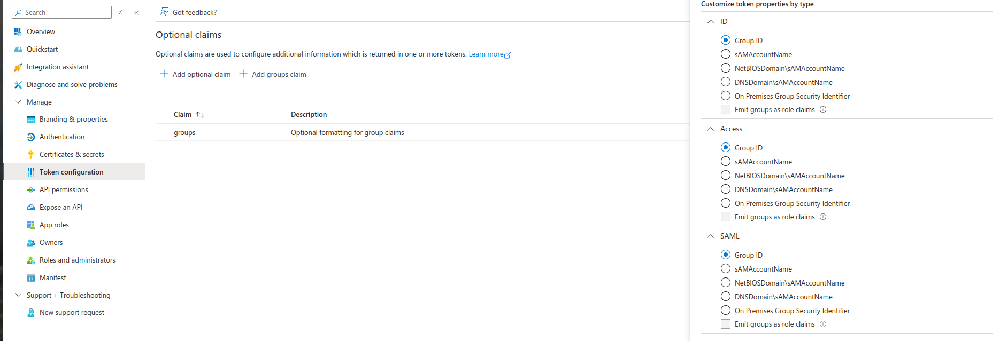
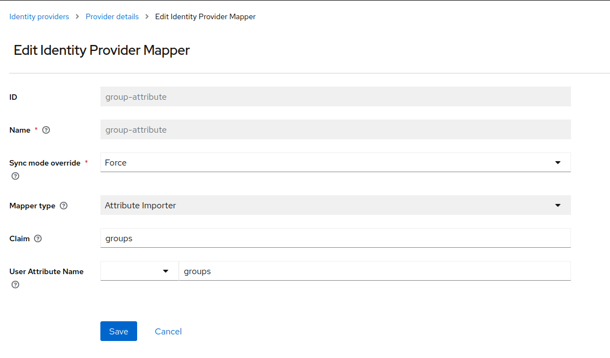
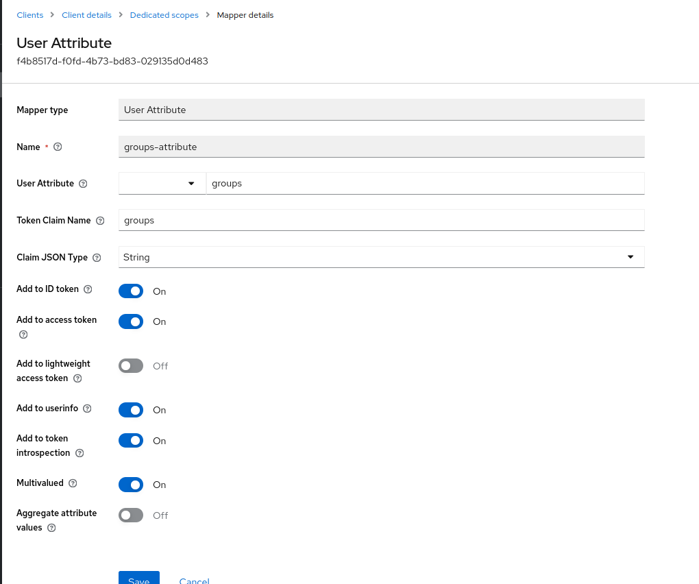

# Integrating Vault and Keycloak with Microsoft Entra ID

This guide provides step-by-step instructions for integrating **Vault** with **Keycloak** using **Microsoft Entra ID** for OIDC-based authentication. The setup focuses on using **group IDs** for access control, as Microsoft Entra ID only provides group IDs in its tokens, not group names.

## Prerequisites

- Microsoft Entra ID configured for OIDC.
- Keycloak setup with an Identity Provider (IDP) pointing to Microsoft Entra ID.
- Hashicorp Vault installed and configured.
- [Vault Configured in IntegrationConfig](./vault-ic.md)

## Steps to Implement Group-Based Access Control with Group IDs

### Step 1: Configure Microsoft Entra ID to Include Group IDs in Tokens

1. **Navigate to Microsoft Entra ID:**
   - Go to **Microsoft Entra ID → App Registrations**.

1. **Set up Optional Claims:**
   - In the Microsoft Entra ID App Registration for your Keycloak, configure an **optional claim** for the app configured with keycloak to include **group IDs** in the tokens.

   

### Step 2: Create an Attribute Importer Mapper in Keycloak

1. **Create Attribute Importer Mapper:**

   To configure the groups claim from Microsoft Entra ID in Keycloak, create a new mapper with the following settings as shown in the image:

    - Mapper Type: User Attribute
    - User Attribute: groups
    - Claim: groups
    - Sync Mode: FORCE

   

### Step 3: Set Up a Mapper for Vault Client in Keycloak

1. **Create ProtocolMapper:**

    To configure the Protocol Mapper that forwards the groups attribute (containing group IDs) from the user's profile into the token, create a new mapper with the following settings as shown in the image:

   

### Step 4: Patch Tenant Spec with Microsoft Entra ID Group IDs for RBAC

1. **Add group IDs:**
   - Modify the existing **Tenant** resource to include the Microsoft Entra ID group IDs under `accessControl`. This will ensure the correct group-based RBAC is applied for Vault.

1. **Example Tenant Spec:**
   Here’s an example of how to patch the **Tenant** with the group ID from Microsoft Entra ID:

   ```yaml
   apiVersion: tenantoperator.stakater.com/v1beta3
   kind: Tenant
   metadata:
     name: arsenal
   spec:
     accessControl:
       owners:
         groups:
           - <object-id>
   ```

   - **`owners.groups`** should be updated with the relevant Microsoft Entra ID group IDs to enforce access control based on the users’ group memberships.

   

## Conclusion

By following these steps, you can successfully integrate Vault with Keycloak for OIDC authentication, using Microsoft Entra ID group IDs for access control. This configuration allows for granular, group-based permissions while working with the limitations of Microsoft Entra ID’s token output.
