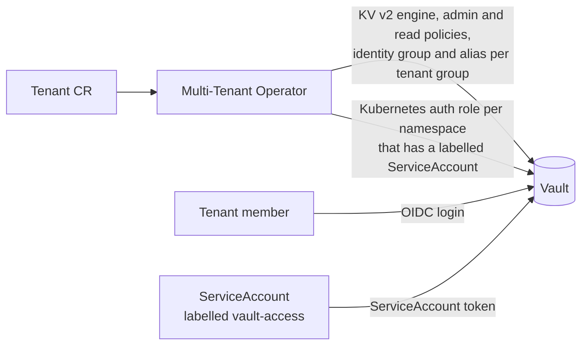
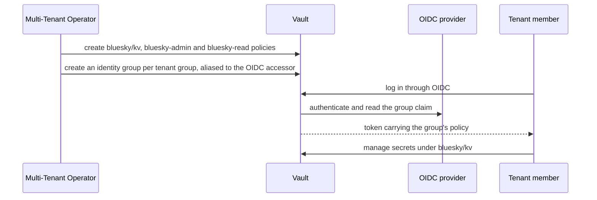
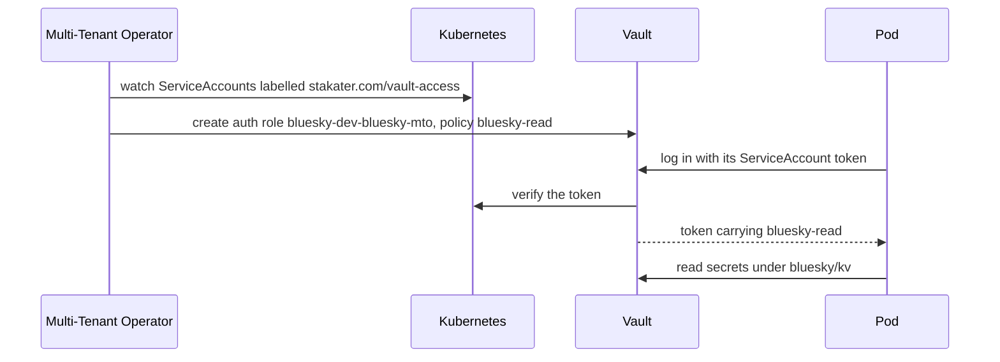
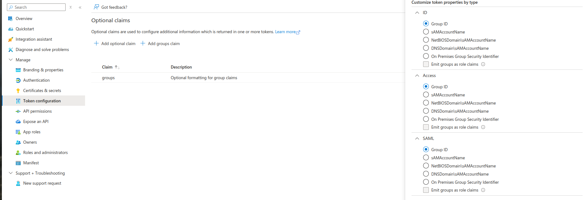
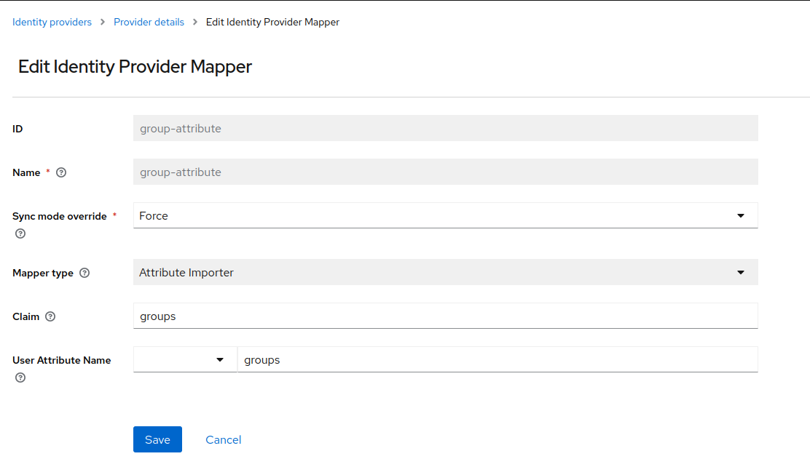
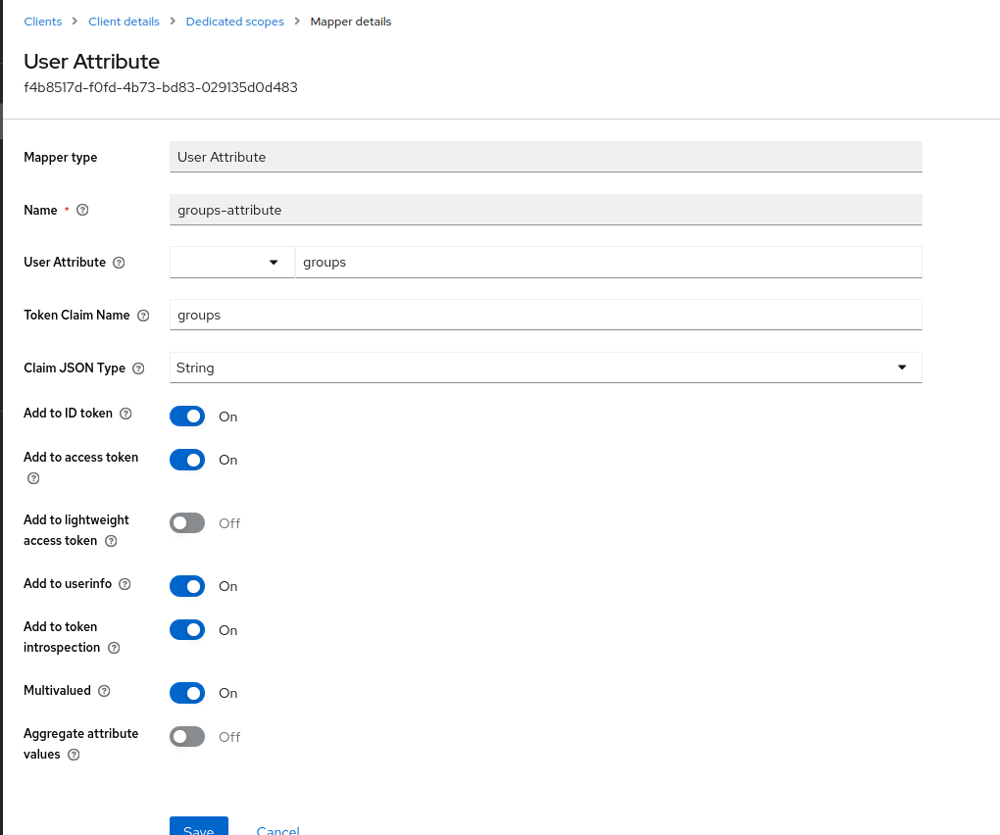
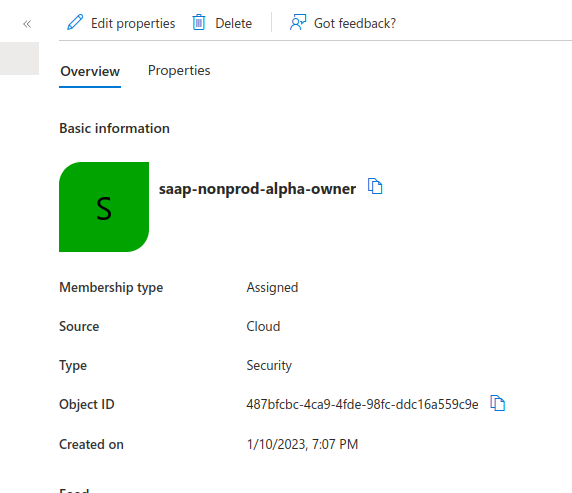

# Vault

[Vault](https://www.vaultproject.io/) is an identity-based secret and encryption management system: it validates and authorizes a client — a person, a machine or an application — before giving it access to a secret.

With the Multi-Tenant Operator (MTO), cluster administrators can configure multi-tenancy within their cluster. The Vault integration extends that multi-tenancy into Vault: every tenant gets its own KV secrets engine, along with the policies, identity groups and Kubernetes auth roles that let tenant members and their workloads reach that engine and nothing else.

Note that Vault integration in MTO is optional.

## What it saves you

Setting a tenant up in Vault by hand means creating, per tenant: a KV secrets engine; an admin policy and a read policy; an identity group for every identity-provider group that should have access, and a group alias on the OIDC accessor for each; and a Kubernetes auth role for every namespace whose workloads need to read secrets. All of it has to be revisited whenever a namespace is added, a team's group membership changes, or a tenant is removed.

MTO derives all of it from the `Tenant` resource you already maintain, and keeps it in step as the tenant changes — creating what is now needed and removing what no longer applies.

The other half is what it removes from application teams. A developer never writes a Vault policy and never holds a static Vault credential. They add one label to a ServiceAccount, and the pod authenticates with the token Kubernetes already gives it.



*Per tenant, the only two things written by hand are the `Tenant` resource and a label on a ServiceAccount. Everything inside Vault is derived from them.*

## What each tenant gets

| Capability | Default | What it is |
|:---|:---|:---|
| A private KV path | on | A KV version 2 secrets engine mounted at `<tenant>/kv`. Tenants cannot see or reach another tenant's path. |
| Human login | on | Tenant members sign in through the same OIDC identity provider as the cluster, and their IdP group membership places them in a Vault identity group. |
| Workload login | on | Pods authenticate with their Kubernetes service account token. No static Vault credentials are distributed. |
| A common shared path | on | One path, `commonSecretsPath`, shared by every tenant — writable by Owners, readable by Viewers. |
| Editor access | off | Editors get no Vault access unless a custom policy grants it. |
| Custom policies | off | The `policies` block in the IntegrationConfig grants extra access to any tenant role. |

MTO keeps all of it in step with the cluster: auth roles are removed when their namespace goes away, identity groups are deleted when they no longer match the tenant's access control, and custom policies are deleted when they are removed from the IntegrationConfig.

## How tenant roles map to Vault access

| Tenant role | Policy | Vault path | Capabilities |
|:---|:---|:---|:---|
| Owner | `<tenant>-admin` | `<tenant>/*` | Create, Read, Update, Delete, List |
| Owner | `<tenant>-admin` | `sys/mounts/<tenant>/*` | Create, Read, Update, Delete, List |
| Owner | `<tenant>-admin` | `<commonSecretsPath>/*` | Create, Read, Update, Delete, List |
| Viewer | `<tenant>-read` | `<tenant>/*` | Read, List |
| Viewer | `<tenant>-read` | `<commonSecretsPath>/*` | Read, List |
| Editor | — | — | No access by default |

Editors receive Vault access only through a custom policy in the IntegrationConfig whose `tenantRoles` includes `editor`. Without one, no Vault identity group is created for the tenant's editor groups.

Workloads get the tenant's `<tenant>-read` policy, whichever role their namespace's members hold.

## Setting up the integration

These three steps are done once per cluster, by a platform administrator, before any tenant gets a Vault path.

### Prerequisites

- A Vault instance reachable from the cluster.
- The [Kubernetes auth method](https://developer.hashicorp.com/vault/docs/auth/kubernetes) enabled in Vault — workloads always authenticate through it, and so does MTO itself when `authMethod` is `kubernetes`.
- An RHSSO (Red Hat Single Sign-On) instance integrated with Vault over the [OIDC login method](https://developer.hashicorp.com/vault/docs/auth/jwt), for user access.

### Enabling the integration

Administrators point MTO at Vault by adding the details to the [IntegrationConfig](../../concepts/integration-config.md#vault):

```yaml
apiVersion: tenantoperator.stakater.com/v1beta1
kind: IntegrationConfig
metadata:
  name: tenant-operator-config
  namespace: multi-tenant-operator
spec:
  integrations:
    vault:
      enabled: true
      authMethod: kubernetes
      accessInfo:
        accessorPath: oidc/
        address: https://vault.apps.prod.abcdefghi.kubeapp.cloud/
        roleName: mto
      config:
        ssoClient: vault
        commonSecretsPath: common-shared-secrets
```

`authMethod` accepts `kubernetes` (the default, shown above) or `token`. Token authentication uses a `secretRef` pointing at a secret holding a Vault token, instead of `roleName`.

`accessorPath` is the path of the OIDC auth mount in Vault. MTO reads its accessor ID and uses it to alias each tenant group to the identity provider.

`commonSecretsPath` is a single path shared by all tenants; it defaults to `common-shared-secrets` when unset. Every field, and the `policies` block for defining custom tenant policies, is described in the [IntegrationConfig documentation](../../concepts/integration-config.md#vault).

### Creating the Vault role for MTO

`roleName` above names a role under Vault's Kubernetes authentication, which is how MTO reaches Vault. Create that role with a policy granting the following permissions:

```hcl
path "secret/*" {
  capabilities = ["create", "read", "update", "patch", "delete", "list"]
}
path "sys/mounts" {
  capabilities = ["read", "list"]
}
path "sys/mounts/*" {
  capabilities = ["create", "read", "update", "patch", "delete", "list"]
}
path "managed-addons/*" {
  capabilities = ["read", "list"]
}
path "auth/kubernetes/role/*" {
  capabilities = ["create", "read", "update", "patch", "delete", "list"]
}
path "sys/auth" {
  capabilities = ["read", "list"]
}
path "sys/policies/*" {
  capabilities = ["create", "read", "update", "patch", "delete", "list"]
}
path "identity/group" {
  capabilities = ["create", "read", "update", "patch", "delete", "list"]
}
path "identity/group-alias" {
  capabilities = ["create", "read", "update", "patch", "delete", "list"]
}
path "identity/group-alias/id/*" {
  capabilities = ["create", "read", "update", "patch", "delete", "list"]
}
path "identity/group/name/*" {
  capabilities = ["create", "read", "update", "patch", "delete", "list"]
}
path "identity/group/id/*" {
  capabilities = ["create", "read", "update", "patch", "delete", "list"]
}
```

## Giving an application a secret

This is the path most people take, and everything else on this page builds on it: create the tenant, write a secret as one of its members, read it from a pod. The examples use tenant `bluesky` and its namespace `bluesky-dev`.

### 1. Create the tenant

Administrators create a tenant as usual. Vault access is granted by group: only the `groups` entries under `accessControl` produce Vault access, and `users` entries do not.

```yaml
apiVersion: tenantoperator.stakater.com/v1beta3
kind: Tenant
metadata:
  name: bluesky
spec:
  accessControl:
    owners:
      groups:
        - bluesky-owner-group
    viewers:
      groups:
        - bluesky-viewer-group
  quota: small
  namespaces:
    sandboxes:
      enabled: false
```

MTO then creates, for tenant `bluesky`:

- a KV version 2 secrets engine mounted at `bluesky/kv`;
- a `bluesky-admin` policy and a `bluesky-read` policy;
- an owner identity group named `bluesky`, plus one for each group under `owners.groups`, holding the `bluesky-admin` policy;
- an identity group for each group under `viewers.groups`, holding the `bluesky-read` policy;
- a group alias for each of those groups on the OIDC accessor, so a user's IdP group membership places them in the matching Vault group.

### 2. Write the first secret — user OIDC auth

Someone has to put a secret in. A member of an owner group signs in through OIDC and writes it; their IdP group membership is what carries the `bluesky-admin` policy.



```bash
vault login -method=oidc
vault kv put bluesky/kv/db-creds username=app password=s3cr3t
```

### 3. Label the ServiceAccount — service account auth

MTO enables the [Kubernetes auth method](https://developer.hashicorp.com/vault/docs/auth/kubernetes), which authenticates a client to Vault with a Kubernetes service account token. For every tenant namespace, MTO creates a Kubernetes auth role named `<namespace>-<tenant>-mto`, bound to that namespace and carrying the tenant's `<tenant>-read` policy.

Only service accounts labelled `stakater.com/vault-access: true` are bound to that role:

```yaml
apiVersion: v1
kind: ServiceAccount
metadata:
  name: bluesky-app
  namespace: bluesky-dev
  labels:
    stakater.com/vault-access: "true"
```

Adding or removing the label re-reconciles the namespace. If a namespace has no labelled service account, MTO deletes the role.



### 4. Read the secret from the pod

From a pod running as `bluesky-app`, exchange the service account token for a Vault token and read the secret written in step 2:

```bash
export VAULT_TOKEN=$(vault write -field=token auth/kubernetes/login \
  role=bluesky-dev-bluesky-mto \
  jwt=@/var/run/secrets/kubernetes.io/serviceaccount/token)

vault kv get bluesky/kv/db-creds
```

The role name is `<namespace>-<tenant>-mto`, so a pod in `bluesky-dev` owned by tenant `bluesky` uses `bluesky-dev-bluesky-mto`.

!!! note
    Workload access is read-only: the role carries the `<tenant>-read` policy. Writing secrets to a tenant's path is done by tenant members signed in through OIDC, or by a client using credentials you issue separately.

## Operating it

### Checking what was created

For tenant `bluesky`, with a token that can read Vault's configuration:

```bash
vault secrets list                                   # bluesky/kv/ is mounted
vault policy read bluesky-admin                      # the owner policy
vault list identity/group/name                       # one group per tenant group
vault read auth/kubernetes/role/bluesky-dev-bluesky-mto
```

The auth role's `bound_service_account_names` lists exactly the labelled service accounts in that namespace, and its `token_policies` holds `bluesky-read`.

### When a pod cannot log in

- The auth role only exists while the namespace has at least one service account labelled `stakater.com/vault-access: true`. The value is the string `"true"` — quote it in YAML, or Kubernetes rejects the label as a boolean.
- The role name is `<namespace>-<tenant>-mto`, not the namespace name.
- A pod that can read but not write is behaving correctly: workload roles carry `<tenant>-read`.

### What deletion does

!!! warning
    Setting `enabled: false` removes each tenant's `<tenant>-admin` and `<tenant>-read` policies and its identity groups, and unmounts its `<tenant>/kv` secrets engine. Removing that mount deletes the secrets stored in it. Deleting the `vault` block outright does not run that cleanup — it leaves everything in Vault as it stands.

Deleting a namespace removes its auth role. Removing a group from the tenant's `accessControl` deletes the matching Vault identity group, so access follows the tenant definition rather than lingering in Vault.

## Using Microsoft Entra ID group IDs

Vault access follows the `groups` entries in a tenant's `accessControl`, matched against the group claim in the token the identity provider issues. Microsoft Entra ID puts group **IDs** in that claim, not group names — so if your chain is Entra ID behind Keycloak, the tenant must list object IDs, and Keycloak needs two mappers to carry the claim through.

This section applies only to that chain. With an identity provider that emits group names, nothing here is needed.

### Step 1: Include group IDs in Entra ID tokens

In **Microsoft Entra ID → App Registrations**, open the registration used by Keycloak and configure an **optional claim** that includes group IDs in the token.



### Step 2: Import the claim as a user attribute in Keycloak

On the Keycloak identity provider pointing at Entra ID, create an attribute importer mapper:

| Setting | Value |
|:---|:---|
| Mapper type | User Attribute |
| User attribute | `groups` |
| Claim | `groups` |
| Sync mode | `FORCE` |



### Step 3: Forward the attribute into the Vault client's token

On the Vault client in Keycloak, create a protocol mapper that forwards the `groups` user attribute into the token it issues to Vault.



### Step 4: Put the group IDs in the tenant

Set the tenant's `accessControl` groups to the Entra ID object IDs rather than group names:

```yaml
apiVersion: tenantoperator.stakater.com/v1beta3
kind: Tenant
metadata:
  name: arsenal
spec:
  accessControl:
    owners:
      groups:
        - <object-id>
```



MTO creates the Vault identity group and its alias from whatever string is listed there, so once the object IDs match the claim, a member of that Entra ID group signing in through OIDC lands in the tenant's Vault group.
