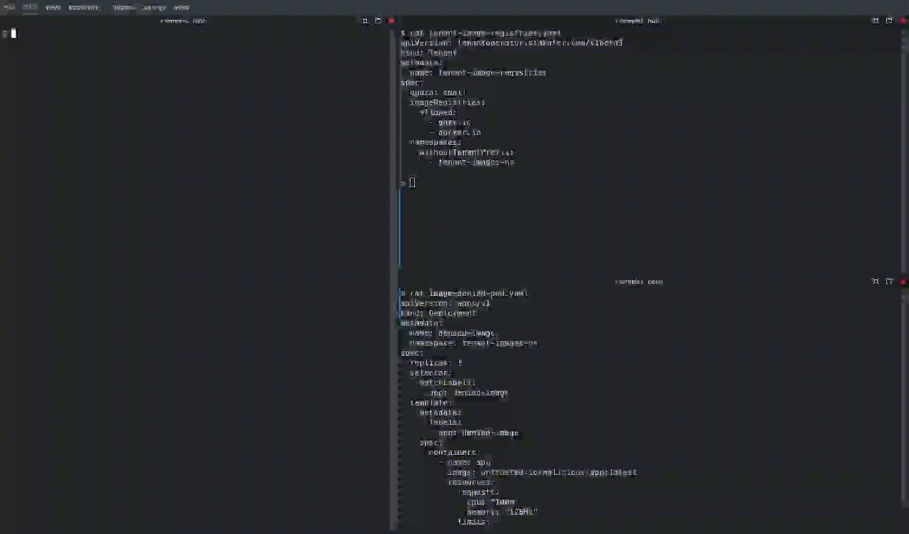

# Image Registries

## Allowing only approved container registries for tenant images

Use the `imageRegistries.allowed` field in the `Tenant` CR to limit which container registries tenants can pull images from. This policy reduces the risk of pulling images from untrusted registries and supports compliance with organizational supply-chain rules.

```yaml title="Tenant"
apiVersion: tenantoperator.stakater.com/v1beta3
kind: Tenant
metadata:
  name: tenant-sample
spec:
  # other fields
  imageRegistries:
    allowed:
      - ghcr.io
      - docker.io
```

Notes:

- The operator inspects image references used by Pods and controllers (Pods, Deployments, StatefulSets, ReplicaSets, Jobs, CronJobs, Daemonsets).
- To allow images that omit an explicit registry (i.e., rely on the container runtime default), include the empty string `""` in the `allowed` list.

### Example

Below are two Pod examples showing how the operator evaluates registry usage.

Allowed image (uses `ghcr.io`, which is in the allow-list):

```yaml title="Allowed Pod"
apiVersion: v1
kind: Pod
metadata:
  name: allowed-sample
spec:
  containers:
    - name: app
      image: ghcr.io/example/app:1.0.0
```

Denied image (uses `untrusted.io`, not in the allow-list):

```yaml title="Denied Pod"
apiVersion: v1
kind: Pod
metadata:
  name: denied-sample
spec:
  containers:
    - name: app
      image: untrusted.io/malicious/app:latest
```

### Behavior

- The first Pod will be accepted because `ghcr.io` is explicitly allowed.
- The second Pod will be rejected by the operator (or by admission policy enforced by the operator) because its image registry `untrusted.io` is not in `imageRegistries.allowed`.

### Demo


