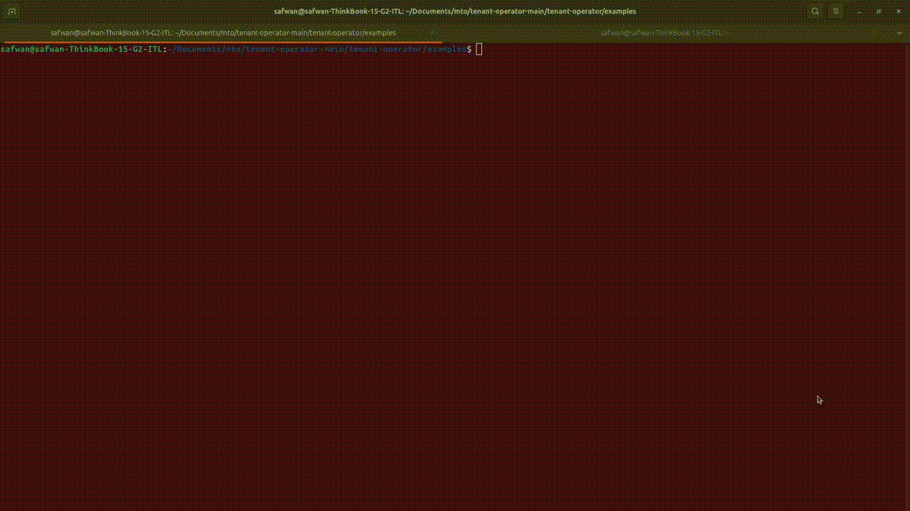

# Ingress Sharding

## Ingress Sharding on Kubernetes using MTO

```yaml title="Tenant"
apiVersion: tenantoperator.stakater.com/v1beta3
kind: Tenant
metadata:
  name: tenant-sample
spec:
  # other fields
  ingressClasses:
    allowed:
    - nginx
    - traefik
```

The `ingressClasses` field in the Tenant specification is used to filter and control which ingress classes are allowed for the tenant. By specifying an `allowed` list, you can restrict the creation of ingress resources to only those with the specified ingress class names. In the example above, only ingress resources with the class names `nginx` and `traefik` are permitted for the tenant.

This ensures that tenants can only use the ingress controllers that are explicitly allowed, providing better control and security over the ingress resources within the Kubernetes cluster.

### Demo



## Ingress Sharding on OpenShift Container Platform

You can use Ingress sharding, also known as router sharding, to distribute a set of routes across multiple routers by adding labels to routes, namespaces, or both. The Ingress Controller uses a corresponding set of selectors to admit only the routes that have a specified label. Each Ingress shard comprises the routes that are filtered using a given selection expression.

### Example

An Ingress Controller `finops-router` is configured with the label selector to handle the routes in tenant `finops`

```yaml
apiVersion: operator.openshift.io/v1
kind: IngressController
metadata:
  name: finops-router
  namespace: openshift-ingress-operator
spec:
  - namespaceSelector:
      matchLabels:
        stakater.com/tenant: finops

```
