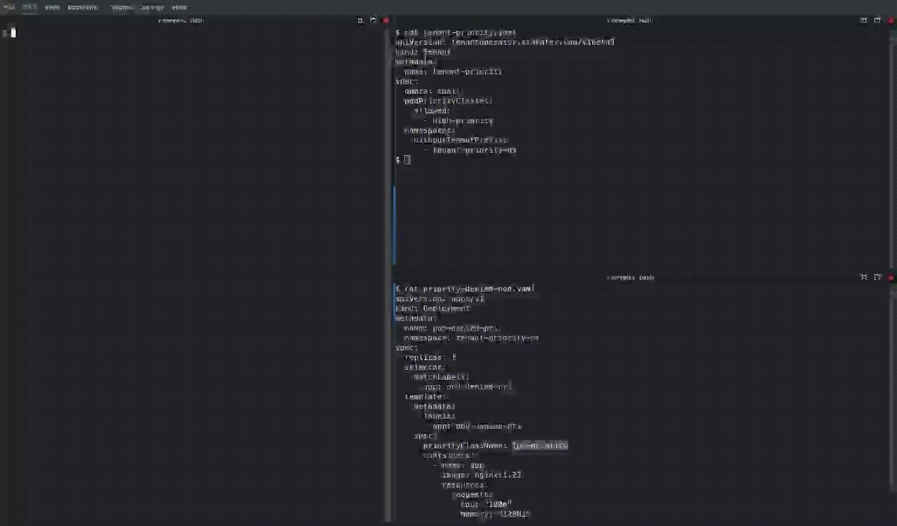

# Restricting Pod Priority Classes per Tenant

## Restricting allowed Pod PriorityClasses for tenant workloads

Use the `podPriorityClasses.allowed` field in the `Tenant` CR to restrict which priority classes tenant workloads may use. This ensures that only approved priority classes are used so cluster QoS and scheduling policies remain predictable.

```yaml title="Tenant"
apiVersion: tenantoperator.stakater.com/v1beta3
kind: Tenant
metadata:
  name: tenant-sample
spec:
  # other fields
  podPriorityClasses:
    allowed:
      - high-priority
```

### Behavior

This field follows a **secure-by-default** model. Configuring this field enables both the filtering functionality and automatic RBAC configuration for PodPriorityClasses:

| Spec State | Behavior |
|------------|----------|
| Field not specified (`nil`) | **Feature disabled** - no RBAC is configured by the operator; it is left to the platform administrator to configure appropriate RBAC for PodPriorityClasses (if any) |
| Empty struct `{}` or `{allowed: []}` | **Allow all** - the operator automatically configures RBAC so that tenants can use any priority class in the cluster |
| Specific values `{allowed: ["high-priority"]}` | **Only allow specified** - the operator automatically configures RBAC so that tenants can only use the listed priority classes |

!!! note
    The filtering functionality only works when the `podPriorityClasses` field is explicitly configured. Without it, the operator does not manage PodPriorityClass access for the tenant.

!!! tip
    Tenant users can use the [kubectl-tenant plugin](../../../kubectlplugin/kubectl-tenant.md) to list the PodPriorityClasses available to them: `kubectl tenant get priorityclasses <tenant-name>`

### Notes

The operator will validate the `priorityClassName` field on workloads and controllers (Pods, Deployments, StatefulSets, ReplicaSets, Jobs, CronJobs, Daemonsets). The empty string (`""`) is treated as a valid `priorityClass` name — include `""` in `allowed` if you want to permit resources that omit a priority class.

### Example

Allowed Pod (uses `high-priority`):

```yaml title="Allowed Pod"
apiVersion: v1
kind: Pod
metadata:
  name: pod-allowed-pri
spec:
  priorityClassName: high-priority
  containers:
    - name: app
      image: nginx:1.23
```

Denied Pod (uses a non-allowed priority class):

```yaml title="Denied Pod"
apiVersion: v1
kind: Pod
metadata:
  name: pod-denied-pri
spec:
  priorityClassName: low-priority
  containers:
    - name: app
      image: nginx:1.23
```

### Validation Behavior

- The first Pod will be accepted because `high-priority` is in `podPriorityClasses.allowed`.
- The second Pod will be rejected by the operator if `low-priority` is not present in the allow-list.

### Demo


