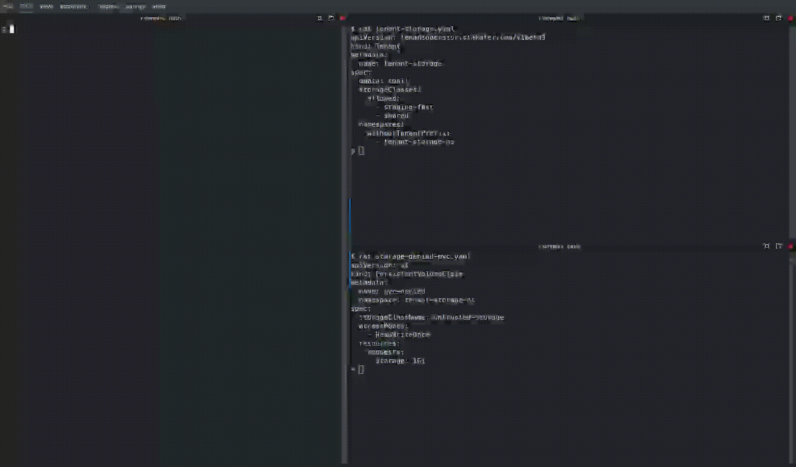

# Restricting Storage Classes per Tenant

## Restricting PersistentVolumeClaims to approved StorageClasses

Use the `storageClasses.allowed` field in the `Tenant` Custom Resource to limit which StorageClasses a tenant may request when creating PersistentVolumeClaims (PVCs).

```yaml title="Tenant"
apiVersion: tenantoperator.stakater.com/v1beta3
kind: Tenant
metadata:
  name: tenant-sample
spec:
  # other fields
  storageClasses:
    allowed:
      - staging-fast
      - shared
```

### Behavior

This field follows a **secure-by-default** model. Configuring this field enables both the filtering functionality and automatic RBAC configuration for StorageClasses:

| Spec State | Behavior |
|------------|----------|
| Field not specified (`nil`) | **Feature disabled** - no RBAC is configured by the operator; it is left to the platform administrator to configure appropriate RBAC for StorageClasses (if any) |
| Empty struct `{}` or `{allowed: []}` | **Allow all** - the operator automatically configures RBAC so that tenants can use any storage class in the cluster |
| Specific values `{allowed: ["sc1"]}` | **Only allow specified** - the operator automatically configures RBAC so that tenants can only use the listed storage classes |

!!! note
    The filtering functionality only works when the `storageClasses` field is explicitly configured. Without it, the operator does not manage StorageClass access for the tenant.

!!! tip
    Tenant users can use the [kubectl-tenant plugin](../../../kubectlplugin/kubectl-tenant.md) to list the StorageClasses available to them: `kubectl tenant get storageclasses <tenant-name>`

### Notes

- If the PVC specifies a `storageClass` explicitly, that value is checked against the allow-list.
- If the PVC references a `volumeName`, the operator inspects the corresponding `PersistentVolume` to determine its class.
- If the PVC omits both `storageClass` and `volumeName`, evaluation is deferred until a default StorageClass is set in the cluster.
- An empty string (`""`) is treated as a literal StorageClass name; include `""` in the allow-list if you want to permit PVCs that omit a storage class.

### Example

Allowed PVC (requests `staging-fast`, which is in the allow-list):

```yaml title="Allowed PVC"
apiVersion: v1
kind: PersistentVolumeClaim
metadata:
  name: pvc-allowed
spec:
  storageClassName: staging-fast
  accessModes:
    - ReadWriteOnce
  resources:
    requests:
      storage: 1Gi
```

Denied PVC (requests `untrusted-storage`, not in the allow-list):

```yaml title="Denied PVC"
apiVersion: v1
kind: PersistentVolumeClaim
metadata:
  name: pvc-denied
spec:
  storageClassName: untrusted-storage
  accessModes:
    - ReadWriteOnce
  resources:
    requests:
      storage: 1Gi
```

### Behavior

- A PVC that requests an allowed StorageClass will be accepted and provisioned as normal.
- A PVC that requests a StorageClass not present in `storageClasses.allowed` will be rejected by the operator or admission policy.

### Demo


