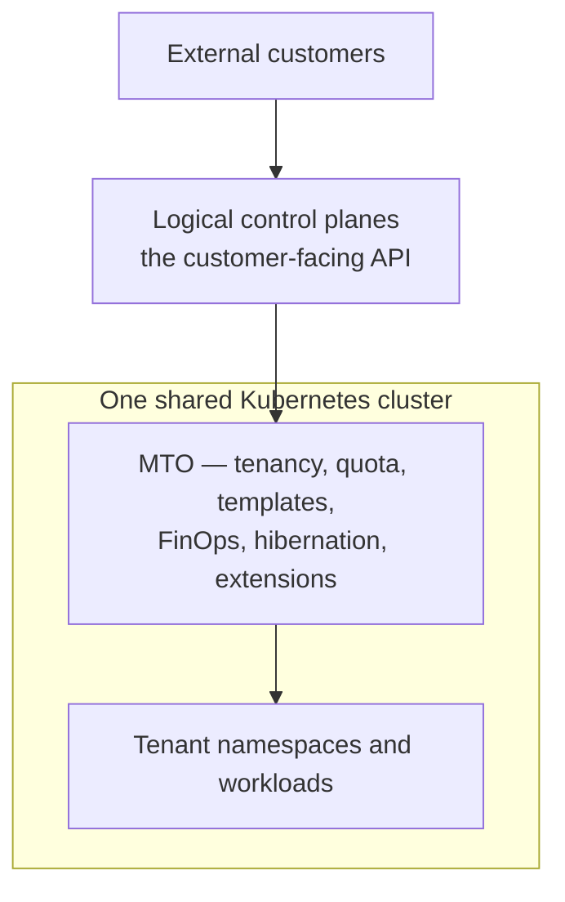

# MTO vs KCP

## Introduction

KCP appears in Kubernetes multi-tenancy searches, and it is genuinely multi-tenant — but it is multi-tenant in a different sense from the one most platform teams are asking about.

KCP provides logical control planes that serve Kubernetes-style APIs. It is not a Kubernetes cluster and it does not run your workloads. Multi-Tenant Operator governs tenancy on a cluster that does.

This page explains the distinction, because for most readers the honest answer is that these two are not competing for the same decision.

---

## TL;DR

| Aspect | MTO | KCP |
|--------|-----|----------|
| What it is | Tenant governance on a Kubernetes cluster | Logical control planes serving Kubernetes-style APIs |
| Runs workloads | Yes — it governs the cluster that does | No |
| Unit of tenancy | `Tenant` owning namespaces | Workspace |
| Typical user | Platform team sharing a cluster between teams | Teams building multi-tenant API services |
| Isolation | Namespace, policy-enforced | Logical control plane per workspace |
| Licence | Commercial | Open source, CNCF Sandbox |
| Same decision? | Rarely | Rarely — but often the same architecture, stacked |

---

## What is KCP?

KCP is a CNCF Sandbox project offering a Kubernetes-like control plane decoupled from any particular cluster. Its central abstraction is the **workspace**: a logical control plane with its own API surface, its own resources, and its own isolation from other workspaces.

Because workspaces are cheap compared with clusters, KCP suits scenarios where you want many isolated API surfaces — control-plane-as-a-service, multi-tenant API providers, and platforms whose product *is* an API rather than a place to run containers.

What KCP does not do is schedule pods. There is no kubelet, no node, and no workload in a workspace in the sense that there is in a cluster.

### Key Characteristics

- Workspaces as isolated logical control planes
- Kubernetes-style APIs without a Kubernetes cluster underneath
- Designed for API multi-tenancy at large workspace counts
- Open source, CNCF Sandbox

### Best For

- Building multi-tenant API services with Kubernetes-style APIs
- Control-plane-as-a-service platforms
- Scenarios needing very large numbers of isolated API surfaces

---

## Core Architectural Difference

**KCP is multi-tenancy of the API. MTO is multi-tenancy of the platform your workloads run on.**

If your question is "how do thirty teams share this cluster safely, and what does each of them cost?", KCP does not answer it — there is no cluster in the picture and no workloads to govern.

If your question is "how do I serve isolated Kubernetes-style API surfaces to many consumers without giving each one a cluster?", MTO does not answer that one.

The overlap is limited to both projects using the word tenancy, which is why they end up in the same search results and almost never in the same shortlist.

---

## Detailed Comparison

### Workloads

MTO governs a cluster that runs workloads: namespaces, quota on CPU and memory, node placement, network policy, and the cost of what is running.

KCP workspaces hold API objects. Running the workloads those objects describe is a separate concern, on separate infrastructure.

### The unit of tenancy

MTO's `Tenant` is organizational: people, namespaces, an allocation, standards, cost, lifecycle.

A KCP workspace is an API boundary. It can represent a tenant, but the organizational meaning — who belongs to it, what it may consume, what it costs — is yours to build on top.

### Governance

MTO's core is governance: RBAC from identity provider groups, quota at the tenant scope, guardrails at admission, standards reconciled continuously, cost attributed by construction.

KCP provides isolation between workspaces. The governance model over them is a platform you would build.

### Operational model

MTO installs into an existing cluster and governs it. KCP is infrastructure you run in its own right, and adopting it is an architectural decision about how your platform's APIs are served.

---

## How to Decide

### Choose MTO when

- You have a Kubernetes or OpenShift cluster shared by several teams or customers
- You need ownership, access, allocation, standards and cost attributed to an organizational boundary
- Workloads are the thing being governed

### Choose KCP when

- You are building a multi-tenant API service with Kubernetes-style APIs
- You need many isolated API surfaces and workloads are not the point
- Control-plane-as-a-service is the product

---

## Using them together

The interesting case is not choosing between them — it is stacking them, and it is a well-formed architecture rather than a curiosity.

A service provider or telecommunications platform needs to give external customers a control plane of their own without giving them credentials to a cluster. Logical control planes serve that front: each customer gets an isolated API surface that is the product. Underneath, the workloads still have to run somewhere, be governed, be standardized, be costed and be cleaned up when a customer leaves — on infrastructure the provider owns and wants to use efficiently.

In that stack the two layers do not overlap at any point:

- **The logical control plane** gives each customer an isolated API surface and keeps them off the cluster entirely.
- **MTO** makes the shared cluster underneath a governed platform: one tenant per customer, quota mapped to their plan, environments standardized by template, cost-to-serve attributed per customer, dormant environments hibernated, and the boundary carried into GitOps and secrets management.

This is also why "our customers are external, so we need hard multi-tenancy" is too quick a conclusion. Customers who never receive cluster credentials cannot reach the API server, so the shared cluster sits behind the product rather than between the provider and the customer. See [Deployment Models](../overview/deployment-models.md#when-tenants-never-touch-the-cluster-api).

---

## Key Takeaways

- KCP and MTO are rarely candidates for the same decision, and frequently candidates for the same architecture.
- KCP is API multi-tenancy; MTO is workload-platform multi-tenancy.
- KCP workspaces do not run workloads, which is usually the deciding fact.
- If you are trying to share a cluster between teams, KCP is not the tool you are looking for.
- Stacked — logical control planes facing the customer, MTO governing the shared cluster beneath — they cover a shape neither reaches alone: external customers, isolated API surfaces, and one efficiently governed cluster underneath.

---

## Frequently Asked Questions (FAQ)

### Is KCP a Kubernetes distribution?

No. It provides Kubernetes-style APIs through logical control planes, without being a cluster that schedules workloads.

### Can KCP replace namespaces for multi-tenancy?

Not for workload tenancy. Workspaces isolate API surfaces; namespaces scope workloads on a cluster.

### Can MTO and KCP be used together?

Yes, and it is a natural pairing rather than a coincidence. Logical control planes give external customers an isolated API surface without cluster credentials; MTO governs the shared cluster their workloads actually run on. There is no integration between the two products — they simply occupy different layers, and the layer boundary is clean.

### Which is more mature for platform teams?

For sharing a workload cluster between teams, tenant-governance tooling is the established answer. KCP targets a newer and narrower problem space, and its status is worth checking directly before adopting it.

### Why does KCP show up in multi-tenancy searches?

Because it is genuinely multi-tenant — of API surfaces rather than of clusters. The word covers both.

---

## Keywords

MTO vs KCP
logical control planes Kubernetes
KCP workspaces
control plane as a service
API multi-tenancy Kubernetes
logical clusters Kubernetes
