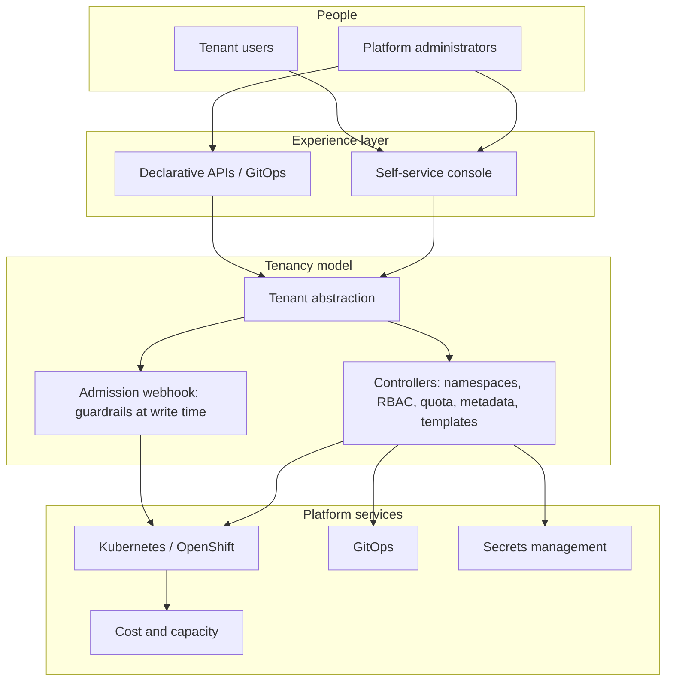

# Multi-Tenant Kubernetes Architecture

## Introduction

Designing a multi-tenant Kubernetes platform means answering two questions that are often collapsed into one:

1. **How separated must tenants be?** — the isolation architecture.
1. **How is a tenant governed?** — the operating model.

The first determines whether tenants share a cluster, get virtual clusters, or get their own. The second determines who owns what, who may access it, what it may consume, what standards it meets and what it costs — and it applies whichever answer you gave to the first.

This page sets out the architectural patterns and the layers a complete platform needs.

---

## TL;DR

| Layer | What it decides | Typical implementation |
|--------|-----|----------|
| Isolation | How separated tenants are | Namespaces, virtual clusters, hosted control planes, dedicated clusters |
| Tenancy model | Who owns what, and what applies to it | A tenant abstraction with controllers |
| Policy enforcement | What is rejected, and when | RBAC, quota, network policy, admission webhooks |
| Standardization | What every environment contains | Templates, reconciled continuously |
| Accountability | What each tenant consumes and costs | Attribution to the tenant boundary |
| Experience | How people interact with all of it | Declarative APIs plus a self-service interface |

---

## The isolation layer

### Shared cluster, namespace-separated

Tenants share one cluster and are separated by namespace, RBAC, quota, network policy and admission control.

The most efficient architecture available: one control plane, one monitoring stack, one upgrade cycle, regardless of how many tenants. The trade is a shared API server and a shared set of cluster-scoped resources.

### Virtual clusters

Each tenant gets a virtual control plane inside a host cluster, scheduling workloads onto the host's nodes. Stronger API isolation and per-tenant CRDs, at the cost of a control plane per tenant to operate.

### Hosted control planes

Control planes run as workloads on a management cluster, with dedicated worker nodes per tenant cluster. Genuine per-tenant clusters without dedicated control-plane infrastructure — and a fleet to run.

### Dedicated clusters

Complete separation and complete duplication of operational cost. The right answer for regulatory boundaries and for adversarial tenants holding cluster credentials; an expensive default.

[Deployment Models](../overview/deployment-models.md) compares these directly, including the case for combining them.

---

## The layers above isolation

Choosing an isolation model is necessary and not sufficient. A platform with thirty virtual clusters has the same governance problem as one with thirty namespaces — it has simply spent more on isolation first.

### Tenancy model

Something has to represent the tenant: an object that owns namespaces, membership, allocation, standards and cost, and a controller that keeps the platform matching it. Without this, every relationship between a team and its resources is maintained by hand. See [What is a Tenant in Kubernetes?](kubernetes-tenants.md).

### Access model

Two questions, and the first is often skipped: **do tenants reach the Kubernetes API at all?** On internal platforms they usually do, and access should then be derived from tenant membership, with membership coming from your existing identity provider groups — hand-written role bindings per namespace are the most common source of stale permissions.

Where a portal, an API or a logical control plane sits in front and no cluster credentials are issued to tenants, the cluster's access model is between the platform team and its own product. That is the standard shape for service providers and telecommunications platforms, and it is why external customers do not by themselves force a stronger isolation model.

### Resource governance

Allocation belongs at the tenant scope, not per namespace — otherwise a tenant that can create namespaces can multiply its own budget. Guardrails on what a tenant may use (storage classes, ingress classes, priority classes, registries, hostnames) belong at admission, where they are rejected at write time.

### Standardization

Every environment needs a baseline: network policies, secrets, monitoring configuration, required metadata. Applied at creation only, that baseline reaches new namespaces and drifts everywhere else. Reconciled continuously, it holds.

### Accountability

Consumption has to be attributable to an organizational owner. If attribution depends on a labelling convention people apply by hand, it will be partial. If a namespace exists only because a tenant declared it, attribution is a property of the model rather than a reporting exercise.

### Experience

Two audiences need to act on the same objects: platform administrators governing the whole platform, and tenant users working inside their boundary. A declarative API serves GitOps; an interface serves people. They should read and write the same objects, so there is no second source of truth.

---

## A reference architecture

The property that matters is the single definition in the middle. Membership, namespaces, allocation, standards, cost attribution and external integrations all derive from it, so they cannot disagree with each other.

---

## Anti-patterns

**Isolation as a substitute for governance.** Giving each team a cluster or a virtual cluster looks like an answer. It defers the governance problem and multiplies the operational cost.

**Per-namespace quota with self-service namespaces.** A tenant that can create namespaces can create budget.

**RBAC copied between namespaces.** It works on the day it is written and diverges immediately afterwards.

**Standards as documentation.** A baseline that is described rather than enforced is met inconsistently.

**Cost attribution retrofitted.** Adding a tagging convention to a cluster already full of workloads means retrofitting it onto everything already running.

**Tenancy that stops at the API server.** The cluster is divided properly while the GitOps controller and the secrets platform stay shared and separately administered — so a tenant boundary exists in one system and not the others.

---

## Frequently Asked Questions (FAQ)

### What is a multi-tenant Kubernetes architecture?

A design that lets several teams, departments or customers share Kubernetes infrastructure, combining an isolation model with a tenancy model that governs ownership, access, allocation, standards and cost.

### Should I start with namespaces or virtual clusters?

Start with namespaces unless you have a specific reason not to — a tenant needing its own CRDs, cluster-scoped autonomy, or a boundary that a shared API server cannot provide for tenants who hold credentials to it. Note that external customers served through a product layer, with no cluster credentials issued, are not such a reason. Isolation is easy to add later for the tenants that genuinely need it.

### Can one architecture serve every tenant?

Rarely at scale. Most large platforms end up combining a shared cluster for most teams with stronger isolation for the few that require it. What should stay consistent across them is the tenant operating model.

### Where does GitOps fit?

Everywhere, if the tenancy model is expressed as Kubernetes objects: tenants, allocations, templates and policies live in Git and are applied by the GitOps tool you already run.

### Does the platform need its own console?

Not strictly, but two audiences act on the platform and only one of them wants to write YAML. A console that reads and writes the same objects as the API avoids creating a second source of truth.

---

## Keywords

multi-tenant Kubernetes architecture
Kubernetes platform architecture
multi-tenancy design patterns
Kubernetes tenant isolation architecture
internal developer platform architecture
platform engineering multi-tenancy
